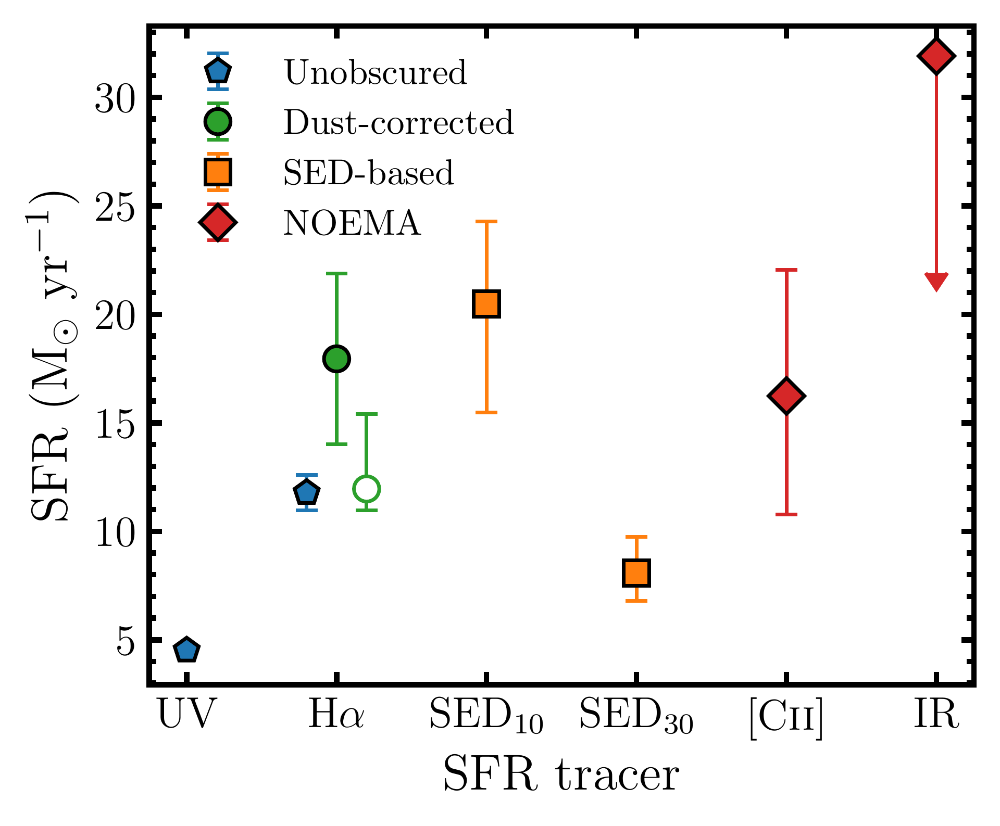
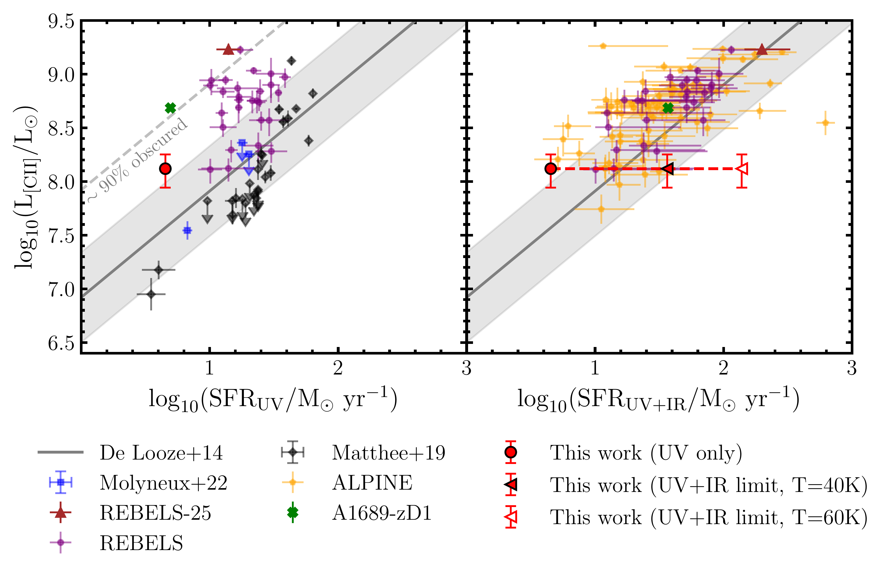
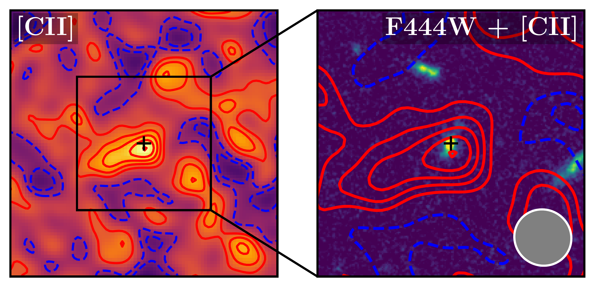

$\newcommand{\ensuremath}{}$
$\newcommand{\xspace}{}$
$\newcommand{\object}[1]{\texttt{#1}}$
$\newcommand{\farcs}{{.}''}$
$\newcommand{\farcm}{{.}'}$
$\newcommand{\arcsec}{''}$
$\newcommand{\arcmin}{'}$
$\newcommand{\ion}[2]{#1#2}$
$\newcommand{\textsc}[1]{\textrm{#1}}$
$\newcommand{\hl}[1]{\textrm{#1}}$
$\newcommand{\footnote}[1]{}$
$\newcommand{\um}{\mu\mathrm{m}}$
$\newcommand{\id}{GNWY-7379420231}$
$\newcommand{\cii}{[C\textsc{ii}]}$
$\newcommand{\sfrcii}{\mathrm{SFR}_\mathrm{[C\textsc{ii}]}}$
$\newcommand{\orcid}[2]{\href{http://orcid.org/#2}{#1}}$
$\newcommand{\orcidsymb}[2]{#1\href{http://orcid.org/#2}{\adjustbox{trim={-.15\width} {0\height} {-.15\width} {0\height},clip}{\includegraphics[height=10pt]{Figures/orcid.pdf}}}}$
$\newcommand{\arraystretch}{1.5}$
$\newcommand{\arraystretch}{1.5}$
$\newcommand{\arraystretch}{1.5}$
$\newcommand{\thebibliography}{\DeclareRobustCommand{\VAN}[3]{##3}\VANthebibliography}$

# NOEMA probes the [Cii] and dust content in a 2175${Å}$ UV Bump Galaxy at $z=7.1$

<mark>Appeared on: 2026-09-14</mark> -  _13 pages, submitted to MNRAS_

K. Ormerod, et al. -- incl., <mark>A. d. Graaff</mark>

**Abstract:** The detection of the $2175$ ${Å}$ UV bump at $z>6$ challenges existing models of dust formation, suggesting rapid formation of small carbonaceous dust grains within the first billion years of cosmic time. We present the results of the first direct attempt at linking far-infrared (FIR) observations to the UV bump within the Epoch of Reionisation (EoR), through  Northern Extended Millimeter Array (NOEMA) observations of GNWY-7379420231 at $z=7.108$ , a galaxy exhibiting the strongest known UV bump feature at $z>4$ .We detect the [ C $ii$ ] 158 $\mu$ m emission line at 5.1 $\sigma$ at $z_\mathrm{[Cii]} = 7.1078 \pm 0.0005$ , in excellent agreement with the redshift derived from the [ O $iii$ ] $\lambda 5007$ ${Å}$ line.The ${\cii}$ luminosity implies $\mathrm{SFR}_\mathrm{[Cii]}=16.2^{+5.8}_{-5.5}M_\odot \mathrm{yr}^{-1}$ , consistent with short timescale SFR tracers such as dust corrected $\mathrm{SFR}_\mathrm{H\alpha}=18.0\pm3.9 M_\odot \mathrm{yr}^{-1}$ and $\mathrm{SFR}_\mathrm{10 Myr}=20.5^{+3.8}_{-5.0}M_\odot \mathrm{yr}^{-1}$ from SED fitting.The dust continuum is not detected suggesting an obscured SFR of $\mathrm{SFR}_\mathrm{IR} < 32  M_\odot \mathrm{yr}^{-1}$ and a dust mass of $M_\mathrm{d} < 5.3\times10^6  M_\odot$ $(M_\mathrm{d}/M_\star<2\%)$ . Finally, the [ C $ii$ ] -derived dynamical mass of $\log_{10}(M_\mathrm{dyn}/M_\odot)=8.95^{+0.51}_{-0.66}$ and stellar mass of $\log _{10}\left(\mathrm{M}_{\star} / \mathrm{M}_{\odot}\right) = 8.39_{-0.09}^{+0.13}$ suggest a gas-rich moderately massive galaxy. Taken together these results rule out GNWY-7379420231 being a heavily dust obscured or massive galaxy, but rather a `normal' EoR galaxy  with a recent upturn in star-formation. Our results suggest efficient shattering of larger dust grains in the diffuse, turbulent interstellar medium (ISM) and/or fortunate line of sight alignment are needed to explain the UV bump properties of GNWY-7379420231.

**Figure 4. -** Comparison of star formation rates for {$\id$} obtained from various SFR tracers. We show unobscured SFRs (not corrected for dust attenuation) as blue pentagons, dust corrected SFRs as green circles, SED-based SFRs as orange squares, and measures of SFR obtained with NOEMA as red diamonds. The open green circle represents the H$\alpha$ SFR obtained from the dust correction based on the Balmer decrement, while the solid green circle represents the H$\alpha$ SFR obtained from the SED-based dust correction.
    The SFR$_\mathrm{IR}$ upper limit shown assumes a dust temperature of $T_\mathrm{dust}=40$K. (*fig:SFR_comparison*)

**Figure 11. -** _Left:_{$\cii$} luminosity as a function of SFR$_{\mathrm{UV}}$. _Right:_{$\cii$} luminosity as a function of SFR$_{\mathrm{UV+IR}}$. The SFR$_\mathrm{UV}$ of {$\id$} is shown as a red circle, with $1\sigma$ error bars. The upper limits of the UV+IR SFRs are also shown in the right panel, for $T_\mathrm{dust}=40$K and $T_\mathrm{dust}=60$K. The red dashed line shows the possible range for the the SFR. For comparison, we include individual galaxies from \citet{molyneux_spectroscopic_2022}, the REBELS survey (Schouws et al, in prep.), the ALPINE survey \citep{bethermin_alpine-alma_2020}, and a compilation of $z\sim6-7$ sources from \citet{matthee_resolved_2019}. All limits shown are $3\sigma$ upper limits. The $1\sigma$ upper limits from \citet{matthee_resolved_2019} are converted to $3\sigma$ upper limits for consistency. We also show the galaxies REBELS-25 \citep[][]{hygate_alma_2023, rowland_rebels-25_2024} and A1689-zD1 \citep[][]{watson_dusty_2015, bakx_accurate_2021}. The $L_{\mathrm{[Cii]}}$-SFR relation from \citet{de_looze_applicability_2014} is indicated by the solid grey line, with the errors shown by the grey shaded region. The grey dashed line in the left panel indicates where galaxies with $\sim90\%$ obscured star formation would lie. (*fig:LCII_SFR*)

**Figure 1. -** _Left_: $12$\arcsec$ \times 12$\arcsec$$ panel showing the NOEMA USB data collapsed over the frequency range $234.37 - 234.46$ GHz ($\Delta v = -53$ to $+63 \mathrm{km s^{-1}}$ relative to the line peak).
   _Right_: $6$\arcsec$ \times 6$\arcsec$$ panel showing the *JWST*/NIRCam F444W cutout of {$\id$} with {$\cii$} contours overlaid. The grey ellipse in the bottom right corner indicates the beam size.
  In both panels, the solid red contours show the $1\sigma, 2\sigma, 3\sigma$, $4\sigma$, and $5\sigma$ levels of the {$\cii$} image, while the blue dashed contours show the $-1\sigma$ and $-2\sigma$ levels. The black cross shows the targeted coordinates. North is up and East is to the left. (*fig:cii cutout*)

