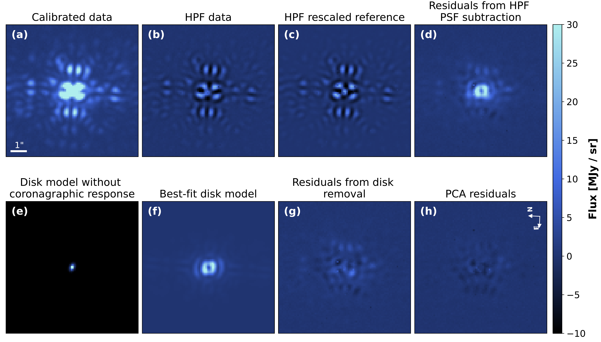
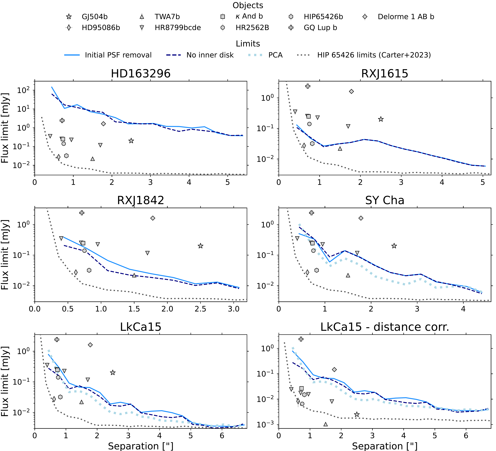
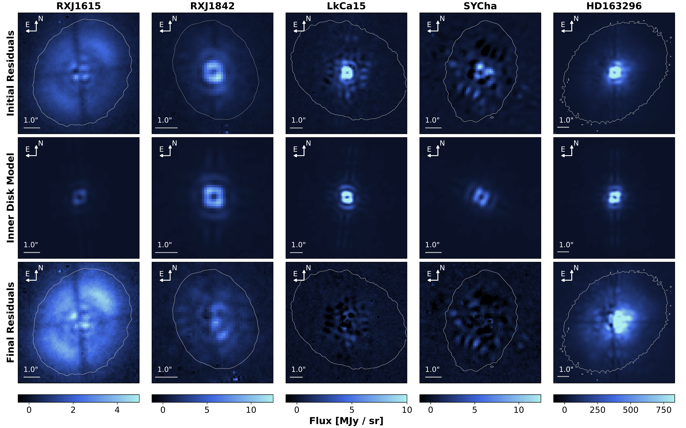

$\newcommand{\ensuremath}{}$
$\newcommand{\xspace}{}$
$\newcommand{\object}[1]{\texttt{#1}}$
$\newcommand{\farcs}{{.}''}$
$\newcommand{\farcm}{{.}'}$
$\newcommand{\arcsec}{''}$
$\newcommand{\arcmin}{'}$
$\newcommand{\ion}[2]{#1#2}$
$\newcommand{\textsc}[1]{\textrm{#1}}$
$\newcommand{\hl}[1]{\textrm{#1}}$
$\newcommand{\footnote}[1]{}$
$\newcommand{\vdag}{(v)^\dagger}$
$\newcommand\aastex{AAS\TeX}$
$\newcommand\latex{La\TeX}$
$\newcommand{\todogabo}[1]{\textcolor{violet}{Gabo: #1}}$
$\newcommand{\todomb}[1]{\textcolor{orange}{MB: #1}}$
$\newcommand{\todo}[1]{\textcolor{red}{#1}}$
$\newcommand{\InstMPIA}{Max-Planck Institute for Astronomy (MPIA), Königstuhl 17, 69117 Heidelberg, Germany}$
$\newcommand{\instUZH}{Department of Astrophysics, University of Zürich, Winterthurerstrasse 190, 8057 Zürich, Switzerland}$
$\newcommand{\InstMPE}{Max-Planck-Institut für extraterrestrische Physik, Giessenbachstrasse 1, 85748 Garching, Germany}$
$\newcommand{\InstMIT}{Department of Earth, Atmospheric, and Planetary Sciences, Massachusetts Institute of Technology, Cambridge, MA 02139, USA}$
$\newcommand{\InstMilano}{Dipartimento di Fisica, Università degli Studi di Milano, Via Celoria 16, 20133 Milano, Italy}$
$\newcommand{\InstNAOJ}{National Astronomical Observatory of Japan, Osawa 2-21-1, Mitaka, Tokyo 181-8588, Japan}$
$\newcommand{\InstAIJ}{Astronomical Institute, Graduate School of Science, Tohoku University, 6-3 Aoba, Aramaki, Aoba-ku, Sendai, Miyagi 980-8578 Japan}$
$\newcommand{\InstIPAGGrenoble}{Univ. Grenoble Alpes, CNRS, IPAG, 38000 Grenoble, France}$
$\newcommand{\InstMonash}{School of Physics and Astronomy, Monash University, Clayton VIC 3800, Australia}$
$\newcommand{\InstCfA}{Center for Astrophysics | Harvard \& Smithsonian, Cambridge, MA 02138, USA}$
$\newcommand{\InstFlorida}{Department of Astronomy, University of Florida, Gainesville, FL 32611, USA}$
$\newcommand{\InstColumbia}{Department of Astronomy, Columbia University, 538 W. 120th Street, Pupin Hall, New York, NY, USA}$
$\newcommand{\InstLeiden}{Leiden Observatory, Leiden University, P.O. Box 9513, NL-2300 RA Leiden, The Netherlands}$
$\newcommand{\InstESO}{European Southern Observatory, Karl-Schwarzschild-Str. 2, D-85748 Garching bei München, Germany}$
$\newcommand{\InstVirginia}{Department of Astronomy, University of Virginia, Charlottesville, VA 22904, USA}$
$\newcommand{\InstUNAM}{Universidad Nacional Autónoma de México. Instituto de Astronomía. A.P. 70-264, 04510. Ciudad de México, México}$
$\newcommand{\InstQMUL}{Astronomy Unit, School of Physics and Astronomy, Queen Mary University of London, London E1 4NS, UK}$
$\newcommand{\InstSTScI}{Space Telescope Science Institute, 3700 San Martin Drive, Baltimore, MD 21218, USA}$
$\newcommand{\InstLESIA}{LESIA, Observatoire de Paris, Université PSL, CNRS, Sorbonne Université, Univ. Paris Diderot, Sorbonne Paris Cité, 5 place Jules$
$Janssen, 92195 Meudon, France}$
$\newcommand{\InstJohnHop}{Department of Physics \& Astronomy, Johns Hopkins University, 3400 N. Charles Street, Baltimore, MD 21218, USA}$
$\newcommand{\InstKavli}{Kavli Institute for Astronomy and Astrophysics, Peking University, Beijing 100871, China}$
$\newcommand{\InstLMU}{University Observatory, Faculty of Physics, Ludwig-Maximilians-Universität München, Scheinerstr. 1, 81679 Munich, Germany}$
$\newcommand{\InstESA}{European Space Agency(ESA),European Space Astronomy Centre(ESAC), Camino Bajo del Castillo s/n,28692, Villanueva de la Canada, Madrid, Spain}$
$\newcommand{\InstETH}{ETH Zürich, Institute for Particle Physics and Astrophysics, Wolfgang-Pauli-Str. 27, 8093 Zürich, Switzerland}$
$\newcommand{\Rdisk}{R_\mathrm{disk}}$
$\newcommand{\MJ}{M_\mathrm{J}}$
$\newcommand{\Mp}{M_\mathrm{p}}$
$\newcommand{\arraystretch}{1.25}$
$\newcommand{\arraystretch}{1.25}$

# JWST/MIRI Imaging Search for Kinematically Detected Protoplanetary Candidates

<mark>Appeared on: 2026-09-14</mark> -  _18 pages, 7 figures, accepted for publication in the Astronomical Journal_

G. Cugno, et al. -- incl., <mark>M. Benisty</mark>, <mark>T. Henning</mark>

**Abstract:** Kinematic perturbations observed with ALMA in CO line emission provide evidence for a population of embedded giant protoplanets shaping the structure of protoplanetary disks.We present JWST/MIRI F1140C ( $\lambda=11.3 \mu$ m) coronagraphic observations of five protoplanetary disks, HD 163296, RXJ1615.3–3255, RXJ1842.9–3532, SY Cha, and LkCa 15, with the goal of directly detecting candidate protoplanets orbiting at $\gtrsim70$ au previously inferred from gas kinematics. The data were analyzed using a bespoke methodology that combines reference PSF subtraction with forward modeling of partially resolved inner disk emission, which otherwise dominates the diffraction pattern in the images. This approach improves the sensitivity to young companions at small separations. No point source consistent with an embedded protoplanet is detected in any of the systems. Instead, in three systems we detect extended emission at $11.3 \mu$ m tracing the outer disk out to radii comparable to those probed by CO. Injection tests indicate upper mass limits of roughly $3–20 \MJ$ at separations of a few hundred au, assuming no additional thermal contribution from circumplanetary environment. Even with space-based observations, these limits remain mostly above the $\sim1-5 \MJ$ masses inferred from disk kinematics, largely due to the limitations imposed by emission (and/or scattered light) contributions from both the inner and outer disk. These observations highlight the challenges of observing protoplanets embedded in their forming environment at large separation with JWST/MIRI. Lessons learned can inform future studies with the Extremely Large Telescope, which will probe separations where the occurrence rate of gas giants is expected to be higher.

**Figure 2. -** Step by step illustration of the removal of the unresolved PSF and  resolved inner disk signals to search for embedded protoplanets. The image shows the processes applied to the LkCa15 dataset as an example. The top row focuses on the PSF removal using high-pass filtered (HPF) images (Sect. \ref{sec:initPSF}), while the bottom row demonstrates the steps presented in Sects. \ref{sec:innerdisk} and \ref{sec:PCA}, modeling and removing the inner disk component. With the exception of panel (e), which is a normalized model shown at the pixel resolution of the MIRI detector, the color scale is the same for all the other panels. Images have not been derotated and are shown as they appear on the detector. Panel (h) shows the orientation with respect to North and East. (*fig:methods*)

**Figure 4. -** S/N=5 detection limits for our MIRI data, as measured after the initial PSF subtraction (Sect. \ref{sec:initPSF}, solid blue line) and after the modeling and removal of the inner disk (Sect. \ref{sec:innerdisk}, dashed line) and for SY Cha and LkCa15 after PCA-based PSF subtraction (Sect. \ref{sec:PCA}, dotted line). The companions with measured F1140C fluxes from the literature are also reported  ([Carter, et. al 2023](https://ui.adsabs.harvard.edu/abs/2023ApJ...951L..20C), [Cugno, et. al 2024](https://ui.adsabs.harvard.edu/abs/2024ApJ...966L..21C), [M\^alin, et. al 2024](https://ui.adsabs.harvard.edu/abs/2024A&A...690A.316M), [Godoy, et. al 2024](https://ui.adsabs.harvard.edu/abs/2024A&A...689A.185G), [Boccaletti, et. al 2024](https://ui.adsabs.harvard.edu/abs/2024A&A...686A..33B), [Lagrange, et. al 2025](https://ui.adsabs.harvard.edu/abs/2025Natur.642..905L), [M\^alin, et. al 2025](https://ui.adsabs.harvard.edu/abs/2025A&A...704A.181M), [Godoy, et. al 2025](https://ui.adsabs.harvard.edu/abs/2025A&A...702A...4G)) , while the grey dashed line shows the detection limits reported by [Carter, et. al (2023)](https://ui.adsabs.harvard.edu/abs/2023ApJ...951L..20C) in the F1140C filter for HIP65426. The bottom right panel reports the same detection limits for LkCa15 reported in the bottom left panel, but this time the fluxes of the known companions and the HIP65426 limits are scaled to the distance of LkCa15.   (*fig:limits*)

**Figure 3. -** Residual gallery of our sample. _ Top row:_ Residuals after the initial PSF subtraction performed either with a single or a linear combination of reference PSFs. The white contour represents the outer edges of the 0th moment $^{12}$CO $J=3-2$ maps.
    _ Middle row:_ models of the inner disk emission obtained from the median values for each parameters. _ Bottom row:_ Residuals after removal of the inner disk signals. The asymmetry seen in J1842 and HD163296 is likely an artifact of the PSF subtraction algorithm. The limits of the colorscale have been halved with respect to the previous plots. The cross-shaped feature visible most prominently in RXJ1615 traces the transition regions of the MIRI four-quadrant phase mask and is therefore instrumental rather than astrophysical (*fig:gallery*)

