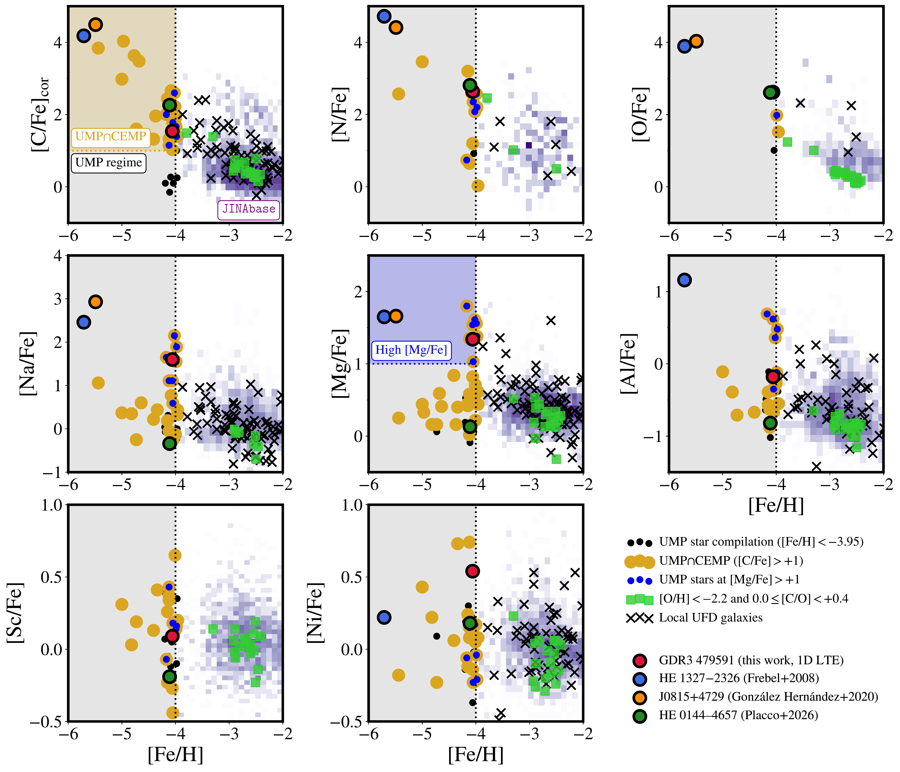
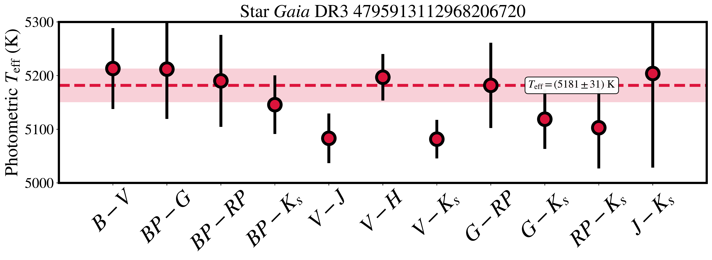
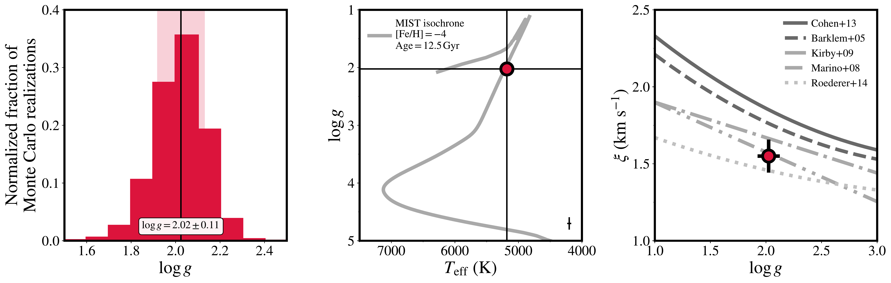
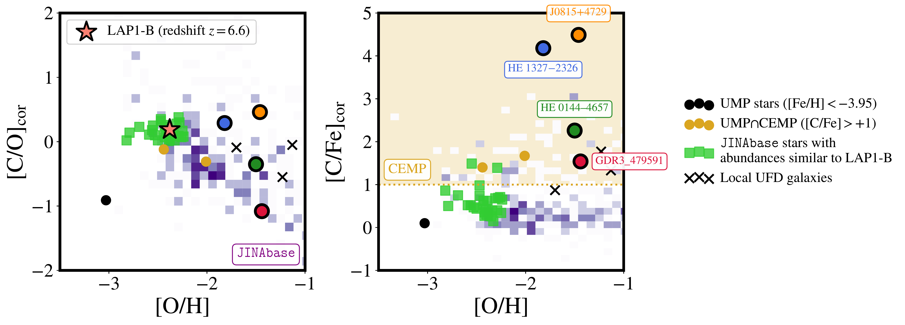

$\newcommand{\ensuremath}{}$
$\newcommand{\xspace}{}$
$\newcommand{\object}[1]{\texttt{#1}}$
$\newcommand{\farcs}{{.}''}$
$\newcommand{\farcm}{{.}'}$
$\newcommand{\arcsec}{''}$
$\newcommand{\arcmin}{'}$
$\newcommand{\ion}[2]{#1#2}$
$\newcommand{\textsc}[1]{\textrm{#1}}$
$\newcommand{\hl}[1]{\textrm{#1}}$
$\newcommand{\footnote}[1]{}$
$\newcommand\physrep{\ref@jnl{Phys.~Rep.}}$
$\newcommand\apjs{\ref@jnl{ApJS}}$
$\newcommand{\jcap}{\ref@jnl{JCAP}}$
$\newcommand{\vdag}{(v)^\dagger}$
$\newcommand\aastex{AAS\TeX}$
$\newcommand\latex{La\TeX}$
$\newcommand{\vv}{{\tablenotemark{\footnotesize{a}}}}$
$\newcommand{\xx}{{\tablenotemark{\footnotesize{b}}}}$
$\newcommand{\yy}{{\tablenotemark{\footnotesize{c}}}}$
$\newcommand{\eps}[1]{\ensuremath{\log\epsilon (\mathrm{#1})}}$
$\newcommand{\abund}[2]{\ensuremath{[\mathrm{#1}/\mathrm{#2}]}}$
$\newcommand{\xfe}[1]{\abund{#1}{Fe}}$
$\newcommand{\adast}{AdAst}$
$\newcommand{\joss}{JOSS}$
$\newcommand{\jkas}{JKAS}$
$\newcommand{\natas}{NatAs}$
$\newcommand{\natme}{NatMe}$
$\newcommand{\rev}[1]{\textcolor{blue}{#1}}$
$\newcommand{\red}[1]{\textcolor{red}{#1}}$
$\newcommand{\sfive}{\ensuremath{S^5}\xspace}$
$\newcommand{\vgsr}{\ensuremath{v_{\rm gsr}}\xspace}$
$\newcommand{\ocen}{\ensuremath{\omega{\rm Cen}}\xspace}$
$\newcommand{\mbh}{\ensuremath{{\rm M_{\rm BH}}}\xspace}$
$\newcommand{\mstar}{\ensuremath{{M_\star}}\xspace}$
$\newcommand{\msun}{\ensuremath{M_\odot}\xspace}$
$\newcommand{\mnsc}{\ensuremath{{\rm M_{\rm NSC}}}\xspace}$
$\newcommand{\z}{\ensuremath{z}\xspace}$
$\newcommand{\edd}{Eddington\xspace}$
$\newcommand{\teff}{\ensuremath{{T_{\rm eff}}}\xspace}$
$\newcommand{\logg}{\ensuremath{{\log g}}\xspace}$
$\newcommand{\vlos}{\ensuremath{{v_{\rm los}}}\xspace}$
$\newcommand{\vturb}{\ensuremath{{\xi}}\xspace}$
$\newcommand{\cfe}{\ensuremath{{\rm[C/Fe]}}\xspace}$
$\newcommand{\ac}{\ensuremath{{A({\rm C})}}\xspace}$
$\newcommand{\sn}{\ensuremath{{S/N}}\xspace}$
$\newcommand{\kmsec}{\ensuremath{{\rm km s^{-1}}}\xspace}$
$\newcommand{\angmom}{\ensuremath{{\rm kpc km s^{-1}}}\xspace}$
$\newcommand{\etot}{\ensuremath{{E_{\rm tot}}}\xspace}$
$\newcommand{\gxp}{\textit{Gaia} XP\xspace}$
$\newcommand{\angs}{{Å}\xspace}$
$\newcommand{\gdr}{GDR3\_479591\xspace}$
$\newcommand{\mw}{Milky~Way\xspace}$
$\newcommand{\caffaustar}{SDSS J102915+172927\xspace}$
$\newcommand{\kellerstar}{SMSS J031300.36-670839.3\xspace}$
$\newcommand{\Gaia}{{\it Gaia}\xspace}$
$\newcommand{\ie}{i.e.\xspace}$
$\newcommand{\eg}{e.g.\xspace}$
$\newcommand{\etc}{etc.\xspace}$
$\newcommand{\etal}{et al.\xspace}$
$\newcommand{\vs}{vs.\xspace}$
$\newcommand{\super}[1]{\ensuremath{^{\textrm{#1}}}}$
$\newcommand{\sub}[1]{\ensuremath{_{\textrm{#1}}}}$
$\newcommand{\FIXME}[1]{{\bf \textcolor{red}{#1}}}$
$\newcommand{\COMMENT}[1]{{\it \textcolor{blue}{(Comment: #1)}}}$
$\newcommand{\NOTE}[1]{\textcolor{blue}{(#1)}}$
$\newcommand{\highlight}[1]{\sethlcolor{yellow}\hl{#1}}$
$\newcommand{\response}[1]{{\bf \textcolor{red}{#1}}}$
$\newcommand{\IT}{{I\&T}\xspace}$
$\newcommand{\sectionfootnote}[2]{$
$  \newcommand{\thefootnote}{\fnsymbol{footnote}}$
$  \section[#1]{#1 ^\dagger}$
$  \footnotetext[2]{#2}$
$  \setcounter{footnote}{0}$
$  \newcommand{\thefootnote}{\arabic{footnote}}$
$}$
$\newcommand{\vect}[1]{\boldsymbol{#1}}$
$\newcommand{\roughly}{\ensuremath{ {\sim} } }$
$\newcommand{\gtr}{\ensuremath{ {>} } }$
$\newcommand{\less}{\ensuremath{ {<} } }$
$\newcommand{\doublehat}[1]{$
$    \settoheight{\dhatheight}{\ensuremath{\hat{#1}}}$
$    \addtolength{\dhatheight}{-0.35ex}$
$    \hat{\vphantom{\rule{1pt}{\dhatheight}}$
$    \smash{\hat{#1}}}}$
$\newcommand{\code}[1]{\texttt{#1}\xspace}$
$\newcommand{\dd}{\ensuremath{\rm d}}$
$\newcommand{\unit}[1]{\ensuremath{\mathrm{ #1}}\xspace}$
$\newcommand{\yr}{\unit{yr}}$
$\newcommand{\Gyr}{\unit{Gyr}}$
$\newcommand{\Myr}{\unit{Myr}}$
$\newcommand{\eV}{\unit{eV}}$
$\newcommand{\keV}{\unit{keV}}$
$\newcommand{\MeV}{\unit{MeV}}$
$\newcommand{\GeV}{\unit{GeV}}$
$\newcommand{\TeV}{\unit{TeV}}$
$\newcommand{\MB}{\unit{MB}}$
$\newcommand{\GB}{\unit{GB}}$
$\newcommand{\TB}{\unit{TB}}$
$\newcommand{◦ee}{\ensuremath{ ^{\circ}}\xspace}$
$\newcommand{◦ees}{◦ee}$
$\newcommand{\mas}{\unit{mas}}$
$\newcommand{\amin}{\unit{arcmin}}$
$\newcommand{\asec}{\unit{arcsec}}$
$\newcommand{\angstrom}{\unit{Å}}$
$\newcommand{\um}{\unit{\mum}}$
$\newcommand{\cm}{\unit{cm}}$
$\newcommand{\km}{\unit{km}}$
$\newcommand{\kms}{\km \second^{-1}}$
$\newcommand{\pc}{\unit{pc}}$
$\newcommand{\kpc}{\unit{kpc}}$
$\newcommand{\Mpc}{\unit{Mpc}}$
$\newcommand{\second}{\unit{s}}$
$\newcommand{\us}{\unit{\mus}}$
$\newcommand{\photons}{\unit{ph}}$
$\newcommand{\photon}{\unit{ph}}$
$\newcommand{\sr}{\unit{sr}}$
$\newcommand{\Msolar}{\unit{M_\odot}}$
$\newcommand{\Msun}{\unit{M_\odot}}$
$\newcommand{\Mstar}{\unit{M_{*}}}$
$\newcommand{\Lsolar}{\unit{L_\odot}}$
$\newcommand{\Lsun}{\unit{L_\odot}}$
$\newcommand{\Lstar}{\unit{L_{*}}}$
$\newcommand{\Lum}{\ensuremath{ L }\xspace}$
$\newcommand{\Dsun}{\unit{D_\odot}}$
$\newcommand{\Dgc}{\ensuremath{D_{GC}}\xspace}$
$\newcommand{\Rgc}{\ensuremath{R_{GC}}\xspace}$
$\newcommand{\cmcubes}{\ensuremath{\cm^{3}\second^{-1}}\xspace}$
$\newcommand{\magn}{\unit{mag}}$
$\newcommand{\mmag}{\unit{mmag}}$
$\newcommand{\e}{\unit{e^{-}}}$
$\newcommand{\rms}{\unit{rms}}$
$\newcommand{\pix}{\unit{pix}}$
$\newcommand{\rmspix}{\unit{rms/pix}}$
$\newcommand{\ermspix}{\e \rmspix}$
$\newcommand{\Mv}{\ensuremath{M_{V}}\xspace}$
$\newcommand{\secref}[1]{Section~\ref{sec:#1}}$
$\newcommand{\appref}[1]{Appendix~\ref{app:#1}}$
$\newcommand{\tabref}[1]{Table~\ref{tab:#1}}$
$\newcommand{\tabrefs}[2]{Tables~\ref{tab:#1} and \ref{tab:#2}}$
$\newcommand{\figref}[1]{Figure~\ref{fig:#1}}$
$\newcommand{\figrefs}[2]{Figures~\ref{fig:#1} and \ref{fig:#2}}$
$\newcommand{\eqnref}[1]{Equation~\eqref{eqn:#1}}$
$\newcommand{\bandvar}[2][]{$
$  \ifthenelse{\isempty{#1}}{\var{#2}}{\var{#2\_#1}}$
$}$
$\newcommand{\spreadmodel}[1][]{\bandvar[#1]{spread\_model}}$
$\newcommand{\spreaderrmodel}[1][]{\bandvar[#1]{spreaderr\_model}}$
$\newcommand{\wavgspreadmodel}[1][]{\bandvar[#1]{wavg\_spread\_model}}$
$\newcommand{\classstar}[1][]{\bandvar[#1]{class\_star}}$
$\newcommand{\magauto}[1][]{\bandvar[#1]{mag\_auto}}$
$\newcommand{\magpsf}[1][]{\bandvar[#1]{mag\_psf}}$
$\newcommand{\magerrpsf}[1][]{\bandvar[#1]{magerr\_psf}}$
$\newcommand{\flags}[1][]{\bandvar[#1]{flags}}$
$\newcommand{\LCDM}{\ensuremath{\rm \Lambda CDM}\xspace}$
$\newcommand{\modulus}{\ensuremath{m - M}\xspace}$
$\newcommand{\mM}{\modulus}$
$\newcommand{\ra}{{\ensuremath{\alpha_{2000}}}\xspace}$
$\newcommand{\dec}{{\ensuremath{\delta_{2000}}}\xspace}$
$\newcommand{\age}{{\ensuremath{\tau}}\xspace}$
$\newcommand{\metal}{{\ensuremath{Z}}\xspace}$
$\newcommand{\major}{\ensuremath{a_h}\xspace}$
$\newcommand{\nobjs}{{sixteen}\xspace}$
$\newcommand{\feh}{{\ensuremath{\rm[Fe/H]}}\xspace}$
$\newcommand{\ellip}{\ensuremath{\epsilon}\xspace}$
$\newcommand{\PA}{\ensuremath{\mathrm{P.A.}}\xspace}$
$\newcommand{\TS}{\ensuremath{\mathrm{TS}}\xspace}$
$\newcommand{\ngmix}{\code{ngmix}}$
$\newcommand{\SWARP}{\code{SWarp}}$
$\newcommand{\swarp}{\SWARP}$
$\newcommand{\SExtractor}{\code{SExtractor}}$
$\newcommand{\sextractor}{\SExtractor}$
$\newcommand{\PSFex}{\code{PSFex}}$
$\newcommand{\Astromatic}{\code{Astromatic}}$
$\newcommand{\HEALPix}{\code{HEALPix}}$
$\newcommand{\healpix}{\HEALPix}$
$\newcommand{\healpy}{\code{healpy}}$
$\newcommand{\DAOPHOT}{\code{DAOPHOT}}$
$\newcommand{\PARSEC}{\code{PARSEC}}$
$\newcommand{\mangle}{\code{mangle}}$
$\newcommand{\emcee}{\code{emcee}}$
$\newcommand{\ugali}{\code{ugali}}$
$\newcommand{\simple}{\code{simple}}$
$\newcommand{\var}[1]{\ensuremath{\texttt{\MakeUppercase{#1}}}\xspace}$
$\newcommand{\nside}{\code{nside}}$
$\newcommand{\prior}{\ensuremath{\mathcal{P}}\xspace}$
$\newcommand{\Prob}{\ensuremath{\mathcal{P}}\xspace}$
$\newcommand{\ProbJ}{\ensuremath{\mathcal{P}(J)}\xspace}$
$\newcommand{\like}{\ensuremath{\mathcal{L}}\xspace}$
$\newcommand{\plike}{\like_p\xspace}$
$\newcommand{\jlike}{\ensuremath{L}\xspace}$
$\newcommand{\pjlike}{\jlike_p\xspace}$
$\newcommand{\pseudolike}{ {\tilde{\like}} \xspace}$
$\newcommand{\loglike}{\ensuremath{\log\like}\xspace}$
$\newcommand{\logpseudolike}{\ensuremath{\log\pseudolike}\xspace}$
$\newcommand{\lnlike}{\ensuremath{\ln\like}\xspace}$
$\newcommand{\lnpseudolike}{\ensuremath{\ln\pseudolike}\xspace}$
$\newcommand{\given}{\ensuremath{  |  }\xspace}$
$\newcommand{\likefn}[2]{\ensuremath{ \like(#1 \given #2) }\xspace}$
$\newcommand{\plikefn}[2]{\ensuremath{ \plike(#1 \given #2) }\xspace}$
$\newcommand{\jlikefn}[2]{\ensuremath{ \jlike(#1 \given #2) }\xspace}$
$\newcommand{\data}{ \ensuremath{ \mathcal{D} }\xspace }$
$\newcommand{\param}{\ensuremath{{\theta}}\xspace}$
$\newcommand{\params}{\ensuremath{\vect{\theta}}\xspace}$
$\newcommand{\sig}{\ensuremath{\mu}\xspace}$
$\newcommand{\bkg}{\ensuremath{\eta}\xspace}$
$\newcommand{\interest}{\ensuremath{\vect{\sig}}\xspace}$
$\newcommand{\nuisance}{\ensuremath{\vect{\bkg}}\xspace}$
$\newcommand{\signal}{\sig}$
$\newcommand{\pvalue}{\textit{p}-value\xspace}$
$\newcommand{\pdf}{PDF\xspace}$
$\newcommand{\uspatial}{\ensuremath{u_s}}$
$\newcommand{\ucolor}{\ensuremath{u_c}}$
$\newcommand{\Jlike}{\ensuremath{\like_{J}}\xspace}$
$\newcommand{\Jsigma}{\ensuremath{\sigma_{i}}\xspace}$
$\newcommand{\Jtrue}{\Ji}$
$\newcommand{\Jobs}{\barJi}$
$\newcommand{\logtenJtrue}{\logtenJi}$
$\newcommand{\logtenJobs}{\barlogtenJi}$
$\newcommand{\Ji}{\ensuremath{J_i}\xspace}$
$\newcommand{\barJi}{\ensuremath{ {\overline{J_i}} }\xspace}$
$\newcommand{\logJi}{\ensuremath{{\log{(J_i)}}}\xspace}$
$\newcommand{\barlogJi}{\ensuremath{ {\overline{\log{(J_i)}}} }\xspace}$
$\newcommand{\logtenJi}{\ensuremath{{\log_{10}{(J_i)}}}\xspace}$
$\newcommand{\barlogtenJi}{\ensuremath{ {\overline{\log_{10}{(J_i)}}} }\xspace}$
$\newcommand{\ScienceTools}{\code{ScienceTools}}$
$\newcommand{\Sourcelike}{\code{Sourcelike}}$
$\newcommand{\gtlike}{\code{gtlike}}$
$\newcommand{\pointlike}{\code{pointlike}}$
$\newcommand{\Gtlike}{\code{Gtlike}}$
$\newcommand{\gtobssim}{\code{gtobssim}}$
$\newcommand{\DMFIT}{\code{DMFIT}}$
$\newcommand{\Pythia}{\code{Pythia}}$
$\newcommand{\GALPROP}{\code{GALPROP}}$
$\newcommand{\DM}{\ensuremath{\mathrm{DM}}}$
$\newcommand{\mDM}{\ensuremath{m_\DM}\xspace}$
$\newcommand{\mLSP}{\ensuremath{m_\LSP}\xspace}$
$\newcommand{\mChi}{\ensuremath{m_\chi}\xspace}$
$\newcommand{\sigmav}{\ensuremath{\langle \sigma v \rangle}\xspace}$
$\newcommand{\sigmavmax}{\ensuremath{\sigmav_{\max}}\xspace}$
$\newcommand{\sigmavT}{\ensuremath{\sigmav_{\rm T}}\xspace}$
$\newcommand{\tsigmav}{\ensuremath{\sigmav R^{2}}\xspace}$
$\newcommand{\LSP}{\ensuremath{\chi}\xspace}$
$\newcommand{\PhiPP}{\ensuremath{\Phi_{\rm PP}}\xspace}$
$\newcommand{\uubar}{\ensuremath{u \bar u}\xspace}$
$\newcommand{\ddbar}{\ensuremath{d \bar d}\xspace}$
$\newcommand{çbar}{\ensuremath{c \bar c}\xspace}$
$\newcommand{\ssbar}{\ensuremath{s \bar s}\xspace}$
$\newcommand{\bbbar}{\ensuremath{b \bar b}\xspace}$
$\newcommand{\ttbar}{\ensuremath{t \bar t}\xspace}$
$\newcommand{\ww}{\ensuremath{W^{+}W^{-}}\xspace}$
$\newcommand{\zz}{\ensuremath{Z^{0}Z^{0}}\xspace}$
$\newcommand{\gluglu}{\ensuremath{gg}\xspace}$
$\newcommand{\ee}{\ensuremath{e^{+}e^{-}}\xspace}$
$\newcommand{\mumu}{\ensuremath{\mu^{+}\mu^{-}}\xspace}$
$\newcommand{\tautau}{\ensuremath{\tau^{+}\tau^{-}}\xspace}$
$\newcommand{\relic}{\ensuremath{3\times10^{-26}\cm^{3}\second^{-1}}\xspace}$
$\newcommand{\Jfactor}{J-factor\xspace}$
$\newcommand{\Jfactors}{J-factors\xspace}$
$\newcommand{\JFactor}{J-Factor\xspace}$
$\newcommand{\Rmax}{\ensuremath{R_{V_{\rm max}}}\xspace}$
$\newcommand{\Vmax}{\ensuremath{V_{\rm max}}\xspace}$
$\newcommand{\rs}{\ensuremath{ r_{\rm s} }\xspace}$
$\newcommand{\rhos}{\ensuremath{ \rho_0 }\xspace}$
$\newcommand{\alphahalf}{\ensuremath{ \alpha_{\rm h} }\xspace}$
$\newcommand{\ahalf}{ \alphahalf }$
$\newcommand{\rhalf}{\ensuremath{ r_{\rm h} }\xspace}$
$\newcommand{\Mhalf}{\ensuremath{ M_{\rm h} }\xspace}$
$\newcommand{\Mtidal}{\ensuremath{M_{\rm tidal}}\xspace}$
$\newcommand{\alphas}{\ensuremath{ \alpha_{\rm s} }\xspace}$
$\newcommand{\boost}{\ensuremath{\mathcal{B}}\xspace}$
$\newcommand{\vdisp}{\ensuremath{\sigma_\star}\xspace}$
$\newcommand{\MITall}{Department of Physics and Kavli Institute for Astrophysics and Space Research, Massachusetts Institute of Technology, 77 Massachusetts Avenue, Cambridge, MA 02139, USA}$
$\newcommand{\MITPhysics}{Department of Physics, Massachusetts Institute of Technology, 77 Massachusetts Avenue, Cambridge, MA 02139, USA}$
$\newcommand{\MITKavli}{Kavli Institute for Astrophysics and Space Research, Massachusetts Institute of Technology, 77 Massachusetts Avenue, Cambridge, MA 02139, USA}$
$\newcommand{\UChicagoAA}{Department of Astronomy \& Astrophysics, University of Chicago, 5640 S Ellis Avenue, Chicago, IL 60637, USA}$
$\newcommand{\KICP}{Kavli Institute for Cosmological Physics, University of Chicago, 5640 S Ellis Avenue, Chicago, IL 60637, USA}$
$\newcommand{\IAGUSP}{Universidade de São Paulo, Instituto de Astronomia, Geofísica e Ci\^encias Atmosféricas, Departamento de Astronomia, SP 05508-090, São Paulo, Brazil}$
$\newcommand{\NOIRLab}{NSF NOIRLab, Tucson, AZ 85719, USA}$
$\newcommand{\JINA}{Joint Institute for Nuclear Astrophysics--Center for the Evolution of the Elements (JINA-CEE), USA}$
$\newcommand{\stanfordKITP}{Kavli Institute for Particle Astrophysics \& Cosmology, P.O. Box 2450, Stanford University, Stanford, CA 94305, USA}$
$\newcommand{\thefootnote}{\fnsymbol{footnote}}$
$\newcommand{\thefootnote}{\arabic{footnote}}$
$\newcommand{\arraystretch}{1.0}$
$\newcommand{\arraystretch}{1.0}$

# **Chemodynamical Analysis of a CNO-Enhanced Ultra Metal-poor Star ($\feh < -4$): \ Insights into Early Enrichment by Faint Population III Supernovae\footnote{Based on observations gathered with the 6.5 m Magellan \ Telescopes located at Las Campanas Observatory, Chile.**}

<mark>Appeared on: 2026-09-15</mark> -  _Submitted to AAS journals_

Guilherme~Limberg, et al. -- incl., <mark>A. d. Graaff</mark>

**Abstract:** We report the independent identification of the ultra metal-poor (UMP) star ( $\feh =-4.06$ ) _Gaia_ DR3 \texttt{source\_id} 4795913112968206720 ( $\gdr$ ) in the _Gaia_ mission's Blue and Red Photometer `XP' spectro-photometric catalog. We combine multi-band photometry, astrometry, and high-resolution spectroscopy to confirm $\gdr$ as a red giant-branch (RGB) starlocated at $\sim$ 6 kpcfrom the Sun. Abundance analysis under local thermodynamic equilibrium reveals significant enhancements, relative to the solar level, in carbon ( $\cfe = +1.54$ , after evolutionary correction for depletion in the RGB), nitrogen ( $\rm[N/Fe] = +2.64$ ), and oxygen ( $\rm[O/Fe] = +2.62$ ). The CNO-enhanced $\gdr$ is thus one of only 5 UMP stars with a detected oxygen abundance. The CNO excess is accompanied by enhancements in several other light elements, such as Na, Mg, Al, and Si. We demonstrate that the chemical pattern of $\gdr$ can be reproduced by the yields of a single Population III `faint' supernova with progenitor mass of $\sim$ 21-to-28 $\msun$ and a low explosion energy of ( $0.3 \leq E_{\rm SN}/(10^{51} {\rm erg}) \leq 0.9$ ). Additionally, we use literature metal-poor stars to show that, contrary to recent propositions for high-redshift galaxies, a mild enhancement in [ C/O ] does not automatically translate to the high [ C/Fe ] typically observed in UMP stars in the Milky Way and its satellites. $\gdr$ could not be dynamically associated with any of the most relevant accreted substructures in the Galactic halo, and we speculate that it was formed in an ultra-faint dwarf galaxy environment that later merged with the Milky Way.

**Figure 5. -** Various chemical abundance spaces; [Fe/H] versus [X/Fe], where `X' represents relevant elements for parameter recovery in Population III supernova nucleosynthesis yield fitting. Top row: C, N, and O (from left to right column). All carbon abundances are corrected (`cor' subscript) for evolutionary depletion in the RGB following \citet[][]{placco2014Carbon} using the $\text$tt{carbcor} package (see text). We highlight the CEMP region ($\cfe \geq +1$) with a yellow background. Middle row: Na, Mg, and Al. The _locus_ occupied by Mg-rich stars ($\rm[Mg/Fe] \geq +1$) is colored blue. Bottom row: Sc and Ni. In all panels, the CNO-enhanced UMP stars (1D LTE only) are displayed with larger symbols with black edges; $\gdr$(this work, red circles), HE 1327$-$2326 \citep[][blue]{frebel2008}, J0815$+$4729 \citep[][orange]{GonzalezHernandez2020}, and HE 0144$-$4657 \citep[][green]{placco2026umpHelmiStream}. The UMP stars in our compilation (Section \ref{subsec:lit_ump}/Appendix \ref{appendix:ump_stars}/Table \ref{tab:ump_comp}) are shown as the black dots. Those UMP stars that are also CEMP are plotted as the larger yellow dots and the high-Mg ones exhibit a smaller blue dot on top of them. Stars in $\text$tt{JINAbase}\citep[][2021 update]{jina} with abundances similar to the LAP1-B galaxy \citep[redshift $z\sim6.6$;][]{nakajima2025pop3Gal} are marked as the green squares. Stars from Milky Way UFD satellites are the black crosses (all references in Appendix \ref{appendix:ufd_stars}). The complete $\text$tt{JINAbase} at $-4 < $\feh$ \leq -2$ is presented as the purplish 2D histogram (Appendix \ref{appendix:refs_jinabase}).
 (*fig:all_abunds*)

**Figure 3. -** Top panel: photometric $\teff$ values for $\gdr$ from different color--$\teff$--$\feh$ calibrations based on \citet[][JKC$+$2MASS]{GHB2009colorTeffcalib} and \citet[][_Gaia_$+$2MASS]{mucciarelli2021calib}. The various $\teff$ estimates are organized from the bluest to the reddest bands in the first terms of the color combinations (red symbols with black edges and black error bars). From left to right: $B-V$($5212\pm 75$ K), ${BP}-G$($5212\pm 93$ K), ${BP}-{RP}$($5190\pm 86$ K), ${BP}-K_s$($5146\pm 55$ K), ${V}-{J}$($5084\pm 46$ K), ${V}-{H}$($5198\pm 43$ K), ${V}-{K_s}$($5081\pm 36$ K), ${G}-{RP}$($5181\pm 79$ K), ${G}-{K_s}$($5118\pm 56$ K), ${RP}-{K_s}$($5102\pm 76$ K), and ${J}-{K_s}$($5201\pm 175$ K). The final adopted $\teff = 5181 \pm 31$ K for $\gdr$ is marked as the red dashed line and shaded region. Bottom left: $\logg$ distribution resulting from our Monte Carlo sampling method with $\gdr$'s adopted $\logg = 2.02\pm0.11$ marked as the black line and shaded region. Bottom middle: $\teff$ versus $\logg$ for a solar-scaled MIST isochrone at $\feh = -4$ and ${\rm age} = 12.5 {\rm Gyr}$(gray line). Sizes of error bars for $\gdr$ are shown in the bottom right corner if this panel. Bottom right: $\logg$ versus $\vturb$. Different gray lines are fits to this relation, mostly by \citet[][]{AlexJi2023ret2}, for different data sets of metal-poor stars; \citet[][solid]{Cohen2013}, \citet[][dashed]{barklem2005}, \citet[][dash-dot]{Kirby2009sculptor}, \citet[][dash-double dot]{Marino2008m4}, and \citet[][dotted]{roederer2014}.
 (*stellarparams*)

**Figure 7. -** Elemental abundance spaces relevant for direct comparisons with extragalactic sources, i.e., including oxygen detections. Left: $\rm[O/H]$ versus $\rm[C/O]_{\rm cor}$, where the stellar carbon abundances are corrected (`cor' subscript) for evolutionary depletion in the RGB following \citet[][]{placco2014Carbon} using the $\text$tt{carbcor} package (see text). The LAP1-B galaxy (redshift $z\sim6.6$) gas-phase abundances is marked as the star symbol \citep[][]{nakajima2025pop3Gal}. Right: $\rm[O/H]$ versus $\rm[C/Fe]_{\rm cor}$. The Stellar Archaeology-defined CEMP region ($\cfe \geq +1$) is highlighted with the yellow background. The CNO-enhanced UMP stars are displayed with larger symbols with black edges; $\gdr$(this work, red circles), HE 1327$-$2326 \citep[][blue]{frebel2008}, J0815$+$4729 \citep[][orange]{GonzalezHernandez2020}, and HE 0144$-$4657 \citep[][green]{placco2026umpHelmiStream}. The UMP stars in our compilation (Section \ref{subsec:lit_ump}/Appendix \ref{appendix:ump_stars}/Table \ref{tab:ump_comp}) are shown as the black dots. Those UMP stars that are also CEMP are plotted as the larger yellow dots. Stars in $\text$tt{JINAbase}\citep[][2021 update]{jina} with abundances similar to the LAP1-B are marked as the green squares. Stars from Milky Way UFD satellites are the black crosses (all references in Appendix \ref{appendix:ufd_stars}). The complete $\text$tt{JINAbase} at $-4 < $\feh$ \leq -2$ is presented as the purplish 2D histogram (Appendix \ref{appendix:refs_jinabase}).
 (*fig:extragal_comparison*)

