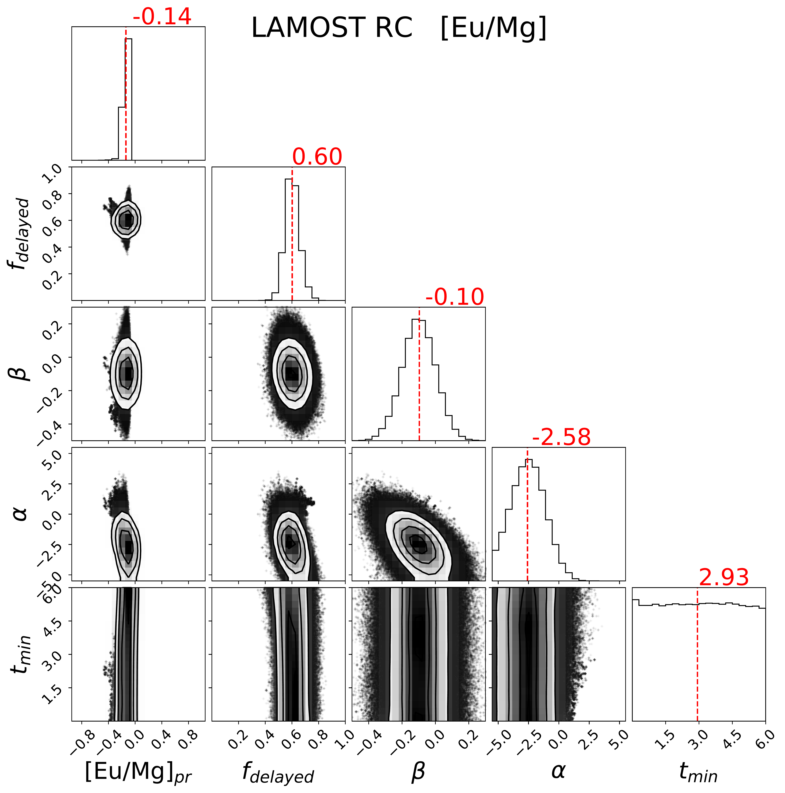
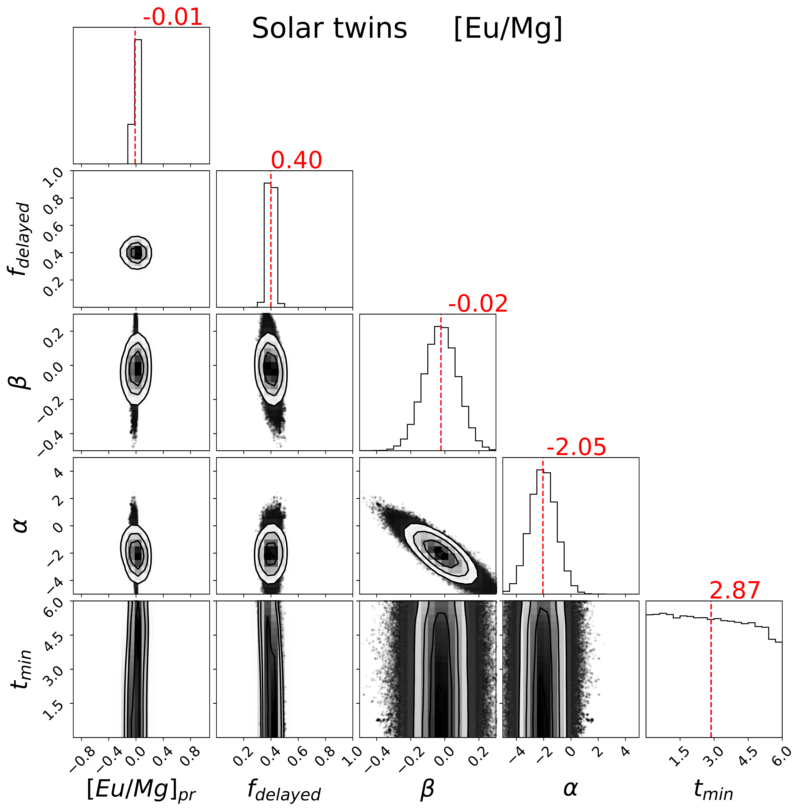
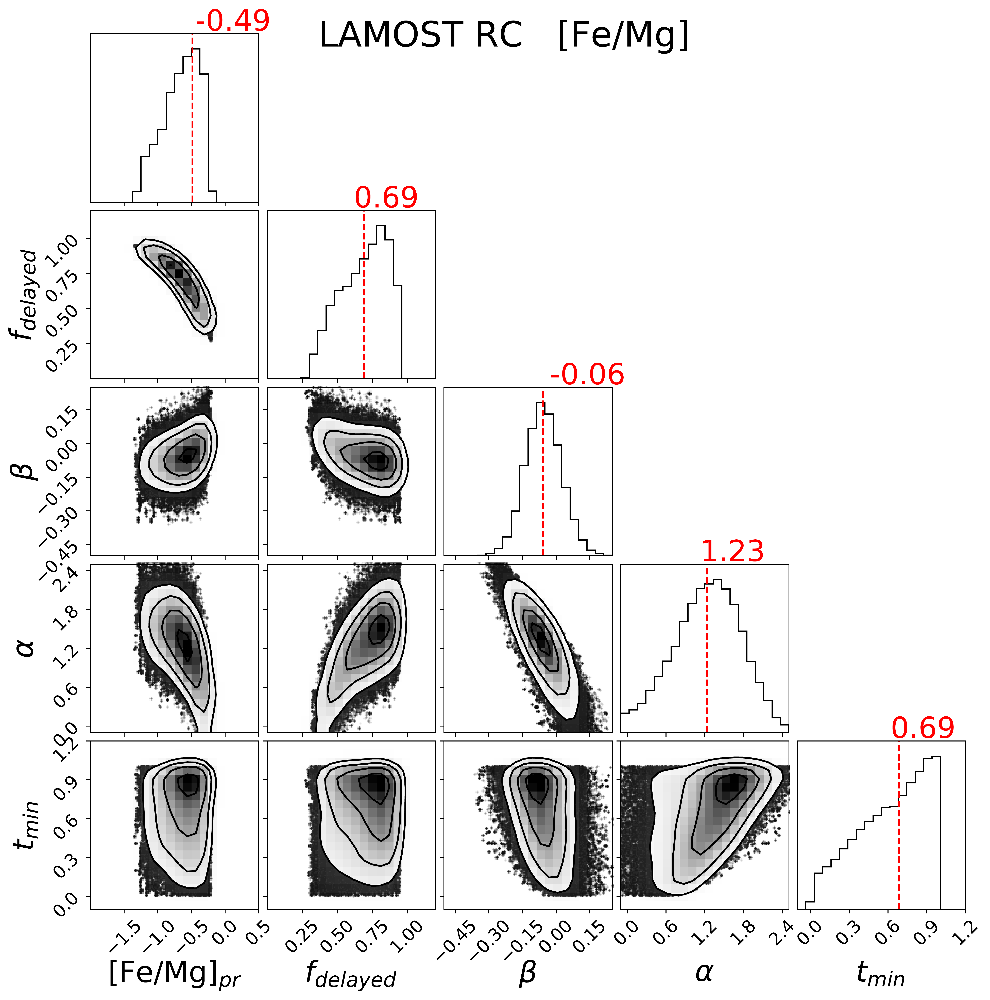
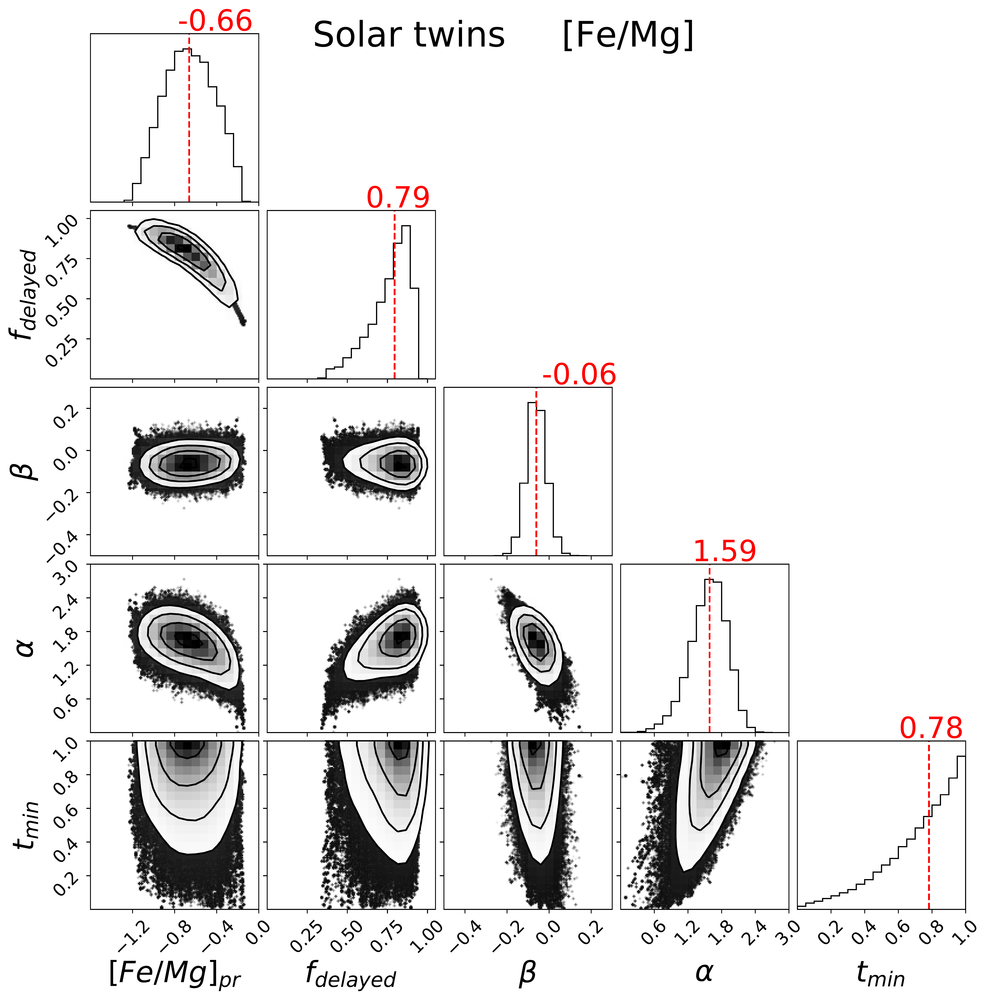
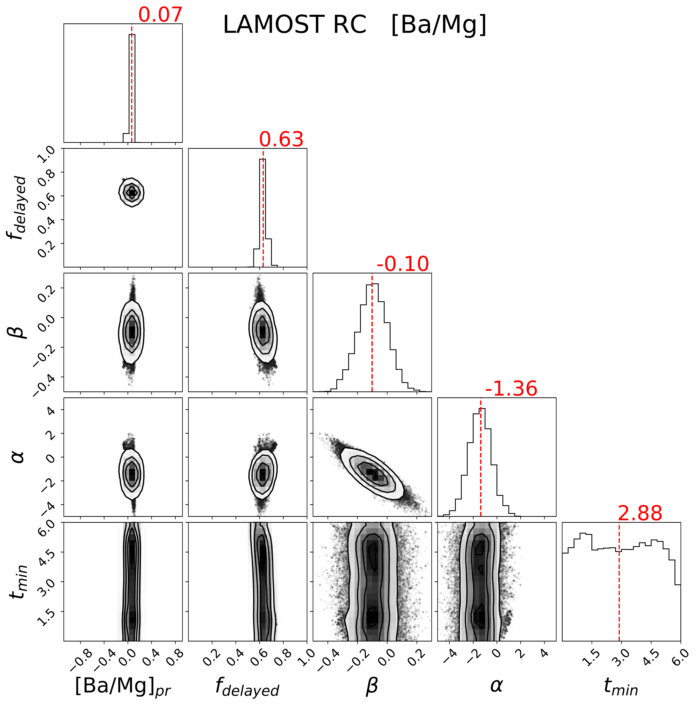
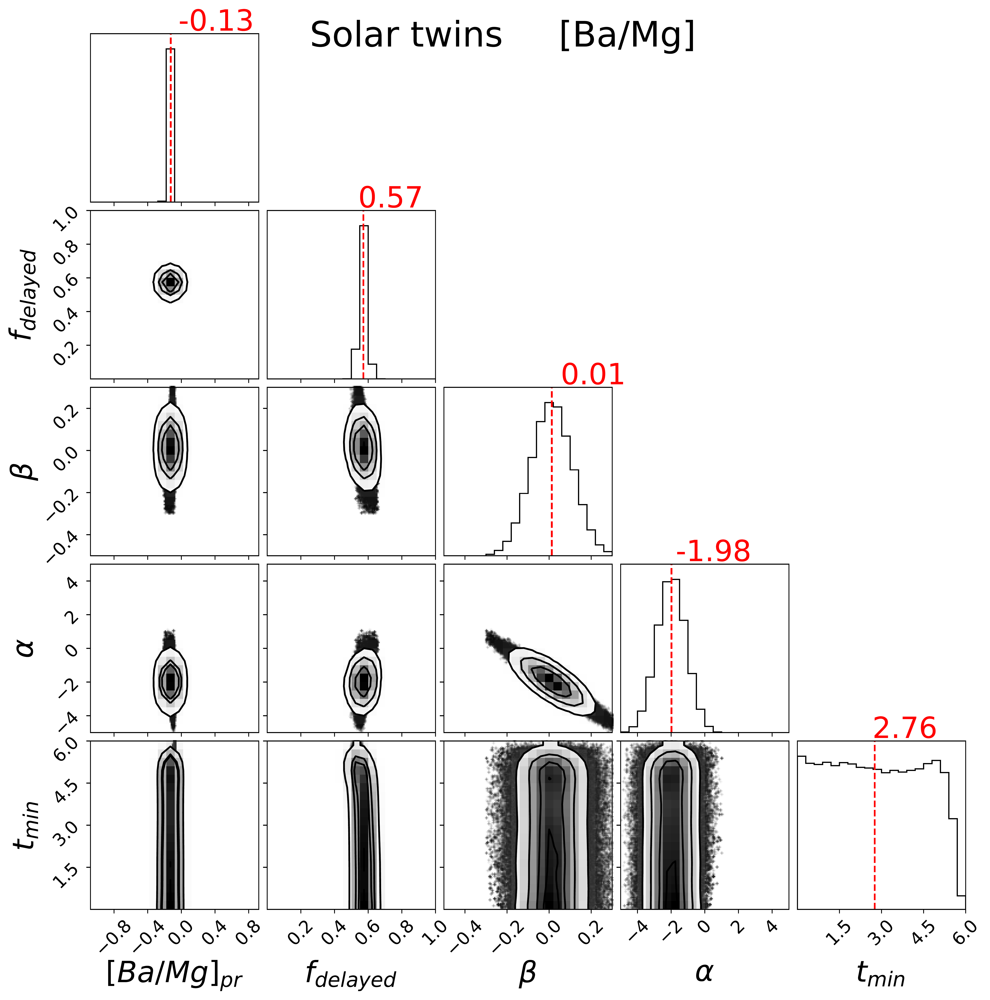

$\newcommand{\ensuremath}{}$
$\newcommand{\xspace}{}$
$\newcommand{\object}[1]{\texttt{#1}}$
$\newcommand{\farcs}{{.}''}$
$\newcommand{\farcm}{{.}'}$
$\newcommand{\arcsec}{''}$
$\newcommand{\arcmin}{'}$
$\newcommand{\ion}[2]{#1#2}$
$\newcommand{\textsc}[1]{\textrm{#1}}$
$\newcommand{\hl}[1]{\textrm{#1}}$
$\newcommand{\footnote}[1]{}$
$\newcommand\latex{La\TeX}$
$\newcommand{\teff}{\ensuremath{T_{\mathrm{eff}} }}$
$\newcommand{\logg}{\ensuremath{{\mathrm{log}  } g }}$
$\newcommand{\feh}{\ensuremath{[{\mathrm{Fe/H}}] }}$
$\newcommand{\afe}{\ensuremath{[{\mathrm{\alpha/Fe}}] }}$
$\newcommand{\mk}{\ensuremath{\mathrm M_K }}$
$\newcommand{\msun}{\ensuremath{M_\odot }}$
$\newcommand{\Hii}{\ensuremath{\mathrm{H \textsc{ii}} }}$
$\newcommand{\Ha}{\ensuremath{\mathrm H_\alpha }}$
$\newcommand{\age}{\ensuremath{\tau}}$
$\newcommand{\subfigure}[1]{#1}$

# Constraining the Delay Time Distribution of the r- and s-Process from Stellar Ages at Solar Metallicity

<mark>Appeared on: 2026-09-15</mark> -  _17 pages, 10 figures, 1 table, ApJ, in press_

<mark>M. Zhang</mark>, <mark>H.-W. Rix</mark>

**Abstract:** We present a new approach to constraining the delay time distribution (DTD) governing r- and s-process element production. Rather than using metallicity as a proxy for time, we work directly with stellar ages at solar metallicity, where chemical equilibrium models are most applicable. We analyze two complementary samples: more than $10,000$ red clump (RC) thin disk stars at solar metallicity from LAMOST, and solar twins with high-precision abundances; both have well-determined stellar ages $\tau$ . We fit chemical-equilibrium models with power-law DTDs to the evolution of [ Eu/Mg ] $(\tau)$ and [ Ba/Mg ] $(\tau)$ in each sample, taking europium as a canonical r-process element and barium as an s-process element, each referenced to magnesium as a near-instantaneous, CCSNe-dominated element. To validate the method, we first apply it to [ Fe/Mg ] $(\tau)$ and recover that $\approx\!70\%$ of Fe comes from a delayed channel with a declining DTD $\propto t^{-1.2}$ , in agreement with well-established results for iron production in thermonuclear supernovae. It also shows that about $60\%$ of Eu and Ba forming today originate from strongly-delayed processes, and the inferred delayed-production rates of both Eu and Ba $*rise*$ with delay time, opposite to that of thermonuclear supernovae. These results provide direct temporal constraints on r- and s-process enrichment, complementary to metallicity-based chemical-evolution studies. Because we model abundance referenced to Mg, and the same trend is recovered across stars of different guiding-center radii, this appears unaffected by radial migration and chemical evolution varying with Galactocentric radius. If confirmed, it points to delayed neutron-capture production beyond NS--NS mergers.

**Figure 6. -** Posterior distributions for the [Eu/Mg] fit, for the LAMOST RC sample (left) and the solar twins (right). Diagonal panels show the 1D marginalized posteriors with their medians (red lines); off-diagonal panels show the 2D posteriors. The recovered DTD index is $\alpha \approx -2.8$(LAMOST) and $\approx -2.2$(twins), i.e. a DTD that *rises* steeply with delay time, with a delayed fraction $f_{\rm delayed}\approx 0.6$(LAMOST) and $\approx 0.45$(twins). As for all elements, $\alpha$ and $\beta$ are covariant, and $t_{\rm min}$ is only weakly constrained.
 (*fig:corner_eu*)

**Figure 4. -** Posterior distributions for the [Fe/Mg] fit, for the LAMOST RC sample (left) and the solar twins (right). Diagonal panels show the 1D marginalized posteriors with their medians (red lines); off-diagonal panels show the 2D posteriors. The recovered DTD index is $\alpha \approx +1.2$(LAMOST) and $\approx +1.6$(twins), i.e. a *declining* DTD, as expected for the Type Ia channel that dominates Fe, with a delayed fraction $f_{\rm delayed} \approx 0.8$. Note the clear $\alpha$--$\beta$ covariance.
 (*fig:corner_fe*)

**Figure 8. -** Posterior distributions for the [Ba/Mg] fit, for the LAMOST RC sample (left) and the solar twins (right). Diagonal panels show the 1D marginalized posteriors with their medians (red lines); off-diagonal panels show the 2D posteriors. The recovered DTD index is $\alpha \approx -1.2$(LAMOST) and $\approx -1.8$(twins), i.e. a rising DTD, somewhat shallower than that of Eu, with a delayed fraction $f_{\rm delayed}\approx 0.6$ in both samples.
 (*fig:corner_ba*)

