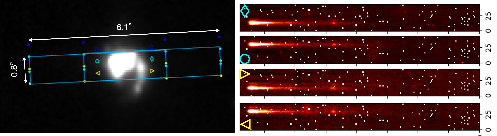
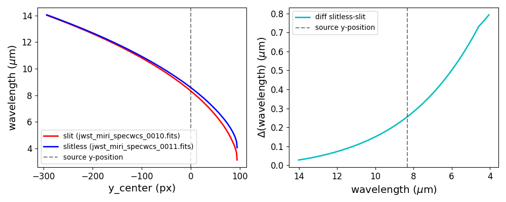
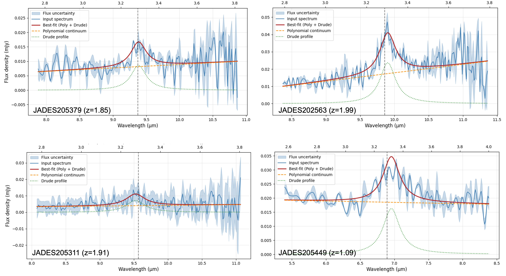

$\newcommand{\ensuremath}{}$
$\newcommand{\xspace}{}$
$\newcommand{\object}[1]{\texttt{#1}}$
$\newcommand{\farcs}{{.}''}$
$\newcommand{\farcm}{{.}'}$
$\newcommand{\arcsec}{''}$
$\newcommand{\arcmin}{'}$
$\newcommand{\ion}[2]{#1#2}$
$\newcommand{\textsc}[1]{\textrm{#1}}$
$\newcommand{\hl}[1]{\textrm{#1}}$
$\newcommand{\footnote}[1]{}$
$\newcommand{\vdag}{(v)^\dagger}$
$\newcommand\aastex{AAS\TeX}$
$\newcommand\latex{La\TeX}$
$\newcommand\um{\mum}$

# Cosmic Noon Galaxies in the Hubble Ultra-Deep Field using MIRI Wide-Field Slitless Spectroscopy

<mark>Appeared on: 2026-09-16</mark> -  _27 pages, 13 figures; submitted to AAS Journals_

S. Kendrew, et al. -- incl., <mark>F. Walter</mark>, <mark>T. Henning</mark>

**Abstract:** We present results from a survey of the Hubble Ultra-Deep Field using the Wide-Field Slitless Spectroscopic (WFSS) capability of the Mid-Infrared Instrument (MIRI) on JWST, demonstrating the capabilities of this new mode. We describe the data reduction and calibration methodology, and estimate calibration uncertainties. From our observations we obtain spectra of 47 galaxies with confirmed spectroscopic redshifts, with a maximum $z_{\mathrm{spec}}$ of 3.712. In the final sample we target in particular the 3.3 $\um$ Polycyclic Aromatic Hydrocarbon (PAH) feature, which has recently gathered interest as a star formation rate indicator and diagnostic for the dust grain size distribution in star forming galaxies from the local Universe to intermediate redshifts. The feature falls into the WFSS wavelength region for redshifts 0.67 to 3.1 - providing full coverage of the peak star formation "Cosmic Noon" era (1 $< z <$ 3) and connecting dust properties in this critical galaxy evolution period with local-Universe and low-redshift observations. Using the galaxies in our sample in this redshift regime, we test correlations identified in lower-redshift samples in the near-infrared or targeted programs in the mid-infrared, finding the WFSS spectra, even with large calibration uncertainties, show good agreement with complementary samples. the 3.3 $\um$ PAH luminosities follow previously established correlations with total IR luminosity and SED-derived star formation rates, confirming this feature's power as tracer of dust-obscured star formation. Our work illustrate the potential of the MIRI WFSS mode for studies of Cosmic Noon-era galaxies in particular in an observationally efficient way.

**Figure 1. -** Left: MIRI F560W image of target galaxy ALMA-C10 from the MIDIS survey \citep{midis2025}, showing the positioning of the LRS slit in Obs 1 of program 4533 overlaid. The mosaic contained 3 pointings along the dispersion direction, indicated in blue, cyan and yellow, respectively. An along-slit-nod pattern executed at each position, resulting in 6 exposures. The filled round symbols indicate the slit vertices in each pointing, and the open symbols indicate the slit center location. The placement has been corrected for the systematic FGS-MIRI pointing offset that resulted in the galaxy being largely missed in the first mosaic pointing (exposures 1 and 2). Right: 2D spectral images of the galaxy at 4 of the 6 pointing locations (exposures 3, 4, 5 and 6). The background has been subtracted, and the images are rotated by 90 degrees for visualization purposes; the dispersion direction of LRS is vertical. Each spectral image is accompanied by a cyan or yellow symbol indicating the pointing at which the spectrum was obtained. In exposures 5 and 6 (yellow triangle symbols), the spectrum of the spiral arm is clearly resolved. (*fig:slit_placement*)

**Figure 6. -** Comparison of the MIRI LRS dispersion profiles at the two well-calibrated locations: in the slit centre and at the nominal position in the SLITLESSPRISM subarray. Overplotted is the difference between the two profiles, illustrating the potential calibration errors in the WFSS dataset, which are all calibrated with the slit calibration reference file. (*fig:dispersion_comp*)

**Figure 11. -** Examples of fits to the 3.3 \um PAH feature in our sample of galaxies. Each plot shows the best 1st-order polynomial fit to the continuum, the best-fit Drude profile, and the combined best fit to the spectral region around the feature. Uncertainties on the spectrum flux are shown in the blue shaded region. x-axes show both the observed and rest wavelengths (bottom and top axes, respectively). The top-right panel shows the fit for source ALMA-C10, discussed in detail in Section \ref{subsec:alma10}; this spectrum also shows a clear detection of the 3.4 \um aliphatic feature.  (*fig:pahfits_examples*)

