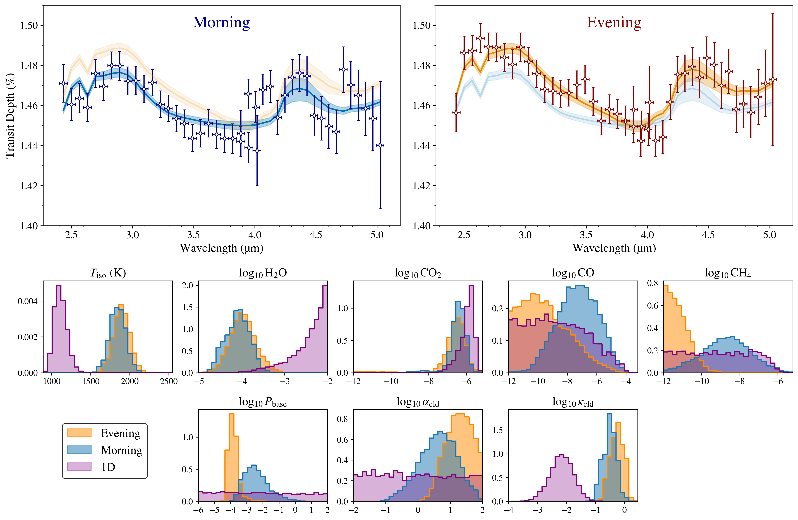
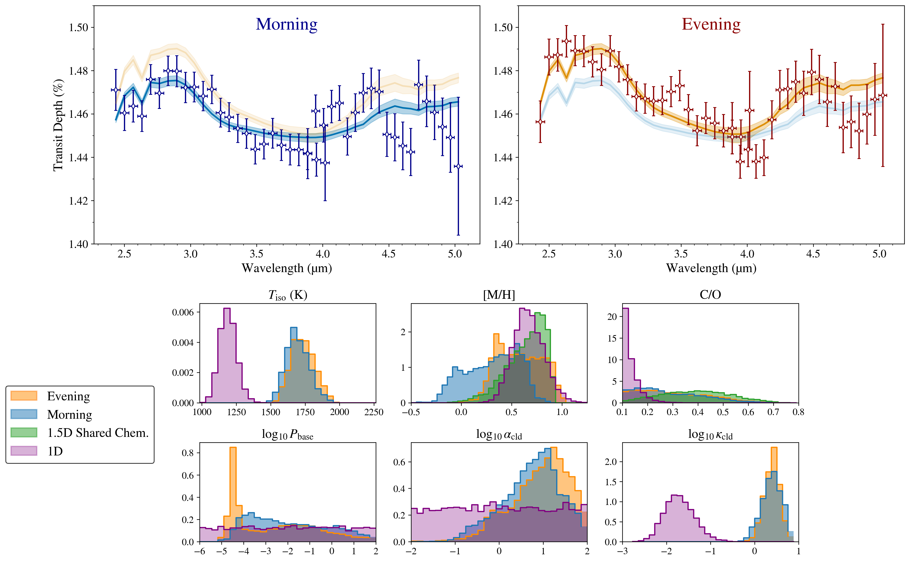
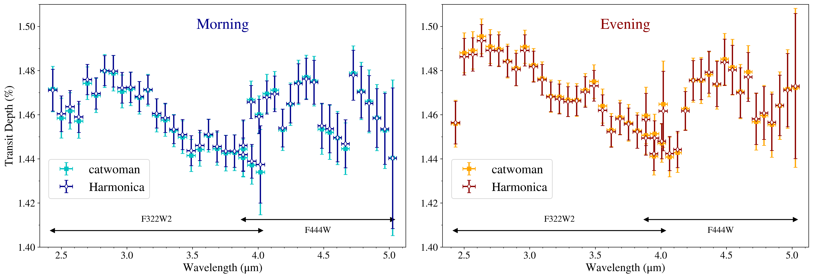

$\newcommand{\ensuremath}{}$
$\newcommand{\xspace}{}$
$\newcommand{\object}[1]{\texttt{#1}}$
$\newcommand{\farcs}{{.}''}$
$\newcommand{\farcm}{{.}'}$
$\newcommand{\arcsec}{''}$
$\newcommand{\arcmin}{'}$
$\newcommand{\ion}[2]{#1#2}$
$\newcommand{\textsc}[1]{\textrm{#1}}$
$\newcommand{\hl}[1]{\textrm{#1}}$
$\newcommand{\footnote}[1]{}$
$\newcommand{\vdag}{(v)^\dagger}$
$\newcommand\aastex{AAS\TeX}$
$\newcommand\latex{La\TeX}$
$\newcommand{\eureka}{\texttt{Eureka!}\xspace}$
$\newcommand{\tiberius}{\texttt{Tiberius}\xspace}$
$\newcommand{\planet}{HD 209458 b\xspace}$
$\newcommand{\water}{H_2O\xspace}$
$\newcommand{\thefigure}{A\arabic{figure}}$
$\newcommand{\thetable}{A\arabic{table}}$
$\newcommand{\theHfigure}{app.\arabic{figure}}$
$\newcommand{\theHtable}{app.\arabic{table}}$

# The asymmetric limbs of $\planet$ observed with JWST NIRCam F322W2/F444W

<mark>Appeared on: 2026-09-16</mark> -  _15 pages, 8 figures (excl. Appendix). Accepted for publication in the Astrophysical Journal Letters_

C. Maguire, et al. -- incl., <mark>E.-M. Ahrer</mark>

**Abstract:** We present a reanalysis of JWST NIRCam F322W2/F444W transit observations of the hot Jupiter $\planet$ to extract morning and evening transmission spectra. To determine whether asymmetries in the transit light curves arise from atmospheric structure, we refine the HD 209458 system parameters through a reanalysis of archival transit and radial velocity data. We then extract limb-resolved spectra using two independent light curve modelling frameworks, \texttt{Harmonica} and \texttt{catwoman} , which yield consistent results. We interpret the transmission spectra using both 1D and 1.5D (i.e., retrievals in which each limb of the planet is modelled independently) atmospheric retrievals. From our 1.5D free-chemistry retrievals, we find a strong preference ( ${\Delta\ln Z=2.81\pm0.49}$ ) for a model in which the morning and evening limbs are retrieved independently over one in which they share atmospheric parameters, despite the additional free parameters this requires. This asymmetry is most pronounced in the retrieved cloud properties, consistent with 3D atmospheric circulation models that predict longitudinally varying cloud distributions, and to a lesser extent in the $\ce{CH4}$ and $\ce{CO}$ abundances. In contrast, the $\ce{H2O}$ and $\ce{CO2}$ abundances and the isothermal temperature structure remain largely consistent between limbs. Similarly, our 1.5D equilibrium chemistry retrieval reveals a uniform composition between the limbs, alongside a marginally hotter evening limb relative to the morning limb. While the retrieved temperatures, chemical abundances, metallicities and carbon-to-oxygen ratios ( $\rm C/O$ ) are uniform across both limbs, they exhibit significant differences from our 1D retrieval results, highlighting the importance of multidimensional modelling in mitigating 1D retrieval biases.

**Figure 3. -** Results of the fiducial 1.5D \texttt{Exo Skryer} free-chemistry retrieval (see Section \ref{sec:freechemretrieval}) applied to the \texttt{Harmonica} transmission spectra. The top panels display the median model transmission spectra and 1$\sigma$ confidence intervals derived from 10,000 posterior samples, with the morning and evening spectra shown on the left and right, respectively. For reference, the evening and morning median models are also shown with a lower opacity on the left and right, respectively. The bottom panels present the marginal posterior distributions for the corresponding limb parameters, with the morning and evening posteriors highlighted in blue and orange, respectively. For comparison, the marginal posteriors from our 1D NIRCam-only atmospheric retrieval are plotted in purple. (*fig:freechem_retrieval*)

**Figure 4. -** Results of the fiducial 1.5D \texttt{Exo Skryer} equilibrium chemistry retrieval (see Section \ref{sec:equilchemretrieval}) applied to the \texttt{Harmonica} transmission spectra. The top panels display the median model transmission spectra and 1$\sigma$ confidence intervals derived from 10,000 posterior samples, with the morning and evening spectra shown on the left and right, respectively. For reference, the evening and morning median models are also shown with a lower opacity on the left and right, respectively. The bottom panels present the marginal posterior distributions for the corresponding limb parameters, with the morning and evening posteriors highlighted in blue and orange, respectively. For comparison, the marginal posteriors from our 1D NIRCam-only atmospheric retrieval are plotted in purple. Similarly for the [M/H] and C/O posteriors, the marginal posteriors from a 1.5D atmospheric retrieval assuming shared chemistry between the limbs are plotted in green. (*fig:equilchem_retrieval*)

**Figure 2. -** The morning (left) and evening (right) transmission spectra obtained for each of our light curve fitting routines (detailed in Sections \ref{sect:harmonica_fitting} \& \ref{sec:catwoman_fitting}). The light curves were reduced with \texttt{Eureka!}(see Section \ref{sec:eureka}). The transit depths obtained from the \texttt{Harmonica} fit are shown as unfilled diamonds, whereas the transit depths obtained from the \texttt{catwoman} fit are shown as filled squares. Horizontal black arrows highlight the wavelength coverage of the NIRCam F322W2 and F444W filters. The best-fit offset value from our 1.5D fiducial free-chemistry atmospheric retrieval has been applied to the F444W values for clarity. (*fig:catharm_eureka*)

