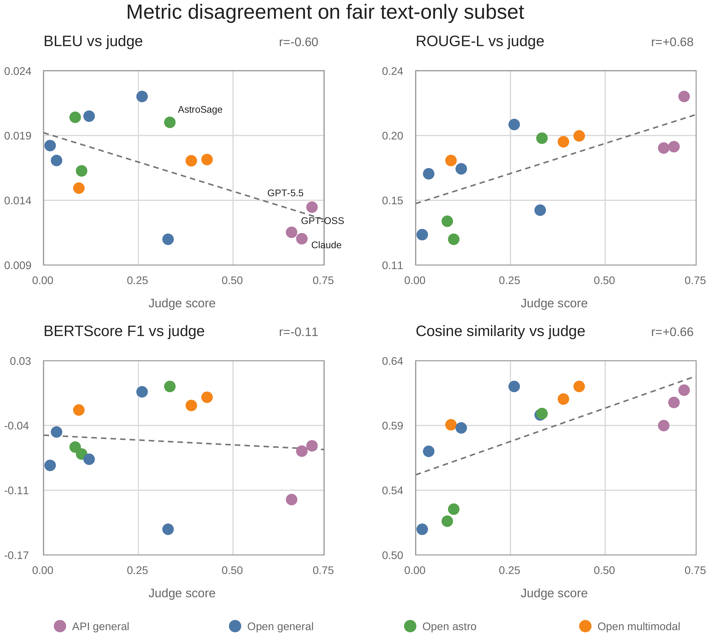
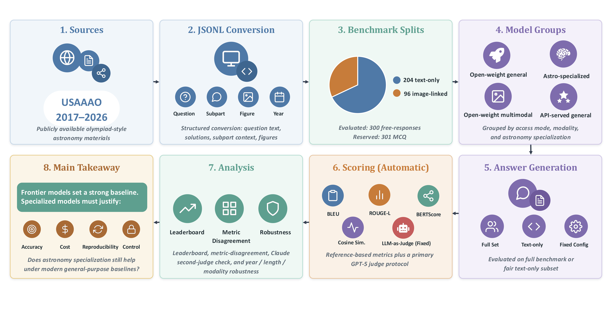
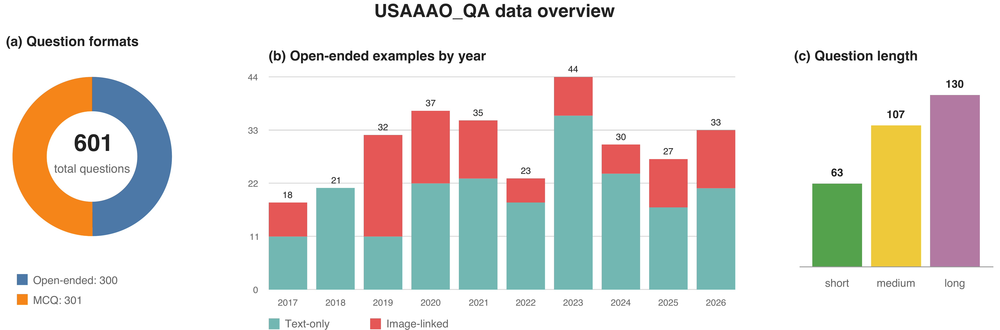

$\newcommand{\ensuremath}{}$
$\newcommand{\xspace}{}$
$\newcommand{\object}[1]{\texttt{#1}}$
$\newcommand{\farcs}{{.}''}$
$\newcommand{\farcm}{{.}'}$
$\newcommand{\arcsec}{''}$
$\newcommand{\arcmin}{'}$
$\newcommand{\ion}[2]{#1#2}$
$\newcommand{\textsc}[1]{\textrm{#1}}$
$\newcommand{\hl}[1]{\textrm{#1}}$
$\newcommand{\footnote}[1]{}$
$\newcommand{\arraystretch}{1.15}$
$\newcommand{\BibTeX}{{\rm B\kern-.05em{\sc i\kern-.025em b}$
$    T\kern-.1667em\lower.7ex\hbox{E}\kern-.125emX}}$

# Rethinking Domain Specialization for Open-Ended Scientific Reasoning in Astronomy Language Models

<mark>Appeared on: 2026-09-17</mark> - 

V. Lama, et al. -- incl., <mark>Y.-S. Ting</mark>

**Abstract:** Domain-specialized language models are widely used for scientific question answering, but stronger general-purpose systems raise a sharper question: when does domain-specific fine-tuning remain valuable for open-ended scientific reasoning? We study this in astronomy with a curated QA benchmark from publicly available 2017--2026 Olympiad-style materials. The free-response subset contains 300 questions, including 204 text-only and 96 image-linked examples. We compare open-weight and API-served general-purpose, multimodal, and astronomy-specialized models using judge-based correctness and complementary reference metrics. Strong general-purpose models establish the highest correctness baseline in this testbed, while analyses of metric agreement, judge sensitivity, benchmark composition, and modality reveal variation not capturedby a single leaderboard. These results motivate treating domain specializationas a task- and deployment-dependent property and highlight the role of domain-specific evaluation in determining which models, capabilities, and evaluation criteria are appropriate for scientific workflows.

**Figure 1. -** Relationship between judge scores and reference-based metrics on the
  shared text-only subset. Correlations vary considerably across BLEU, ROUGE-L,
  BERTScore F1, and sentence-level cosine similarity, illustrating that
  reference similarity does not consistently track judged correctness. (*fig:metric-disagreement*)

**Figure 7. -** Experimental pipeline for constructing the benchmark, generating model
  responses, evaluating scientific answer quality, and analyzing model behavior
  across performance, metric-agreement, robustness, and modality views. (*fig:experiment-pipeline*)

**Figure 8. -** Overview of the USAAAO\_QA corpus. (a) Distribution of the 601 questions between free-response and multiple-choice formats. (b) Distribution of the 300 free-response examples across years and text-only or image-linked modalities. (c) Distribution of the free-response examples across short, medium, and long length categories. The 301 multiple-choice questions are reserved for a future benchmark track. (*fig:data-overview*)

