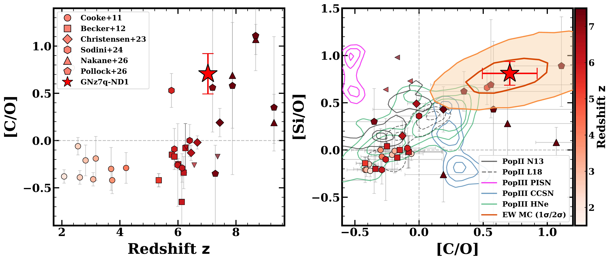
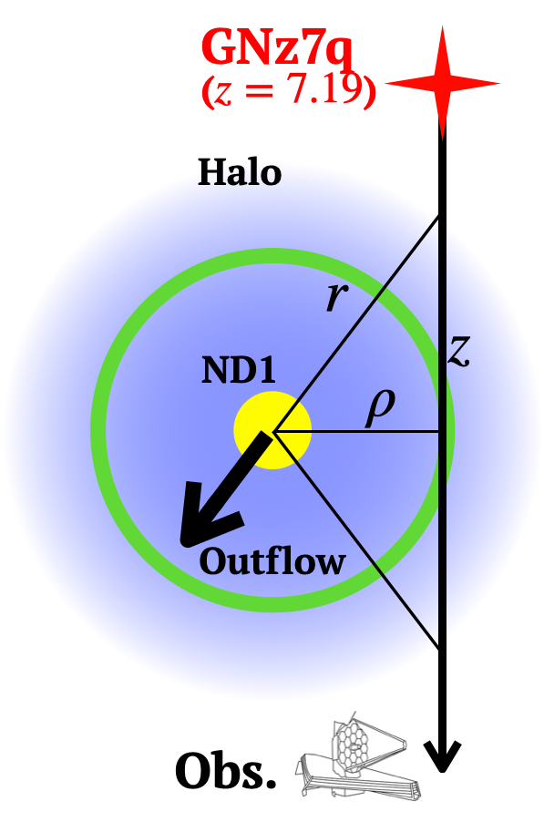

$\newcommand{\ensuremath}{}$
$\newcommand{\xspace}{}$
$\newcommand{\object}[1]{\texttt{#1}}$
$\newcommand{\farcs}{{.}''}$
$\newcommand{\farcm}{{.}'}$
$\newcommand{\arcsec}{''}$
$\newcommand{\arcmin}{'}$
$\newcommand{\ion}[2]{#1#2}$
$\newcommand{\textsc}[1]{\textrm{#1}}$
$\newcommand{\hl}[1]{\textrm{#1}}$
$\newcommand{\footnote}[1]{}$
$\newcommand{\vdag}{(v)^\dagger}$
$\newcommand\aastex{AAS\TeX}$
$\newcommand\latex{La\TeX}$
$\newcommand{\oiii}{[O \textsc{iii}]}$
$\newcommand{\nii}{[N \textsc{ii}]}$
$\newcommand{\sii}{[S \textsc{ii}]}$
$\newcommand{\ha}{H\alpha}$
$\newcommand{\hb}{H\beta}$
$\newcommand{\hg}{H\gamma}$
$\newcommand{\hii}{H \textsc{ii}}$
$\newcommand{\feii}{Fe \textsc{ii}}$
$\newcommand{\heii}{He \textsc{ii}}$
$\newcommand{\sersic}{Sérsic}$
$\newcommand{\hi}{\mbox{H {\scshape i}} }$
$\newcommand{\lya}{Ly\alpha}$
$\newcommand{\mum}{\mum}$
$\newcommand{\dv}{\Delta v_{\rm Ly\alpha}}$
$\newcommand{\ew}{EW_{\rm 0}}$
$\newcommand{\lsun}{L_{\rm \odot}}$
$\newcommand{\msun}{M_{\rm \odot}}$
$\newcommand{\ltir}{L_{\rm TIR}}$
$\newcommand{\nhi}{N_{\rm HI}}$
$\newcommand{\loiii}{L_{\rm[OIII]}}$
$\newcommand{\llya}{L_{\rm Ly\alpha}}$
$\newcommand{\luv}{L_{\rm UV}}$
$\newcommand{\zph}{z_{\rm ph}}$
$\newcommand{\muv}{M_{\rm UV}}$
$\newcommand{\td}{T_{\rm d}}$
$\newcommand{\bd}{\beta_{\rm d}}$
$\newcommand{\md}{M_{\rm dust}}$
$\newcommand{\zoiii}{z_{\rm[OIII]}}$
$\newcommand{\zlya}{z_{\rm Ly\alpha}}$
$\newcommand{\zsun}{Z_{\rm \odot}}$
$\newcommand{\mdyn}{M_{\rm dyn}}$
$\newcommand{\mgas}{M_{\rm gas}}$
$\newcommand{\mmol}{M_{\rm H_{\rm 2}}}$
$\newcommand{\matom}{M_{\rm H_{\rm I}}}$
$\newcommand{\lir}{L_{\rm IR}}$
$\newcommand{\lirs}{L_{\rm IR,SF}}$
$\newcommand{\lira}{L_{\rm IR,AGN}}$
$\newcommand{\mgii}{Mg\textsc{ii}\lambda\lambda2796,2803}$
$\newcommand{\civ}{C\textsc{iv}\lambda\lambda1548,1550}$
$\newcommand{\oi}{\textsc{Oi}\lambda1302}$
$\newcommand{\cii}{\textsc{Cii}\lambda1334}$
$\newcommand{\siii}{Si\textsc{ii}\lambda1260}$
$\newcommand{\ciiemi}{{\textsc{[C ii]}}}$
$\newcommand{\oiiiemi}{{\textsc{[O iii]}}}$
$\newcommand{\galfits}{\textsc{GalfitS}}$
$\newcommand{\cigale}{\texttt{cigale}}$
$\newcommand{\tcr}{\textcolor{red}}$
$\newcommand{\tcb}{\textcolor{blue}}$
$\newcommand{\tcm}{\textcolor{magenta}}$
$\newcommand{\tcg}{\textcolor{cyan}}$
$\newcommand{\tck}{\textcolor{black}}$
$\newcommand{\PN}{\textcolor{green}}$
$\newcommand{\tarq}{GNz7q}$
$\newcommand{\targ}{ND1}$

# A dense, metal-rich absorber driven by a heavily dust-obscured galaxy:The direct evidence of CGM enrichment at $z\sim7$

<mark>Appeared on: 2026-09-17</mark> - 

Q. Fei, et al. -- incl., <mark>F. Walter</mark>, <mark>Y. Wu</mark>

**Abstract:** We report the serendipitous discovery of a dense, metal-enriched circumgalactic medium (CGM) absorber at $z=7.03$ , together with its associated host galaxy, identified along the sightline toward a red quasar.The absorber exhibits the largest rest-frame equivalent widths and column densities observed to date at $z > 5$ , tracing a metal enriched gaseous halo.Using deep JWST/NIRSpec and NOEMA observations, we characterize the absorber's physical properties and identify its host galaxy, ND1, as a vigorously star-forming galaxy at an exceptionally close impact parameter of $\approx 16$ kpc, so heavily dust-obscured that its emission is only detected in the NIRCam longest-wavelength bands ( $\lambda \gtrsim 4 \mu$ m).Multi-line detections of $\oiiiemi$ $\lambda$ 5007, H $\alpha$ , and $\ciiemi$ $\lambda 158 \mu$ m emission anchor the systemic redshift to $z_{\rm sys}=7.0321\pm 0.0007$ , revealing a coherent blueshift of $\sim 50 \rm  km s^{-1}$ between the absorbing gas and the host galaxy, suggesting outflow-driven metal transport into the halo.The outflow velocity, combined with the measured column density, implies an outflow rate of $\dot{M}_{\rm out}\approx 64 \rm M_\odot yr^{-1}$ and a mass loading factor $\eta\approx 3$ , indicating an energetic, chemically-enriched wind launched from a dust-obscured starburst.While the overall ionization state and [ Mg/Fe ] abundance ratio align with the empirical cosmic evolutionary trends, the absorber displays an enhanced carbon-to-oxygen ( [ C/O ] ) ratio.This abundance pattern suggests the nucleosynthetic yields of Population III stellar explosions, and aligns with the host's star-formation history extending to $z \gtrsim 8$ , potentially offering a rare fossil record of primordial metal enrichment.Ultimately, our findings demonstrate that intense star-formation feedback can rapidly and efficiently pollute the CGM/IGM well into the Epoch of Reionization.The NIR-dark nature of the host further implies that traditional rest-UV surveys may systematically miss the dusty sources that drive CGM- and IGM-scale metal enrichment in the early Universe.

**Figure 15. -** 
    Chemical abundance revealed from absorption lines at high-$z$, including the data from ground-based telescopes \citep[circles and squares][]{Cooke+2011_chemical, Becker+2012_chemical, Sodini+2024_che}, from recent JWST observations \citep[diamonds, triangles, and pentagon][]{Christensen+2023_qso_abs, Nakane+2026_che, Pollock+2026_che}, and this study (star).
    Left: The carbon-to-oxygen abundance ratio, [C/O], as a function of redshift.
    Our target is shown as the red star, while comparative samples from the literature are presented as colored data points.
    Right: [Si/O] vs. [C/O].
    The nested orange contours around $\targ$ mark the $1\sigma$ and $2\sigma$ joint-confidence regions on the abundance ratios, obtained from a Monte-Carlo propagation of the equivalent-width measurement uncertainties through the multi-ion curve-of-growth fit ($N_{\rm MC}=3\times 10^{4}$; see Section \ref{sec5.3}).
    Overlaid coloured tracks show theoretical metal yields from Population II (black) and three Population III scenarios: pair-instability supernovae (magenta), core-collapse supernovae (blue), and hypernovae (green).
     (*fig13:popiii*)

**Figure 7. -** {Multi-wavelength characterization of the galaxy $\targ$.}(a) The false-color image centered on $\tarq$, generated from F090W, F210M, and F444W, alongside NIRSpec MSA shutters from observations used in this study.
    The target of this study, $\targ$, is located towards the North--East.
    The green contours show the NOEMA 1 mm dust continuum from the archival Band-3 observations of [Fujimoto, et. al (2022)](https://ui.adsabs.harvard.edu/abs/2022Natur.604..261F).
    (b) Multi-band cutout images of $\targ$, spanning near-infrared bandpasses (F090W through F2100W) and the 1 mm NOEMA continuum map (from  ([Fujimoto, et. al 2022](https://ui.adsabs.harvard.edu/abs/2022Natur.604..261F)) ). MIRI images are smoothed with a kernel of 2 pixels for the presentation purpose.
    (c) The JWST/NIRSpec G395M-F290LP spectrum of $\targ$. The top panel shows the 2D spectrum from GO\#4762, and the bottom panel shows the 1D spectrum in units of $10^{-19} \mathrm{erg s^{-1} cm^{-2} \text{Å}^{-1}}$.
    The black line shows the integrated 1D spectrum combining two observations, while the blue line shows the 1D spectrum soly from GO\#4762.
    Key emission lines detected in the spectrum, including [O iii]$\lambda$5007 and H$\alpha$(red labels), are marked by red dashed vertical lines, and provide the redshift anchor for the systemic velocity used in the rest of the analysis.
     (*fig04:host*)

**Figure 3. -** Sketch of the geometry used to convert the absorption measurements into a mass-outflow rate for $\targ$(Section \ref{sec5.1}).
    The line of sight to the background quasar $\tarq$($z=7.19$) passes at a projected impact parameter $\rho$(on-sky separation converted to physical kpc at the host redshift) from the host galaxy $\targ$(yellow).
    The absorbing gas is treated as a partially-covering, uniformly enriched thin shell (green circle) of physical radius $r$, embedded in the host halo (light-blue diffuse region). Because we only measure the on-sky separation and the line-of-sight velocity component, both $\rho$ and $v_{\rm out}$ are projected quantities, with $r \geq \rho$ and $|\vec{v}_{\rm out}| \geq v_{\rm out, LOS}$; the values quoted in the main text should therefore be interpreted as first-order estimates. (*fig:app_outflow_geom*)

