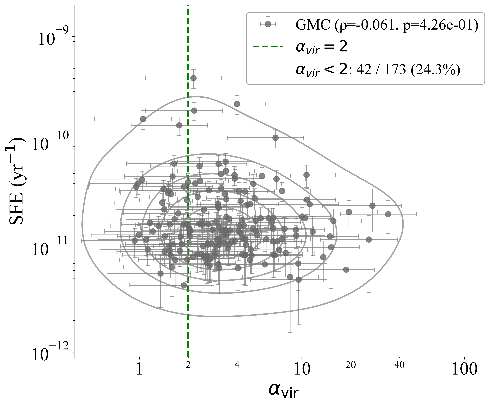
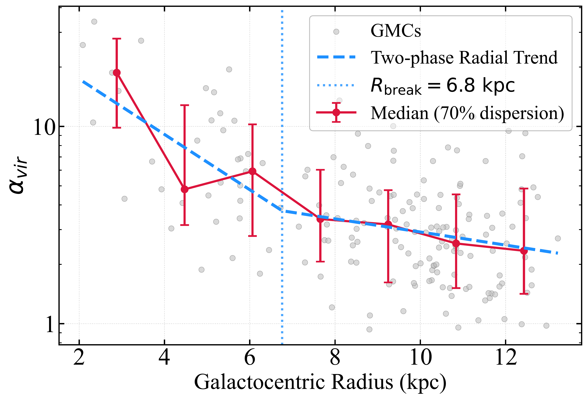
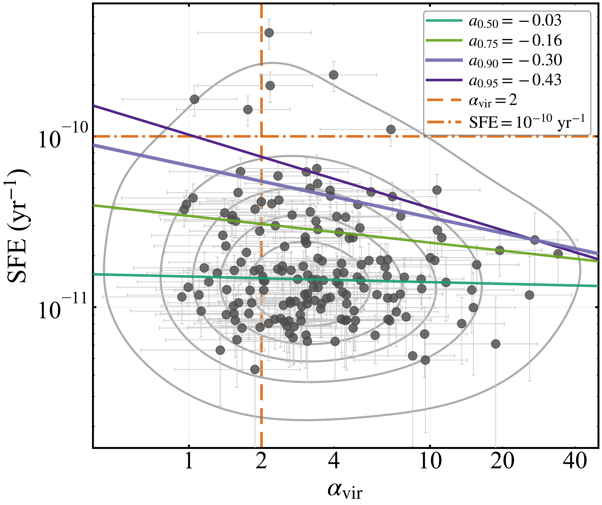

$\newcommand{\ensuremath}{}$
$\newcommand{\xspace}{}$
$\newcommand{\object}[1]{\texttt{#1}}$
$\newcommand{\farcs}{{.}''}$
$\newcommand{\farcm}{{.}'}$
$\newcommand{\arcsec}{''}$
$\newcommand{\arcmin}{'}$
$\newcommand{\ion}[2]{#1#2}$
$\newcommand{\textsc}[1]{\textrm{#1}}$
$\newcommand{\hl}[1]{\textrm{#1}}$
$\newcommand{\footnote}[1]{}$
$\newcommand\green{#1 }$

# Low Star Formation Efficiency in M31: Evidence for a Deficit of Bound Gas

<mark>Appeared on: 2026-09-17</mark> -  _13 pages, 8 figures, 1 table; accepted for publication in ApJ_

F. Deng, et al. -- incl., <mark>S. Jiao</mark>, <mark>H. Beuther</mark>, <mark>C. Gieser</mark>, <mark>F. Xu</mark>, <mark>J. d. Brok</mark>

**Abstract:** The Andromeda galaxy (M31) exhibits a systematically low star formation efficiency (SFE) compared to other star-forming galaxies.Star formation is thought to be regulated by the mass of gravitationally bound gas.To investigate whether the low SFE in M31 originates from a scarcity of such bound gas, we analyze the dynamical state of its giant molecular cloud (GMC) population by estimating their virial parameters ( $\alpha_{\text{vir}}$ ).Using a JCMT-SCUBA2 850 \textmu m dust-continuum GMC catalog as the parent sample, we combine it with IRAM 30m CO(1-0) data to define a working sample of 173 GMCs and derive their kinematic properties.Most analyzed GMCs exhibit high $\alpha_{\text{vir}}$ , indicating that they are predominantly gravitationally unbound at the $\sim86$ -pc resolution of our observations.While no statistically significant global correlation is found between SFE and $\alpha_{\text{vir}}$ for the full cloud sample, the upper quantiles of the SFE distribution show progressively stronger negative trends with increasing $\alpha_{\text{vir}}$ .This upper-tail trend may arise from the combined effects of the virial parameter limiting the upper range of SFE values accessible to the GMC population and feedback-driven disruption reducing the number of high-SFE, high- $\alpha_{\rm vir}$ CO-bright clouds in the observed sample.The substantial scatter in the SFE- $\alpha_{\text{vir}}$ plane likely reflects the diverse evolutionary stages of GMCs, the temporal mismatch between gas and star formation tracers, and the limitations of a cloud-averaged virial parameter as a tracer of internal dynamical structure, making a simple one-to-one correspondence between $\alpha_{\text{vir}}$ and instantaneous SFE difficult to recover for individual GMCs.

**Figure 8. -** Relation between the SFE and the $\alpha_{\text{vir}}$.
        The contours outline the distribution of the data points, decreasing in number density from the peak (center) to the 95\% probability boundary (outermost).
        The vertical green dashed line marks the $\alpha_{\text{vir}} = 2$ threshold. The Spearman correlation coefficient ($\rho$) and the corresponding $p$-value are annotated in the legend. The error bars represent the uncertainties propagated from the measurements of mass, size, SFR, and $\sigma_v$. (*fig:sfe_vir*)

**Figure 2. -** Radial variation of the GMC virial parameter as a function of galactocentric radius in M31. Gray circles represent individual GMCs in our sample. The red symbols and associated error bars denote the median values and the 70\% dispersion (corresponding to the 15th--85th percentiles) calculated within sliding radial bins.
    The blue dashed line illustrates a two-phase linear fit to the logarithmic data, with an apparent transition near $R \sim 6$-7 kpc marked by the vertical blue dotted line.
     (*fig:vir_galacR*)

**Figure 5. -** Relation between SFE and $\alpha_{\rm vir}$ with quantile-regression fits.
    The data points and contours are the same as in Figure \ref{fig:sfe_vir}.
    Colored solid lines show linear quantile-regression fits in the $\log{\rm SFE}$--$\log\alpha_{\rm vir}$ plane for $\tau=0.50$, 0.75, 0.90, and 0.95, where $\tau$ denotes the conditional quantile of the SFE distribution at fixed $\alpha_{\rm vir}$.
    The vertical orange dashed line marks the $\alpha_{\rm vir}=2$ threshold, while the horizontal orange dash-dotted line indicates $SFE=10^{-10}$ yr$^{-1}$.
     (*fig:sfe_vir_up*)

