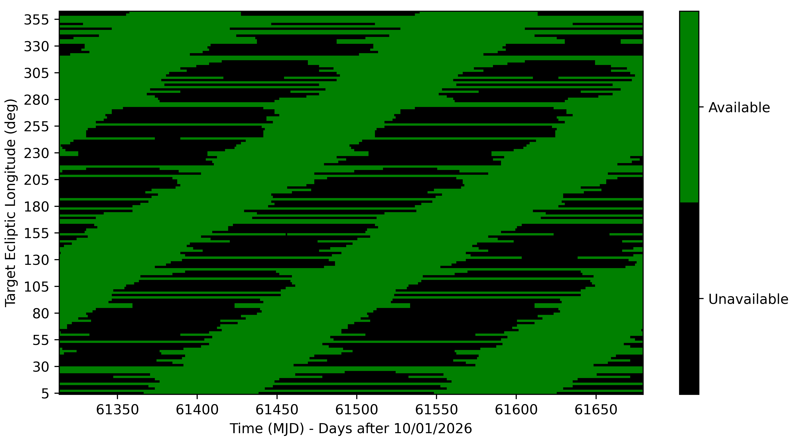

$\newcommand{\ensuremath}{}$
$\newcommand{\xspace}{}$
$\newcommand{\object}[1]{\texttt{#1}}$
$\newcommand{\farcs}{{.}''}$
$\newcommand{\farcm}{{.}'}$
$\newcommand{\arcsec}{''}$
$\newcommand{\arcmin}{'}$
$\newcommand{\ion}[2]{#1#2}$
$\newcommand{\textsc}[1]{\textrm{#1}}$
$\newcommand{\hl}[1]{\textrm{#1}}$
$\newcommand{\footnote}[1]{}$
$\newcommand{\mfbar}[1]{\mf{\bar{#1}}}$
$\newcommand{\mfhat}[1]{\mf{\hat{#1}}}$
$\newcommand{\intd}[1]{\ensuremath{ \mathrm{d}#1}}$
$\newcommand{\leftexp}[2]{{\vphantom{#2}}^{#1}\!{#2}}$
$\newcommand{\leftsub}[2]{{\vphantom{#2}}_{#1}\!{#2}}$
$\newcommand{\refeq}[1]{Equation  (\ref{#1})}$
$\newcommand{\reftable}[1]{Table \ref{#1}}$
$\newcommand{\reffig}[1]{Figure \ref{#1}}$
$\newcommand{\refsec}[1]{Section \ref{#1}}$
$\newcommand{\refnum}[1]{Ref.~\citenum{#1}}$
$\newcommand{\nlhref}[1]{\href{#1}{\nolinkurl{#1}}}$
$\newcommand{\baselinestretch}{1.0}$
$\newcommand{\mf}{\mathbf}$
$\newcommand{\mb}{\mathbb}$
$\newcommand{\mc}{\mathcal}$

# The Nancy Grace Roman Space Telescope Coronagraph Community Participation Program

<mark>Appeared on: 2026-09-17</mark> -  _Conference proceedings from Space telescopes and instrumentation 2024: optical, infrared, and millimeter wave_

D. Savransky, et al. -- incl., <mark>W. Brandner</mark>, <mark>O. Krause</mark>, <mark>M. Samland</mark>, <mark>J. Schreiber</mark>

**Abstract:** In preparation for the operational phase of the Nancy Grace Roman Space Telescope, NASA has created the Coronagraph Community Participation Program (CPP) to prepare for and execute Coronagraph Instrument technology demonstration observations. The CPP is composed of 7 small, US-based teams, selected competitively via the Nancy Grace Roman Space Telescope Research and Support Participation Opportunity, members of the Roman Project Team, and international partner teams from ESA, JAXA, CNES, and the Max Planck Institute for Astronomy. The primary goals of the CPP are to prepare simulation tools, target databases, and data reduction software for the execution of the Coronagraph Instrument observation phase. Here, we present the current status of the CPP and its working groups, along with plans for future CPP activities up through Roman's launch. We also discuss plans to potentially enable future commissioning of currently-unsupported modes.

**Figure 1. -** Roman observatory pointing constraints applied to the HWO mission star listmamajek2024nasa.  Rows represent individual target stars (sorted by ecliptic longitude) while columns represent time in days after 10/01/2026. Black regions of each row represent times when the target is inaccessible due to pointing constraints. The fraction of the year that a target is available is primarily driven by its ecliptic latitude. (*fig:cgi_keepout*)

