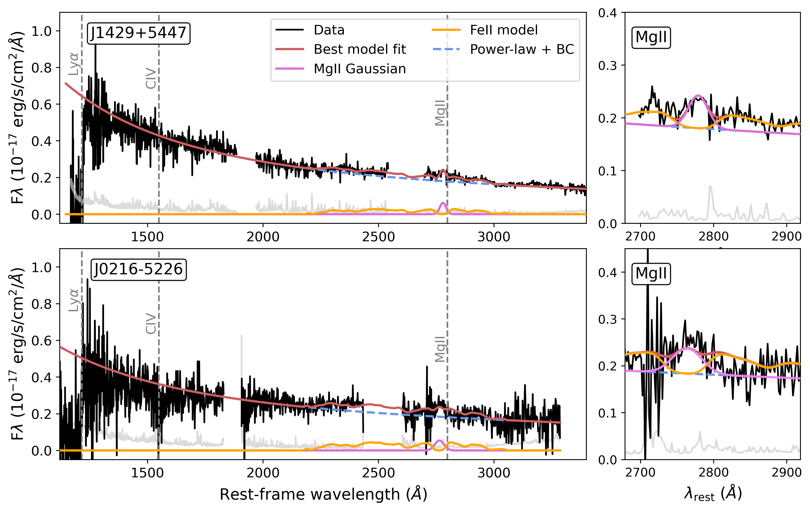
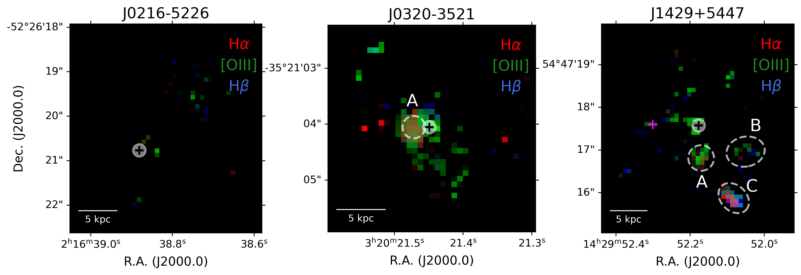
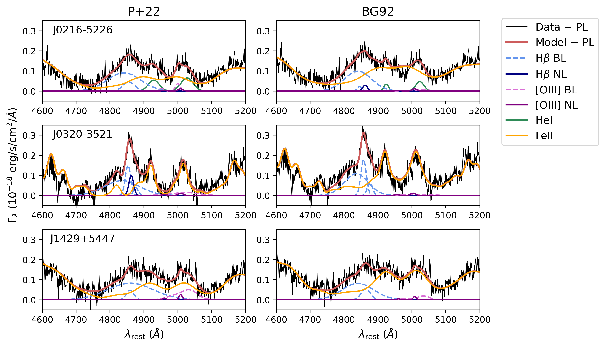

$\newcommand{\ensuremath}{}$
$\newcommand{\xspace}{}$
$\newcommand{\object}[1]{\texttt{#1}}$
$\newcommand{\farcs}{{.}''}$
$\newcommand{\farcm}{{.}'}$
$\newcommand{\arcsec}{''}$
$\newcommand{\arcmin}{'}$
$\newcommand{\ion}[2]{#1#2}$
$\newcommand{\textsc}[1]{\textrm{#1}}$
$\newcommand{\hl}[1]{\textrm{#1}}$
$\newcommand{\footnote}[1]{}$
$\newcommand{\vdag}{(v)^\dagger}$
$\newcommand\aastex{AAS\TeX}$
$\newcommand\latex{La\TeX}$

# Extreme Enrichment at Cosmic Dawn: Three FeII-Strong Quasars at $z > 6$ from the JWST Aether survey

<mark>Appeared on: 2026-09-18</mark> -  _Accepted for publication in The Astrophysical Journal, 19 pages, 11 figures_

A. J. Gloudemans, et al. -- incl., <mark>E. Bañados</mark>, <mark>S. Belladitta</mark>, <mark>F. Walter</mark>, <mark>J. Wolf</mark>

**Abstract:** We present three outliers on the quasar main sequence at $z>6$ , as revealed by JWST/NIRSpec IFU observations from the Aether survey, a program targeting $\sim$ 200 quasars at cosmic dawn. The quasars, J0216 $-$ 5226, J0320 $-$ 3521, and J1429+5447, exhibit exceptionally strong $\ion{Fe}{2}$ emission and weak H $\beta$ and [ $\ion{O}{3}$ ] lines, indicating rapid chemical enrichment within the first Gyr of cosmic history. Their $\ion{Fe}{2}$ strengths ( $R_{\text{\ion{Fe}{2}},\lambda4570} \equiv \text{EW}_{\text{\ion{Fe}{2}}}/\text{EW}_{\text{H}\beta}$ ) range between $\sim2.5-3.6$ , placing them among the top $\sim3$ \% of SDSS quasars at ( $0\lesssim z\lesssim 1$ ). The H $\alpha$ emission lines of J0216 $-$ 5226 and J1429+5447 imply black hole masses of $\sim1-7\times10^9$ M $_{\odot}$ with $\lambda_{\text{Edd}}\sim0.1-0.6$ , comparable to typical high- $z$ quasars, although virial black hole masses may be systematically overestimated in strong $\ion{Fe}{2}$ emitters. In contrast, J0320 $-$ 3521 hosts a lower mass black hole of $\sim0.2-2\times10^9$ M $_{\odot}$ , suggesting possible super-Eddington rate accretion with $\lambda_{\text{Edd}}\sim0.5-6.0$ .The IFU data of J0320 $-$ 3521 reveal a distinct emission-line region at a projected distance of $\sim1.5$ kpc, consistent with either an interacting companion or ionized gas associated to the quasar. We further identify a complex environment around J1429+5447, including two candidate companion galaxies or extended ionized gas structures.These quasars with bright emission-line regions, J0320 $-$ 3521 and J1429+5447, are radio-loud sources, while J0216 $-$ 5226 remains undetected in radio ( $R_{5\text{GHz,}  3\sigma}\lesssim4$ ).Together, these results confirm previous findings that highly enriched, rapidly growing black holes were already in place at cosmic dawn. Despite the small sample size, our results further highlight the diversity in environment and radio-jet properties among quasars that otherwise share the same extreme region of the quasar fundamental plane.

**Figure 5. -** The dereddenend rest-frame UV spectra of J1429+5447 at $z=6.16$(top panel) and J0216$-$5226 at $z=6.39$(bottom panel) including best model fits. Top: The Gemini/GNIRS \citep{Shen2019ApJ...873...35S} of J1429+5447 showing the best model fit to the rest-frame UV and zoom-in on the $\ion${Mg}{2} line (right panel). The error spectrum is given in grey. Bottom: The Magellan/FIRE spectra of J0216$-$5226 with best model fit. The errors on the UV spectrum (grey) are large, and therefore these fitting results are uncertain. (*fig:MgII_spec_fitting*)

**Figure 6. -**  Composite H$\alpha$(red), [$\ion${O}{3}](green), and H$\beta$(blue) integrated intensity maps of J0216$-$5226 (left), J0320$-$3531 (middle), and J1429+5447 (right) after modeling and subtracting the quasar emission (showing only S/N$>1$). The quasar location is indicated with a black cross. The map of J0320$-$3531 (middle) shows a single clear emission line region to the East of the quasar, denoted A. The map of J1429+5447 shows three distinct emission line regions, which are highlighted by the circles and denoted A, B, and C. The pink cross on the J1429+5447 map shows the sky location of a previously observed CO(2-1) emission by \cite{Wang2011ApJ...739L..34W}. We interpret region C as a foreground galaxy, therefore its apparent emission originates from the galaxy continuum instead of the specific emission lines. (*fig:rgb_maps*)

**Figure 9. -** Zoom-in on the H$\beta$+$\ion${O}{3} complex and the best-fitting models using the \cite{Park2022ApJS..258...38P} Mrk 493 template (P+22; left column) and the \cite{Boroson1992ApJS...80..109B} I Zw 1 template (BG92; right column). The best-fitting power-law continuum has been subtracted for clarity. The inferred $\ion${Fe}{2} strength depends on the adopted template, with P+22 generally producing lower $\ion${Fe}{2} equivalent widths and lower $R_{\text{$\ion${Fe}{2}},\lambda4570}$ values. (*fig:Hbeta_comparison_iron_templates*)

