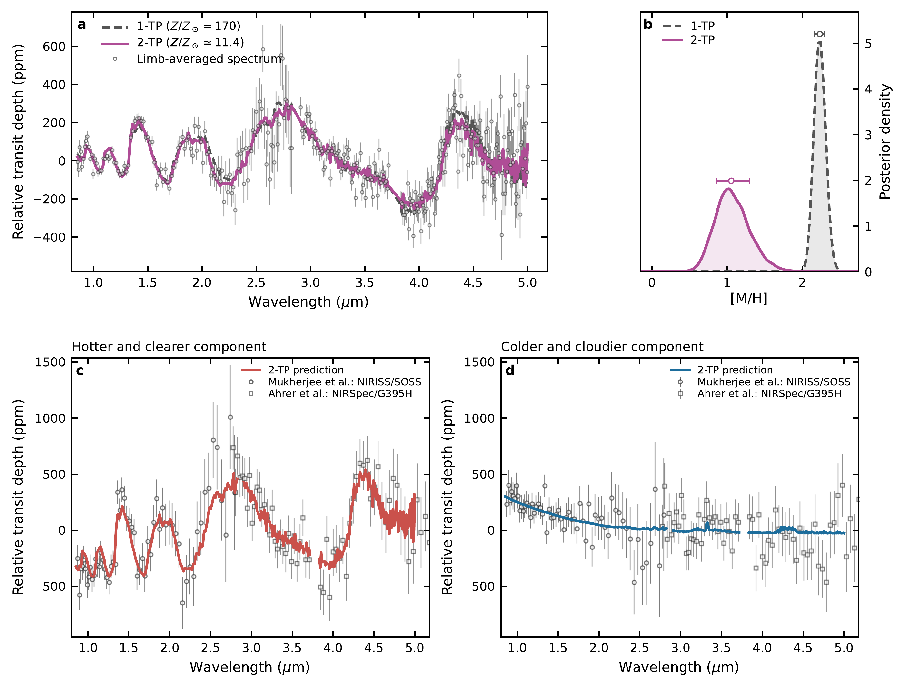
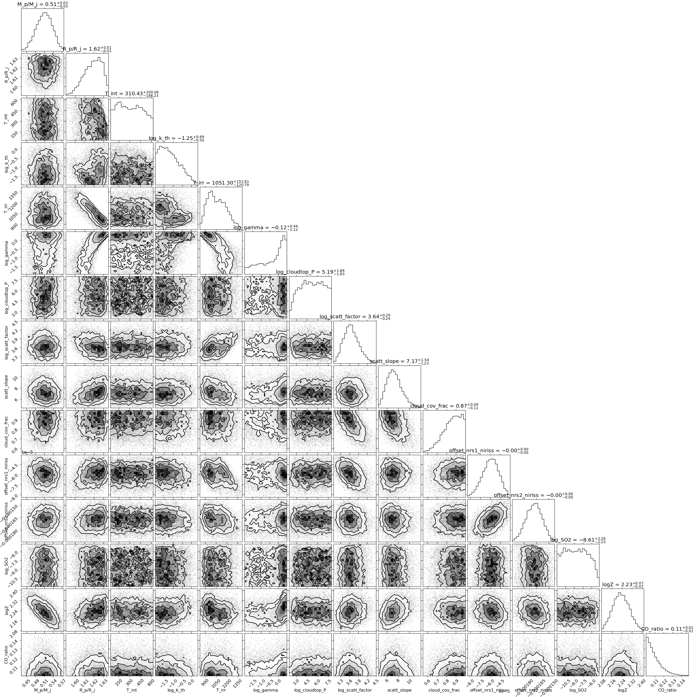
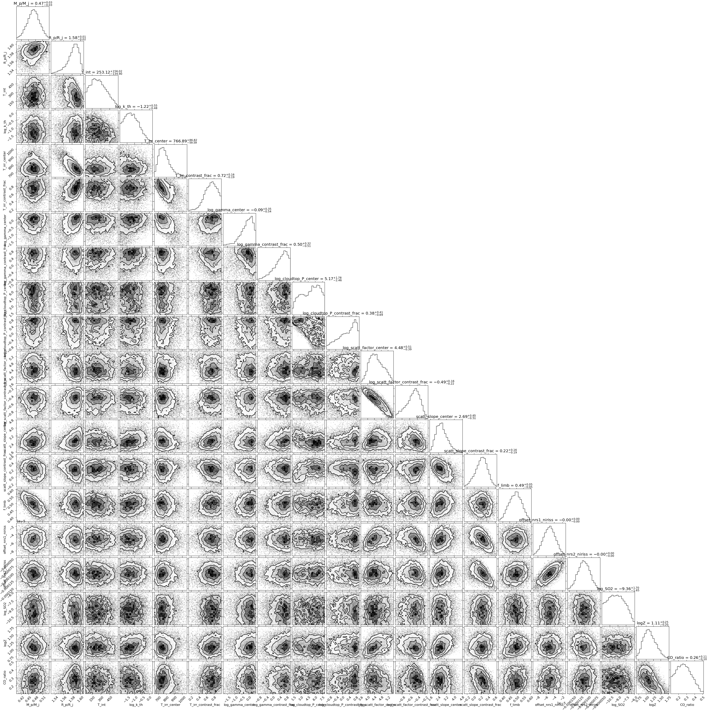

$\newcommand{\ensuremath}{}$
$\newcommand{\xspace}{}$
$\newcommand{\object}[1]{\texttt{#1}}$
$\newcommand{\farcs}{{.}''}$
$\newcommand{\farcm}{{.}'}$
$\newcommand{\arcsec}{''}$
$\newcommand{\arcmin}{'}$
$\newcommand{\ion}[2]{#1#2}$
$\newcommand{\textsc}[1]{\textrm{#1}}$
$\newcommand{\hl}[1]{\textrm{#1}}$
$\newcommand{\footnote}[1]{}$
$\newcommand{\onedlogz}{2.23^{+0.07}_{-0.07}}$
$\newcommand{\onedlinearz}{170^{+30}_{-24}}$
$\newcommand{\twodlogz}{1.06^{+0.24}_{-0.20}}$
$\newcommand{\twodlinearz}{11^{+9}_{-4}}$
$\newcommand{\prtonedlogz}{2.049^{+0.066}_{-0.065}}$
$\newcommand{\prtonedlinearz}{111.8^{+18.3}_{-15.5}}$
$\newcommand{\prtlogz}{0.83^{+0.19}_{-0.15}}$
$\newcommand{\prtlinearz}{6.8^{+3.6}_{-2.0}}$
$\newcommand{\onedhostz}{72.7^{+14.6}_{-11.6}}$
$\newcommand{\twodhostz}{4.9^{+3.8}_{-1.9}}$
$\newcommand{\wasptrendz}{5.7}$
$\newcommand{\onedtrendratio}{12.6}$
$\newcommand{\combineddeltaevidence}{12.08}$
$\newcommand{\combineddeltaevidenceerr}{0.24}$
$\newcommand{\combinedbayesfactor}{1.8\times10^{5}}$
$\newcommand{\combinedndata}{316}$
$\newcommand{\onedchisq}{507.1}$
$\newcommand{\twodchisq}{478.4}$
$\newcommand{\prtchisq}{482.8}$
$\newcommand{\prtchisqdelta}{4.7}$
$\newcommand{\onedfitdof}{301}$
$\newcommand{\twodfitdof}{295}$
$\newcommand{\prtfitdof}{296}$
$\newcommand{\retrievalfitdof}{295}$
$\newcommand{\onedfitredchisq}{1.68}$
$\newcommand{\twodfitredchisq}{1.62}$
$\newcommand{\prtfitredchisq}{1.63}$
$\newcommand{\morningtirr}{429^{+110}_{-79}}$
$\newcommand{\eveningtirr}{1091^{+97}_{-64}}$
$\newcommand{\limbdeltatirr}{664^{+114}_{-122}}$
$\newcommand{\limbdeltascatt}{3.5}$
$\newcommand{\limbweight}{0.49 \pm 0.05}$
$\newcommand{\metallicitydexshift}{1.17^{+0.21}_{-0.25}}$
$\newcommand{\metallicityratio}{14.9^{+9.3}_{-6.6}}$
$\newcommand{\eveninglimbchisq}{92.3}$
$\newcommand{\morninglimbchisq}{73.6}$
$\newcommand{\eveninglimbredchisq}{0.78}$
$\newcommand{\morninglimbredchisq}{0.62}$
$\newcommand{\crossedeveninglimbchisq}{460.7}$
$\newcommand{\crossedmorninglimbchisq}{369.1}$
$\newcommand{\crossedeveninglimbredchisq}{3.90}$
$\newcommand{\crossedmorninglimbredchisq}{3.13}$
$\newcommand{\jointlimbchisq}{165.9}$
$\newcommand{\jointlimbredchisq}{0.70}$
$\newcommand{\eveningnirisschisq}{50.2}$
$\newcommand{\morningnirisschisq}{29.2}$
$\newcommand{\eveningnirspecchisq}{42.1}$
$\newcommand{\morningnirspecchisq}{44.3}$
$\newcommand{\clearwithheldchisq}{92.3}$
$\newcommand{\cloudywithheldchisq}{73.6}$
$\newcommand{\crossedeveningchisq}{460.7}$
$\newcommand{\crossedmorningchisq}{369.1}$
$\newcommand{\platonsevenvalidationdraws}{1000}$
$\newcommand{\platonsevenmaxppm}{0.0066}$
$\newcommand{\platonsevenrmsppm}{0.0022}$
$\newcommand{\platonsevenmaxsigma}{3\times10^{-4}}$
$\newcommand{\platonsevenmetalshift}{3.08\times10^{-5}}$
$\newcommand{\platonsevenessfraction}{1\times10^{-4}}$
$\newcommand{\platon}{\texttt{PLATON}}$
$\newcommand{\jwst}{\textit{JWST}}$
$\newcommand{\dd}{\mathrm{d}}$
$\newcommand{\zsun}{Z_{\rm atm}/Z_\odot}$

# Recovering the Morning and Evening Limbs of WASP-94Ab from Its Limb-Averaged JWST Transmission Spectrum

<mark>Appeared on: 2026-09-21</mark> -  _submitted to ApJL_

T. R. Fairnington, et al. -- incl., <mark>M. Zhang</mark>, <mark>E.-M. Ahrer</mark>

**Abstract:** Recent JWST observations have revealed that the morning and evening limbs of the hot Jupiter WASP-94Ab have very different transmission spectra. An analysis of these resolved limb spectra yielded a metallicity more than an order of magnitude below that obtained from the limb-averaged spectrum, which calls into question the accuracy of traditional retrievals for heterogenous planets. Here we analyze the limb-averaged JWST NIRISS and NIRSpec transmission spectra of WASP-94Ab using both a standard one-temperature-profile (1-TP) retrieval with patchy clouds, and a new two-temperature-profile (2-TP) retrieval. The 2-TP retrieval assumes a linear combination of two atmospheric components that share the same bulk elemental composition but have independent thermal structures, chemistries, and aerosol properties. This model is implemented in \texttt{PLATON 7.0} , a \texttt{JAX} -accelerated code that is over 100 times faster than its predecessor, which is key to making the retrieval computationally tractable. The limb-averaged spectrum of WASP-94Ab favors the 2-TP model by a Bayes factor $K\simeq\combinedbayesfactor$ and shifts the metallicity downward to $\zsun=\twodlinearz$ from $\onedlinearz$ obtained with the 1-TP model. The 2-TP retrieval predicts two, equally weighted components that reproduce the limb-resolved spectra across both instruments without prior knowledge of them. This work demonstrates that compositional information survives limb averaging for WASP-94Ab, suggesting that 2-TP retrievals can be used to identify limb-asymmetry and extend metallicity studies beyond the small set of planets amenable to limb-resolved spectroscopy.

**Figure 4. -** The limb-averaged analysis and its comparison with independently published reductions. Panel (a) shows the limb-averaged $0.85$--$5.0 \mu{\rm m}$ NIRISS/SOSS and NIRSpec/G395H spectrum with the best-fitting 1-TP and 2-TP models. Panel (b) shows the corresponding atmospheric metallicity posteriors relative to the Sun. Panels (c) and (d) compare the hotter/clearer and colder/cloudier components predicted by the limb-averaged 2-TP retrieval with the published NIRISS/SOSS limb spectra of \citetalias{Mukherjee:26}(circles) and NIRSpec/G395H limb spectra of \citetalias{Ahrer:25a}(squares). We note that the limb-resolved spectra presented in panels c and d are not used in our retrievals, i.e., the red and blue models are not fits to the data shown in these panels, but rather the two components extracted directly from the spectrum plotted in panel a. (*fig:limbaveraged*)

**Figure 2. -** Corner plot from the 1-TP limb-averaged retrieval. (*app:corner1D*)

**Figure 3. -** Corner plot from the 2-TP limb-averaged retrieval. (*app:corner1.5D*)

