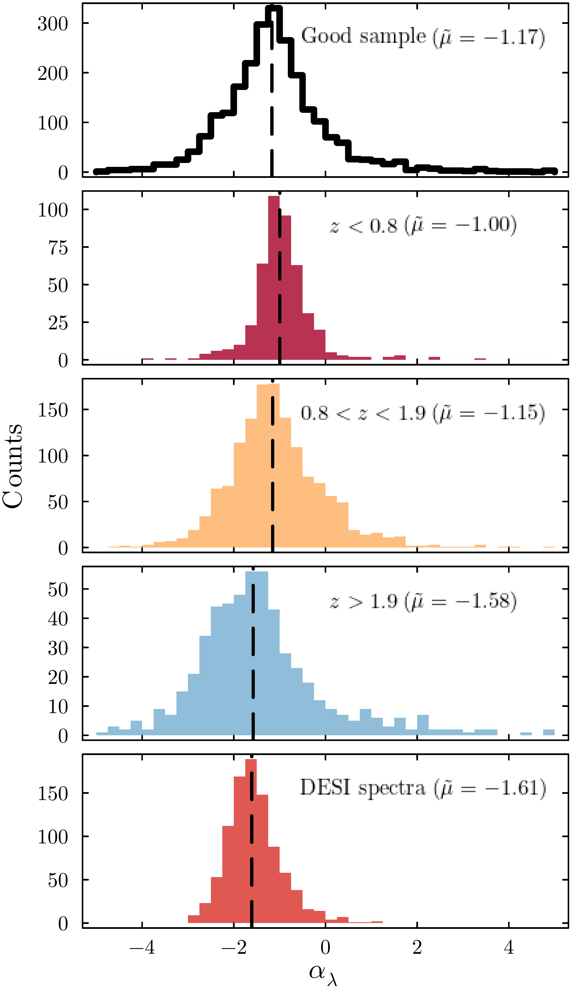
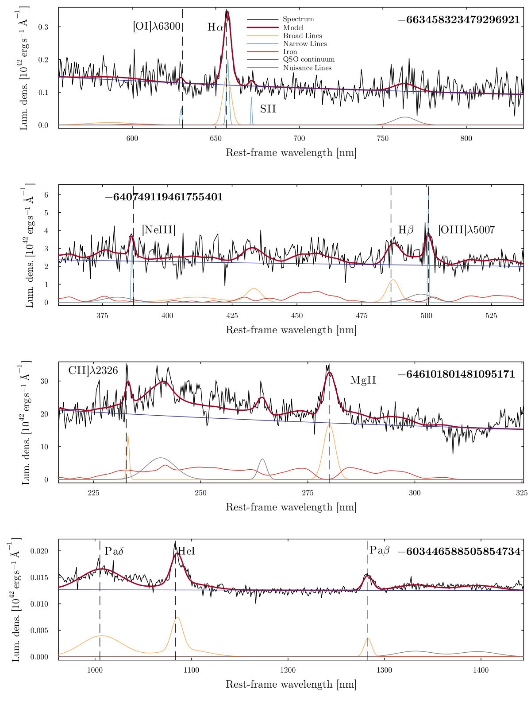
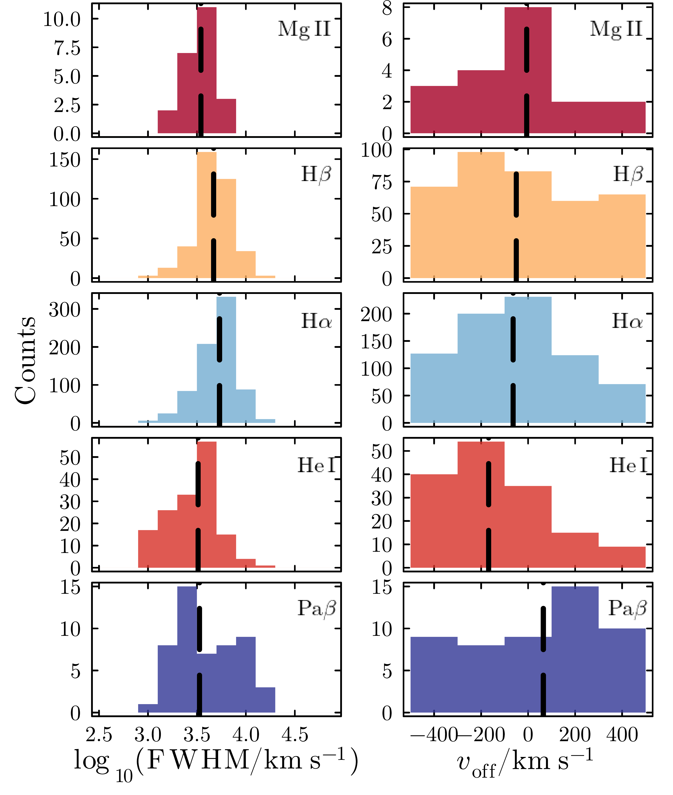

$\newcommand{\ensuremath}{}$
$\newcommand{\xspace}{}$
$\newcommand{\object}[1]{\texttt{#1}}$
$\newcommand{\farcs}{{.}''}$
$\newcommand{\farcm}{{.}'}$
$\newcommand{\arcsec}{''}$
$\newcommand{\arcmin}{'}$
$\newcommand{\ion}[2]{#1#2}$
$\newcommand{\textsc}[1]{\textrm{#1}}$
$\newcommand{\hl}[1]{\textrm{#1}}$
$\newcommand{\footnote}[1]{}$
$\newcommand{\pz}{\phantom{0}}$
$\newcommand{\ps}{\phantom{-}}$
$\newcommand{\orcid}[1]{\orcidlink{#1}}$
$\newcommand\gdr[1]{\gaia DR#1}$
$\newcommand\gaiacrftwo{\gaia CRF2}$
$\newcommand\gbp{\ensuremath{G_\mathrm{BP}}}$
$\newcommand\grp{\ensuremath{G_\mathrm{RP}}}$
$\newcommand{\linenumbers}[0]\usepackage$

# Euclid Quick Data Release (Q1): $\Euclid$ spectroscopy of quasars. 2. Physical properties from spectral fitting

<mark>Appeared on: 2026-09-21</mark> -  _24 pages, 17 figures, 4 tables, online data available at this https URL . Submitted to A&A_

E. Collaboration, et al. -- incl., <mark>J. Wolf</mark>, <mark>K. Jahnke</mark>

**Abstract:** A substantial volume of spectroscopic data has become available with the Euclid Quick Data Release (Q1), which represents a unique opportunity to study quasars (QSOs) in the Euclid Deep Fields, provide spectroscopic measurements, and estimates of their physical properties. We present results from a spectroscopic analysis of QSOs with $\HE$ $\leq 22.5$ using Q1. We use external catalogues  from surveys such as the Dark Energy Spectroscopic Instrument (DESI), $\gaia$ , Wide-field Infrared Survey Explorer (WISE), and the QUasars as BRIght beacons for Cosmology in the Southern hemisphere (QUBRICS) for the QSO selection and redshift determination, totalling $5489$ QSOs. We provide measurements of the line fluxes, full widths at half-maximum, and respective uncertainties for the emission lines of $\Euclid$ spectra through the use of the software \texttt{QSFit} . We additionally estimate the QSO continuum slope and present a simple criterion to identify problematic $\Euclid$ spectra based on fitting statistics and signal-to-noise ratio (S/N). Of the total $5489$ QSOs, $5387$ are successfully fitted. We find that 45 \% of the total number of successfully fitted spectra are free of problematic artefacts allowing for trustworthy measurements. Our final $\Euclid$ QSO sample spans a redshift range of $0.01 \leq z \leq 4.8$ and shows a median spectral index of $\alpha_{\lambda}\sim -1.17$ . Finally, we estimate black hole masses with single epoch methods for $1213$ sources, using the $\ion{He}{i}$  $\lambda10830$ , Pa $\beta$ , $\ha$ , $\hb$ , and $\ion{Mg}{ii}$ emission lines, obtaining a mean logarithmic mass of $\logten(M_{\rm BH}/\si{\solarmass})\sim8.7$ and mean Eddington ratio of $\lambda_\mathrm{Edd}\sim0.34$ . The catalogue with the physical spectral properties of this sample together with the software developed for the analysis is available online to allow scientific exploitation.

**Figure 4. -** Histograms of the QSO continuum slopes $\alpha_{\lambda}$ estimated from \Euclid spectra, in different redshift bins. The bottom panel shows the histogram obtained from DESI spectra.  Vertical lines mark the medians of the values in each bins. In the legend, $\tilde{\mu}$ refers to the median value. Table \ref{tab:QSO_slopes} shows this information as well as the redshift range and average bolometric luminosity of each sample. (*fig:QSOcont_Redshift*)

**Figure 17. -** Examples of fits using \texttt{QSFit} for sources with H$\rm \alpha$(first panel), H$\rm \beta$(second panel), $\ion${Mg}{ii}(third panel), and Pa $\beta$ and $\ion${He}{i} lines (fourth panel), which are used in this analysis for BH mass estimation. The dark red bold line shows the model obtained by \texttt{QSFit} when convolving the spectrum (thin grey line) with a Gaussian template based on the resolution of the spectra $(R\sim450)$. The remaining components are shown before the convolution is applied which is why some lines are thinner than the adopted resolution permits. (*fig:QSFIT_Ha_Hb_MgII*)

**Figure 8. -** *Left panels*: Histograms of FWHM for the five emission lines considered in this work. *Right panels*: Histograms for the
velocity offset associated with each of the five lines. (*fig:FWHM_Voff_Hist*)

