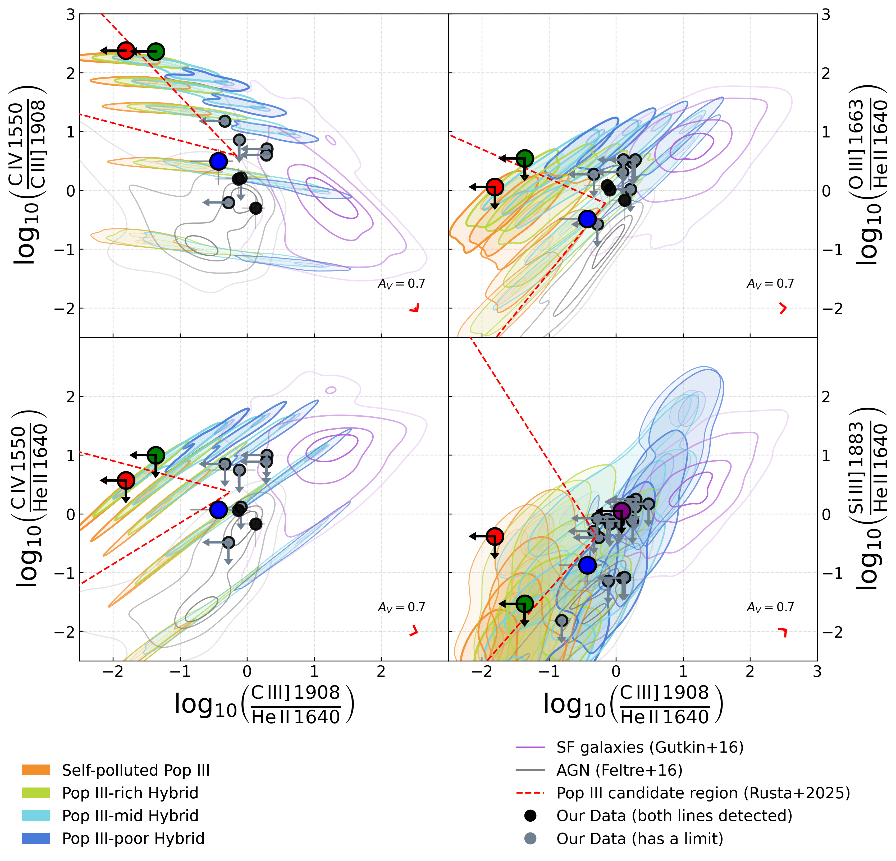
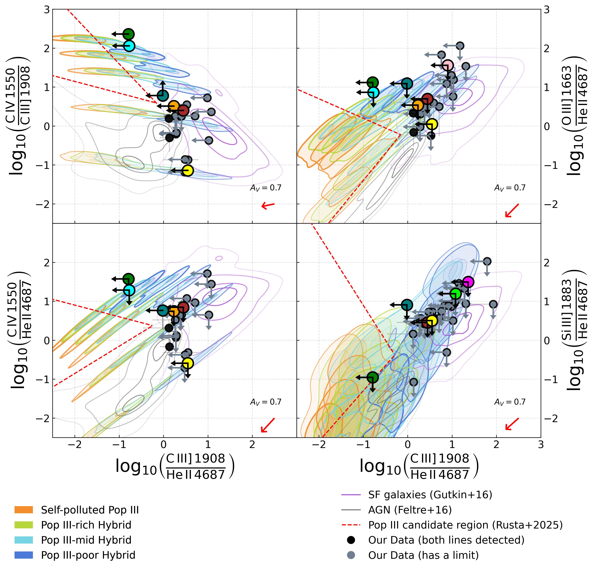
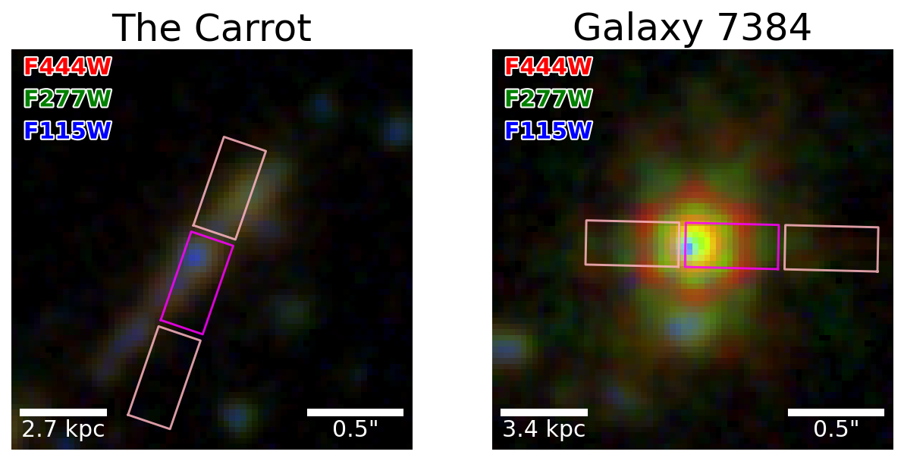

$\newcommand{\ensuremath}{}$
$\newcommand{\xspace}{}$
$\newcommand{\object}[1]{\texttt{#1}}$
$\newcommand{\farcs}{{.}''}$
$\newcommand{\farcm}{{.}'}$
$\newcommand{\arcsec}{''}$
$\newcommand{\arcmin}{'}$
$\newcommand{\ion}[2]{#1#2}$
$\newcommand{\textsc}[1]{\textrm{#1}}$
$\newcommand{\hl}[1]{\textrm{#1}}$
$\newcommand{\footnote}[1]{}$
$\newcommand{\pd}[1]{\textcolor{red}{[\;pd: #1\;]}}$
$\newcommand{\vdag}{(v)^\dagger}$
$\newcommand\aastex{AAS\TeX}$
$\newcommand\latex{La\TeX}$
$\newcommand{\ext}{{\color{blue}\textbf{EXT}}}$
$\newcommand{\band}{{\color{blue}\textbf{BAND}}}$
$\newcommand{\MUV}{M_{\mathrm{UV}}}$
$\newcommand{\solm}{\mathrm{M}_\odot}$
$\newcommand{\fion}[2]{\mbox{[#1 \uppercase\expandafter{\romannumeral #2\relax}]}}$
$\newcommand{\sfion}[2]{\mbox{#1 \uppercase\expandafter{\romannumeral #2\relax}]}}$
$\newcommand{\lephare}{{\tt{LePhare}}}$
$\newcommand{\eazy}{{\tt{EAZY}}}$
$\newcommand{\bagpipes}{{\tt{Bagpipes}}}$
$\newcommand{\prospector}{{\tt{Prospector}}}$
$\newcommand{\sextractor}{{\tt{SExtractor}}}$
$\newcommand{\astropy}{{\tt{Astropy}}}$
$\newcommand{\galfit}{{\tt{GALFIT}}}$
$\newcommand{\galfind}{{\tt{galfind}}}$
$\newcommand{\webbpsf}{{\tt{WebbPSF}}}$
$\newcommand{\topcat}{{\tt{TOPCAT}}}$
$\newcommand{\cloudy}{{\tt{CLOUDY}}}$
$\newcommand{\jaguar}{{\tt{JAGUAR}}}$
$\newcommand{\galcv}{{\tt{GALCV}}}$
$\newcommand{\emcee}{{\tt{emcee}}}$
$\newcommand{\sectionautorefname}{\S}$
$\newcommand{\subsectionautorefname}{\S}$
$\newcommand{\subsubsectionautorefname}{\S}$
$\newcommand{\arraystretch}{1.8}$
$\newcommand{\arraystretch}{1.8}$
$\newcommand{\deg}{^{\circ} }$
$\newcommand{\solm}{M_{\odot} }$
$\newcommand{\msol}{M_{\odot} }$
$\newcommand{\soll}{L_{\odot} }$
$\newcommand{\kms}{km s^{-1}}$
$\newcommand{\hub}{ h_{100}^{-1} }$
$\newcommand{\etal}{{et~al.\/}}$
$\newcommand{\micron}{\mu\text{m}\xspace}$
$\newcommand{\thebibliography}{\DeclareRobustCommand{\VAN}[3]{##3}\VANthebibliography}$

# Sown at Cosmic Dawn: Searching for Pop III Signatures in JWST JADES He II Selected Line Emitters

<mark>Appeared on: 2026-09-21</mark> -  _33 pages, 19 figures, 2 tables_

R. Roberts, et al. -- incl., <mark>T. Harvey</mark>

**Abstract:** Population III (Pop III) stars, the first generation of metal-free stars, remain undetected, partly because entirely pristine galaxies represent a short-lived phase. We instead target the longer-lived _self-polluted_ and _hybrid_ Pop III--Pop II phases, in which surviving metal-free Pop III stars coexist with enriched gas and newly formed Pop II stars, producing strong He II alongside detectable UV metal lines. We search for this signature in 84 strong He II-emitting galaxies at $z \simeq 3$ --7 in the JWST/JADES GOODS-South and GOODS-North fields, combining UV emission-line diagnostics, gas-phase metallicities, AGN screening, and spatially resolved SED fitting. We find no evidence for any pristine Pop III galaxies. Instead, _The Blueberry_ (ID 13176, $z=5.94$ ) is our strongest candidate for a _hybrid_ Pop III--Pop II system and is the only source with robust detections of all diagnostic UV lines. Its resolved stellar populations are extremely young, blue, and weakly attenuated, with high star formation rates, consistent with intense recent star formation. While these properties alone cannot distinguish it from a chemically enriched starburst, its robust UV metal-line ratios provide the strongest evidence in our sample for a surviving Pop III contribution within an enriched host. _The Carrot_ (ID 13577, $z=5.57$ ) further demonstrates the power of resolved analysis, revealing a central region substantially bluer and younger than the galaxy as a whole. Together, these results suggest that Pop III signatures may be spatially localised and diluted in integrated measurements, highlighting resolved SED fitting as a tool for identifying environments where the Universe's first stars may survive.

**Figure 5. -** UV emission-line diagnostic diagrams using He II $\lambda1640$, comparing our sample with the Pop III model predictions of Rusta_2025. Coloured contours show the model density distributions, with increasing contour thickness corresponding to increasing ionisation parameter ($\log U = -3, -2, -1, -0.5, 0$). Empty contours show the AGN (grey) and star-forming galaxy (purple) model grids from Feltre_2016 and Gutkin_2016, respectively. Red dashed lines delineate the region in which Pop III stars are predicted to contribute more than 25\% of the total stellar mass. Black points show the observed line ratios, with grey error bars indicating $1\sigma$ uncertainties. For non-detected lines, ratios are instead shown in grey using the corresponding $3\sigma$ upper limits, with arrows indicating the direction in which the true ratio may lie. Objects identified as potential Pop III candidates from their nominal line ratios are highlighted with larger red, green, blue and purple  markers; these markers retain the same limit treatment where one of the relevant UV metal lines is undetected. The red vectors in the lower-left corner of each panel show the effect of dust attenuation for $A_V=0.7$. Error bars are omitted where they are smaller than the symbol size. (*fig:LimitContourPlot1*)

**Figure 6. -** UV emission-line diagnostic diagrams using He II $\lambda4687$, comparing our sample with the Pop III model predictions of Rusta_2025. Coloured contours show the model density distributions, with increasing contour thickness corresponding to increasing ionisation parameter ($\log U = -3, -2, -1, -0.5, 0$). Empty contours show the AGN (grey) and star-forming galaxy (purple) model grids from Feltre_2016 and Gutkin_2016, respectively. Red dashed lines delineate the region in which Pop III stars are predicted to contribute more than 25\% of the total stellar mass. Black points show the observed line ratios, with grey error bars indicating $1\sigma$ uncertainties. For non-detected lines, ratios are instead shown in grey using the corresponding $3\sigma$ upper limits, with arrows indicating the direction in which the true ratio may lie. Objects identified as potential Pop III candidates from their nominal line ratios are highlighted with larger coloured markers; these markers retain the same limit treatment where one of the relevant UV metal lines is undetected. The red vectors in the lower-left corner of each panel show the effect of dust attenuation for $A_V=0.7$. Error bars are omitted where they are smaller than the symbol size. (*fig:LimitContourPlot2*)

**Figure 1. -** Example RGB composites (F115W, F277W, F444W) illustrating the quality of the images we use for morphological classification with the MSA slitlet configurations overlaid in pink and magenta. Left: an extended, clumpy galaxy, ID 13577 (_The Carrot_), suitable for resolved SED fitting. Right: a compact, point-like source, ID 7384, with diffraction features, flagged as a potential AGN and unsuitable for resolved analysis. Scale bars are shown at the bottom of each cutout. (*fig:rgb*)

