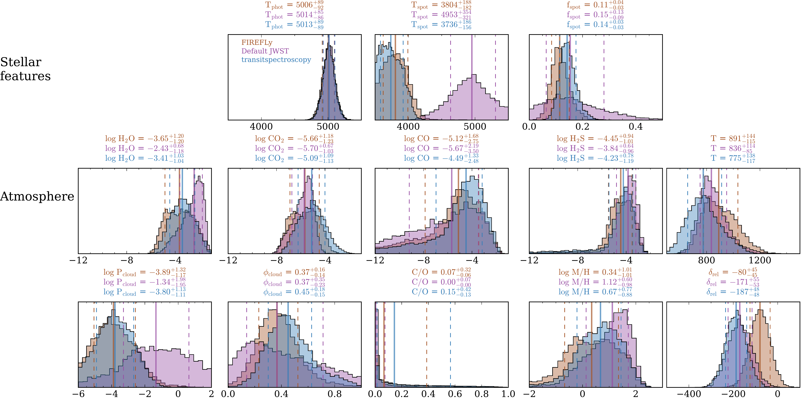
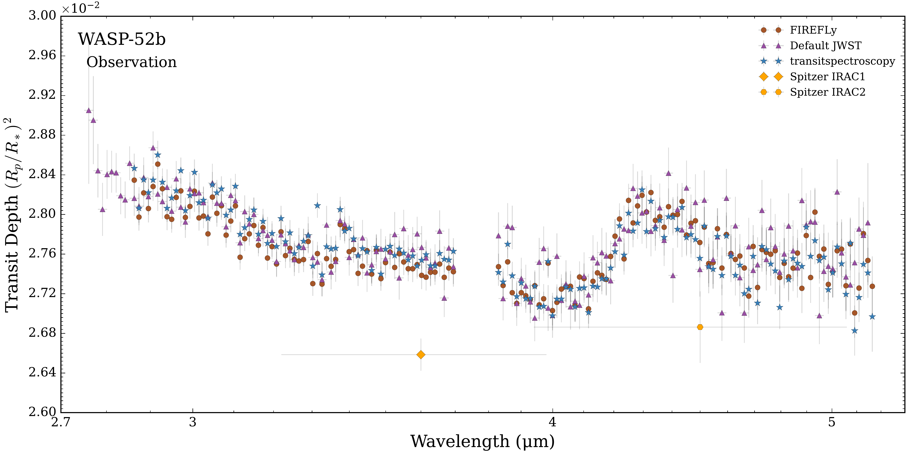
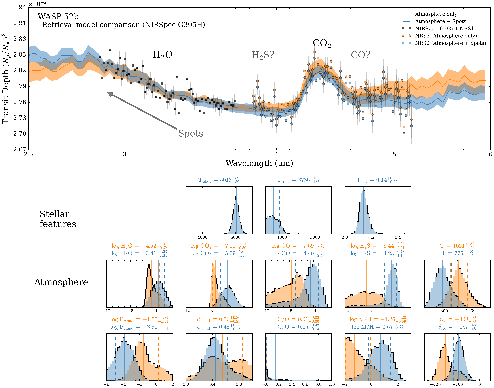

$\newcommand{\ensuremath}{}$
$\newcommand{\xspace}{}$
$\newcommand{\object}[1]{\texttt{#1}}$
$\newcommand{\farcs}{{.}''}$
$\newcommand{\farcm}{{.}'}$
$\newcommand{\arcsec}{''}$
$\newcommand{\arcmin}{'}$
$\newcommand{\ion}[2]{#1#2}$
$\newcommand{\textsc}[1]{\textrm{#1}}$
$\newcommand{\hl}[1]{\textrm{#1}}$
$\newcommand{\footnote}[1]{}$
$\newcommand{\mytwoline}[2]{\makecell{#1\\[-0.2ex]#2}}$
$\newcommand{\vdag}{(v)^\dagger}$
$\newcommand\aastex{AAS\TeX}$
$\newcommand\latex{La\TeX}$
$\newcommand{\arraystretch}{1.2}$

# JWST MEP - A World Under Spotty Starlight: Detection of  $\ce{CO2}$ and $\ce{H2O}$ in the \ Hot Saturn WASP-52b with JWST NIRSpec G395H

<mark>Appeared on: 2026-09-21</mark> -  _18 pages, 8 figures_

J. G. 3. Team, et al. -- incl., <mark>E.-M. Ahrer</mark>

**Abstract:** Exoplanets orbiting active stars offer distinct challenges for atmospheric characterization with the JWST. Among such worlds, the hot Saturn WASP-52b ( $T_{\rm{eq}} \sim$ 1300 K) orbits an active K-dwarf that complicates transmission spectroscopy via stellar contamination. Here, we present the first JWST NIRSpec G395H (2.8-5.2 $\micron$ ) limb-averaged transmission spectrum of WASP-52b obtained through the JWST Morning/Evening Program (GO-3969), which aims to measure limb asymmetries across a sample of hot giant exoplanets. Our spectrum reveals the first detection of $\ce{CO2}$ in WASP-52b's atmosphere ( $\ln \mathcal{B} = 54$ / $> 10 \sigma$ ), with a retrieved abundance of log $\rm C O_2 = -5.09^{+1.09}_{-1.14}$ , and confirmation of $\ce{H2O}$ ( $\ln \mathcal{B} = 5.9$ / $\sim$ 3--4 $ \sigma$ ), with an abundance of log $\rm H_2 O = -3.41^{+1.04}_{-1.04}$ . We find a steep near-infrared slope that cannot be explained solely by $\ce{H2O}$ absorption, necessitating unocculted starspots ( $\ln \mathcal{B} = 5.7$ / $\sim 3-4 \sigma$ ), though with properties that vary across our data reductions. The shape and amplitude of the molecular bands additionally suggest high-altitude ( $<$ 10 mbar) inhomogeneous clouds covering $\approx 40 \pm 20$ \% of the terminator ( $\ln \mathcal{B} = 1.9$ / $\sim 2.5 \sigma$ ), which provides evidence for the  morning-evening terminator differences that are consensus predictions of general circulation models. WASP-52b's atmospheric metallicity can be sub-solar, solar, or super-solar, due to order-of-magnitude uncertainties in the molecular abundances caused by degeneracies between compositions, clouds, and starspots. However, chemical equilibrium retrievals provide a similar statistical fit while favoring a tighter constraint with a super-solar metallicity (M/H $= 14.8^{+12.1}_{-5.9} \times$ solar). These results highlight that chemical detections and aerosol properties may still be recovered for planets orbiting active stars via transmission spectroscopy.

**Figure 5. -** Retrieval posterior distributions for different data reductions with their median values (solid lines) and their $\pm$ 1$\sigma$ confidence intervals (dashed lines). The retrieval results for \texttt{FIREFly}(brown), \texttt{Default JWST}(purple), and \texttt{transitspectroscopy}(blue) are shown for the statistically preferred atmosphere + spots model. Top: retrieved stellar contamination parameters for the atmosphere + spots model. Middle and bottom: key retrieved atmospheric properties from both models (see Table \ref{tab:retrieval_results} for full retrieval results). (*fig:reductions*)

**Figure 3. -** JWST NIRSpec/G395H transmission spectrum of WASP-52b. Three independent data reductions are compared: \texttt{FIREFly}(brown circles), the JWST default pipeline (purple triangles), and \texttt{transitspectroscopy}(blue stars). The Spitzer/IRAC data from [Alam, Nikolov and López-Morales (2018)]() are overplotted for comparison for the 3.6 $\mu$m and 4.5 $\mu$m filters (orange diamonds). (*fig:obs*)

**Figure 4. -** POSEIDON atmospheric and stellar retrieval results for WASP-52b. Top: NIRSpec/G395H transmission spectrum from the \texttt{transitspectroscopy} data reduction, with the two models varying stellar parameters overplotted. The unocculted starspots introduce an upward spectral slope, indicated by the grey arrow. The NIRSpec/G395H NRS2 data are offset by the median retrieved offset from each model. Each model has a median retrieved spectrum (solid line) and the $\pm$ 1$\sigma$ confidence interval (shaded contours). Bottom: retrieval models' posterior distributions with their median values (solid lines) and their $\pm$ 1$\sigma$ confidence intervals (dashed lines). The stellar contamination parameters are highlighted in the top row, and atmospheric parameters are highlighted in the middle and bottom rows (see Table \ref{tab:retrieval_results} for full retrieval results). (*fig:models*)

