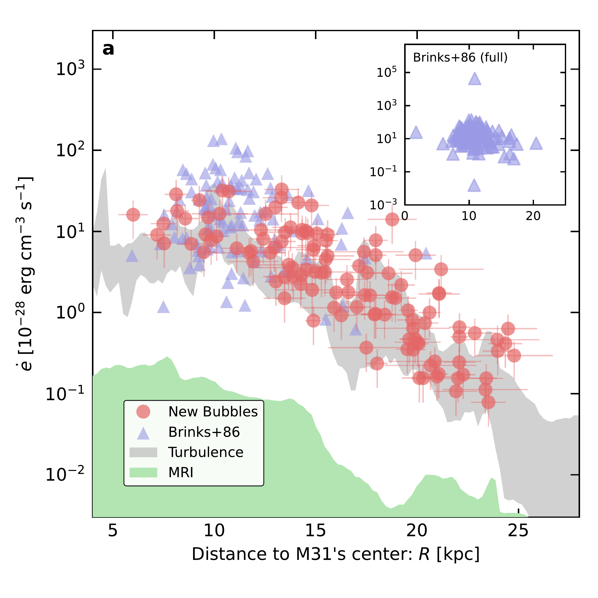
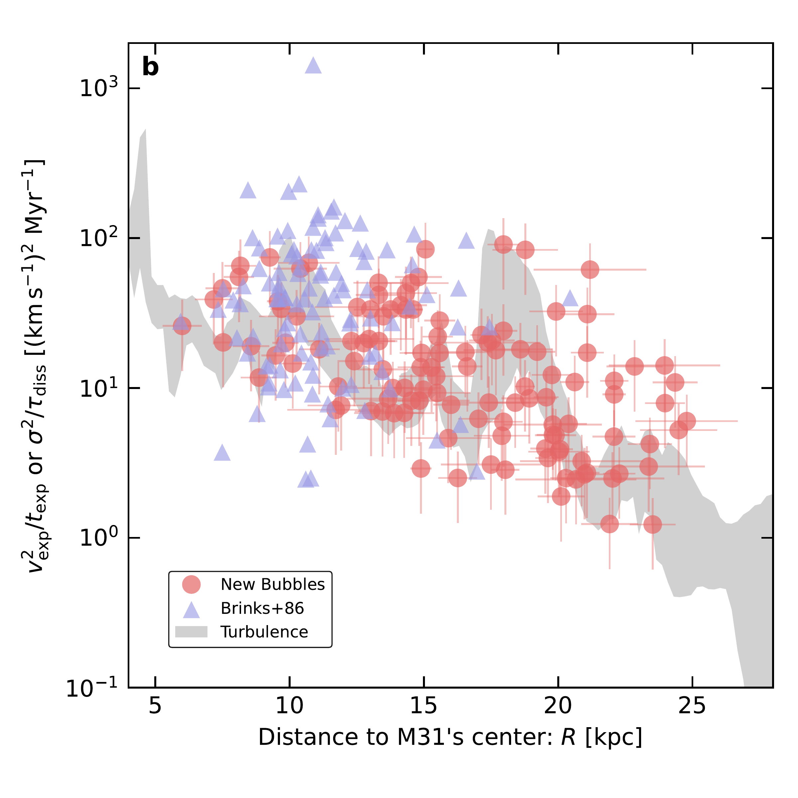
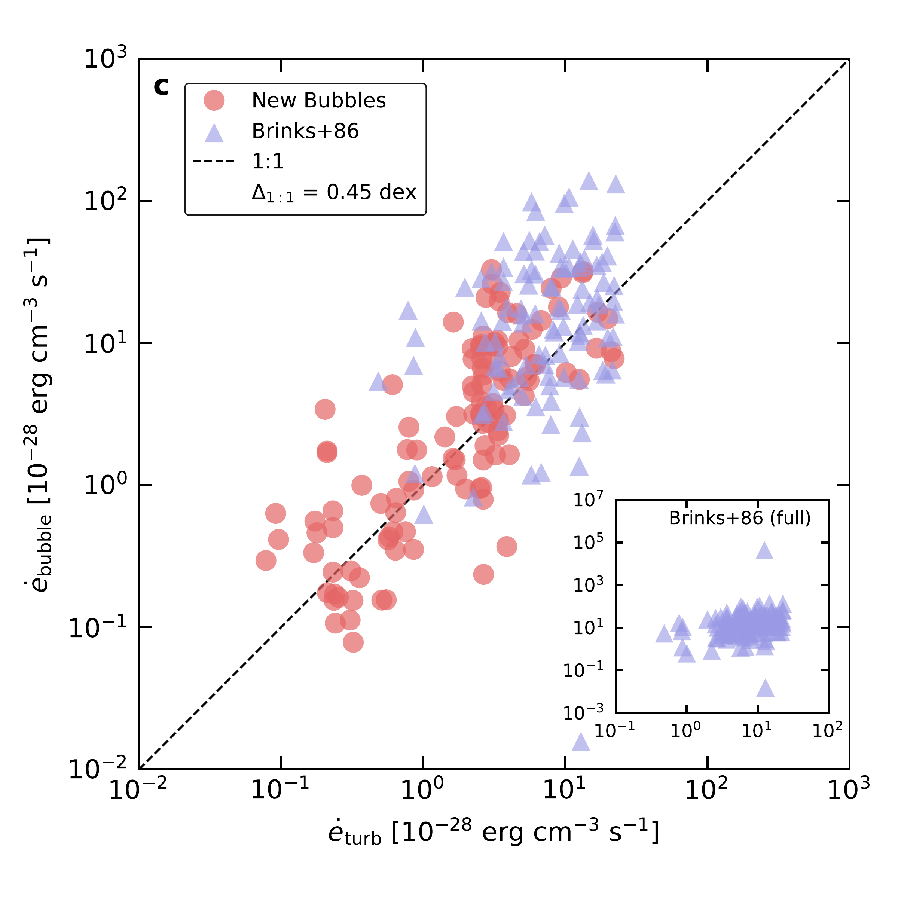
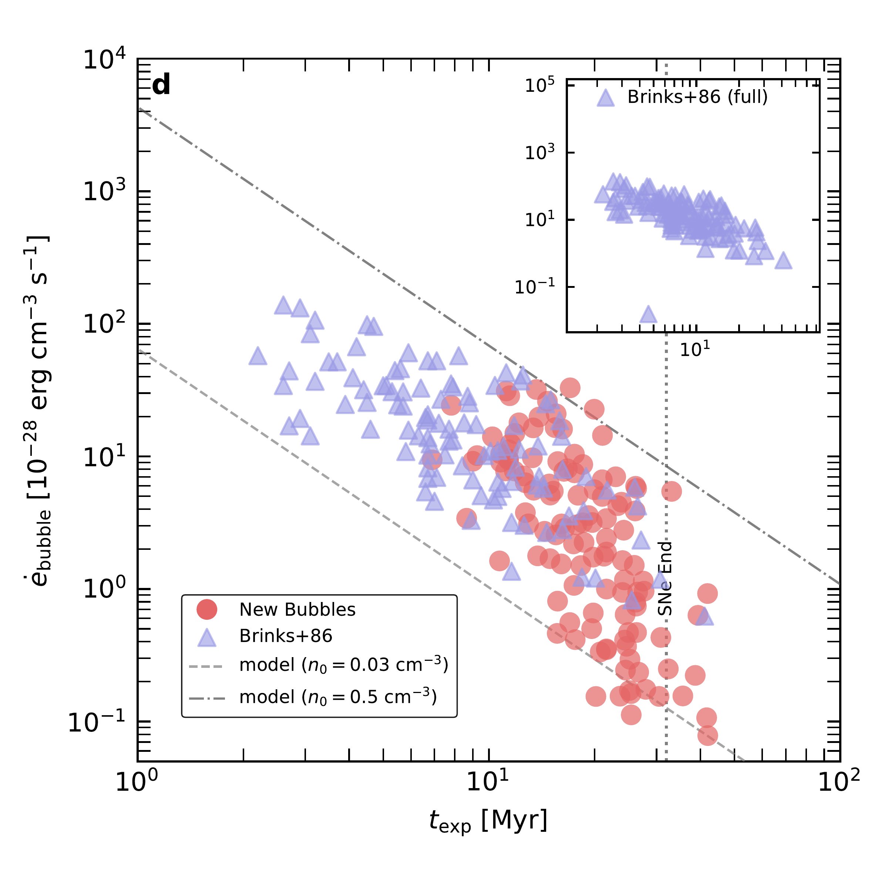
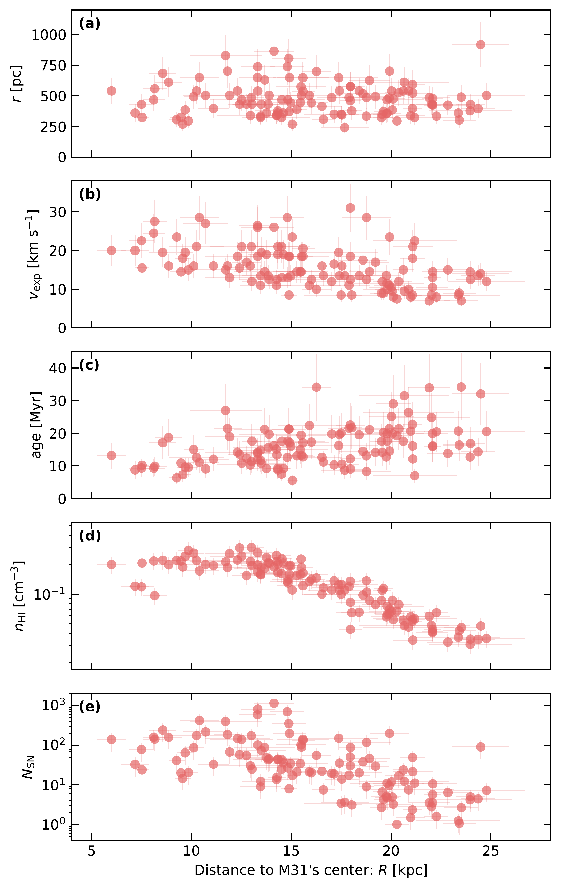

$\newcommand{\ensuremath}{}$
$\newcommand{\xspace}{}$
$\newcommand{\object}[1]{\texttt{#1}}$
$\newcommand{\farcs}{{.}''}$
$\newcommand{\farcm}{{.}'}$
$\newcommand{\arcsec}{''}$
$\newcommand{\arcmin}{'}$
$\newcommand{\ion}[2]{#1#2}$
$\newcommand{\textsc}[1]{\textrm{#1}}$
$\newcommand{\hl}[1]{\textrm{#1}}$
$\newcommand{\footnote}[1]{}$
$\newcommand{\pcc}{ cm^{-3}}$
$\newcommand{\kms}{{\rm km s^{-1}}}$
$\newcommand{\hi}{H{\sc i}}$
$\newcommand{\arcsec}{^{\prime\prime}}$
$\newcommand{\editfm}[1]{{#1}}$
$\newcommand{\AbstractVersion}[1]{$
${\color{red}$
$\rule{\linewidth}{0.6pt}\ \noindent$
$    \MakeUppercase{Abstract Version #1 \Downarrow}}$
$}$
$\newcommand{\apj}{ApJ}$
$\newcommand{\apjl}{ApJ}$
$\newcommand{\apjs}{ApJS}$
$\newcommand{\pasp}{PASP}$
$\newcommand{\physrep}{Physics Reports}$
$\newcommand{\mnras}{MNRAS}$
$\newcommand{\aap}{A\&A}$
$\newcommand{\aj}{AJ}$
$\newcommand{\nat}{Nature}$
$\newcommand{\pre}{Phys.~Rev.~E}$
$\newcommand{\araa}{ARA\&A}$
$\newcommand{\icarus}{Icarus}$
$\newcommand{\pcc}{ cm^{-3}}$
$\newcommand{\kms}{{\rm km s^{-1}}}$
$\newcommand{\hi}{H{\sc i}}$
$\newcommand{\arcsec}{^{\prime\prime}}$
$\newcommand{\editfm}[1]{{#1}}$
$\newcommand{\AbstractVersion}[1]{$
${\color{red}$
$\rule{\linewidth}{0.6pt}\ \noindent$
$    \MakeUppercase{Abstract Version #1 \Downarrow}}$
$}$
$\newcommand{\apj}{ApJ}$
$\newcommand{\apjl}{ApJ}$
$\newcommand{\apjs}{ApJS}$
$\newcommand{\pasp}{PASP}$
$\newcommand{\physrep}{Physics Reports}$
$\newcommand{\mnras}{MNRAS}$
$\newcommand{\aap}{A\&A}$
$\newcommand{\aj}{AJ}$
$\newcommand{\nat}{Nature}$
$\newcommand{\pre}{Phys.~Rev.~E}$
$\newcommand{\araa}{ARA\&A}$
$\newcommand{\icarus}{Icarus}$
$\newcommand\refname{References and Notes}$
$\newcommand{\fnum@figure}{\textbf{Figure \thefigure}}$
$\newcommand{\fnum@table}{\textbf{Table \thetable}}$
$\newcommand\refname{References and Notes}$
$\newcommand{\fnum@figure}{\textbf{Figure \thefigure}}$
$\newcommand{\fnum@table}{\textbf{Table \thetable}}$
$\newcommand{\thefigure}{S\arabic{figure}}$
$\newcommand{\thetable}{S\arabic{table}}$
$\newcommand{\theequation}{S\arabic{equation}}$
$\newcommand{\thepage}{S\arabic{page}}$
$\newcommand{\thefigure}{S\arabic{figure}}$
$\newcommand{\thetable}{S\arabic{table}}$
$\newcommand{\theequation}{S\arabic{equation}}$
$\newcommand{\thepage}{S\arabic{page}}$
$\newcommand\scititle{$
$Supernova origin of galactic turbulence revealed by superbubbles$
$}$
$\newcommand\scititle{$
$Supernova origin of galactic turbulence revealed by superbubbles$
$}$

# $\bfseries$ $\boldmath$ $\scititle$

<mark>Appeared on: 2026-09-21</mark> -  _27 pages, 14 figures (including supplementary material). Initial-submission version; no revisions arising from peer review are incorporated. The revised article was published in Nature Astronomy. Please consult and cite: this https URL_

F. Meng, et al. -- incl., <mark>S. Jiao</mark>

**Abstract:** $\bfseries$ $\boldmath$ Supernovae (SNe) are among the leading candidates for powering galactic-scale turbulence.SNe drive expanding shells of neutral atomic hydrogen (HI) known as superbubbles.Due to the lack of a sensitive, dynamically complete, galaxy-wide census, superbubbles have not been used to quantify the galactic-scale turbulent energy budget.Here we present a combined Five-hundred-meter Aperture Spherical radio Telescope (FAST) and Jansky Very Large Array HI survey of the Andromeda galaxy (M31), the nearest giant spiral, with superior sensitivity and dynamical coverage.We identify 118 superbubbles across the entire disk of M31 with dynamical ages up to 40 Myr, consistent with the expected duration of SN activity in a star cluster and extending the age coverage well beyond previous surveys.Inferred from these superbubbles, the kinetic energy injection rates ( $10^{49}$ – $10^{51.5}$ erg kpc $^{-3}$ Myr $^{-1}$ ) from SNe closely match the turbulence dissipation rates derived independently from the same data, in both magnitude and spatial distribution.These results demonstrate that clustered SN feedback is sufficient to sustain galactic-scale turbulence, which shapes disk structure and influences galaxy evolution.

**Figure 1. -** **Superbubble energy injection compared with turbulent dissipation.**(a) Volumetric energy injection rates $\dot{e}_{\rm bubble}$ for individual bubbles (red) as a function of $R$, shown alongside the turbulent dissipation rate (gray band) and the MRI estimate (green shade); Brinks+86 shells Brinks:1986vn are plotted in blue, and the inset shows their full range.
(b) Radial comparison of $v_{\rm exp}^2/t_{\rm exp}$ for bubbles with $\sigma^2/\tau_{\rm diss}$ for turbulence (gray band), using the same color scheme as panel a for both the new bubbles and the Brinks+86 shells Brinks:1986vn.
(c) Comparison of $\dot{e}_{\rm bubble}$ and $\dot{e}_{\rm turb}$ at matched $R$ relative to a 1:1 line, with a median offset of 0.45 dex; the inset shows the full Brinks+86 sample Brinks:1986vn.
(d) $\dot{e}_{\rm bubble}$ versus expansion time, compared with Weaver-model (kinetic energy part) tracks for $n_0=0.03$($r_0=50 {\rm pc}$ at $t_{\rm exp}=0$) and $0.5 {\rm cm^{-3}}$($r_0=100 {\rm pc}$ at $t_{\rm exp}=0$); the dotted line marks the end of clustered SNe Leitherer:1999aa, Orr:2022aa, and Brinks+86 bubbles are overplotted Brinks:1986vn.
 (*f.mainchart*)

**Figure 3. -** **Superbubble energy injection compared with turbulent dissipation.**(a) Volumetric energy injection rates $\dot{e}_{\rm bubble}$ for individual bubbles (red) as a function of $R$, shown alongside the turbulent dissipation rate (gray band) and the MRI estimate (green shade); Brinks+86 shells Brinks:1986vn are plotted in blue, and the inset shows their full range.
(b) Radial comparison of $v_{\rm exp}^2/t_{\rm exp}$ for bubbles with $\sigma^2/\tau_{\rm diss}$ for turbulence (gray band), using the same color scheme as panel a for both the new bubbles and the Brinks+86 shells Brinks:1986vn.
(c) Comparison of $\dot{e}_{\rm bubble}$ and $\dot{e}_{\rm turb}$ at matched $R$ relative to a 1:1 line, with a median offset of 0.45 dex; the inset shows the full Brinks+86 sample Brinks:1986vn.
(d) $\dot{e}_{\rm bubble}$ versus expansion time, compared with Weaver-model (kinetic energy part) tracks for $n_0=0.03$($r_0=50 {\rm pc}$ at $t_{\rm exp}=0$) and $0.5 {\rm cm^{-3}}$($r_0=100 {\rm pc}$ at $t_{\rm exp}=0$); the dotted line marks the end of clustered SNe Leitherer:1999aa, Orr:2022aa, and Brinks+86 bubbles are overplotted Brinks:1986vn.
 (*f.mainchart*)

**Figure 12. -** **Superbubble properties as a function of galactocentric radius $R$ in M31.(a) Radius $r$.
(b) Expansion velocity $v_{\rm exp}$.
(c) Kinematic age $t_{\rm exp} = 0.5 r/v_{\rm exp}$.
(d) Ambient $\hi$ density $n_{\rm HI}$.
(e) Number of supernovae $N_{\rm SN}$ required to drive each bubble Weaver:1977wh.
 (*f.rvage*)

