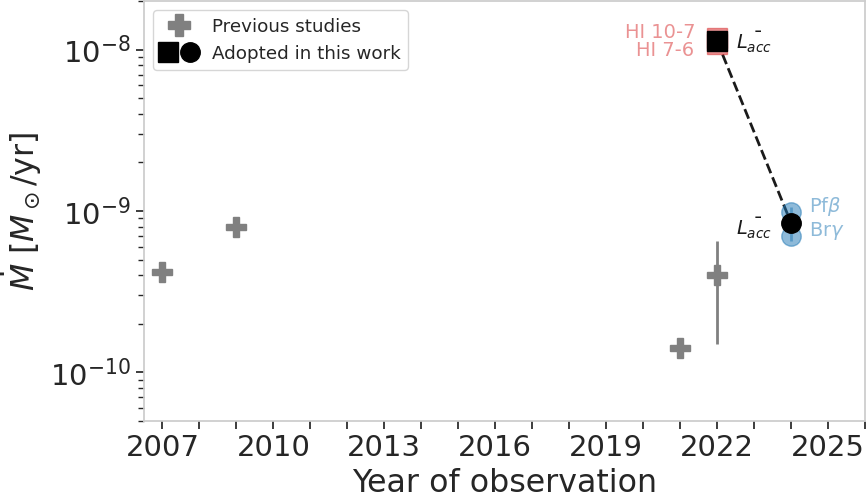
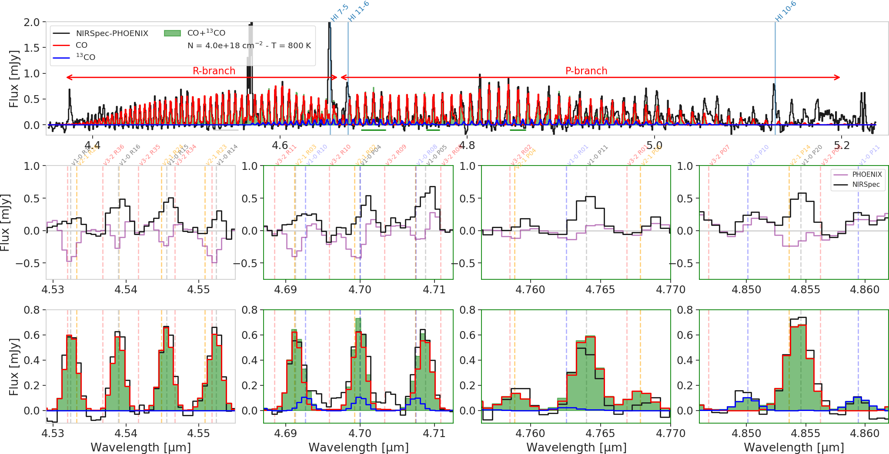

$\newcommand{\ensuremath}{}$
$\newcommand{\xspace}{}$
$\newcommand{\object}[1]{\texttt{#1}}$
$\newcommand{\farcs}{{.}''}$
$\newcommand{\farcm}{{.}'}$
$\newcommand{\arcsec}{''}$
$\newcommand{\arcmin}{'}$
$\newcommand{\ion}[2]{#1#2}$
$\newcommand{\textsc}[1]{\textrm{#1}}$
$\newcommand{\hl}[1]{\textrm{#1}}$
$\newcommand{\footnote}[1]{}$
$\newcommand{\CBC}[1]{\textcolor{PineGreen}{#1}}$
$\newcommand{\BT}[1]{\textcolor{blakc}{#1}}$
$\newcommand{\BTbis}[1]{\textcolor{black}{#1}}$

# Impact of accretion variability on the CO emission \ of a disk around a very-low-mass star with JWST

<mark>Appeared on: 2026-09-22</mark> -  _Accepted in A&A. 13 pages + 8 pages of Appendix, 10 figures + 9 figures in Appendix_

C. Bergez-Casalou, et al. -- incl., <mark>T. Henning</mark>, <mark>G. Perotti</mark>

**Abstract:** _Context:_ Very-low-mass stars ( $M_\star<0.2M_\odot$ ) are known to host a larger fraction of terrestrial planets compared to higher mass stars. Studying the structure of their protoplanetary disk is therefore crucial to understand the formation of Earth-like planets. _Aims:_ In this paper, we aim to characterize the innermost regions of the disk around a known very-low-mass star, 2MASS J16053215-1933159 (J1605 hereafter), by analyzing new JWST/NIRSpec observations taken in 2024, 2 years after a first observation with JWST/MIRI in 2022. We investigate the atomic and molecular emission in both spectra to establish a global view of the system and study its variability. _Methods:_ After identifying both the fundamental band of CO and HI recombination emission lines from both spectra corrected from the contribution of the stellar photosphere, we use the HI lines to derive the stellar accretion rate at each epoch. The CO emission is fitted with a slab model to derive the gas characteristics. _Results:_ We find that between the two epochs (2022 \& 2024), the CO flux is reduced by a factor $\sim 3$ , the flux of the only HI line seen by both NIRSpec and MIRI (the HI 10-6 line) is reduced by a factor $\sim13$ , and the total continuum density flux is reduced by $\sim 15 \%$ . The accretion rate derived from individual HI lines is consistent with a decrease of a factor $\sim13$ in 2 years. After correcting the spectrum from the CO absorption present in J1605 stellar photosphere, we find that the decrease of the disk's CO emission is consistent with a CO gas of same column density and temperature at each epoch, but originating from a smaller emitting area when the accretion rate is low (NIRSpec's epoch). While warm hydrocarbons ( $\simeq 500 $ K) are detected with MIRI-MRS (2022) with extremely high column densities of $\rm C_2H_2$ , no hydrocarbons features are seen with NIRSpec (2024). We propose that non-LTE effects quench the near-IR emission of hydrocarbons in the warm reservoir. Taking the newly detected hot CO ( $\sim$ 800 K) as a reference and assuming LTE, we constrain the column density of $\rm C_2H_2$ , HCN and $\rm CH_4$ to be less than 30 \% of CO in the hot reservoir. This value suggests that the C/O in the inner disk is unlikely to be much larger than unity. _Conclusion:_ The variation of the accretion luminosity of the very-low-mass star J1605 correlates with the variation of its fundamental CO luminosity in a similar way as in T-Tauri stars, supporting the idea that very-low-mass stars could be seen as scaled-down versions of T-Tauri stars. The detection of the emission of the fundamental band of CO in disks around cold objects (very-low-mass stars, brown dwarfs and giant planets) is challenging because of the presence of CO absorption in their photosphere. Future observations (e.g., with ELT/METIS) looking for such emission will require robust ways to constrain the photosphere emission and follow the time variability of the sources.

**Figure 5. -** Vibrational stability equation of state
               $S_{\mathrm{vib}}(\lg e, \lg \rho)$.
               $>0$ means vibrational stability.
              Vibrational stability equation of state
               $S_{\mathrm{vib}}(\lg e, \lg \rho)$.
               $>0$ means vibrational stability.
              Nonlinear Model ResultsNonlinear Model ResultsSpectral types and photometry for stars in the
  region.Spectral types and photometry for stars in the
  region.Shown in greyscale is a...Shown in greyscale...Shown in panels...Shown in greyscale is...Complexes characterisation.Shown in panels...List of the LMC stellar complexes...List of the derived...Line data and abundances ...Continued. (*FigVibStab*)

**Figure 9. -** Time evolution of J1605's accretion rate. Previous studies (grey cross symbols) consider different accretion tracers (see Sect. \ref{sec:acc_HI_lines} for more details). The squares (resp. circles) represent the accretion rates derived from this work from the MIRI (resp. NIRSpec) lines. The accretion rate clearly decreased between 2022 and 2024. (*fig:acc_J1605*)

**Figure 14. -** Zoom on CO emission corrected from the photosphere absorption and the continuum. _Top panel:_ overview of the corrected CO emission with the best CO slab fit model. The slab model fit was done over three narrow windows marked with the horizontal green lines. _Middle row:_ zoom panels of the three narrow windows used for the fit (3 right panels) and of a region of the R-branch (gray horizontal line in top panel) where the CO emission is clearly red-shifted while the stellar photosphere (in purple) is slightly blue-shifted. _Bottom row:_ same zoomed in panels as above but with the spectrum corrected of the stellar photosphere, making the CO lines centered. Please note that for readability, we did not label all transitions. (*fig:zoomCO*)

