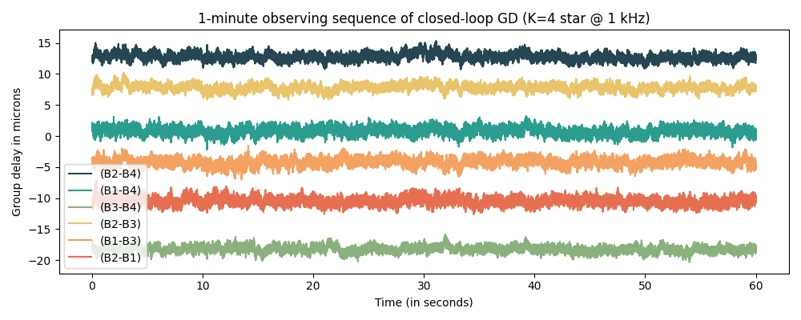
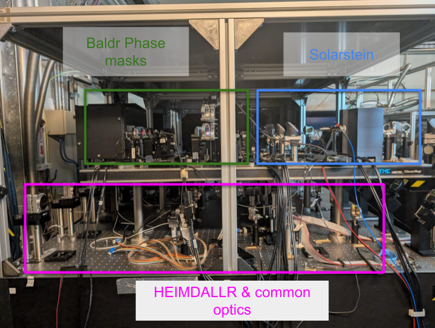
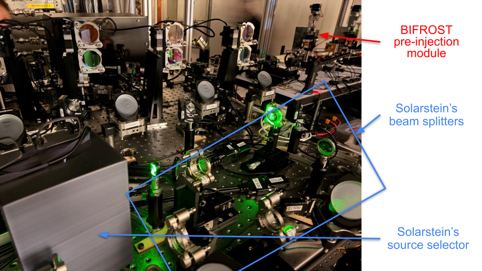
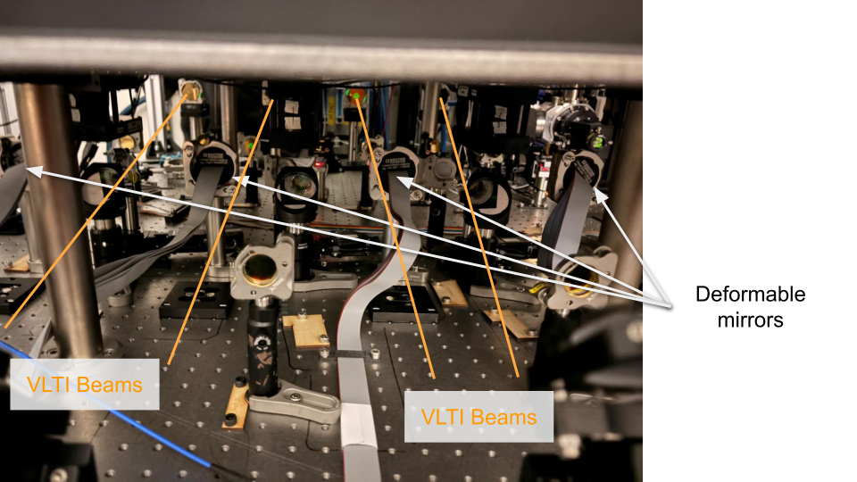
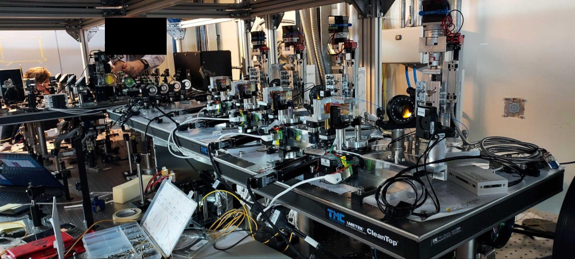
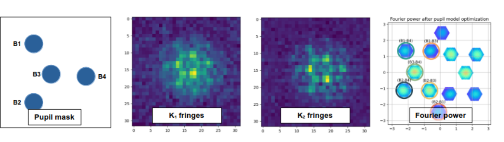

$\newcommand{\ensuremath}{}$
$\newcommand{\xspace}{}$
$\newcommand{\object}[1]{\texttt{#1}}$
$\newcommand{\farcs}{{.}''}$
$\newcommand{\farcm}{{.}'}$
$\newcommand{\arcsec}{''}$
$\newcommand{\arcmin}{'}$
$\newcommand{\ion}[2]{#1#2}$
$\newcommand{\textsc}[1]{\textrm{#1}}$
$\newcommand{\hl}[1]{\textrm{#1}}$
$\newcommand{\footnote}[1]{}$
$\newcommand{\baselinestretch}{1.0}$

# Pushing high angular resolution and high contrast observations on the VLTI from Y to L band with the Asgard instrumental suite: integration status and plans

<mark>Appeared on: 2026-09-22</mark> - 

M.-A. Martinod, et al. -- incl., <mark>S. Kraus</mark>

**Abstract:** ESO’s VLTI has a history of record-breaking discoveries in astrophysics using high-angular resolution instrumentation.Its latest visitor instrument, the Asgard instrumental suite, is one key to further enhance the potential of the facility, particularly in the very near-infrared.It comprises four natively collaborating instruments: HEIMDALLR, a K-band fringe tracker, wavefront corrector and stellar interferometer in K band, with the same optics; Baldr, an H-band Zernike wavefront sensor; BIFROST, an Y-J-H-band photonic combiner whose main science case is studying the formation processes and properties of stellar and planetary systems; and NOTT, an L-band nulling interferometer for imaging young planetary systems.Each of these instruments promise significant advances in their respective science goals that scale with their technical challenges and technology innovations.The integration of Asgard is planned in three phases.The first one (integration, commissioning of HEIMDALLR and Baldr) is successfully done.In this paper, we show an overview of the current progress of the integration of Asgard, the first results of the on-sky commissioning of HEIMDALLR and the future steps and observing policies for Asgard to serve the broader community.

**Figure 5. -** 1-minute closed-loop time sequence (observing block) of group-delay error signals acquired by HEIMDALLR during commissioning, when observing a K=4.1 magnitude star (HD 90115) at 1 kHz frame rate. (*fig:gd_tracking*)

**Figure 2. -** Pictures of Baldr, Solarstein and HEIMDALLR's optics (top left), the upper level (top right), the point of view of the VLTI beams (bottom left) and BIFROST injection module (bottom right). (*fig:pictures*)

**Figure 4. -** Fundamental wavefront sensing principle of HEIMDALLR. The beams from the VLTI (labeled B1, B2, B3 \& B4) are brought together in a 2D compact non-redundant array (first panel) and then to a common focus. The K-band beam is split into two $K_1$ and $K_2$ sub-bands (second and third panel) that are processed through 2D Fourier transform (fourth panel), giving access to astrophysically relevant interferometric quantities like V$^2$ and closure-phase along with inter- and intra-beam metrology information. The labels of the different splodges refer to the pair of beams that contribute to the complex visibility for said splodge. (*fig:hmd_principle*)

