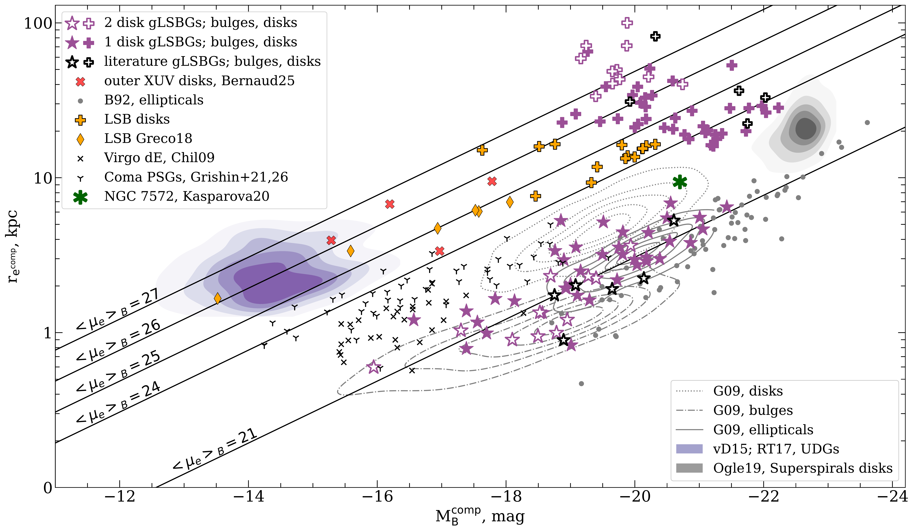
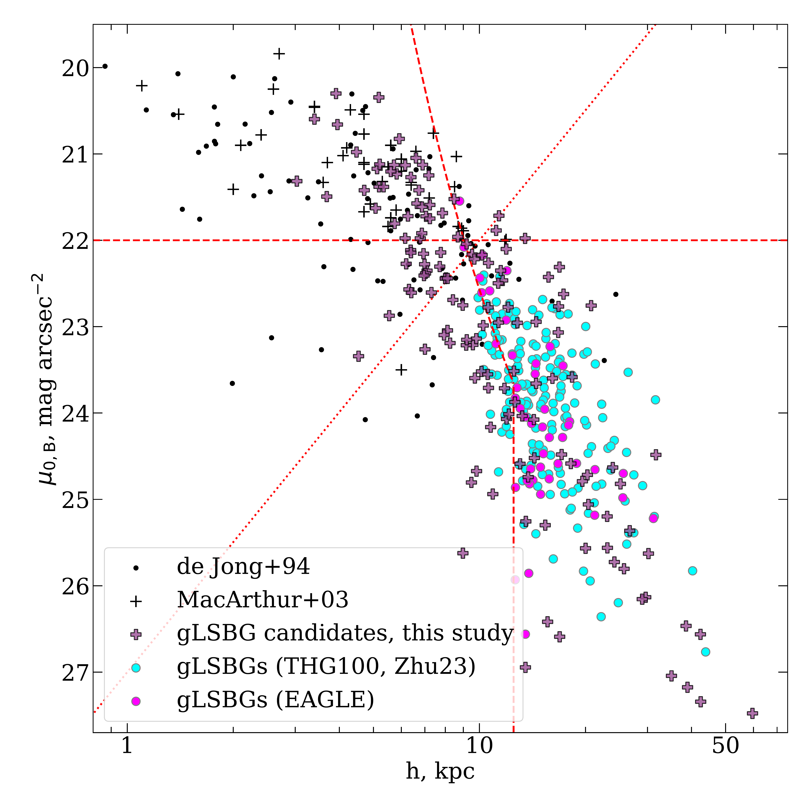
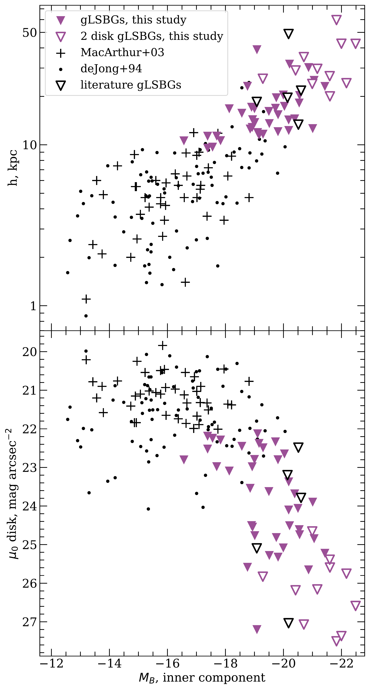

$\newcommand{\ensuremath}{}$
$\newcommand{\xspace}{}$
$\newcommand{\object}[1]{\texttt{#1}}$
$\newcommand{\farcs}{{.}''}$
$\newcommand{\farcm}{{.}'}$
$\newcommand{\arcsec}{''}$
$\newcommand{\arcmin}{'}$
$\newcommand{\ion}[2]{#1#2}$
$\newcommand{\textsc}[1]{\textrm{#1}}$
$\newcommand{\hl}[1]{\textrm{#1}}$
$\newcommand{\footnote}[1]{}$
$\newcommand{\M}{M }$
$\newcommand{\N}{NGC }$
$\newcommand{\NGC}{NGC }$
$\newcommand{\UGC}{UGC }$
$\newcommand{\U}{UGC }$
$\newcommand{\Malin}{Malin }$
$\newcommand{\HI}{H{\sc i} }$
$\newcommand{\HII}{H{\sc ii}  }$
$\newcommand{\ii}{ {\sc ii}}$
$\newcommand{\iii}{ {\sc iii}}$
$\newcommand{\Ms}{\textrm{M}_{\odot}}$
$\newcommand{\nb}{\textsc{nbursts}}$
$\newcommand{\green}{\textcolor[rgb]{0.361, 0.769, 0.349}}$
$\newcommand{\red}{\textcolor[rgb]{1.00,0.00,0.00}}$
$\newcommand{\blue}{\textcolor[rgb]{0.00,0.00,1.00}}$
$\newcommand{\gold}{\textcolor[rgb]{1.00,0.50,0.00}}$

# Giant Low-Surface Brightness Galaxies in the Global Picture of Galaxy Formation and Evolution: Scaling Relations of Giant Galactic Disks from a Statistically-Significant Sample

<mark>Appeared on: 2026-09-23</mark> -  _submitted to A&A; 11 pages, 6 figures_

F. M. Kolganov, et al. -- incl., <mark>M. Demianenko</mark>

**Abstract:** Giant low-surface brightness galaxies (gLSBGs) challenge standard merger-driven galaxy assembly models due to their large, dynamically cold disks, with radii often larger than 100 kpc and dynamical masses exceeding ${\sim}10^{12}$  $\Ms$ . We identify $60$ gLSBGs, including a volume-complete subsample of $35$ galaxies out to $z=0.1$ in the 120 sq.deg. area. Using new and archival photometric and spectroscopic data, we homogeneously analyze their structural properties and derive central velocity dispersions. We update the gLSBG volume density estimate in the local Universe to $(3.6 \pm 0.6) \cdot 10^{-5} \text{Mpc}^{-3}$ . This number corresponds to about 1 in 4000 galaxies in the $g$ -band luminosity range $0.14-1.37 \cdot 10^{11} L_{\odot}$ out to $z=0.1$ , which is consistent with EAGLE cosmological simulations but 3.8 times lower than the corresponding value in TNG100. Central surface brightness and scalelength of the gLSB disks scale with the luminosity of the central component, becoming fainter and flatter as the central component grows more luminous, suggesting rapid disk formation rather than the inside-out growth typical of high surface brightness late-type galaxies. Many gLSBGs also show extended UV counterparts in GALEX, strengthening their connection to XUV-disk galaxies. Finally, comparison with superluminous spirals shows that even complete gas-to-star conversion cannot transform a typical gLSBG into a superspiral, owing to their lower total baryonic mass.

**Figure 9. -** Effective radius versus absolute B-band magnitude for the bulge and disk components of gLSBGs, including both the sample presented in this work and literature data. For comparison, various classes of galaxies and galaxy components from the literature are also shown, including ultra-diffuse galaxies (UDGs), superspirals, dwarf ellipticals (dEs), elliptical galaxies, classical and pseudo-bulges, XUV disks, high-surface-brightness (HSB) disks, and moderately sized LSB galaxies. The lines correspond to the constant mean surface brightness in the B band in mag arcsec$^{-2}$\citep{vanDokkum2015}. (*fig:Mre*)

**Figure 1. -** The relation between the B-band disk central surface brightness and the exponential scale length as was originally introduced by \citet{Sprayberry1995}. Squares represent literature data, while crosses indicate all gLSBGs candidates identified in this work, including those not included in the final sample. Yellow and blue symbols show galaxies from the TNG100 \citep{Zhu23} and EAGLE \citep{vol_dens2023} simulations, respectively. The diagonal line marks the diffuseness index criterion; galaxies located below this line satisfy the selection. The selection adopted in this work occupies the bottom-right rectangle of the diagram. (*fig:data_sample*)

**Figure 4. -** Absolute B-band magnitude of the galaxy inner component vs. exponential scalelength of the disk (upper panel) and disk central surface brightness (lower panel). Filled purple triangles show gLSBGs with single component disk fit. In this case inner component is the Sersic profile. Empty purple triangles correspond to the gLSBGs with double component disk fit. In this case inner component magnitude corresponds to the Sersic+smaller disk profile. We also give literature data on late-type galaxies for comparison. (*fig:Minner*)

