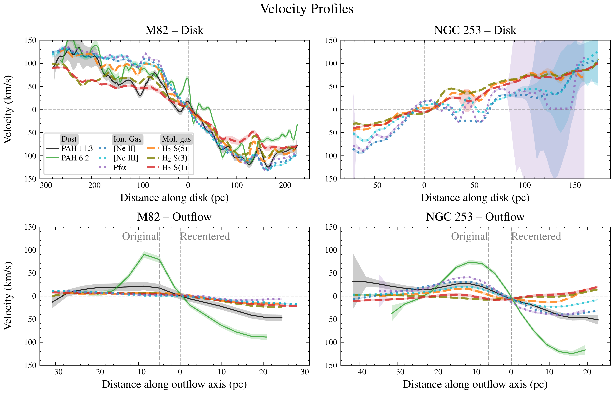
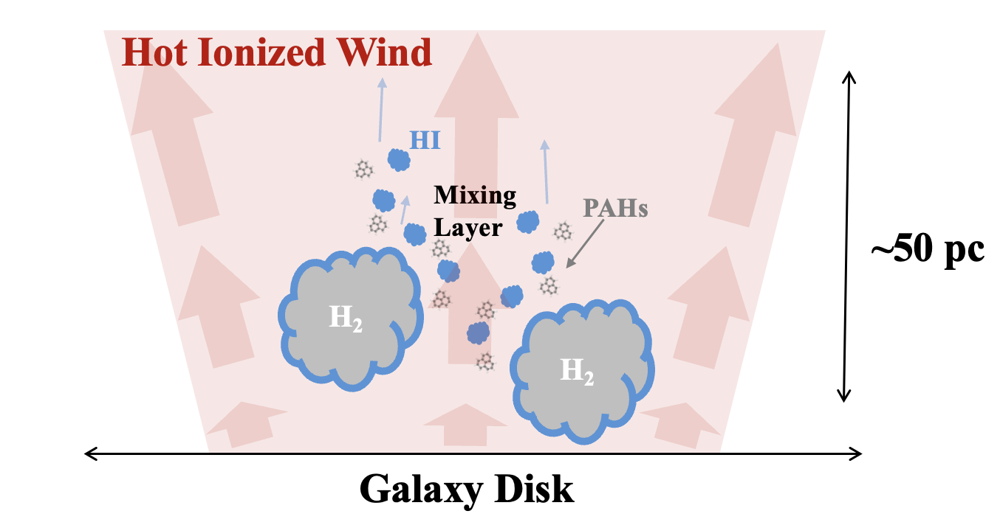
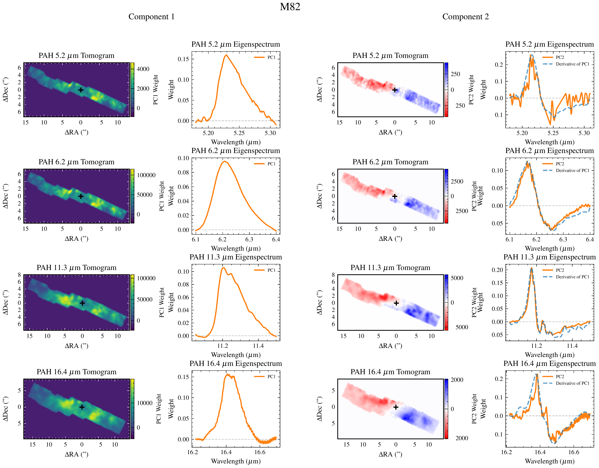

$\newcommand{\ensuremath}{}$
$\newcommand{\xspace}{}$
$\newcommand{\object}[1]{\texttt{#1}}$
$\newcommand{\farcs}{{.}''}$
$\newcommand{\farcm}{{.}'}$
$\newcommand{\arcsec}{''}$
$\newcommand{\arcmin}{'}$
$\newcommand{\ion}[2]{#1#2}$
$\newcommand{\textsc}[1]{\textrm{#1}}$
$\newcommand{\hl}[1]{\textrm{#1}}$
$\newcommand{\footnote}[1]{}$
$\newcommand{\vdag}{(v)^\dagger}$
$\newcommand\aastex{AAS\TeX}$
$\newcommand\latex{La\TeX}$

# JWST Observations of Starbursts: The motion of dust - PAH kinematics of M82 and NGC 253 with JWST/MIRI spectroscopy

<mark>Appeared on: 2026-09-23</mark> -  _19 pages, 13 figures, Accepted for publication in ApJ_

F. R. Donnan, et al. -- incl., <mark>J. Smith</mark>, <mark>F. Walter</mark>

**Abstract:** We present an analysis of dust kinematics in the local starburst galaxies M82 (NGC 3034) and NGC 253 using Polycyclic Aromatic Hydrocarbon (PAH) features observed with JWST/MIRI spectroscopy. We are able to produce high-quality velocity maps of the 5.2 $\mu$ m, 6.2 $\mu$ m, and 11.3 $\mu$ m PAH features, as well as numerous lines of molecular gas via $H_2$ rotational transitions and ionized gas from [ $\ion{Ne}{2}$ ] and H recombination lines. Given the field of view and inclination, we trace a rotating disk in M82 where we observe a steep rise in the velocities followed by flattening, typical of galaxy rotation curves. In NGC 253, however, the 6.2 $\mu$ m and 11.3 $\mu$ m PAH features trace the launching region of the outflow, firmly within the starburst region. We find the ionized gas also shows outflow contributions in NGC 253 while the warm molecular gas is dominated by rotation. Additionally, the molecular gas outflow velocities are lower than the ionized gas, with the 11.3 $\mu$ m PAH feature consistent with the ionized gas rather than the molecular gas. We therefore suggest that PAHs are more closely associated with the ionized gas rather than the molecular at the base of the galaxy outflow, where larger scale imaging shows comparable morphology between PAHs and HI. The 6.2 $\mu$ m PAH feature has an even higher outflow velocity for both galaxies, possibly suggesting preferential ionization of the PAHs within the faster-moving hot phase of the base of the outflow.

**Figure 13. -** 1D velocity profiles of the disk and outflow axes. Top panels show the velocity profiles extracted through 2$"$ wide apertures along the major axis of the disk for M82 and NGC 253 with various emission features. The bottom panels show the velocity profiles through 1$"$ wide apertures of the outflow, taken perpendicular to the major axis of the disk. The PAH features are shown with a solid line, the $H_2$ lines are shown with a dashed line while the ionized gas tracers are shown with a dotted line. The shaded regions show the 1$\sigma$ errors in the velocity. We omit the 5.2 $\mu$m and 16.4 $\mu$m PAH features from this plot as there may be non-negligible contributions to the inferred velocity from variations in the intrinsic profile as demonstrated in Fig. \ref{fig:VelDiff}.  We also omit the 6.2 $\mu$m and 11.3 $\mu$m PAH features for the disk profiles of NGC 253 as these features are dominated by the outflow.
    It is worth noting that these are only statistical errors from the Monte Carlo repeats of the PCA process and do not account for calibration uncertainties and therefore should be taken as lower limits of the errors. In the bottom panels the vertical lines show the position of the nucleus labeled "Original" and the adjusted center position labeled "Recentered" to coincide with where the sign of the velocity flips. (*fig:VelProfiles*)

**Figure 2. -** Outflow scenario consistent with our observations. Within the $\sim$50 pc region at the base of the outflow, molecular clouds are accelerated slowly while the outer layers of ionized gas and PAHs mix with the fast hot ionized wind, resulting in higher velocities of HI and PAHs compared to $H_2$. Additionally, the most mixed PAHs may be preferentially ionized, leading to higher velocities of the 6.2 $\mu$m PAH feature. (*fig:Diagram*)

**Figure 4. -** The first and second principal components of the PAH features for M82. The first two columns show the first component, with the left panels showing the tomograms while the right panels show the corresponding eigenspectrum (orange). The second component is shown in the final two columns, where the dashed blue line shows the derivative of the first principal component eigenspectrum, which should match the second principal component in the case of a Doppler shift. This plot demonstrates that velocity shifts dominate the profile changes rather than variations in the intrinsic profile. (*fig:2ndCompM82*)

