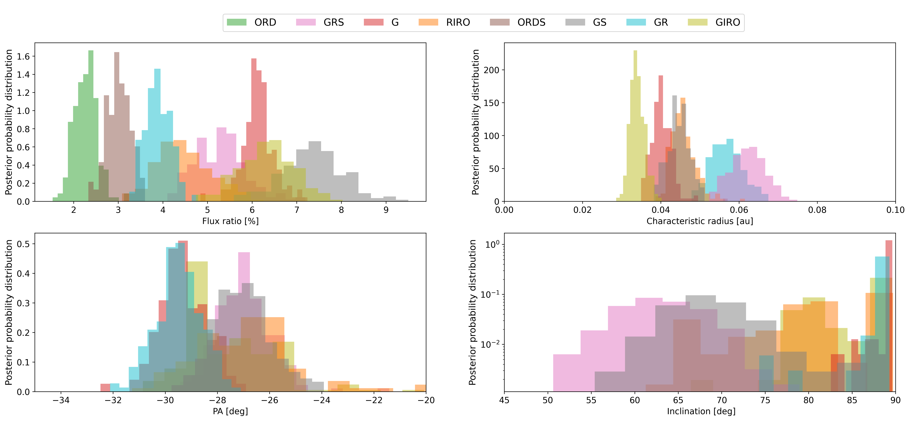
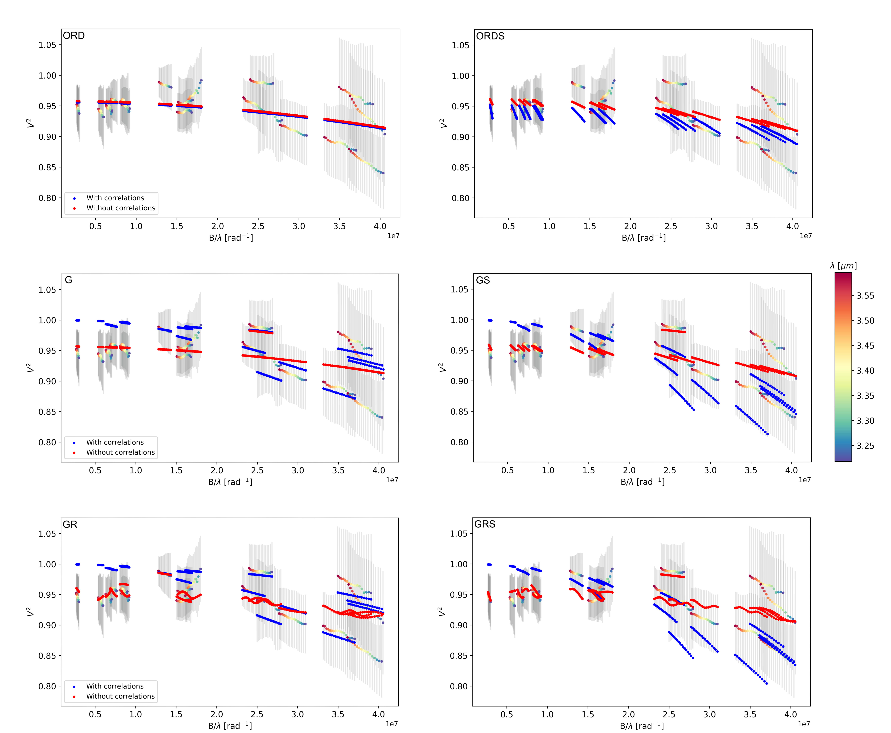
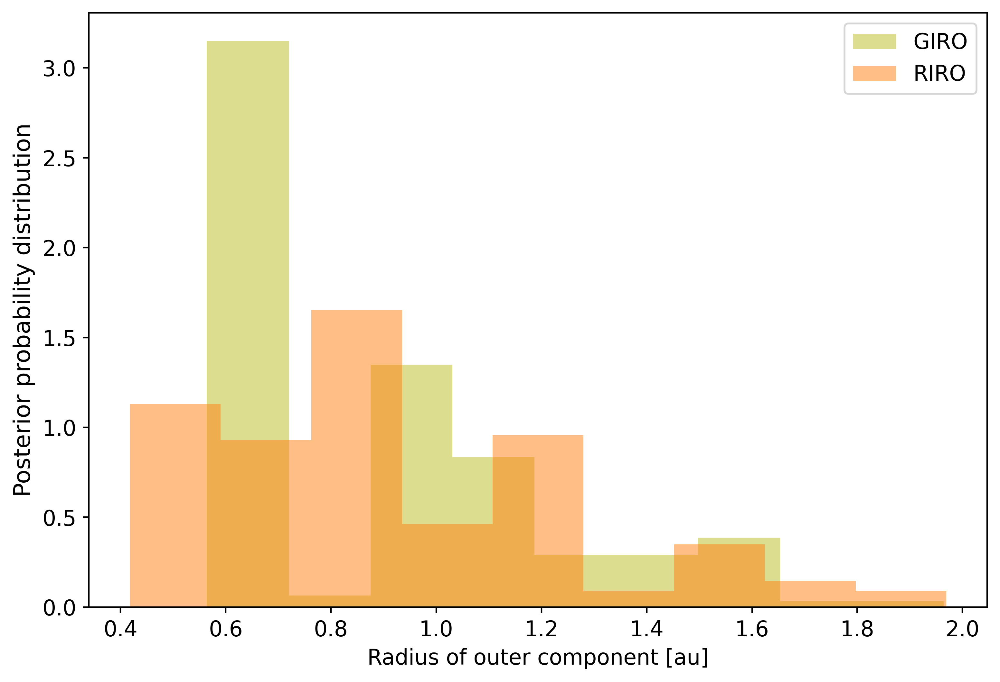

$\newcommand{\ensuremath}{}$
$\newcommand{\xspace}{}$
$\newcommand{\object}[1]{\texttt{#1}}$
$\newcommand{\farcs}{{.}''}$
$\newcommand{\farcm}{{.}'}$
$\newcommand{\arcsec}{''}$
$\newcommand{\arcmin}{'}$
$\newcommand{\ion}[2]{#1#2}$
$\newcommand{\textsc}[1]{\textrm{#1}}$
$\newcommand{\hl}[1]{\textrm{#1}}$
$\newcommand{\footnote}[1]{}$
$\newcommand{\vspacetab}{\rule{0pt}{3ex}}$
$\newcommand{\JM}[1]{\textcolor{red}{[#1] \textbf{(JM)}}}$
$\newcommand{\JC}[1]{\textcolor{orange}{[JC]: #1}}$
$\newcommand{\PP}[1]{\textcolor{magenta}{[PP]: #1}}$
$\newcommand{\arraystretch}{2}$
$\newcommand{\arraystretch}{1.12}$
$\newcommand{\arraystretch}{1.12}$

# VLTI/MATISSE observations of the hot dust around $\object{$\beta$ Pictoris}$$\thanks{Based on observations collected at the European Southern Observatory under ESO programmes 106.21Q8.006, 106.21Q8.004, 106.21Q8.001, 110.246D.003.}$: Observing faint objects with MATISSE

<mark>Appeared on: 2026-09-25</mark> - 

P. Priolet, et al. -- incl., <mark>P. Boley</mark>, <mark>T. Henning</mark>

**Abstract:** Hot exozodiacal dust has been detected in approximately 20 \% of nearby main-sequence stars, indicating that it is a common feature in extrasolar planetary systems. However, their spatial distribution and grain properties remain poorly understood. We  aim to show that the spatial distribution of hot dust around $\beta$ Pictoris -- an iconic planetary system with two known planets and a population of exocomets -- can be effectively constrained through a detailed analysis of optical long-baseline interferometry data. We obtained _L_ -band ( $\lambda \sim 3.5 \mu$ m) observations of $\beta$ Pictoris with the MATISSE instrument at the VLTI. We first developed a method to assess correlations in the visibility measurements by estimating the full data covariance matrix. We then modeled the circumstellar emission using geometric brightness distributions to fit the observed visibilities. This study reveals circumstellar emission around $\beta$ Pictoris consistent with hot exozodiacal dust. By modeling the emission both accounting and not accounting for correlations in the data, we demonstrate their significant impact on the inferred dust properties. The best-fit model reveals a compact ( $\sim$ 0.05 au), highly inclined dust structure near the sublimation radius, misaligned by $\sim 60◦ee$ on the sky plane with respect to the extended edge-on outer disk, contributing $\sim 4\%$ – $7.5\%$ of the total flux at $\lambda = 3.4 \mu$ m, and is composed of submicron-sized grains. The data ${ are also compatible with an additional}$ dust component near 1 au. In the case of $\beta$ Pictoris, the two-decade-old paradigm -- placing hot exozodiacal dust near the sublimation radius and composed of submicron-sized grains -- finds observational support in the detailed analysis of MATISSE data. The misalignment with the known debris disk further supports a link to the exocometary activity.

**Figure 15. -** Posterior distributions for all single-component models and the inner component of two-component models, obtained when accounting for correlations. The distribution of inclinations (bottom right) is presented in log scale, because some (e.g., GRS and GS) are broader than others (e.g., G), while the other distributions are shown in linear scale. (*fig:posterior_dists_incomp_onecomp*)

**Figure 16. -** Best fits for the single-component models with (blue) and without (red) accounting for correlations. Left panels: Without spectral dependence. Right panels: With spectral dependence. The model keyword is indicated at the top left of the figure. (*fig:single_comp_fits*)

**Figure 9. -** Half-light radius of the outer component of the two-component models. (*fig:post_Rhl_outer*)

