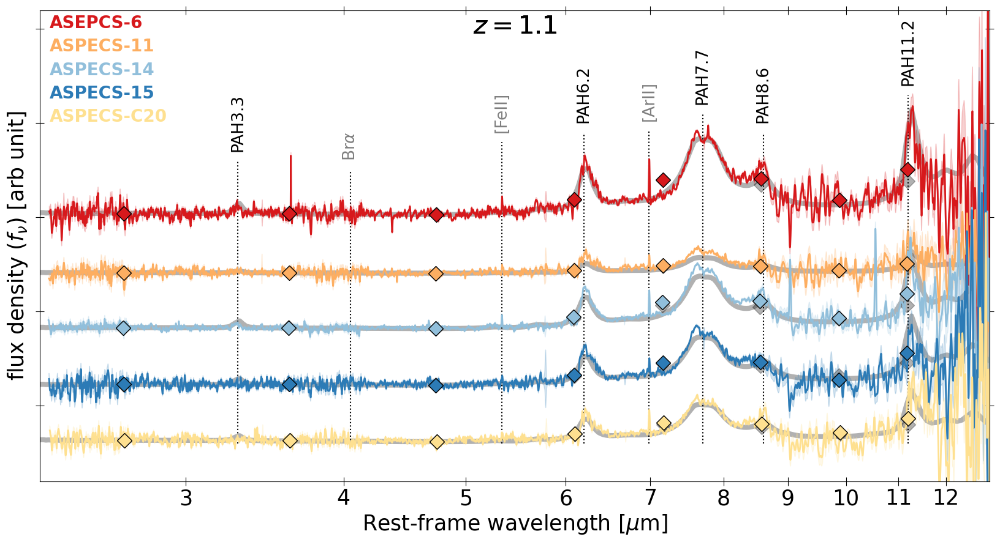
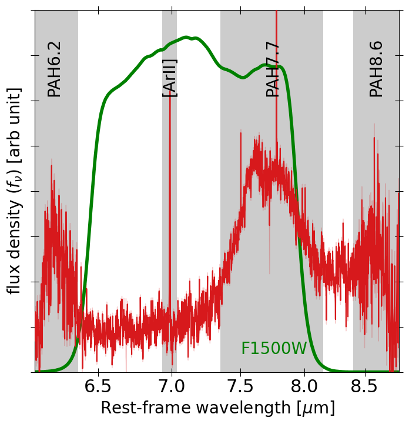
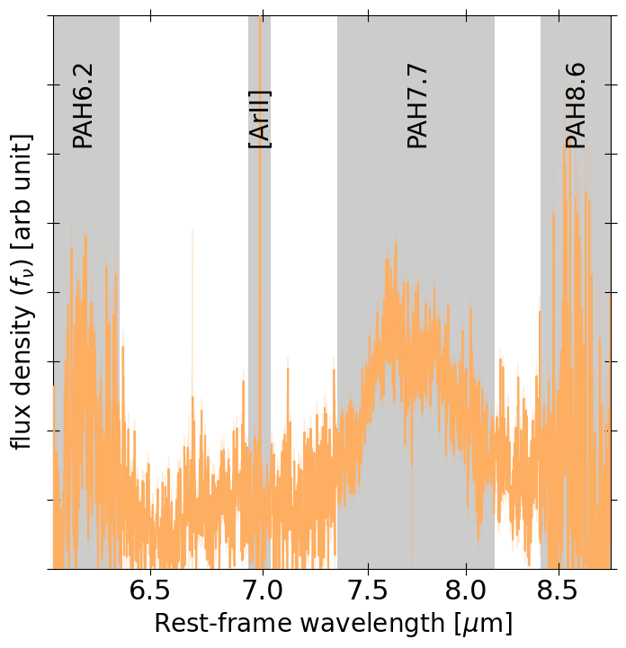
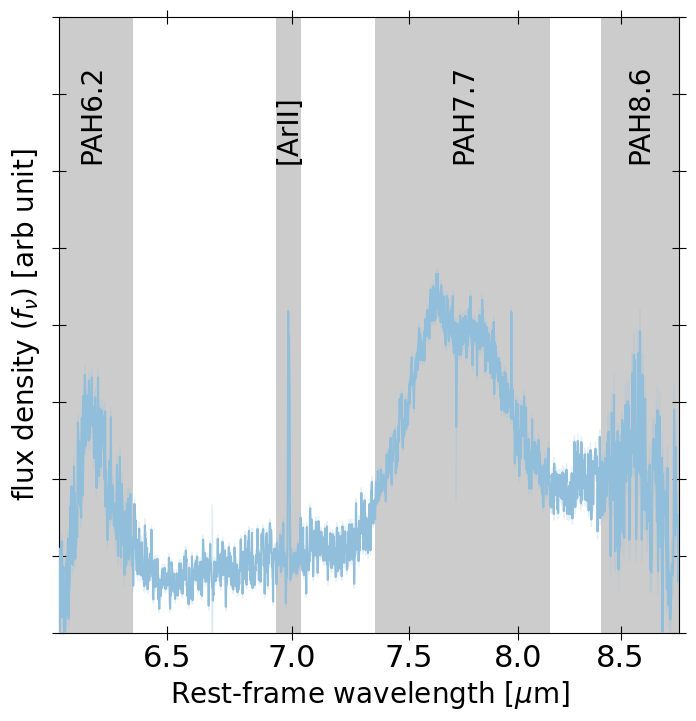
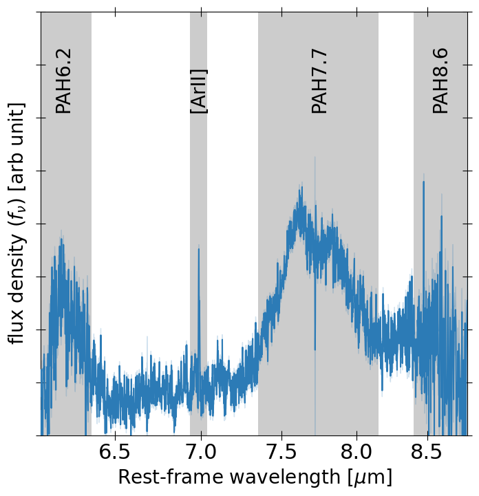
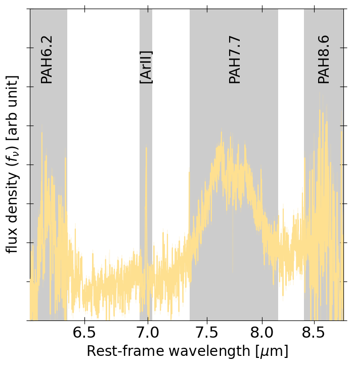
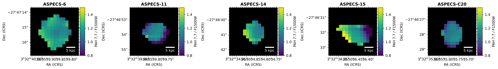
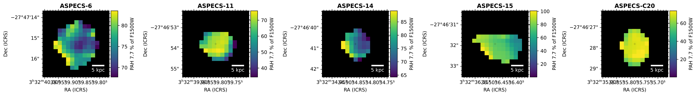
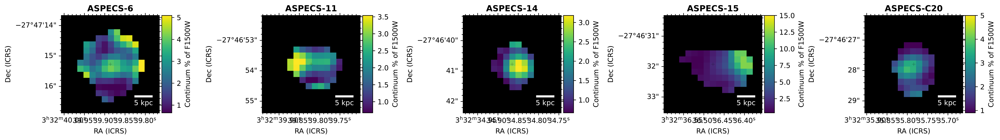

$\newcommand{\ensuremath}{}$
$\newcommand{\xspace}{}$
$\newcommand{\object}[1]{\texttt{#1}}$
$\newcommand{\farcs}{{.}''}$
$\newcommand{\farcm}{{.}'}$
$\newcommand{\arcsec}{''}$
$\newcommand{\arcmin}{'}$
$\newcommand{\ion}[2]{#1#2}$
$\newcommand{\textsc}[1]{\textrm{#1}}$
$\newcommand{\hl}[1]{\textrm{#1}}$
$\newcommand{\footnote}[1]{}$

# PAHSPECS: JWST/MIRI Spectroscopy of PAHs at Cosmic Noon

<mark>Appeared on: 2026-09-25</mark> -  _Submitted to A&A_

I. Shivaei, et al. -- incl., <mark>F. Walter</mark>

**Abstract:** The physical conditions of the interstellar medium (ISM) are thought to differ greatly in high-redshift environments compared to those in the local Universe.Polycyclic aromatic hydrocarbons (PAHs) are one of the most important constituents of the ISM, usually mediating the heating and cooling of gas in photo-dissociation regions. However, PAHs are currently essentially unexplored in main-sequence (MS) galaxies at high redshifts, and specifically at $z$ $\sim$ 1--2 (‘cosmic noon’), preventing us from accessing the ISM's thermal and chemical balance. Here we present the PAH Spectroscopic Survey (PAHSPECS) JWST program, the first MIRI/MRS survey of PAH features at 3.3, 6.2, 7.7, 8.6 and 11.3 $\mu$ m in MS galaxies at $z$ $\sim$ 1. The five targets are from the deep ALMA CO and continuum flux-limited sample in the HUDF.Here, we provide an overview of the project, its motivations, and a brief summary of the first results. We detect the 6.2, 7.7 and 11.3 $\mu$ m PAHs in all galaxies, and the 3.3 $\mu$ m feature in only two. We find that spectral energy distribution (SED) fitting to multi-wavelength broad-band mid-IR photometry can recover the true 6.2 and 7.7 $\mu$ m PAH luminosities derived via spectral decomposition of the MRS spectra to within $\sim$ 25 \% accuracy. However, the 3.3 and 11.3 $\mu$ m PAH features are both overestimated with respect to the true values by $\sim$ 50 \% (and in some cases up to factors of 3--5). Spatially resolved maps of ASPECS-6, the most extended source in the sample, show significant spatial variations of the 7.7 $\mu$ m PAH contribution to the MIRI F1500W flux, suggesting that while photometric measurements can infer the PAH luminosity accurately, IFU spectroscopy is necessary to study variations in PAH ratios and therefore characterize the dust properties of galaxies. The fractional contribution of PAHs to the total dust mass ( $q_{\rm PAH}$ ) derived from photometric SED modeling of the PAHSPECS sources is roughly in agreement with the $L_{\rm PAH}/L_{\rm IR}$ ratio measured from spectroscopy, but the correlation is not as tight as predicted by the models. On average, PAHSPECS galaxies show an excess in their 6.2 $\mu$ m equivalent width with respect to nearby dusty luminous systems. On the other hand, on average, they have lower 3.3 $\mu$ m PAH equivalent widths than local systems, but they show values similar to other higher mass, starbursting systems at similar redshifts ( $z$ $\sim$ 1--3). This evidence points to differential changes in the size distributions of the neutral and ionized PAH populations in cosmic noon galaxies.

**Figure 6. -** Top: MRS spectra of the five PAHSPECS galaxies, with MIRI photometry (color diamonds) and best-fit SEDs (thick grey line) overplotted. Each galaxy is shown with a different color and the spectra are shifted arbitrarily in vertical direction and smoothened by a Gaussian kernel with $\sigma=4$ for better visualization. The MIRI photometry from 5.6 to 25$ \mu$m is shown with the same colors. The best-fit SED to the photometry only is shown with thick grey line for each galaxy.
    Bottom: The native resolution MRS spectra is shown in the region of highest SNR at $\lambda_{\mathrm{rest}}\sim$ 6--9 $\mu$m. [Ar{\sc ii}] at 6.98 $\mu$m is detected in all galaxies. For the 7.7 $\mu$m feature, the 7.42, 7.60, and 7.85 $\mu$m components are shown. The MIRI F1500W filter transmission curve is shown for reference in the panel of ASPECS-6 with a green line, as it is used in Section \ref{sec:photvsspec} to perform synthetic photometry on the MRS spectra (*fig:spectra*)

**Figure 8. -** Ratio maps involving the PAH7.7 feature and the F1500W synthetic photometry applied to the MRS cubes for ASPECS galaxies. The first row of panels shows the maps of the total PAH7.7 feature to the synthetic F1500W photometry. Ratios above 1 are possible because the wings of the PAH feature extend well beyond the filter (see text for details and \citealp{Donnan2026b}). The second row of panels is the fraction of PAH7.7 feature within the F1500W filter to the synthetic F1500W photometry. The third row of panels is the same as the second but for the fraction of continuum emission within the F1500W to the synthetic F1500W photometry.
     (*fig:PAH-maps*)

**Figure 9. -** Best-fit SEDs and observed photometry of PAHSPECS sample. Filter curves used in the SED fitting are shown at the bottom. 7 by 7 arcsec NIRCam and MIRI cutouts are also shown.
    NIRCam RBG cutout is from filters F277W, F356W and F444W.  (*fig:seds*)

