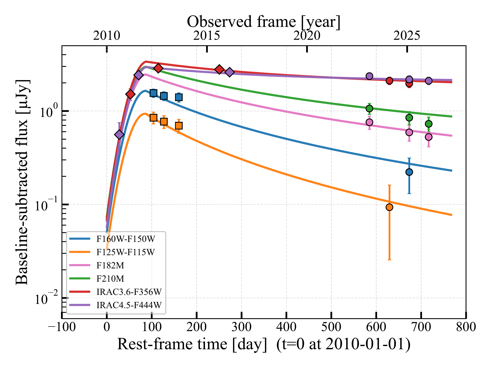
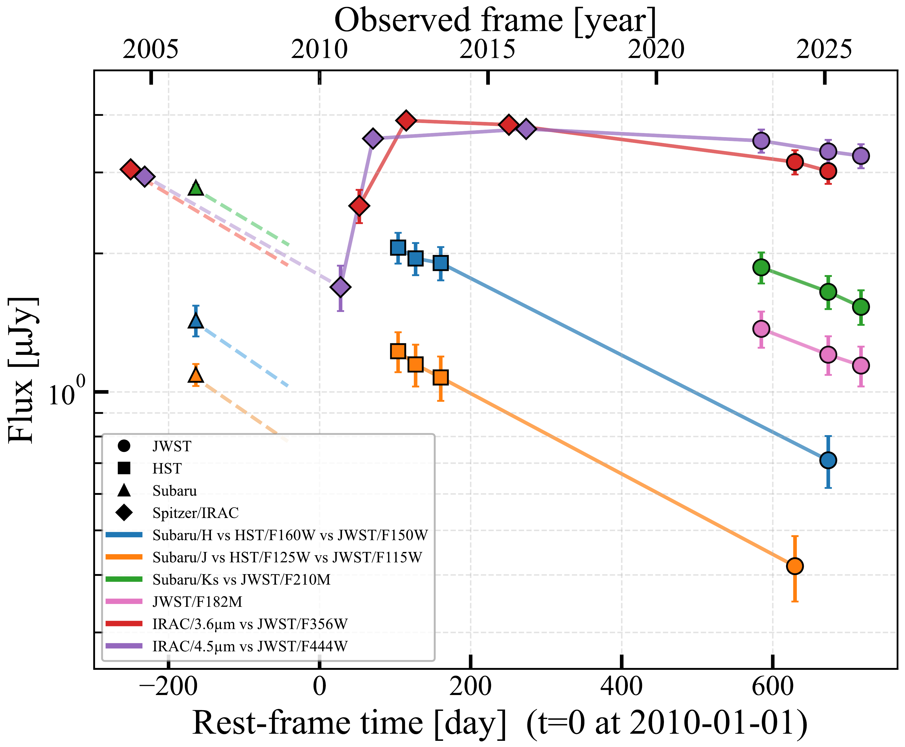
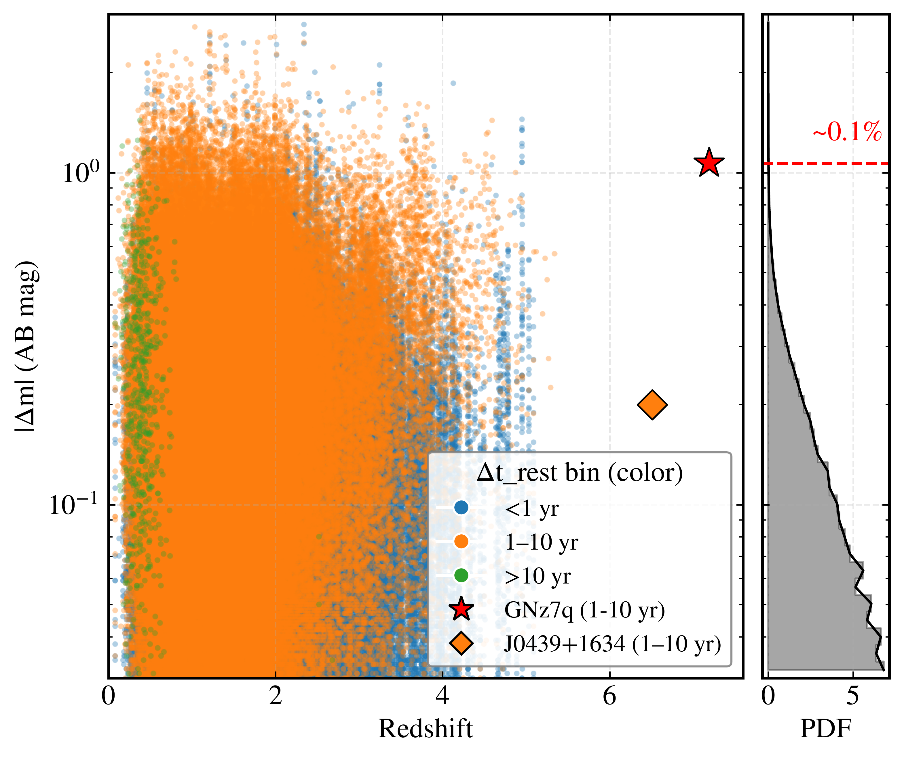
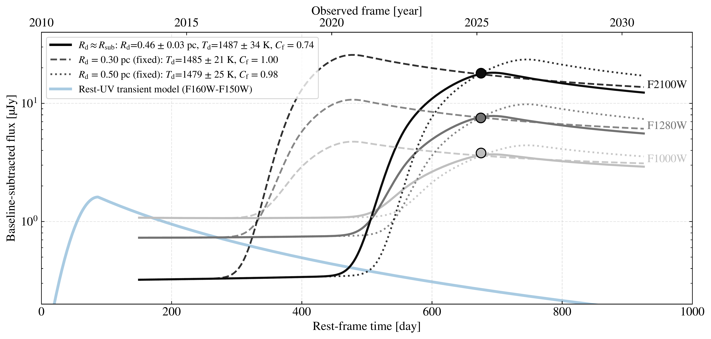

$\newcommand{\ensuremath}{}$
$\newcommand{\xspace}{}$
$\newcommand{\object}[1]{\texttt{#1}}$
$\newcommand{\farcs}{{.}''}$
$\newcommand{\farcm}{{.}'}$
$\newcommand{\arcsec}{''}$
$\newcommand{\arcmin}{'}$
$\newcommand{\ion}[2]{#1#2}$
$\newcommand{\textsc}[1]{\textrm{#1}}$
$\newcommand{\hl}[1]{\textrm{#1}}$
$\newcommand{\footnote}[1]{}$
$\newcommand{\doi}[1]{doi: \href{https://doi.org/#1}{\nolinkurl{#1}}}$
$\newcommand{\farcs}{\mbox{.\!\!^{\prime\prime}}}$
$\newcommand{\pcc}{ cm^{-3}}$
$\newcommand{\hst}{\textit{HST}}$
$\newcommand{\jwst}{\textit{JWST}}$
$\newcommand{\targ}{GNz7q}$
$\newcommand{\ent}{GNz7q-ENT}$
$\newcommand{\theHfigure}{\thesection\arabic{figure}}$
$\newcommand{\theHequation}{\thesection\arabic{equation}}$
$\newcommand{\arraystretch}{0.9}$
$\newcommand{\aj}{AJ}$
$\newcommand{\actaa}{Acta Astron.}$
$\newcommand{\araa}{ARA\&A}$
$\newcommand{\apj}{ApJ}$
$\newcommand{\apjl}{ApJ}$
$\newcommand{\apjs}{ApJS}$
$\newcommand{\ao}{Appl.~Opt.}$
$\newcommand{\apss}{Ap\&SS}$
$\newcommand{\aap}{A\&A}$
$\newcommand{\aapr}{A\&A~Rev.}$
$\newcommand{\aaps}{A\&AS}$
$\newcommand{\azh}{AZh}$
$\newcommand{\baas}{BAAS}$
$\newcommand{\bac}{Bull. astr. Inst. Czechosl.}$
$\newcommand{\caa}{Chinese Astron. Astrophys.}$
$\newcommand{\cjaa}{Chinese J. Astron. Astrophys.}$
$\newcommand{\icarus}{Icarus}$
$\newcommand{\jcap}{J. Cosmology Astropart. Phys.}$
$\newcommand{\jrasc}{JRASC}$
$\newcommand{\mnras}{MNRAS}$
$\newcommand{\memras}{MmRAS}$
$\newcommand{\na}{New A}$
$\newcommand{\nar}{New A Rev.}$
$\newcommand{\pasa}{PASA}$
$\newcommand{\pra}{Phys.~Rev.~A}$
$\newcommand{\prb}{Phys.~Rev.~B}$
$\newcommand{\prc}{Phys.~Rev.~C}$
$\newcommand{\prd}{Phys.~Rev.~D}$
$\newcommand{\pre}{Phys.~Rev.~E}$
$\newcommand{\prl}{Phys.~Rev.~Lett.}$
$\newcommand{\pasp}{PASP}$
$\newcommand{\pasj}{PASJ}$
$\newcommand{\qjras}{QJRAS}$
$\newcommand{\rmxaa}{Rev. Mexicana Astron. Astrofis.}$
$\newcommand{\skytel}{S\&T}$
$\newcommand{\solphys}{Sol.~Phys.}$
$\newcommand{\sovast}{Soviet~Ast.}$
$\newcommand{\ssr}{Space~Sci.~Rev.}$
$\newcommand{\zap}{ZAp}$
$\newcommand{\nat}{Nature}$
$\newcommand{\iaucirc}{IAU~Circ.}$
$\newcommand{\aplett}{Astrophys.~Lett.}$
$\newcommand{\apspr}{Astrophys.~Space~Phys.~Res.}$
$\newcommand{\bain}{Bull.~Astron.~Inst.~Netherlands}$
$\newcommand{\fcp}{Fund.~Cosmic~Phys.}$
$\newcommand{\gca}{Geochim.~Cosmochim.~Acta}$
$\newcommand{\grl}{Geophys.~Res.~Lett.}$
$\newcommand{\jcp}{J.~Chem.~Phys.}$
$\newcommand{\jgr}{J.~Geophys.~Res.}$
$\newcommand{\jqsrt}{J.~Quant.~Spec.~Radiat.~Transf.}$
$\newcommand{\memsai}{Mem.~Soc.~Astron.~Italiana}$
$\newcommand{\nphysa}{Nucl.~Phys.~A}$
$\newcommand{\physrep}{Phys.~Rep.}$
$\newcommand{\physscr}{Phys.~Scr}$
$\newcommand{\planss}{Planet.~Space~Sci.}$
$\newcommand{\procspie}{Proc.~SPIE}$

# A tidal disruption event in a quasar at redshift 7.19$\vspace{-15mm}$

<mark>Appeared on: 2026-09-28</mark> -  _18 pages, 8 (+2) figures, 1 table. Submitted to OJA. Comments are welcome!_

S. Fujimoto, et al. -- incl., <mark>F. Walter</mark>

**Abstract:** We report a long-lived nuclear transient in GNz7q, a red quasar at $z=7.19$ powered by a $\sim3\times10^{7} M_\odot$ black hole and hosted by a compact, dusty starburst galaxy.The transient was identified in more than two decades of multi-epoch imaging with _HST_ , _Spitzer_ , and _JWST_ .After a rapid rise, the source faded smoothly by $\Delta m\simeq1.1$ mag in the rest-frame ultraviolet over a rest-frame timescale of $\sim2$ yr, with coherent, wavelength-dependent evolution across 1--5 $\mu$ m that places GNz7q above the 99.9th percentile of the SDSS quasar variability distribution and is absent at $z\gtrsim5$ .The duration and energetics disfavor superluminous supernovae, and Monte Carlo tests show that stochastic quasar variability reproduces the observed multi-band evolution with a probability of $\lesssim10^{-5}$ .A panchromatic model combining a thermal continuum with a $t^{-5/3}$ decline reproduces the light curves, yielding a peak temperature of $\simeq1.4\times10^{4}$ K, a peak bolometric luminosity of $\simeq3\times10^{45}$ erg s $^{-1}$ , and a radiated energy of $\simeq1.5\times10^{53}$ erg, which imply the tidal disruption of a star of a few solar masses and place the event among the most energetic tidal disruption events (TDEs) known.A redshifted, extremely broad Balmer-line component in independent _JWST_ /NIRSpec spectroscopy is consistent with a transient, non-virialized broad-line region. _JWST_ /MIRI photometry further reveals delayed mid-infrared emission from $\simeq1500$ K dust at a sub-parsec radius, consistent with a dust echo of the flare and providing a direct constraint on circumnuclear dust reprocessing in a quasar at $z>7$ .The relatively low black-hole mass ( $M_{\rm BH}\lesssim10^{8} M_\odot$ ) and dense star-forming nucleus of GNz7q are conditions under which TDEs are expected to be most efficient, extending the connection between energetic nuclear transients and dusty star-forming hosts to the epoch of reionization.These observations provide a time-domain view of episodic black-hole fueling and its dusty nuclear environment 700 million years after the Big Bang.Wide-field time-domain surveys with _Roman_ and _Euclid_ in the near-infrared, complemented by LSST at lower redshifts, may uncover such transients in large numbers and enable systematic time-domain studies of black-hole growth in the reionization era.

**Figure 6. -** \small**Multi-wavelength light-curve modeling of the extreme transient in GNz7q.**
Baseline-subtracted multi-epoch photometry spanning
$\sim$1--5 $\mu$m (observed frame), combining _HST_, _Spitzer_, and _JWST_ data.
Times are shown in the rest frame.
Colored curves show the best-fit panchromatic transient model with a Gaussian rise and a $t^{-5/3}$ decay.
 (*fig:light_curve*)

**Figure 5. -** \small**Multi-epoch, multi-wavelength photometry over two decades, confirming the long-term, outstanding variability of GNz7q.****Left:** Multi-epoch photometry compiled from all available imaging, using filters closely matched in effective wavelength across different instruments (e.g., _HST_/F160W versus _JWST_/NIRCam F150W).
Since around 2012, the shorter-wavelength bands exhibit a consistent, smooth dimming of up to $\Delta m\simeq1.1$ mag over a rest-frame timescale of $\sim$2 yr, while the fading amplitude is more modest at $\sim$4--5 $\mu$m.
This wavelength-dependent evolution is naturally expected for a cooling transient event.
Data obtained prior to 2010 show additional variability and are not considered part of the main event discussed here (see text).
Although such early variability could in principle arise from the same physical event (e.g., a multi-peaked TDE;  ([Leloudas, Fraser and Stone 2016]()) ), the sparse temporal sampling prevents a firm interpretation, and we therefore focus on the better-sampled transient evolution observed after 2012.
Calibration, reduction, and photometry systematics are firmly ruled out based on tests with nearby sources in the same field (Figure \ref{fig:test}).
**Right:** Comparison of the rest-UV variability amplitude with the SDSS quasar variability distribution  ([MacLeod and Kochanek 2010]()) , along with the probability density function (PDF) of $|\Delta m|$ collapsed over redshift.
Points are color-coded by rest-frame baseline.
GNz7q exhibits $>1$ mag variability, above the 99th percentile of SDSS quasars.
The orange diamond marks J0439+1634 at $z=6.51$, the clearest photometric variability detection among the known $z>5.3$ quasars, with an amplitude of $\simeq0.2$ mag in the rest-frame ultraviolet over $\simeq2$ rest-frame years  ([Leung, Eilers and Panagiotou 2026]()) .
 (*fig:variability*)

**Figure 7. -** \small**Dust-echo modeling of the $\jwst$/MIRI photometry.**$\jwst$/MIRI F1000W, F1280W, and F2100W photometry modeled as thermal dust reprocessing of the UV--optical transient.
The solid curves show the best-fit model assuming that the characteristic dust radius equals the sublimation radius ($R_{\rm d}=R_{\rm sub}$).
Dashed and dotted curves illustrate representative solutions with fixed radii
($R_{\rm d}=0.3$ and $0.5$ pc), highlighting the partial degeneracy arising from uncertainties in dust geometry and reprocessing efficiency.
The transparent blue curve shows the best-fit rest-frame ultraviolet transient model in the F160W--F150W band (identical to that in Figure \ref{fig:light_curve}), illustrating the delayed mid-infrared response to the ultraviolet flare.
Importantly, future intensive mid-infrared monitoring will break the degeneracy, while the spectral shape across the current three MIRI bands already well constrains $T_{\rm dust}\simeq1500$ K.
 (*fig:dust_echo*)

