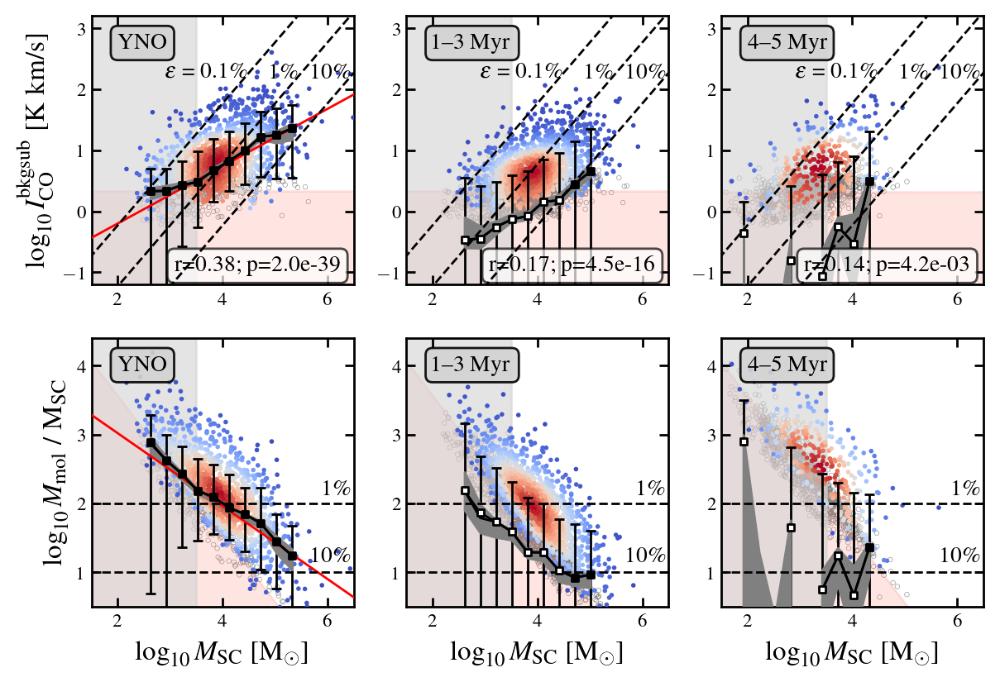
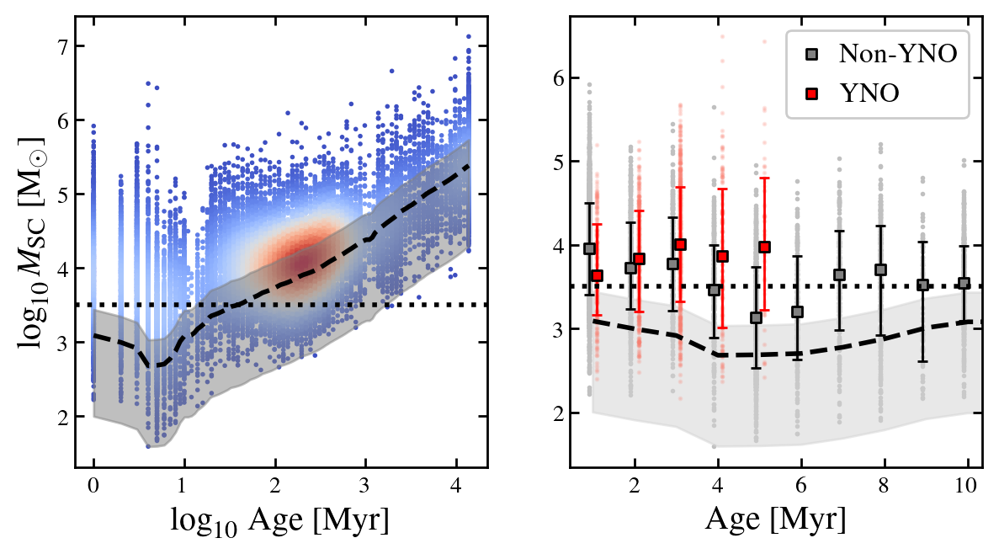
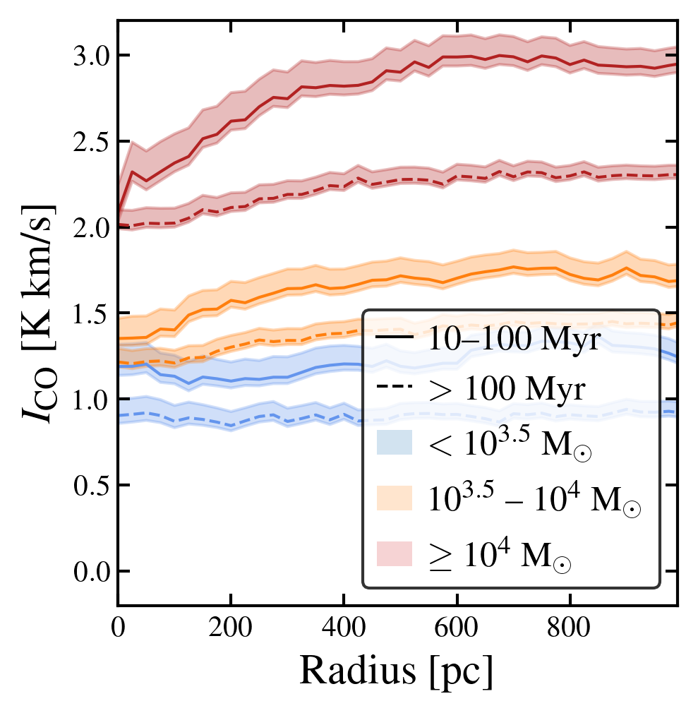
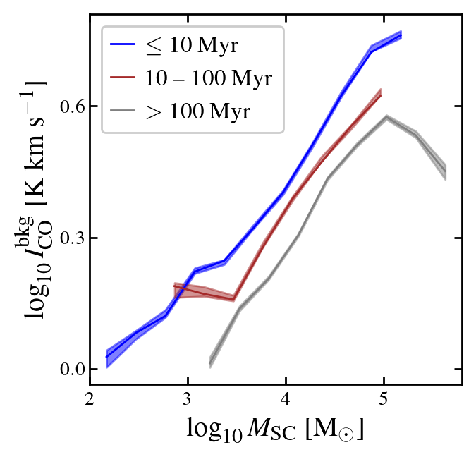

$\newcommand{\ensuremath}{}$
$\newcommand{\xspace}{}$
$\newcommand{\object}[1]{\texttt{#1}}$
$\newcommand{\farcs}{{.}''}$
$\newcommand{\farcm}{{.}'}$
$\newcommand{\arcsec}{''}$
$\newcommand{\arcmin}{'}$
$\newcommand{\ion}[2]{#1#2}$
$\newcommand{\textsc}[1]{\textrm{#1}}$
$\newcommand{\hl}[1]{\textrm{#1}}$
$\newcommand{\footnote}[1]{}$
$\newcommand{\micron}{\mum\xspace}$
$\newcommand{\solarmass}{M_{\odot}\xspace}$
$\newcommand{\velu}{km s^{-1}\xspace}$
$\newcommand{\alphacou}{M_{\odot}~(K~km~s^{-1}pc^{2})^{-1}\xspace}$
$\newcommand{\OSU}{\label{OSU} Department of Astronomy, The Ohio State University, 140 West 18th Avenue, Columbus, Ohio 43210, USA}$
$\newcommand{\Alberta}{\label{Alberta} Department of Physics, University of Alberta, Edmonton, AB T6G 2E1, Canada}$
$\newcommand{\ANU}{\label{ANU} Research School of Astronomy and Astrophysics, Australian National University, Canberra, ACT 2611, Australia}$
$\newcommand{\IPAC}{\label{IPAC} Caltech-IPAC, 1200 E. California Blvd. Pasadena, CA 91125, USA}$
$\newcommand{\Carnegie}{\label{Carnegie} Observatories of the Carnegie Institution for Science, 813 Santa Barbara Street, Pasadena, CA 91101, USA}$
$\newcommand{ÇAPP}{\label{CCAPP} Center for Cosmology and Astroparticle Physics, 191 West Woodruff Avenue, Columbus, OH 43210, USA}$
$\newcommand{\CfA}{\label{CfA}Harvard-Smithsonian Center for Astrophysics, 60 Garden Street, Cambridge, MA 02138, USA}$
$\newcommand{\UCT}{\label{UCT}Department of Astronomy, University of Cape Town, Rondebosch 7701, Cape Town, South Africa}$
$\newcommand{\UCASS}{\label{UCASS}Department of Mathematical Sciences, Centre for Astrophysics and Space Science, University of South Africa, Florida, 1709, South Africa}$
$\newcommand{\CITEVA}{\label{CITEVA} Centro de Astronomía (CITEVA), Universidad de Antofagasta, Avenida Angamos 601, Antofagasta, Chile}$
$\newcommand{\CNRS}{\label{CNRS} CNRS, IRAP, 9 Av. du Colonel Roche, BP 44346, F-31028 Toulouse cedex 4, France}$
$\newcommand{\ESO}{\label{ESO} European Southern Observatory, Karl-Schwarzschild Stra{\ss}e 2, D-85748 Garching bei München, Germany}$
$\newcommand{\ESOChile}{\label{ESOChile} European Southern Observatory, Avenida Alonso de Cordoba 3107, Casilla 19, Santiago 19001, Chile}$
$\newcommand{\HD}{\label{HD} Astronomisches Rechen-Institut, Zentrum für Astronomie der Universität Heidelberg, Mönchhofstra\ss e 12-14, D-69120 Heidelberg, Germany}$
$\newcommand{\ICRAR}{\label{ICRAR} International Centre for Radio Astronomy Research, University of Western Australia, 35 Stirling Highway, Crawley, WA 6009, Australia}$
$\newcommand{\IRAM}{\label{IRAM} Institut de Radioastronomie Millimétrique (IRAM), 300 Rue de la Piscine, F-38406 Saint Martin d'Hères, France}$
$\newcommand{\ITA}{\label{ITA} Universität Heidelberg, Zentrum für Astronomie, Institut für Theoretische Astrophysik, Albert-Ueberle-Str 2, D-69120 Heidelberg, Germany}$
$\newcommand{\IWR}{\label{IWR} Universität Heidelberg, Interdisziplinäres Zentrum für Wissenschaftliches Rechnen, Im Neuenheimer Feld 205, D-69120 Heidelberg, Germany}$
$\newcommand{\JHU}{\label{JHU} Department of Physics and Astronomy, The Johns Hopkins University, Baltimore, MD 21218, USA}$
$\newcommand{\Leiden}{\label{Leiden} Leiden Observatory, Leiden University, P.O. Box 9513, 2300 RA Leiden, The Netherlands}$
$\newcommand{\Maryland}{\label{Maryland} Department of Astronomy, University of Maryland, College Park, MD 20742, USA}$
$\newcommand{\MPE}{\label{MPE} Max-Planck-Institut für extraterrestrische Physik, Giessenbachstra{\ss}e 1, D-85748 Garching, Germany}$
$\newcommand{\MPIA}{\label{MPIA} Max-Planck-Institut für Astronomie, Königstuhl 17, D-69117, Heidelberg, Germany}$
$\newcommand{\Nagoya}{\label{Nagoya} Department of Physics, Nagoya University, Furo-cho, Chikusa-ku, Nagoya, Aichi 464-8602, Japan}$
$\newcommand{\NRAO}{\label{NRAO} National Radio Astronomy Observatory, 520 Edgemont Road, Charlottesville, VA 22903-2475, USA}$
$\newcommand{\OAN}{\label{OAN} Observatorio Astronómico Nacional (IGN), C/Alfonso XII, 3, E-28014 Madrid, Spain}$
$\newcommand{\ObsParis}{\label{ObsParis} Sorbonne Université, Observatoire de Paris, Université PSL, CNRS, LERMA, F-75014, Paris, France}$
$\newcommand{\Princeton}{\label{Princeton} Department of Astrophysical Sciences, Princeton University, Princeton, NJ 08544 USA}$
$\newcommand{\UToledo}{\label{UToledo} University of Toledo, 2801 W. Bancroft St., Mail Stop 111, Toledo, OH, 43606}$
$\newcommand{\Toulouse}{\label{Toulouse} Université de Toulouse, UPS-OMP, IRAP, F-31028 Toulouse cedex 4, France}$
$\newcommand{\UBonn}{\label{UBonn} Argelander-Institut für Astronomie, Universität Bonn, Auf dem Hügel 71, 53121 Bonn, Germany}$
$\newcommand{\UChile}{\label{UChile} Departamento de Astronomía, Universidad de Chile, Camino del Observatorio 1515, Las Condes, Santiago, Chile}$
$\newcommand{\UConn}{\label{UConn} Department of Physics, University of Connecticut, Storrs, CT, 06269, USA}$
$\newcommand{\UCSD}{\label{UCSD}Center for Astrophysics and Space Sciences, Department of Physics,  University of California, San Diego, 9500 Gilman Drive, La Jolla, CA 92093, USA}$
$\newcommand{\UGent}{\label{UGent} Sterrenkundig Observatorium, Universiteit Gent, Krijgslaan 281 S9, B-9000 Gent, Belgium}$
$\newcommand{\ULyon}{\label{ULyon} Univ Lyon, Univ Lyon 1, ENS de Lyon, CNRS, Centre de Recherche Astrophysique de Lyon UMR5574,\ F-69230 Saint-Genis-Laval, France}$
$\newcommand{\UMass}{\label{UMass} University of Massachusetts—Amherst, 710 N. Pleasant Street, Amherst, MA 01003, USA}$
$\newcommand{\UWyoming}{\label{UWyoming} Department of Physics and Astronomy, University of Wyoming, Laramie, WY 82071, USA}$
$\newcommand{\LAM}{\label{LAM} Aix Marseille Univ, CNRS, CNES, LAM (Laboratoire d’Astrophysique de Marseille), Marseille, France}$
$\newcommand{\UHawaii}{\label{UHawaii} Institute for Astronomy, University of Hawaii, 2680 Woodlawn Drive, Honolulu, HI 96822, USA}$
$\newcommand{\UCM}{\label{UCM} Departamento de Física de la Tierra y Astrofísica, Universidad Complutense de Madrid, E-28040, Spain}$
$\newcommand{\IPARC}{\label{IPARC} Instituto de Física de Partículas y del Cosmos IPARCOS, Facultad de Ciencias Físicas, Universidad Complutense de Madrid, E-28040, Spain}$
$\newcommand{\STScI}{\label{STScI} Space Telescope Science Institute, 3700 San Martin Drive, Baltimore, MD 21218, USA}$
$\newcommand{\McMaster}{\label{McMaster} Department of Physics and Astronomy, McMaster University, 1280 Main Street West, Hamilton, ON L8S 4M1, Canada}$
$\newcommand{\INAF}{\label{INAF} INAF -- Osservatorio Astrofisico di Arcetri, Largo E. Fermi 5, I-50157, Firenze, Italy}$
$\newcommand{\Sydney}{\label{Sydney} Sydney Institute for Astronomy, School of Physics A28, The University of Sydney, NSW 2006, Australia}$
$\newcommand{\CITA}{\label{CITA} Canadian Institute for Theoretical Astrophysics (CITA), University of Toronto, 60 St George St, Toronto, ON M5S 3H8, Canada}$
$\newcommand{\ASIAA}{\label{ASIAA} Institute of Astronomy and Astrophysics, Academia Sinica, No. 1, Sec. 4, Roosevelt Road, Taipei 10617, Taiwan}$
$\newcommand{\TKU}{\label{TKU} Department of Physics, Tamkang University, No.151, Yingzhuan Rd., Tamsui Dist., New Taipei City 251301, Taiwan}$
$\newcommand{\PSMA}{\label{PSMA} Penn State Mont Alto, 1 Campus Drive, Mont Alto, PA  17237, USA}$
$\newcommand{\ILL}{\label{ILL} ILL}$
$\newcommand{\stromlo}{\label{stromlo} Research School of Astronomy and Astrophysics, Australian National University, Mt Stromlo Observatory, Weston Creek, ACT 2611, Australia}$
$\newcommand{\UCatolica}{\label{UCatolica} Instituto de Astronomía, Universidad Católica del Norte, Av. Angamos 0610, Antofagasta, Chile}$
$\newcommand{\UT}{\label{UT} McDonald Observatory, The University of Texas at Austin, 1 University Station, Austin, TX 78712-0259, USA}$
$\newcommand{\Vanderbilt}{\label{Vanderbilt} Department of Physics and Astronomy, Vanderbilt University, VU Station 1807, Nashville, TN 37235, USA}$
$\newcommand{\UNF}{\label{UNF} Department of Physics, University of North Florida, 1 UNF Dr. Jacksonville FL 32224}$
$\newcommand{\NAOC}{\label{NAOC} Chinese Academy of Sciences South America Center for Astronomy, National Astronomical Observatories, CAS, Beijing 100101, China}$
$\newcommand{\CASA}{\label{CASA} Center for Astrophysics and Space Astronomy, University of Colorado, 389 UCB, Boulder, CO 80309-0389, USA}$
$\newcommand{\UNAM}{\label{UNAM} Universidad Nacional Autónoma de México, Instituto de Astronomía, AP 106, Ensenada 22800, BC, México}$
$\newcommand{\UDP}{\label{UDP} Instituto de Estudios Astrofísicos, Facultad de Ingeniería y Ciencias, Universidad Diego Portales, Av. Ejército Libertador 441, Santiago, Chile}$
$\newcommand{\Steward}{\label{Steward} Steward Observatory, University of Arizona, 933 N. Cherry Ave., Tucson, AZ 85721-0065, USA}$
$\newcommand{\APO}{\label{APO} Apache Point Observatory and New Mexico State University, P.O. Box 59,$
$Sunspot, NM 88349-0059, USA}$
$\newcommand{\UNAMCU}{\label{UNAMCU} Universidad Nacional Autónoma de México, Instituto de Astronomía, AP 70-264, CDMX 04510, México}$
$\newcommand{\UWash}{\label{UWash}Department of Astronomy, University of Washington, Seattle, WA, 98195}$
$\newcommand{Ç}{\label{CC}Department of Physics, Colorado College, Colorado Springs, CO 80903}$
$\newcommand{\Utah}{\label{Utah}Department of Physics and Astronomy, University of Utah, 115 S. 1400 E., Salt Lake City, UT 84112, USA}$
$\newcommand{\UConcepcion}{\label{UConcepcion}Departamento de Astronomía, Universidad de Concepción, Casilla 160-C, Concepción, Chile}$
$\newcommand{\FCLA}{\label{FCLA}Franco-Chilean Laboratory for Astronomy, IRL 3386, CNRS and Universidad de Chile, Santiago, Chile}$
$\newcommand{\Oklahoma}{\label{Oklahoma}Homer L. Dodge Department of Physics and Astronomy, University of Oklahoma, Norman, OK 73019, USA}$
$\newcommand{\UIUC}{\label{UIUC}Department of Astronomy, University of Illinois, Urbana, IL 61801, USA}$
$\newcommand{\Harvard}{\label{Harvard}Harvard-Smithsonian Center for Astrophysics, Cambridge, MA 02138, USA}$
$\newcommand{\caltech}{\label{caltech}Department of Astronomy, California Institute of Technology, Pasadena, CA 91125, USA}$
$\newcommand{\UOA}{\label{UOA}Department of Physics, University of Arkansas, 226 Physics Building, 825 West Dickson Street, Fayetteville, AR 72701, USA}$
$\newcommand{\units}{\label{units}Department of Physics, Astronomy Section, University of Trieste, Via G.B. Tiepolo, 11, I-34143 Trieste, Italy}$
$\newcommand{\Rad}{\label{Rad}{Elizabeth S. and Richard M. Cashin Fellow at the Radcliffe Institute for Advanced Studies at Harvard University, 10 Garden Street, Cambridge, MA 02138, USA}}$
$\newcommand{\LJMU}{\label{LJMU}{Astrophysics Research Institute, Liverpool John Moores University, IC2, Liverpool Science Park, 146 Brownlow Hill, Liverpool L3 5RF, UK}}$
$\newcommand{\COOL}{\label{COOL}{Cosmic Origins Of Life (COOL) Research DAO, \href{https://coolresearch.io}{https://coolresearch.io}}}$
$\newcommand{\Ox}{\label{Ox}{Sub-department of Astrophysics, Department of Physics, University of Oxford, Keble Road, Oxford OX1 3RH, UK}}$
$\newcommand{\UShizuokaGlobal}{\label{UShizuokaGlobal}{Faculty of Global Interdisciplinary Science and Innovation, Shizuoka University, 836 Ohya, Suruga-ku, Shizuoka 422-8529, Japan}}$
$\newcommand{\NAOJ}{\label{NAOJ}{National Astronomical Observatory of Japan, 2-21-1 Osawa, Mitaka, Tokyo, 181-8588, Japan}}$
$\newcommand{\StU}{\label{StU}{SUPA, School of Physics and Astronomy, University of St Andrews, North Haugh, St Andrews, KY16 9SS}}$
$\newcommand{\JBCA}{\label{JBCA}{UK ALMA Regional Centre Node, Jodrell Bank Centre for Astrophysics, Department of Physics and Astronomy, The University of Manchester, Oxford Road, Manchester M13 9PL, UK}}$
$\newcommand{\UniCA}{\label{UniCA}{Université Côte d'Azur, Observatoire de la Côte d'Azur, CNRS, Laboratoire Lagrange, 06000, Nice, France}}$
$\newcommand{\IALP}{\label{IALP} Instituto de Astrofísica de La Plata, CONICET-UNLP, Paseo del Bosque S/N, B1900FWA La Plata, Argentina }$
$\newcommand{\UVA}{\label{UVA} Department of Astronomy, University of Virginia, Charlottesville, VA 22904, USA}$
$\newcommand{\Cambridge}{\label{Cambridge} Institute of Astronomy and Kavli Institute for Cosmology, University of Cambridge, Madingley Road, Cambridge, CB3 0HA, UK}$
$\newcommand{\UKY}{\label{UKY} Department of Physics and Astronomy, University of Kentucky, 506 Library Drive, Lexington, KY 40506, USA}$
$\newcommand{\Dyn}{\label{Dyn} Cluster of Excellence DYNAVERSE, Institute for Astrophysics, University of Cologne, Zülpicher Str. 77, 50937 Cologne, Germany}$
$\newcommand{\arraystretch}{1.4}$
$\newcommand{\arraystretch}{1.4}$
$\newcommand{\arraystretch}{1.4}$
$\newcommand\gridline{#1}$
$\newcommand\boxedfig{#1#2#3}$
$\newcommand\fig{#1#2#3}$
$\newcommand\leftfig{#1#2#3}$
$\newcommand\rightfig{#1#2#3}$
$\newcommand\rotatefig{#1#2#3#4}$

# Quantifying the decline in CO(2–1) intensity around PHANGS-HST star clusters: Constraints on molecular gas dispersal, stellar feedback, and cluster formation efficiency

<mark>Appeared on: 2026-09-29</mark> -  _26 pages, 20 figures, submitted to A&A_

H. He, et al. -- incl., <mark>E. Schinnerer</mark>

**Abstract:** Star clusters form from molecular clouds. The mass of the stars formed depends on the molecular gas mass and the cluster formation efficiency. Over time, stellar feedback and cluster drift lead star clusters to become dis-associated from their parent clouds.   Previous studies have used cross-correlation functions and nearest-neighbour distributions to characterize this relationship. While these spatial statistics provide important measures of the association between star clusters and molecular gas, they do not by themselves quantify the surrounding molecular gas mass or its relation to cluster mass. We combine the largest survey of star clusters in nearby galaxies to-date, PHANGS-HST, with maps of molecular gas maps from PHANGS--ALMA to assess how the molecular gas associated with clusters depends on their age and mass. We aim to use these measurements to constrain the efficiency of cluster formation and the typical timescales over which clusters become dis-associated from their natal molecular gas. We analyse 29,233 star clusters in 36 galaxies catalogued from PHANGS-HST galaxies and compare them to CO(2-1) maps at 150 pc resolution from PHANGS--ALMA. For each star cluster with stellar mass $\geq 10^{3.5}$ M $_\odot$ , we measure the profile of line-integrated CO (2-1) intensity. To do this, we subtract the large-scale background to obtain the local background-subtracted CO intensity, $I_{\rm CO}^{\rm bkgsub}$ . We group the clusters by age and mass inferred from spectral energy distribution modelling to quantify the dependence of $I_{\rm CO}^{\rm bkgsub}$ and corresponding molecular gas mass, $M_{\rm mol}$ , on these cluster properties. To account for the cluster mass ( $M_{\rm SC}$ ) dependence, we also calculate the normalised mass ratio of $(M_{\rm mol}/M_{\rm SC})$ for clusters with different ages. CO intensity varies systematically with cluster age and mass. Clusters that are spatially associated with H $\alpha$ emission   exhibit the highest $I_{\rm CO}^{\rm bkgsub}$ of 7.4 K km s $^{-1}$ , corresponding to a $M_{\rm mol}/M_{\rm SC}$ ratio of 82 and implying a cluster formation efficiency ( $\epsilon_{\rm obs}$ ) of $\sim 1.2\%$ .   Young clusters without significant associated H $\alpha$ emission show lower and age-dependent $I_{\rm CO}^{\rm bkgsub}$ and $M_{\rm mol}/M_{\rm SC}$ , decreasing from 1.3 K km s $^{-1}$ and 15 for clusters with age 1--3 Myr, to a level consistent with background for clusters older than 9--10 Myr. Clusters older than 10 Myr show no statistical excess of CO intensity. We use the clusters with H $\alpha$ association as initial conditions to model the impact of cluster drift and demonstrate that this is unlikely to drive the observed cluster-gas spatial disassociation on short timescales of 4--6 Myr. Instead, early stellar feedback seems likely to be the main driver.

**Figure 7. -** (_Top_) The background subtracted $I_{\rm CO}$ versus the cluster mass. The coloured points show significant CO detections (S/N$\geq 3$) colour coded by the number density of points. The empty gray circles indicate the upper limit of non-significant CO detections. The salmon shade indicates the region where the typical $S/N$ of the CO (2-1) data is $< 3$. The light-gray shaded region indicates the mass range below our threshold of 10$^{3.5} \: {\rm M_{\odot}}$, where we consider our cluster population recovery incomplete for clusters younger than 10 Myr.
The dashed lines indicate a constant $I_{\rm CO}^{\rm bkgsub}$/$M_{\rm mol}$ ratio and $\epsilon$ represents the corresponding observed cluster formation efficiency (Eq. \ref{eq:efficiency}). The error bars indicate the binned median with 16th--84th percentile range and the dark gray shaded region indicates the uncertainty of the median. The filled and open squares indicate mass bins with CO detection fraction above and below 50\%, respectively. The red lines indicate the $\text$tt{linmix} power-law fit to the observed trend (\S\ref{subsec:Ico_vs_mass}).
(_Bottom_) The derived gas mass to cluster mass ratio versus cluster mass. All symbols and shaded regions have the same meaning as in the top panel.  (*fig:Idiff_mass_young*)

**Figure 5. -** (_Left_) Cluster mass versus age scatter plot for all clusters in our sample with points colour-coded by data density in this space. The dashed curve indicates the approximate cluster mass sensitivity as a function of age for a nominal detection limit of $V=24$ mag at 10 Mpc ($M_V=-6$ mag). The gray shaded region shows analogous curves for the range of distances in our galaxy sample. Although the true selection function is more complex, this curve has been used in the PHANGS-HST survey as a convenient reference  (lee_phangs-hst_2022) .    More sophisticated completeness modelling using artificial cluster injection-recovery \citep[e.g.][]{tang_cluster_2026} could refine this simple mass threshold in future work. The horizontal line indicates a constant mass of 10$^{3.5}$\solarmass that we later adopt as a mass threshold.
    (_Right_) Zoomed-in version for clusters younger than 10 Myr. Gray dots indicate non-YNO clusters, and red dots indicate YNO clusters. Bold points and error bars shows the binned median and 16th-84th scatter.    (*fig:mass_vs_age*)

**Figure 13. -** (_Left_) Stacked median CO intensity profiles around the old star clusters ($>$ 10 Myr) of different masses. The solid and dashed lines indicate clusters aged 10--100 Myr and $>$100 Myr. Different colours indicate clusters of different mass ranges: $<10^{3.5}$\solarmass(_blue_), 10$^{3.5}$ -- 10$^4$\solarmass(_orange_) and $\geq 10^4$\solarmass(_red_).
(_Right_) The median of the $I_{\rm CO}$ background within 500 -- 1000 pc annulus for different cluster mass bins (bin width of 0.3 dex) of different age groups: $\leq$10 Myr (_blue_), 10--100 Myr (_brown_) and $>$100 Myr (_gray_). The colour shaded regions indicate the median uncertainty derived from error propagation.    (*fig:bkg_vs_mass*)

