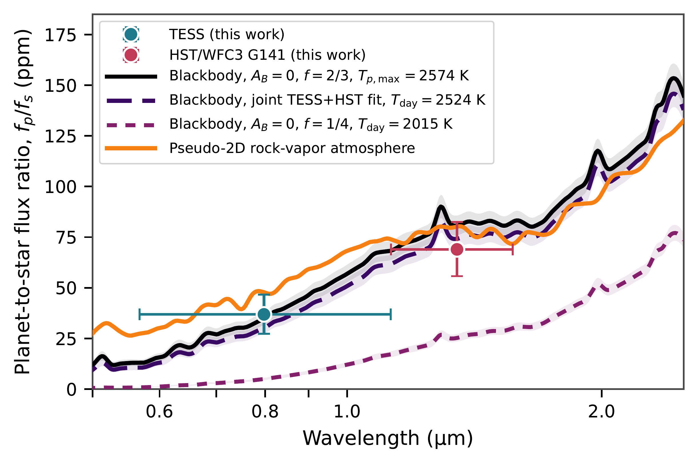
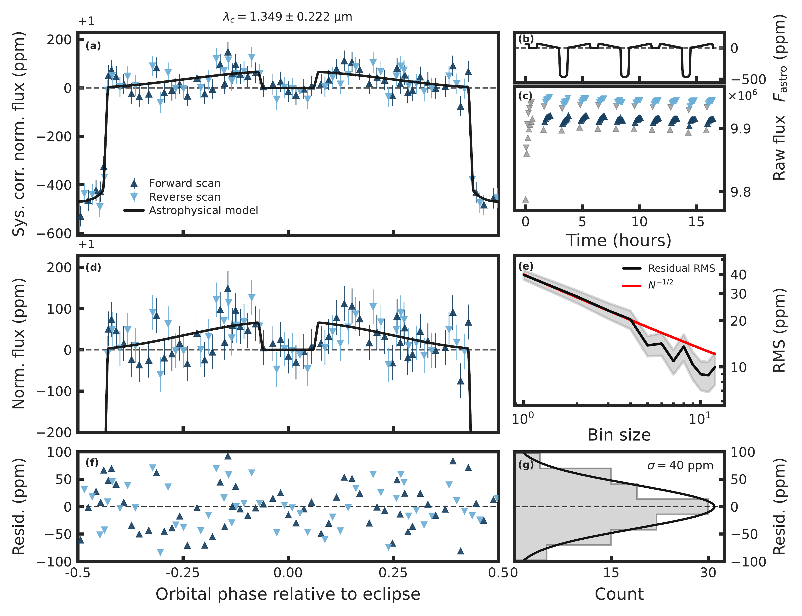
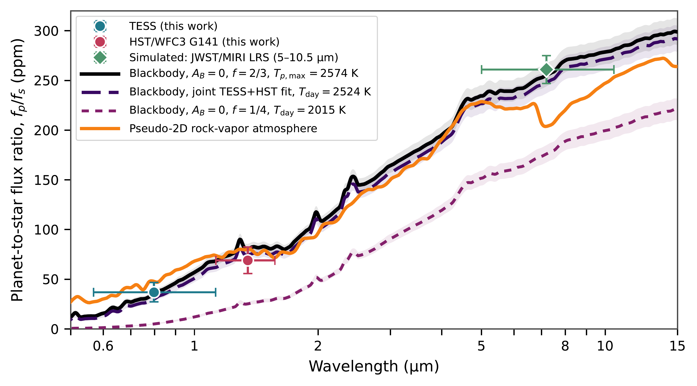

$\newcommand{\ensuremath}{}$
$\newcommand{\xspace}{}$
$\newcommand{\object}[1]{\texttt{#1}}$
$\newcommand{\farcs}{{.}''}$
$\newcommand{\farcm}{{.}'}$
$\newcommand{\arcsec}{''}$
$\newcommand{\arcmin}{'}$
$\newcommand{\ion}[2]{#1#2}$
$\newcommand{\textsc}[1]{\textrm{#1}}$
$\newcommand{\hl}[1]{\textrm{#1}}$
$\newcommand{\footnote}[1]{}$
$\newcommand{\fpfsTESSobs}{\ensuremath{37\pm10 \mathrm{ppm}}}$
$\newcommand{\fpfsHSTobs}{\ensuremath{69^{+14}_{-13} \mathrm{ppm}}}$
$\newcommand{\tbTESS}{\ensuremath{2566^{+94}_{-110} \mathrm{K}}}$
$\newcommand{\rTESS}{\ensuremath{0.996^{+0.039}_{-0.044}}}$
$\newcommand{\tbHST}{\ensuremath{2497^{+110}_{-119} \mathrm{K}}}$
$\newcommand{\rHST}{\ensuremath{0.970^{+0.044}_{-0.048}}}$
$\newcommand{\tbjoint}{\ensuremath{2524^{+77}_{-84} \mathrm{K}}}$
$\newcommand{\rjoint}{\ensuremath{0.980^{+0.032}_{-0.034}}}$
$\newcommand{\tbjointAgone}{\ensuremath{2407^{+91}_{-102} \mathrm{K}}}$
$\newcommand{\tpmax}{\ensuremath{2574^{+36}_{-35} \mathrm{K}}}$
$\newcommand{\tfullred}{\ensuremath{2015^{+28}_{-27} \mathrm{K}}}$
$\newcommand{\reflcoeff}{\ensuremath{105\pm6 \mathrm{ppm}}}$
$\newcommand{\reflAgone}{\ensuremath{11 \mathrm{ppm}}}$
$\newcommand{\flower}{\ensuremath{0.453}}$
$\newcommand{\ABupper}{\ensuremath{0.320}}$
$\newcommand{\fstarTESS}{\ensuremath{41.6\%}}$
$\newcommand{\fstarHST}{\ensuremath{21.3\%}}$
$\newcommand{\fstarTESSHST}{\ensuremath{62.9\%}}$
$\newcommand{\fstarTESSHSTfrac}{\ensuremath{0.629}}$
$\newcommand{\ABAgfactor}{\ensuremath{0.944}}$
$\newcommand{\fpfsTESSmax}{\ensuremath{38^{+4}_{-3} \mathrm{ppm}}}$
$\newcommand{\fpfsHSTmax}{\ensuremath{79\pm5 \mathrm{ppm}}}$
$\newcommand{\fpfsMIRIsim}{\ensuremath{261\pm14 \mathrm{ppm}}}$
$\newcommand{\miriPrecision}{\ensuremath{14 \mathrm{ppm}}}$

# The First Hubble Detection of a Secondary Eclipse from a Rocky Exoplanet: the 5.4-hour planet TOI-2431 b

<mark>Appeared on: 2026-09-29</mark> -  _Accepted for publication in ApJL on September 25, 2026; 21 pages, 9 figures, 2 tables_

S. Zieba, et al. -- incl., <mark>L. Kreidberg</mark>, <mark>I. J. M. Crossfield</mark>

**Abstract:** We present an HST/WFC3 G141 phase-curve observation of the ultra-short-period rocky planet TOI-2431 b and detect its secondary eclipse in the near infrared. Combined with the TESS optical eclipse, these measurements constrain the planet's dayside brightness temperature, reflected light contribution, albedo, and heat redistribution.We detect the eclipse in the optical and near infrared wavelengths of TESS and HST/WFC3 G141, with a planet-to-star flux ratio of $\fpfsTESSobs$ and $\fpfsHSTobs$ , respectively.Assuming negligible reflected light, the joint TESS+HST fit yields a brightness temperature $T_{b,\rm joint} = \tbjoint$ and a brightness temperature ratio of $\mathcal{R}_{\rm joint}=T_{b,\rm joint}/T_{p,\max}=\rjoint$ consistent with the zero-albedo, no-redistribution limit $T_{p,\max} = \tpmax$ .The HST phase curve is consistent with zero nightside emission and no measurable hotspot offset, consistent with inefficient day-night heat distribution.Under this thermal-dominated interpretation, TOI-2431 b lies at the zero-albedo, no-redistribution limit and contrasts with previously observed lava worlds.At optical and near-infrared wavelengths, however, thermal emission is degenerate with reflected light.For a geometric albedo of $A_g=0.1$ , reflected light would contribute approximately $\reflAgone$ in each bandpass, reducing the temperature to $T_{b,\rm joint}(A_g=0.1) = \tbjointAgone$ .Longer-wavelength observations are required to isolate the thermal component.Planned JWST/MIRI LRS observations are expected to substantially reduce this degeneracy and provide more direct constraints on heat redistribution and possible silicate-atmosphere spectral features.This marks the first secondary eclipse detection of a rocky exoplanet using HST and establishes TOI-2431 b as a benchmark target for studying properties of lava worlds.

**Figure 1. -** Measured planet-to-star flux ratios of TOI-2431 b in the TESS and HST/WFC3 G141 bandpasses compared with blackbody planetary emission models. The blue and red circles show the measured TESS and HST eclipse depths, respectively. The solid black curve shows the zero Bond albedo, no-redistribution model \(f=2/3\) and \(T_{p,\max}=$\tpmax$\). The long-dashed curve shows the joint TESS+HST thermal-only blackbody solution, with \(T_{\rm day}=$\tbjoint$\). The short-dashed curve shows the zero-albedo, full-redistribution limit \(f=1/4\) and \(T_{\rm day}=$\tfullred$\). The shaded region around these models shows the uncertainty in this prediction, propagated from the stellar and orbital parameters. The orange curve shows the disk-integrated pseudo-2D rock-vapor atmosphere forward model described in Section \ref{pseudo2Dmodeling}. For the blackbody cases, the planet is treated as a blackbody. Any spectral features in these predicted planet-to-star flux ratios therefore arise from the stellar spectrum. (*fig:spectrum*)

**Figure 6. -** HST/WFC3 G141 white-light phase curve of TOI-2431 b, covering 1.127--1.570 \micron. For all subplots, we show the unbinned integrations with their 1$\sigma$ error bars that have been rescaled with a multiplicative factor to account for under- or overestimation of the pipeline's integration uncertainties. Note that panels (a), (d), and (f) are phase-folded. (a) Systematics-corrected, normalized, and phase-folded light curve, with the secondary eclipse centered at phase zero. Dark-blue upward triangles and light-blue downward triangles denote forward and reverse spatial scans, respectively, and the black curve shows the best-fitting astrophysical model. (b) The best-fitting astrophysical model, $F_{\rm astro}$, as a function of time since the first observed integration. (c) Uncorrected extracted \texttt{PACMAN} white-light flux. Grey points indicate observations that were removed in the fitting stage following previous work, because they are either in the first orbit or the first forward or reverse scan in an orbit. (d) Zoom in on panel (a), showing the phase variation and secondary eclipse. In panels (a) and (d), the horizontal dashed line denotes the stellar baseline flux. (e) RMS of the residuals as a function of temporal bin size. The black curve shows the measured RMS, the gray region its uncertainty, and the red curve the $N^{-1/2}$ expectation for uncorrelated noise, normalized to the unbinned residual RMS. (f) Residuals from the best-fitting light-curve model. (g) Distribution of the residuals; the black curve shows a Gaussian with $\sigma$=40 ppm, which corresponds to the standard deviation of the best-fitting residuals. (*fig:hst_lc*)

**Figure 8. -** Predicted emission spectrum of TOI-2431 b from the optical to the JWST/MIRI LRS wavelength range. The TESS and HST measurements and the three blackbody models are the same as in Figure \ref{fig:spectrum}, but are extended here to the mid-infrared. The green diamond shows a simulated MIRI LRS broadband eclipse measurement assuming $A_g=0$ and $T_{\rm day}=T_{p,\max}$ and limiting the analysis to the 5--10.5 \micron interval leading to $\fpfsMIRIsim$. Unlike the single broadband point shown here, MIRI LRS provides spectroscopic information across this wavelength range giving the opportunity to search for features caused by a rock vapor atmosphere. (*fig:miri_spectrum*)

