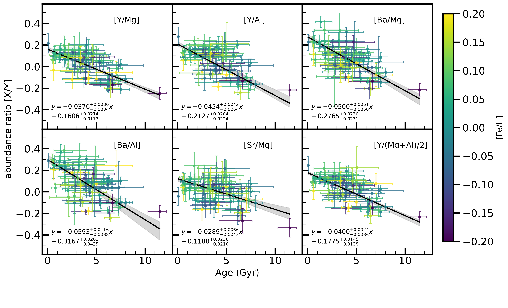
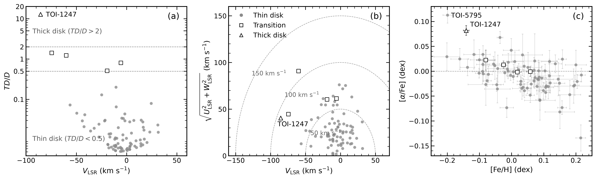
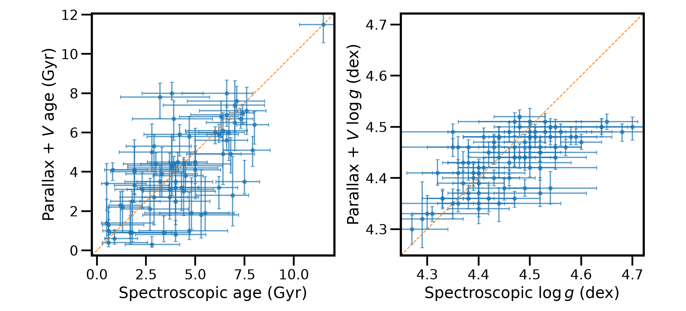

$\newcommand{\ensuremath}{}$
$\newcommand{\xspace}{}$
$\newcommand{\object}[1]{\texttt{#1}}$
$\newcommand{\farcs}{{.}''}$
$\newcommand{\farcm}{{.}'}$
$\newcommand{\arcsec}{''}$
$\newcommand{\arcmin}{'}$
$\newcommand{\ion}[2]{#1#2}$
$\newcommand{\textsc}[1]{\textrm{#1}}$
$\newcommand{\hl}[1]{\textrm{#1}}$
$\newcommand{\footnote}[1]{}$

# Planets Around Solar Twins/Analogs (PASTA) III: Chemical Clock Relations in Planet-Hosting Solar Analogs

<mark>Appeared on: 2026-09-29</mark> -  _11 pages; accepted in Astronomy & Astrophysics_

Q. Sun, et al. -- incl., <mark>Y.-S. Ting</mark>

**Abstract:** Abundance ratios between elements synthesized on different nucleosynthetic timescales provide empirical chemical clocks for estimating stellar ages, but robust calibrations require homogeneous samples with precise stellar parameters and elemental abundances. We aim to investigate whether the presence of planets modifies empirical chemical clock relations. We present high-precision stellar parameters and elemental abundances for 52 new planet-hosting targets observed with Keck/HIRES, LBT/PEPSI, and Subaru/HDS. Combined with PASTA I and II, the full sample comprises 94 stars, of which 81 are identified as planet-hosting solar twins and analogs, and is used to characterize Galactic chemical evolution and derive empirical chemical clock relations. We recover the expected Galactic chemical evolution trends, with $\alpha$ -elements such as Mg and S increasing with stellar age, while $s$ -process elements such as Y, Ba, and Sr show negative age correlations. In contrast, Fe-peak elements and the $r$ -process element Eu show little or no significant age dependence. These trends give rise to tight chemical clock relations based on [ Y/Mg ] , [ Y/Al ] , [ Ba/Mg ] , [ Ba/Al ] , and [ Sr/Mg ] , with [ Y/Mg ] and [ Y/Al ] providing the strongest correlations. [ Ba/Al ] shows the steepest age dependence, and the Ba-based ratios are generally more sensitive to age than their Y-based counterparts. Planet-hosting solar analogs follow chemical-clock relations consistent with those of nearby solar twins, with no evidence for a significant planet-related effect. The derived relations are primarily applicable to local solar twins and analogs in the Galactic thin disk.

**Figure 4. -** Chemical clock relations for planet-hosting solar analogs, showing abundance ratios as a function of stellar age for [Y/Mg], [Y/Al], [Ba/Mg], [Ba/Al], [Sr/Mg], and [Y/$(\mathrm{Mg}+\mathrm{Al})/2$]. Data points are color-coded by metallicity ([Fe/H]). Black lines show best-fit linear relations derived using Deming regression, accounting for uncertainties in both variables, and shaded regions indicate 1$\sigma$ confidence intervals. All abundance ratios show statistically significant correlations with stellar age. (*fig:clock*)

**Figure 5. -** Kinematic and chemical properties for the 81 planet-hosting solar
		twins and analogs in PASTA. Panel (a) shows the thick-to-thin disk probability ratio, $TD/D$, as a function of $V_{\rm LSR}$, with the dashed horizontal lines at $TD/D=0.5$ and 2 separating the thin-disk, transition, and thick-disk populations. Panel (b) shows the Toomre diagram, $\sqrt{U_{\rm LSR}^{2}+W_{\rm LSR}^{2}}$ versus $V_{\rm LSR}$; the dashed curves indicate constant total LSR velocities of 50, 100, and 150 km s$^{-1}$. Panel (c) shows [$\alpha$/Fe] as a function of [Fe/H], where the mean $\alpha$ abundance is calculated from Mg, Si, Ca, and Ti in linear abundance space. Circles, squares, and triangles denote thin-disk, transition, and thick-disk stars, respectively, based on their $TD/D$ probabilities. TOI-1247, the only thick-disk candidate in the sample, is labeled in all three panels. (*fig:kine*)

**Figure 1. -** Comparison of parallax-based and spectroscopic ages (left) and $\log g$ values (right) for the PASTA solar twins and analogs. The dashed lines indicate one-to-one agreement. (*fig:comp*)

