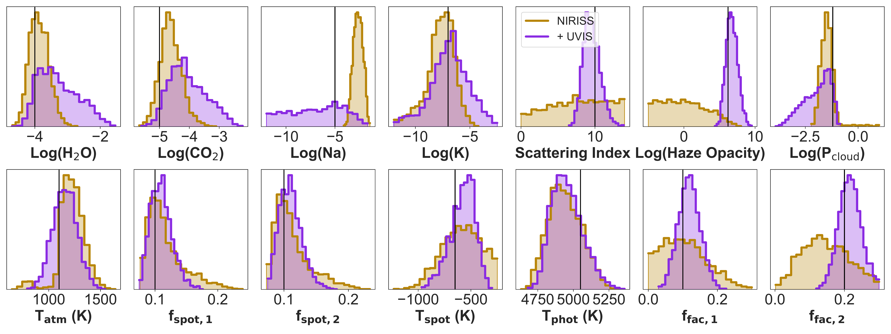
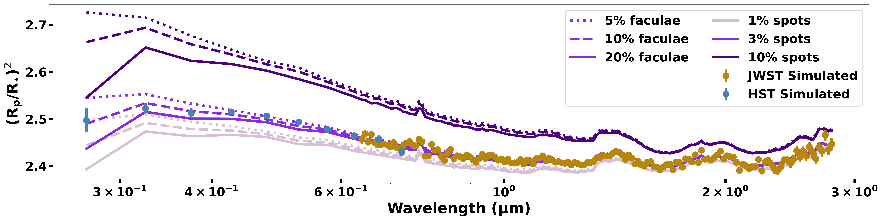
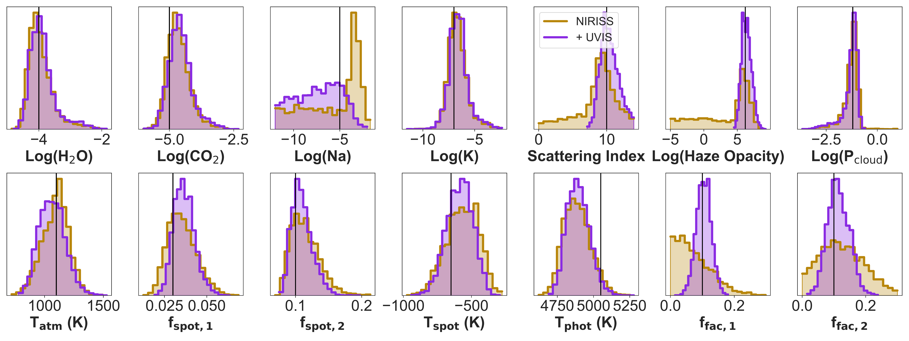

$\newcommand{\ensuremath}{}$
$\newcommand{\xspace}{}$
$\newcommand{\object}[1]{\texttt{#1}}$
$\newcommand{\farcs}{{.}''}$
$\newcommand{\farcm}{{.}'}$
$\newcommand{\arcsec}{''}$
$\newcommand{\arcmin}{'}$
$\newcommand{\ion}[2]{#1#2}$
$\newcommand{\textsc}[1]{\textrm{#1}}$
$\newcommand{\hl}[1]{\textrm{#1}}$
$\newcommand{\footnote}[1]{}$
$\newcommand{\thebibliography}{\DeclareRobustCommand{\VAN}[3]{##3}\VANthebibliography}$

# K-dwarf starspot hunters: how to directly characterize spot and faculae properties with UV-IR panchromatic transit spectra

<mark>Appeared on: 2026-09-29</mark> -  _11 pages, 7 figures, submitted to RASTI_

J. K. Barstow, et al. -- incl., <mark>E.-M. Ahrer</mark>, <mark>C. Vidante</mark>

**Abstract:** Transmission spectroscopy of exoplanets provides an important window into their atmospheric composition, structure and dynamics, especially in the JWST era. As the quality of the observational data and therefore the precision of our constraints improves, we become increasingly sensitive to sources of systematic bias in our models and observations. One significant example of this is the Transit Light Source Effect, in which heterogeneous features in the stellar photosphere -- spots and faculae -- imprint additional spectral signatures onto exoplanet transmission spectra. The effects of this stellar contamination must be accounted for or removed in order to accurately recover the planet's atmospheric properties. Including parameterized models of spots and faculae within spectral retrieval analysis is increasingly adopted as a solution to this problem, but is limited by the accuracy of models of stellar spectra. In this paper, we outline an observational strategy combining simultaneous data from JWST and the Hubble Space Telescope that would enable us to further constrain these models. We perform synthetic retrievals to demonstrate how we could constrain starspot and faculae parameters; we test the impact of using different model spectra in the retrieval; and we consider the impact of variable stellar activity on coadding transits to achieve the desired signal-to-noise. We find that ultraviolet and optical wavelengths are key for breaking degeneracies between stellar contamination and planetary parameters.

**Figure 2. -** This figure shows a comparison across two synthetic retrievals, performed on spectra with [10\%, 10\%] spots and [10\%, 20\%] faculae respectively, with (purple) and without (gold) UVIS . The input values are indicated by vertical lines. The constraints on the haze properties, starspot temperature and starspot/faculae coverage fractions dramatically improve with the addition of the UVIS data (purple posteriors), whilst the constraints on the gas abundances and cloud top pressure become less precise. (*figure:69_uvis_niriss*)

**Figure 1. -** This figure shows the 3$\times$3 synthetic spectra generated from different combinations of starspot and faculae models. The shade of purple corresponds to the spot coverage fraction, with darker shades indicating more spots, whilst the linestyle denotes the facular coverage fraction, with more solid lines corresponding to higher facular coverage. The spectra are shown at the resolution of simulated Hubble WFC3/UVIS G280 and JWST NIRISS/SOSS observations that would have the appropriate signal-to-noise for a single transit observation. The gold and blue points show simulated data, including normally distributed noise, for the 10\% faculae, 3\% spots case.  (*figure:synthetics*)

**Figure 3. -** As Figure \ref{figure:69_uvis_niriss}, performed on spectra with [3\%, 10\%] spots and [10\%, 10\%] faculae respectively. (*figure:56_uvis_niriss*)

