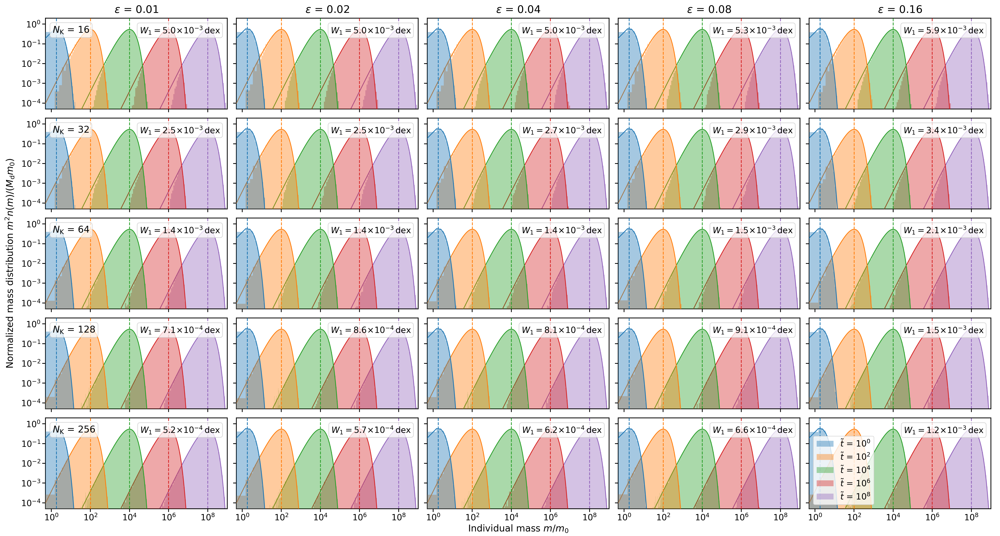
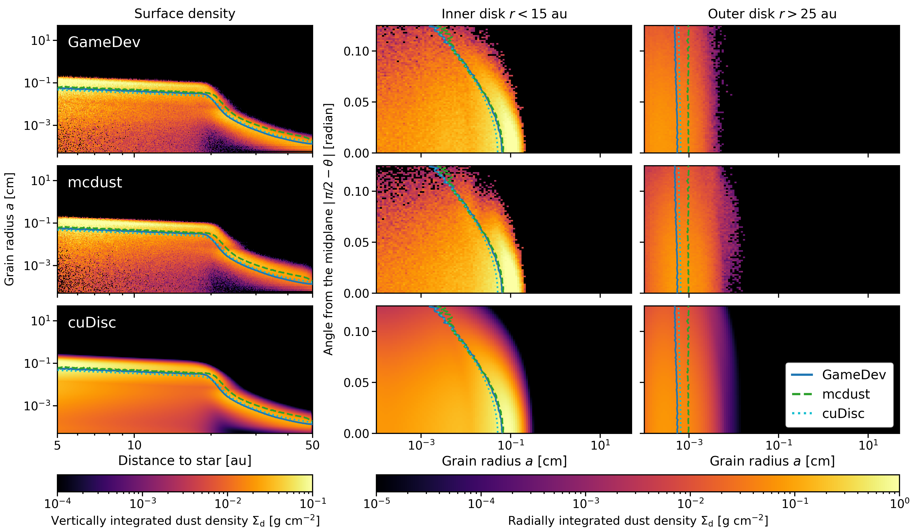
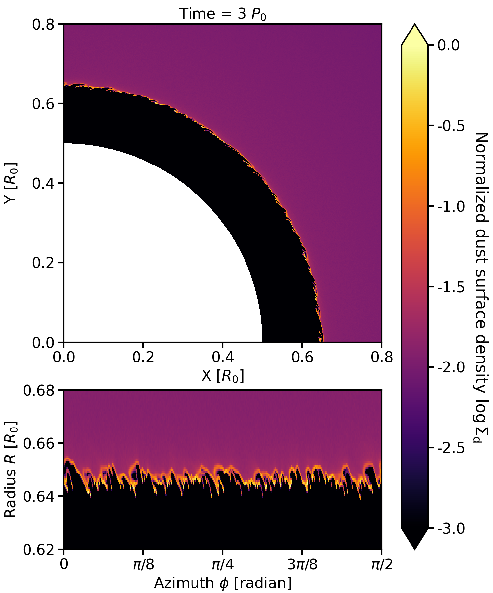

$\newcommand{\ensuremath}{}$
$\newcommand{\xspace}{}$
$\newcommand{\object}[1]{\texttt{#1}}$
$\newcommand{\farcs}{{.}''}$
$\newcommand{\farcm}{{.}'}$
$\newcommand{\arcsec}{''}$
$\newcommand{\arcmin}{'}$
$\newcommand{\ion}[2]{#1#2}$
$\newcommand{\textsc}[1]{\textrm{#1}}$
$\newcommand{\hl}[1]{\textrm{#1}}$
$\newcommand{\footnote}[1]{}$
$\newcommand{\arraystretch}{1.15}$
$\newcommand{\arraystretch}{1}$

# GameDev: GPU-accelerated model for dust evolution

<mark>Appeared on: 2026-09-30</mark> -  _23 pages, 13 figures, submitted to A&A. Comments and requests are welcome. The code is available at this https URL_

<mark>J. Bi</mark>

**Abstract:** Grain growth and fragmentation through dust collisions in protoplanetary disks are strongly coupled with dust dynamics. This is because the spatial and velocity distributions of dust set the collision rates and outcomes, while dust grain sizes set the aerodynamic coupling with gas. However, existing dust evolution codes often rely on prescribed dust velocities and are mostly restricted to one or two spatial dimensions. In this work, we present \texttt{GameDev} , a dust evolution model accelerated by graphics processing units (GPUs) that couples independently evolved three-dimensional dust dynamics with Monte Carlo collisional evolution of dust. In \texttt{GameDev} , we model dust as Lagrangian representative particles in a prescribed gas disk. We integrate particle trajectories with the staggered semi-analytic method, which remains accurate for both tightly and weakly coupled dust grains. We estimate collision rates from each particle's nearest neighbors rather than on a grid, preventing physically close particles from being excluded from collision sampling because they lie across a grid boundary. Most importantly, we sample collision events against neighborhoods that remain frozen over adaptive intervals, enabling massive parallelization across particles. These implementations make \texttt{GameDev} an accurate and efficient tool for studying dust evolution in protoplanetary disks. \texttt{GameDev} supports both NVIDIA CUDA and AMD ROCm platforms, provides a smaller-scale standalone Eulerian dust fluid model, and is publicly available on GitHub.

**Figure 10. -** 
    Normalized grain-mass distributions in the constant-kernel test for all combinations of $N_{\rm K}$(rows) and $\varepsilon$(columns). Shaded histograms show one repetition and solid curves show the analytical solutions at $\tilde{t} = 10^0, 10^2, \dots, 10^8$. Vertical dashed lines mark the analytical peak masses $m_{\rm peak}$. Each panel lists $W_1$ at the final snapshot, averaged over ten repetitions.
 (*fig:coag_const*)

**Figure 7. -** 
    Partial reproduction of Fig. 14 of [Eriksson, et. al (2026)](https://ui.adsabs.harvard.edu/abs/2026MNRAS.549ag982E) for the strong-turbulence model with $\alpha = 10^{-3}$ at $t = 11{,}100$ yr, showing \texttt{GameDev}(top), \texttt{mcdust}(middle), and \texttt{cuDisc}(bottom, at $t = 11{,}134$ yr). Left: vertically integrated surface density of dust per grain-size bin as a function of the distance to the star. Middle and right: radially integrated surface density of dust per grain-size bin as a function of the angle from the midplane in the inner ($r < 15$ au) and outer ($r > 25$ au) disk. Lines show the mass-weighted mean radius of grains in each model and are overplotted in all rows for comparison.
 (*fig:e26_1*)

**Figure 3. -** 
    Dust surface density in the particle model of the photospheric instability at $t = 3P_0$. Top: inner part of the simulated sector in Cartesian coordinates. Bottom: inner edge of the dust disk in the $R$--$\phi$ plane across the full sector.
 (*fig:psi*)

