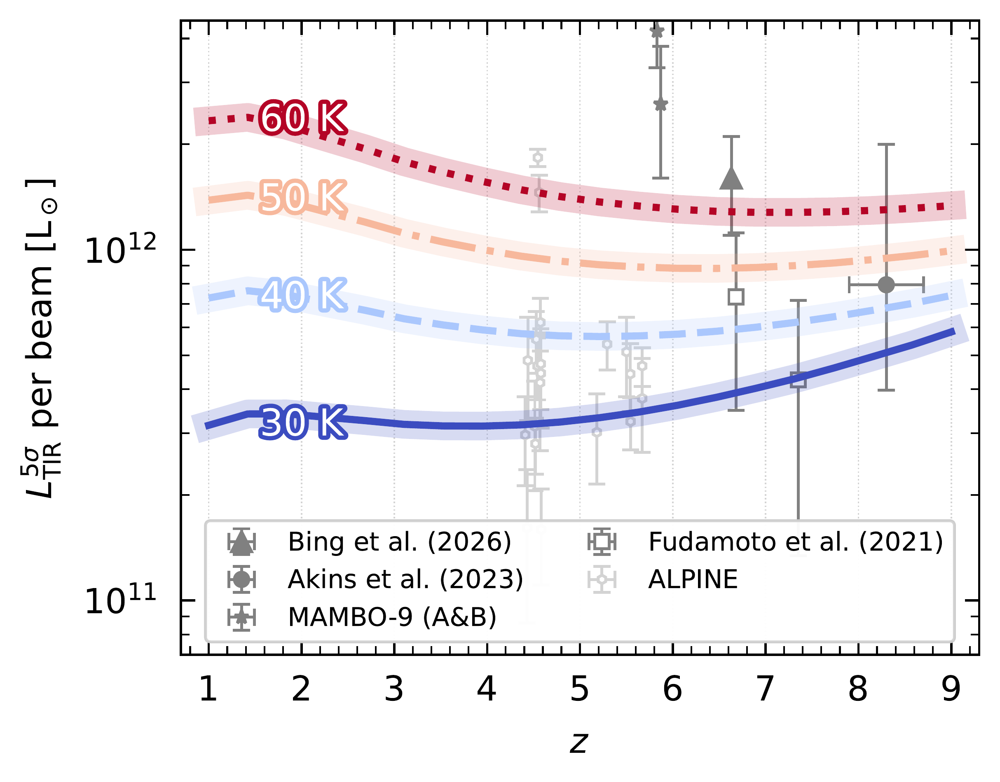
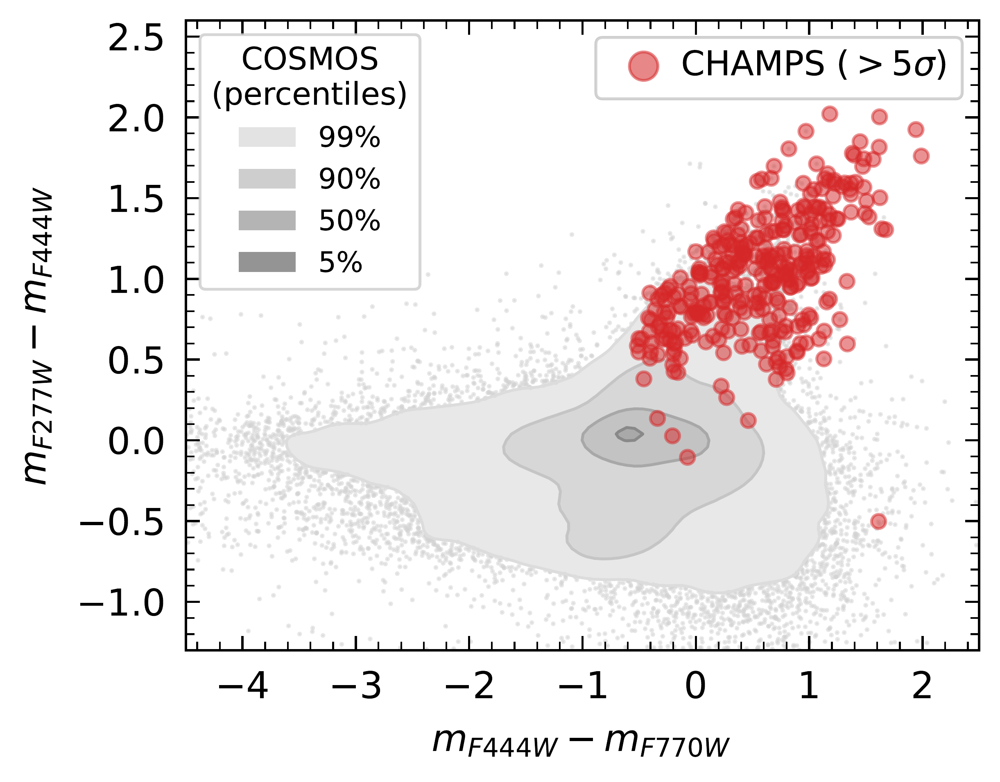
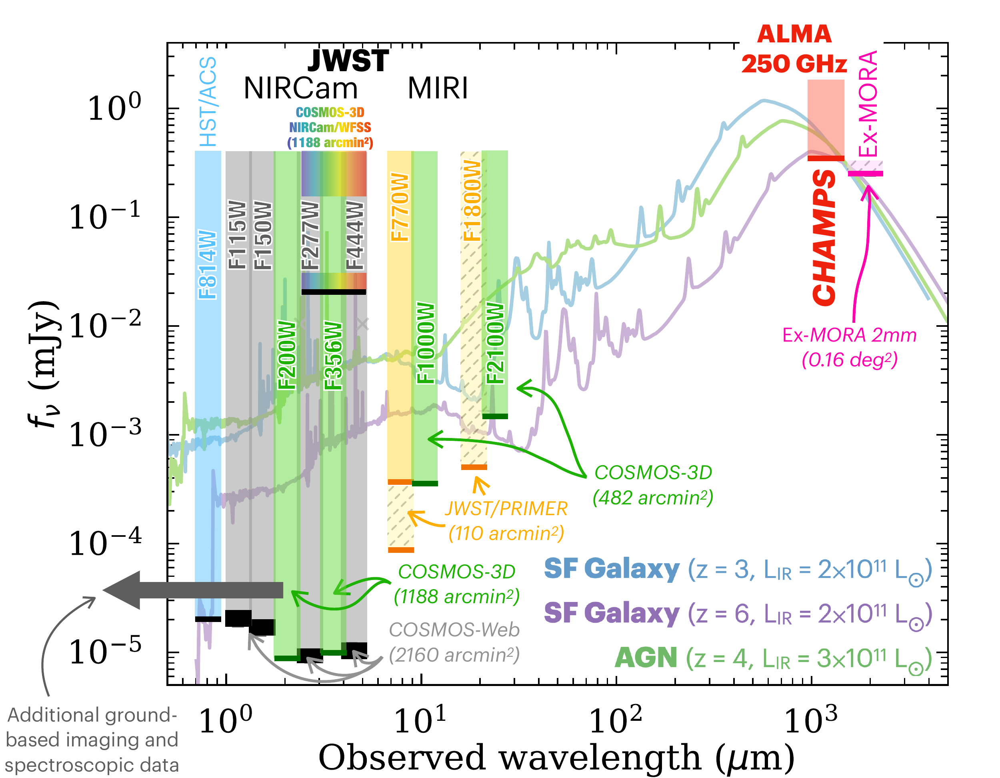
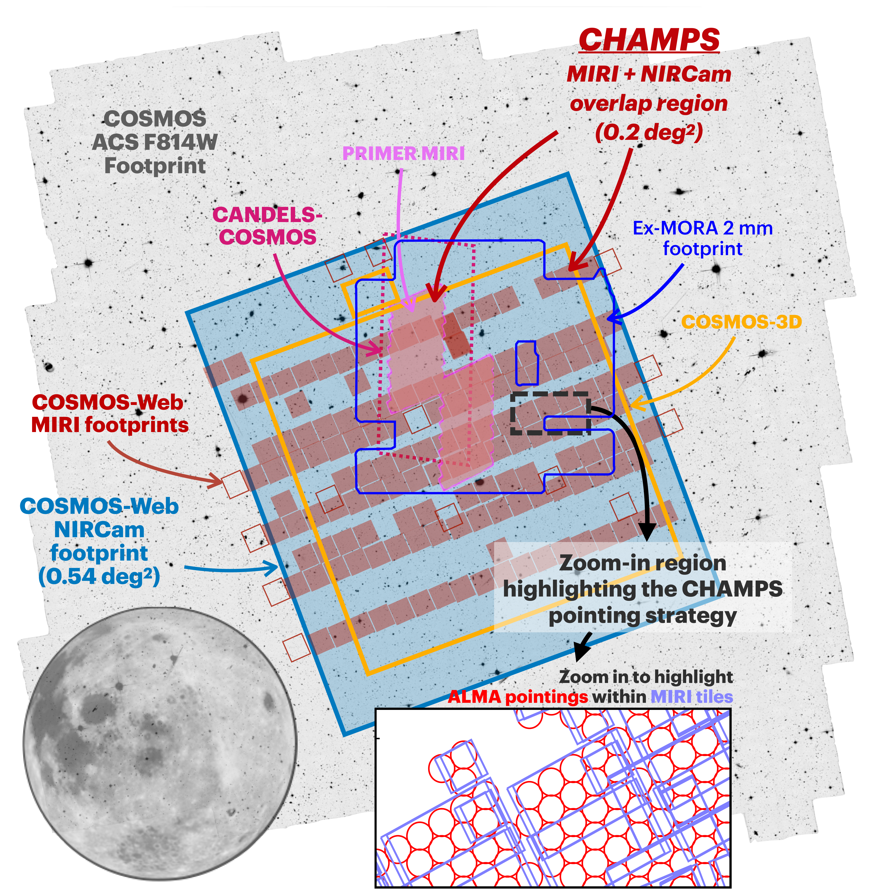
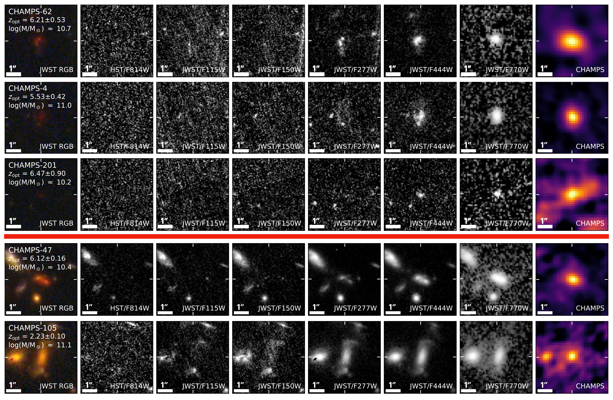

$\newcommand{\ensuremath}{}$
$\newcommand{\xspace}{}$
$\newcommand{\object}[1]{\texttt{#1}}$
$\newcommand{\farcs}{{.}''}$
$\newcommand{\farcm}{{.}'}$
$\newcommand{\arcsec}{''}$
$\newcommand{\arcmin}{'}$
$\newcommand{\ion}[2]{#1#2}$
$\newcommand{\textsc}[1]{\textrm{#1}}$
$\newcommand{\hl}[1]{\textrm{#1}}$
$\newcommand{\footnote}[1]{}$
$\newcommand{\vdag}{(v)^\dagger}$
$\newcommand\aastex{AAS\TeX}$
$\newcommand\latex{La\TeX}$
$\newcommand{\A}{\text{\normalfontÅ}}$
$\newcommand{\red}[1]{{\bf\textcolor{red}{#1}}}$
$\newcommand{\blue}[1]{{\bf\textcolor{blue}{#1}}}$
$\newcommand{\comment}[1]{{\bf\textcolor{blue}{[#1]}}}$
$\newcommand\textlcsc[1]{\textsc{\MakeLowercase{#1}}}$
$\newcommand{\ergPerSecondPerCM}{{\rm erg} {\rm s}^{-1}{\rm cm}^{-2}}$
$\newcommand{\ergPerSecond}{{\rm erg} {\rm s}^{-1}}$
$\newcommand\champs{{\large \textsc{champs}}}$
$\newcommand\hbeta{H\beta}$
$\newcommand\ebmv{E(B-V)}$
$\newcommand\ebmvs{ E_{s}{\rm (B-V)} }$
$\newcommand\ebmvn{ E_{n}{\rm (B-V)} }$
$\newcommand\halpha{H\alpha}$
$\newcommand\hgamma{H\gamma}$
$\newcommand\Msol{{M}_{\odot}}$
$\newcommand\Mstell{{M}_{\star}}$
$\newcommand\Lsol{{\rm L}_{\odot}}$
$\newcommand\Zsol{{\rm Z}_{\odot}}$
$\newcommand\Msolyr{{\rm M_{\odot} yr^{-1}}}$
$\newcommand\logm{\log(M/\Msol)}$
$\newcommand\lya{Ly\alpha}$
$\newcommand\ewha{{\rm EW}({\rm H}\alpha)}$
$\newcommand\ewlya{{\rm EW}({\rm Ly}\alpha)}$
$\newcommand\h{2}$
$\newcommand\oabund{12+\log({\rm O/H})}$
$\newcommand\kms{{\rm km s}^{-1}}$
$\newcommand\myr{{\rm Myr}}$
$\newcommand\dex{{\rm dex}}$
$\newcommand\gyr{{\rm Gyr}}$
$\newcommand\hbeta{H\beta}$
$\newcommand\halpha{H\alpha}$
$\newcommand\sii{[\ion{S}{2}]}$
$\newcommand\siii{\ion{Si}{2}}$
$\newcommand\siiii{\ion{Si}{3}}$
$\newcommand\siiv{\ion{Si}{4}}$
$\newcommand\cii{\ion{C}{2}}$
$\newcommand\Cii{[\ion{C}{2}]}$
$\newcommand\cplus{[\ion{C}{2}]}$
$\newcommand\niiha{[N{\scriptsize ~II}]/H\alpha}$
$\newcommand\lniiha{\log([N{\scriptsize ~II}]/H\alpha)}$
$\newcommand\niiniiha{[N{\scriptsize ~II}]/([N{\scriptsize ~II}]+H\alpha)}$
$\newcommand\niiniihatot{[N{\scriptsize ~II}]/([N{\scriptsize ~II}]+H\alpha)_{\rm tot}}$
$\newcommand\niipha{([N{\scriptsize ~II}]+H\alpha)}$
$\newcommand\niiphatot{([N{\scriptsize ~II}]+H\alpha)_{\rm tot}}$
$\newcommand\oiiihb{[O{\scriptsize ~III}]/H\beta}$
$\newcommand\oiiiha{[O{\scriptsize ~III}]/H\alpha}$
$\newcommand\loiiihb{\log([O{\scriptsize ~III}]/H\beta)}$
$\newcommand\civ{\ion{C}{4}}$
$\newcommand\oi{[\ion{O}{1}]}$
$\newcommand\oii{[\ion{O}{2}]}$
$\newcommand\oiii{[\ion{O}{3}]}$
$\newcommand\heii{\ion{He}{2}}$
$\newcommand\feii{\ion{Fe}{2}}$
$\newcommand\aliii{\ion{Al}{3}}$
$\newcommand\nii{[\ion{N}{2}]}$
$\newcommand\hii{\ion{H}{2}}$
$\newcommand\aco{\alpha_{{\rm CO}}}$
$\newcommand\Ga{\textit{GALEX0959+0151}}$
$\newcommand\Gb{\textit{GALEX1000+0157}}$
$\newcommand\Gc{\textit{GALEX1000+0201}}$
$\newcommand\Gaa{GALEX0959+0151}$
$\newcommand\Gbb{GALEX1000+0157}$
$\newcommand\Gcc{GALEX1000+0201}$
$\newcommand\CO{CO(1-0)}$
$\newcommand\fesc{f_{{\rm esc}}}$
$\newcommand\mgas{M_{{\rm gas}}}$
$\newcommand\fgas{f_{{\rm gas}}}$
$\newcommand\LIR{L_{{\rm IR}}}$
$\newcommand\LFIR{L_{{\rm FIR}}}$
$\newcommand\LUV{L_{{\rm UV}}}$
$\newcommand\LHA{L_{{\rm H\alpha}}}$
$\newcommand\DLHA{\Delta\log(L_{{\rm H\alpha}})}$
$\newcommand\LCO{L_{{\rm CO}}}$
$\newcommand\LCII{L_{{\rm CII}}}$
$\newcommand\logLha{\log(L_{\rm H\alpha})}$
$\newcommand\logL{\log(L)}$
$\newcommand\IRXB{IRX-\beta}$
$\newcommand\dn{4000}$
$\newcommand\flya{f_{\rm Ly\alpha}}$
$\newcommand\iracA{[3.6 {\rm \mu m}]-[4.5 {\rm \mu m}]}$
$\newcommand\iracB{[4.5 {\rm \mu m}]-[5.8 {\rm \mu m}]}$
$\newcommand\fion{f^{\rm ion}_{\rm esc}}$
$\newcommand\xiion{\xi_{\rm ion}}$
$\newcommand\wone{\textit{W1}}$
$\newcommand\WISE{\textit{WISE}}$
$\newcommand\NEOWISE{\textit{NEOWISE}}$
$\newcommand\wtwo{\textit{W2}}$
$\newcommand\x{\times}$
$\newcommand\Rtwothree{([\ion{O}{3}]_{\rm 5007} + [\ion{O}{3}]_{\rm 4959} + [\ion{O}{2}]_{\rm 3727})/H\beta}$
$\newcommand\Rthree{([\ion{O}{3}]_{\rm 5007} + [\ion{O}{3}]_{\rm 4959})/H\beta}$
$\newcommand\Rtwo{[\ion{O}{2}]_{\rm 3727}/H\beta}$
$\newcommand\Othreetwo{[\ion{O}{3}]_{\rm 5007}/[\ion{O}{2}]_{\rm 3727}}$
$\newcommand\Ntwo{[\ion{N}{2}]_{\rm 6585}/H\alpha}$
$\newcommand\Stwo{([\ion{S}{2}]_{\rm 6732} + [\ion{S}{2}]_{\rm 6718})/H\alpha}$
$\newcommand\SR{[\ion{S}{2}]_{\rm 6732}/[\ion{S}{2}]_{\rm 6718}}$
$\newcommand\Toii{T_e({\rm O^{+} })}$
$\newcommand\Toiii{T_e({\rm O^{++} })}$

# CHAMPS: The COSMOS High-Redshift ALMA-MIRI Population Survey --\\A New Census of the Dusty Early Universe

<mark>Appeared on: 2026-09-30</mark> -  _15 pages, 10 figures, submitted to ApJ_

A. L. Faisst, et al. -- incl., <mark>K. Jahnke</mark>

**Abstract:** Understanding how dust forms and evolves over cosmic time is a key open problem in extragalactic astrophysics.Galaxies in the early Universe were once thought to be mostly dust-poor, but recent discoveries of heavily dust-obscured galaxies near the Epoch of Reionization challenge models of early dust production and raise new questions about the true cosmic star formation rate density.In this paper, we present the $* COSMOS High-Redshift ALMA-MIRI Population Survey*$ ( $\champs$ ), which sheds light on the dusty early universe at $z>4$ . $\champs$ is a new 144h ALMA $1.2 {\rm mm}$ (band 6) large program mapping the combined JWST/NIRCam $+$ MIRI footprint in the COSMOS field. It covers $0.2 {\rm deg^2}$ with a synthesized beam size of $1.1\arcsec$ and a sensitivity of $0.14 {\rm mJy/beam}$ . It is complemented, alongside JWST, by ancillary X-ray, UV, optical, sub-mm, and radio data. $\champs$ , optimized as a blind survey, detects above $5\sigma$ approximately $385$ individual dusty high-redshift sub-mm sources, $68$ dusty AGN, and a dozen dusty galaxies at $z>6$ . The galaxies are largely not detected in JWST/F150W, making them prototypical near-IR dark galaxies.We showcase three of the highest-redshift most dusty and massive candidate galaxies detected in $\champs$ with redshifts up to $z\approx7.5$ . $\champs$ also enables stacks of thousands of galaxies grouped in bins of various physical parameters. Its sub-mm coverage of dust-attenuated JWST-identified galaxies provides robust constraints on dust masses and obscured star formation rates to study early dust formation and evolution.In addition, $\champs$ enables a blind search for luminous CO line emitters at $z=0.4$ – $2.7$ and $\Cii$ $_{\rm 158\mu m}$ emitters at $z\approx6.7$ .

**Figure 7. -** * Left:* Estimated $5\sigma$ total IR luminosity limits (per synthesized beam) as a function of redshift and dust temperature ($30 {\rm K}-60 {\rm K}$).
Also shown are measurements from ALPINE \citep[open circles;][]{bethermin20}, two serendipitously detected near-IR dark galaxies from REBELS \citep[empty squares;][]{fudamoto21}, one of the dust-obscured JWST/MIRI-detected massive galaxies from [Akins, et. al (2023)](https://ui.adsabs.harvard.edu/abs/2023ApJ...956...61A)(solid circle), and a ALMA-detected near-IR dark galaxy from [Bing, et. al (2026)](https://ui.adsabs.harvard.edu/abs/2026MNRAS.549ag846B)(filled triangle).
* Right:* Color-color parameter space probed by \champs detections ($>5\sigma$, red) compared to the galaxies detected in COSMOS-Web at similar redshifts (gray, contours cover 5, 50, 90, and $99\%$ of galaxies). The majority of \champs detections exhibit significantly redder colors than $\approx99\%$ of the galaxies detected with JWST. This figure is equivalent to the one presented in [Zavala, et. al (2026)](https://ui.adsabs.harvard.edu/abs/2026ApJ...998L..36Z).
 (*fig:sensitivity*)

**Figure 6. -** * Left:* Overview of the spectral coverage showing \champs (red, $1.2 {\rm mm}$) as well as other observations from Hubble, JWST, and ALMA. We show example SEDs of two star-forming galaxies (at $z=3$ and $z=6$) and an AGN at $z=4$ with varying total IR luminosities as indicated in the legend.
* Right:* Overview of the \champs sky coverage (red) compared to other observations from Hubble, JWST/NIRCam and MIRI, as well as ALMA. The inset focuses on a small region showcasing the pointing strategy of \champs to cover all JWST/MIRI observations from COSMOS-Web, PRIMER-COSMOS, and COSMOS-3D. The background shows the COSMOS ACS/F814W footprint  ([Koekemoer, et. al 2007](https://ui.adsabs.harvard.edu/abs/2007ApJS..172..196K))  with our Moon to scale.
 (*fig:coverage*)

**Figure 9. -** 
Cutouts of five example galaxies detected in \champs (all at $>5\sigma$). The top three show the top three reddest (and highest redshift) sources (see also Figure \ref{fig:dustmass}). The bottom two show lower redshift detections. Shown are the JWST/NIRCam RGB images (F150W-F277W-F444W; left), the JWST/NIRCam$+$MIRI cutouts (middle panels), and the \champs $1.2 {\rm mm}$ cutout (right). Optical redshifts (from COSMOS2025) are indicated on the left panels as well as their stellar masses. Optical$+$\champs redshifts and stellar masses are indicated on the right panels. Note the heavy dust attenuation of these galaxies, making them essentially invisible in Hubble optical imaging.
 (*fig:cutouts*)

