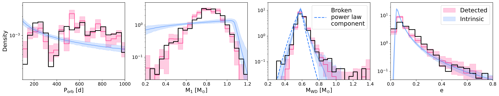
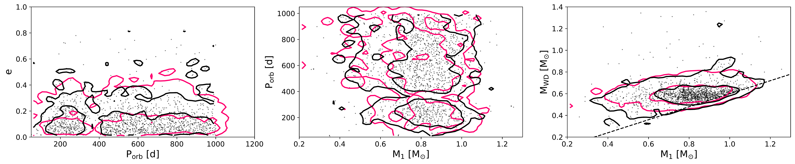
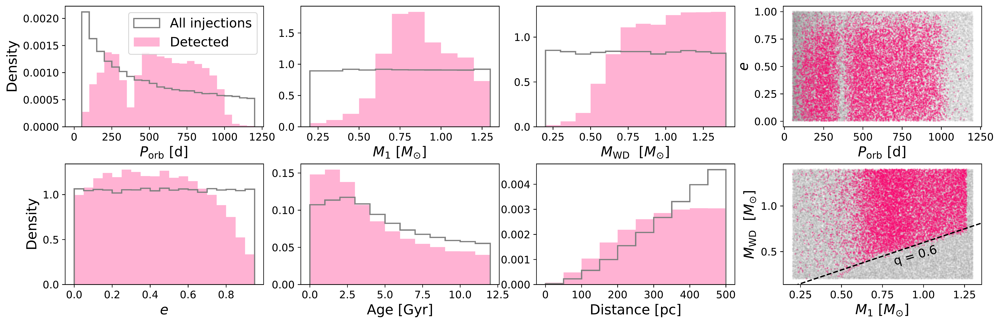
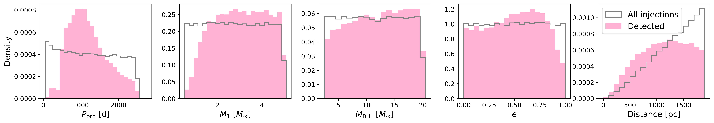

$\newcommand{\ensuremath}{}$
$\newcommand{\xspace}{}$
$\newcommand{\object}[1]{\texttt{#1}}$
$\newcommand{\farcs}{{.}''}$
$\newcommand{\farcm}{{.}'}$
$\newcommand{\arcsec}{''}$
$\newcommand{\arcmin}{'}$
$\newcommand{\ion}[2]{#1#2}$
$\newcommand{\textsc}[1]{\textrm{#1}}$
$\newcommand{\hl}[1]{\textrm{#1}}$
$\newcommand{\footnote}[1]{}$
$\newcommand{\url}[1]{\href{#1}{#1}}$
$\newcommand{\dodoi}[1]{doi:~\href{http://doi.org/#1}{\nolinkurl{#1}}}$
$\newcommand{\doeprint}[1]{\href{http://ascl.net/#1}{\nolinkurl{http://ascl.net/#1}}}$
$\newcommand{\doarXiv}[1]{\href{https://arxiv.org/abs/#1}{\nolinkurl{https://arxiv.org/abs/#1}}}$
$\newcommand{\vdag}{(v)^\dagger}$
$\newcommand\aastex{AAS\TeX}$
$\newcommand\latex{La\TeX}$
$\newcommand{\cs}[1]{{\color{blue} #1}}$
$\newcommand{\reed}[1]{\textcolor{red}{#1}}$
$\newcommand{\ny}[1]{{\color{magenta} #1}}$
$\newcommand\natexlab{#1}$

# Beyond what's observed: hierarchical inference of Gaia astrometric compact-object binaries

<mark>Appeared on: 2026-09-30</mark> -  _22 pages, 16 figures, submitted to PASP_

N. Yamaguchi, et al. -- incl., <mark>K. El-Badry</mark>, <mark>S. Shahaf</mark>

**Abstract:** Astrometry from the Gaia mission has revealed a large and homogeneous population of binaries containing compact objects, including more than 3000 white dwarf--main sequence (WDMS) binaries with orbital periods of $P_{\rm orb}\sim100$ -- $1000$ d. Most of these binaries likely underwent mass transfer from asymptotic giant branch donors, but their evolutionary histories remain uncertain. We develop a hierarchical Bayesian inference model to constrain the intrinsic properties of the Gaia WDMS binary population while accounting for measurement uncertainties and the survey selection function. We infer the distributions of orbital period, component masses, and eccentricity, as well as the total space density. We find that the intrinsic orbital-period distribution follows a declining power law, $p(P_{\rm orb})\propto P_{\rm orb}^{-0.445\pm0.048}$ , and the WD mass distribution is sharply peaked near $0.6 M_\odot$ , with only $\sim1\%$ of systems hosting WDs more massive than $0.8 M_\odot$ . The inferred MS-star mass distribution is relatively flat down to $\sim0.3 M_{\odot}$ , which is unexpected if the population is dominated by products of stable mass transfer with a fixed critical mass ratio.  The eccentricity distribution peaks at a nonzero value, $e=0.046\pm0.001$ , suggesting incomplete circularization or eccentricity excitation. We infer a midplane space density of $\sim3\times10^4 {\rm kpc}^{-3}$ for WDMS binaries in the parameter space probed by Gaia DR3. These properties provide empirical benchmarks for future work to constrain binary evolution models. We also apply the framework to Gaia black hole and neutron star binaries, inferring that $30^{+66}_{-20}$ and $614^{+203}_{-149}$ such systems exist within $2 $ kpc, respectively. This framework will enable detailed population-level constraints on a wide range of systems identified from the much larger catalog of astrometric orbits expected from Gaia DR4.

**Figure 8. -** _Top_: 1D distributions of the fitted parameters. The observed sample from \citetalias{Shahaf2024MNRAS} is plotted in black and compared with the PPD in pink. The inferred distribution of the intrinsic population is shown in blue. The shaded regions cover the 5th-95th percentiles. As expected, the PPD and observed distributions largely overlap. _Bottom_: 2D histograms, where two contours correspond to the 68th and 95th percentiles of the cumulative probability. We also plot the individual data points for the observed sample. (*fig:ppc*)

**Figure 6. -** 1D histograms (normalized) and 2D scatter plots of parameters of the injection set. Across all panels, we plot the complete injection set in gray and detected systems in pink (Section \ref{ssec:inj_dist}). $P_{\rm orb}$, $M_1$, $M_{\rm WD}$, and $e$ are the parameters fit in our model, while the distributions of age and distance are assumed to be known. The difference between the injected and detected samples are a result of the various steps in the selection pipeline (Section \ref{ssec:selection_func}), as discussed in the text. The black dashed line in the $M_{\rm WD}-M_{1}$ plot marks a mass ratio of 0.6.
     (*fig:injections*)

**Figure 12. -** Parameter distributions in the injection set for BHs. In pink, we isolate the "detected" systems (i.e. those which receive astrometric orbits in DR3). (*fig:injections_bhs*)

