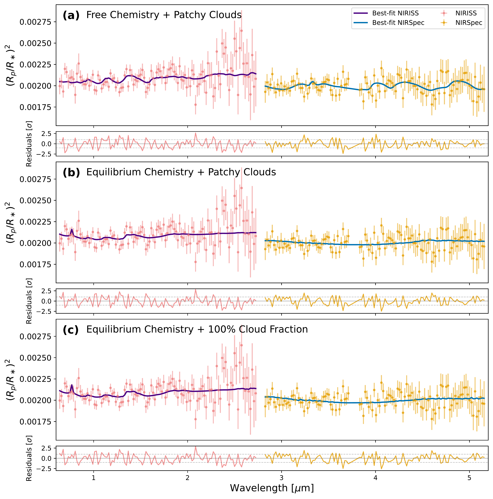
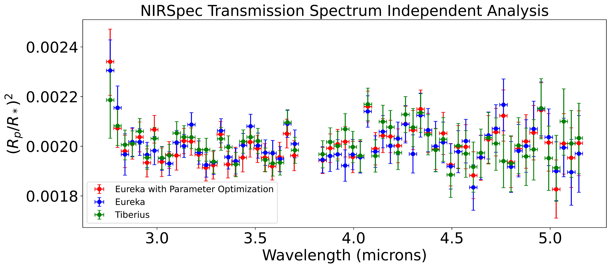
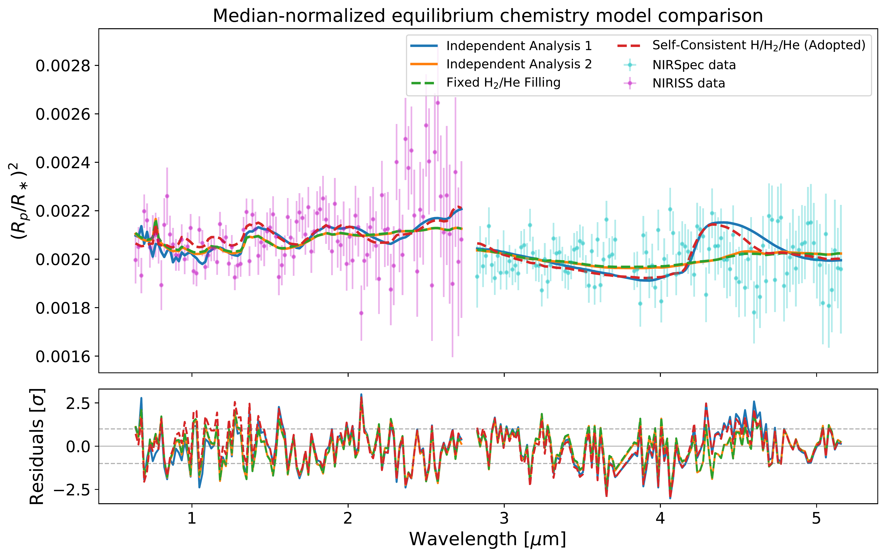

$\newcommand{\ensuremath}{}$
$\newcommand{\xspace}{}$
$\newcommand{\object}[1]{\texttt{#1}}$
$\newcommand{\farcs}{{.}''}$
$\newcommand{\farcm}{{.}'}$
$\newcommand{\arcsec}{''}$
$\newcommand{\arcmin}{'}$
$\newcommand{\ion}[2]{#1#2}$
$\newcommand{\textsc}[1]{\textrm{#1}}$
$\newcommand{\hl}[1]{\textrm{#1}}$
$\newcommand{\footnote}[1]{}$
$\newcommand{\vdag}{(v)^\dagger}$
$\newcommand\aastex{AAS\TeX}$
$\newcommand\latex{La\TeX}$

# Cool, Cloudy Nights on an Ultrahot Neptune: \ A Panchromatic NIRISS/NIRSpec Transmission Spectrum of LTT 9779 b

<mark>Appeared on: 2026-09-30</mark> -  _29 pages, 22 figures, 3 tables. In Review at AAS Journals_

S. Stamer, et al. -- incl., <mark>I. J. M. Crossfield</mark>, <mark>S. Saha</mark>, <mark>K. A. Kahle</mark>

**Abstract:** Studies of planets that reside in the hot Neptune desert allow us to gain insight into how their atmospheres survive the intense flux from their host stars. One such member of that population, LTT 9779 b, is unique in that it has a confirmed atmosphere across various multi-wavelength studies, although results regarding the planet's atmospheric content differ. We present a panchromatic ( $\lambda = 0.63 - 5.165$ $\mu$ m) JWST transmission spectrum of LTT 9779 b's atmosphere, including a re-reduction of previously obtained NIRISS/SOSS data and a reduction of recent NIRSpec/G395H data. Through atmospheric retrievals, we find muted spectral features consistent with the presence of clouds and a low terminator temperature ( $\sim560  \mathrm{K}$ for free chemistry, and $\sim910-950  \mathrm{K}$ for equilibrium chemistry), with a range of possible atmospheric metallicity values dependent on atmospheric temperature and cloud coverage. Forward modeling suggests that, if clouds are present, small sub-micron particle sizes, moderate-to-high sedimentation efficiency ( $f_{\rm sed} = 1 - 3$ , corresponding to a relatively compact vertical cloud extent), low particle column densities, and high eddy diffusion coefficients ( $k_{zz} \geq 10^{10}$ cm $^{2}$ s $^{-1}$ ) are preferred. Probing silicate cloud absorption features in the mid-infrared is needed to confirm the cloud species, allowing us to break the cloud-metallicity degeneracy that is present in this panchromatic transmission spectrum.

**Figure 9. -** 
    Comparison of best-fit atmospheric retrievals for the panchromatic NIRISS/NIRSpec transmission spectrum. Panel (a) shows the patchy-cloud free-chemistry retrieval, panel (b) shows the patchy-cloud equilibrium-chemistry retrieval, and panel (c) shows the 100\% cloud-fraction equilibrium-chemistry retrieval. In each panel, the upper axis shows the observed NIRISS and NIRSpec transit depths with the corresponding best-fit model spectra, while the lower axis shows residuals in units of the observational uncertainty. The three retrieval frameworks illustrate how different assumptions about atmospheric chemistry and cloud coverage can reproduce the muted transmission spectrum.
     (*fig:retrieval_comparison*)

**Figure 7. -** Comparison of three independent reductions of the JWST/NIRSpec G395H transit data. The green points show the primary \texttt{Eureka!} reduction, the red points show the parameter-optimized \texttt{Eureka!} reduction, and the blue points show the independent \texttt{Tiberius} reduction. The agreement among the three spectra demonstrates that the overall transmission-spectrum shape is robust to the choice of extraction and light-curve analysis procedure. (*fig:NIRSpec_spectrum_independent*)

**Figure 8. -** Comparison of four 100\% cloud-fraction equilibrium-chemistry retrieval setups for the panchromatic NIRISS/NIRSpec transmission spectrum. The red curve shows our adopted self-consistent treatment, in which the \ce{H}, \ce{H2}, and \ce{He} abundances are set by the equilibrium-chemistry calculation, while the green curve shows an earlier implementation that forced \ce{H2} and \ce{He} to fill the remaining atmospheric mass fraction in a fixed ratio. The blue and orange curves show two independent retrievals used to validate the retrieval framework. The imposed filling treatment alters the high-metallicity behavior through its effect on the atmospheric mean molecular weight and scale height. The lower panel shows residuals in units of the observational uncertainty. (*fig:eqm_independent_analysis*)

