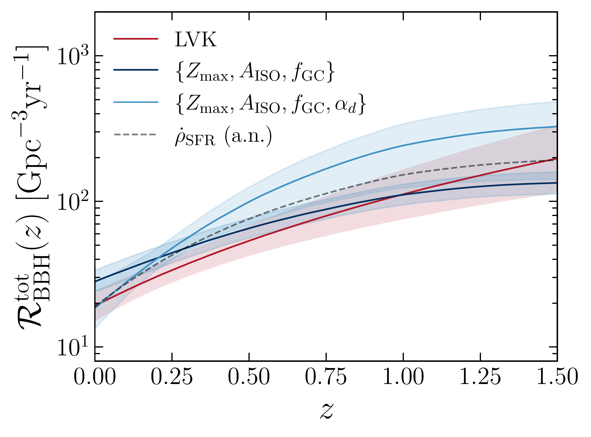
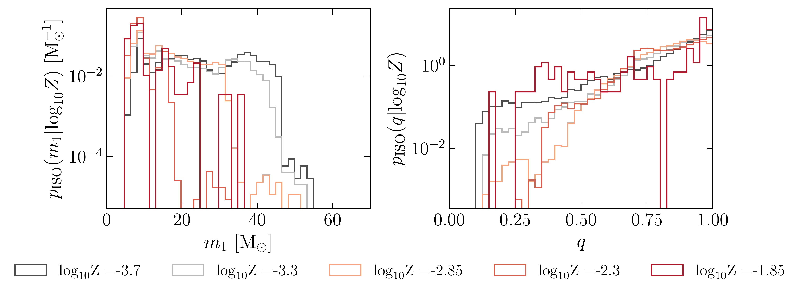
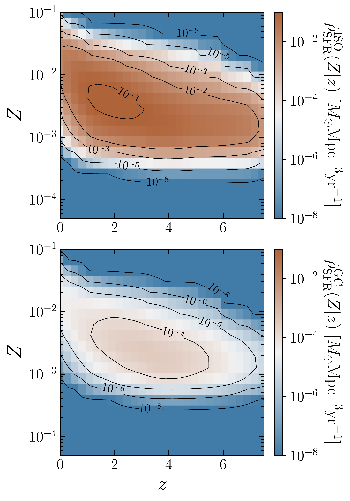

$\newcommand{\ensuremath}{}$
$\newcommand{\xspace}{}$
$\newcommand{\object}[1]{\texttt{#1}}$
$\newcommand{\farcs}{{.}''}$
$\newcommand{\farcm}{{.}'}$
$\newcommand{\arcsec}{''}$
$\newcommand{\arcmin}{'}$
$\newcommand{\ion}[2]{#1#2}$
$\newcommand{\textsc}[1]{\textrm{#1}}$
$\newcommand{\hl}[1]{\textrm{#1}}$
$\newcommand{\footnote}[1]{}$
$\newcommand{\orcidicon}[1]{\href{https://orcid.org/#1}{\includegraphics[width=11pt]{ORCIDiD_icon128x128.png}}}$
$\newcommand{\orcid}[1]{\href{https://orcid.org/#1}{\protect\orcidicon{#1}}}$
$\newcommand{\arraystretch}{1.8}$

# Shaping binary black hole merger efficiency with gravitational wave observations

<mark>Appeared on: 2026-09-30</mark> -  _14 pages, 9 figures_

M. Bosi, et al. -- incl., <mark>S. Torniamenti</mark>

**Abstract:** Gravitational wave (GW) astronomy offers unprecedented insights into binary black hole (BBH) coalescence.However, many of the key quantities involved remain inaccessible to direct observations.The BBH merger rate density is deeply linked to both the merger efficiency and the distribution of delay time between binary formation and merger, neither of which is directly constrained by observations.Disentangling their impact on the merger rate represents a highly non-trivial endeavour.Here we present a semi-parametric BBH population model, based on population synthesis simulations of both isolated and dynamically-formed BBHs, anchored on an observation-driven, metallicity-dependent star formation history.We parametrise the merger efficiency of these two formation channels, fitting the model to GW events from the Gravitational-Wave Transient Catalog 5.0 within a hierarchical Bayesian framework.Our analysis suggests that the isolated BBH merger efficiency should be lowered by a factor $\mathcal{O}(10)$ relative to standard population synthesis results.The dynamical channel requires an efficiency more than an order of magnitude larger than the isolated one to reproduce current GW observations.Nevertheless, we find that the two channels provide comparable contributions to the observed number of events.Finally, we introduce a parametrisation for the delay time distribution of the isolated BBHs.We derive a distribution consistent with the observed local merger rate and show its degeneracy with the merger efficiency.

**Figure 4. -** Comparison between the BBH merger rate density inferred with the $\{Z_\mathrm{max},A_\mathrm{ISO},f_\mathrm{GC}\}$ and $\{Z_\mathrm{max},A_\mathrm{ISO},f_\mathrm{GC},\alpha_{d}\}$ models, in dark and light blue respectively, and the reduced GW dataset. The estimate from the LVK collaboration with the Power Law Redshift model \citep{lvk2026:pop} is in dark red.
    The solid curves show the posterior medians, while the shaded regions the $90\%$ credible intervals.
    The dashed grey curve describes the scaled cosmic star formation rate density given by equation \eqref{eq:csfrd}, marginalised over metallicity. (*fig:merger_rate_density*)

**Figure 9. -** Primary mass (_left panel_) and mass ratio (_right panel_) pdfs of isolated BBHs that merge within a Hubble time, at given metallicity values. (*fig:NBBH_sevn*)

**Figure 1. -** Cosmic star formation rate density feeding the isolated (_top panel_) and globular cluster (_bottom panel_) BBH formation channel, as function of both redshift and metallicity.
    The metallicity dependence is guided by the iron-group elements' abundance, as described in Appendix \ref{sec:appendix_csfrd}.
    The black contours show levels of constant cosmic SFRD ranging from $10^{-8}$ to $10^{-1}$ M$_\odot$Mpc$^{-3}$yr$^{-1}$(_top panel_) and $10^{-4}$  M$_\odot$Mpc$^{-3}$yr$^{-1}$(_bottom panel_). (*fig:csfrd_Z*)

