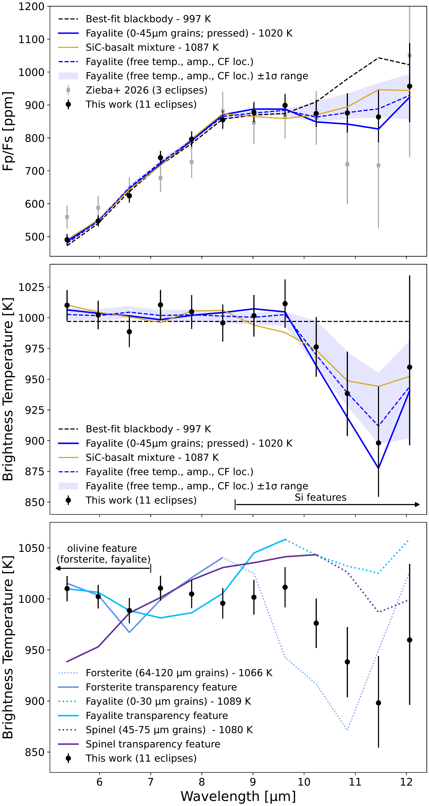
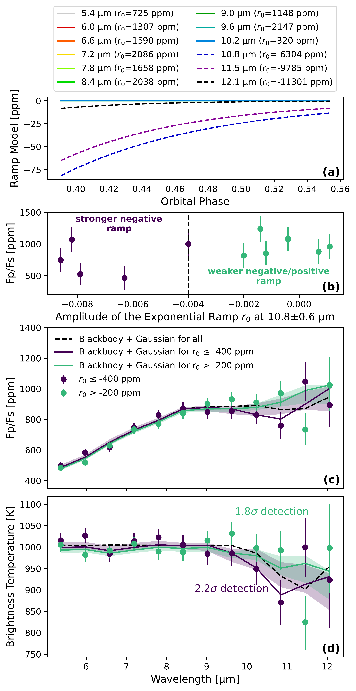
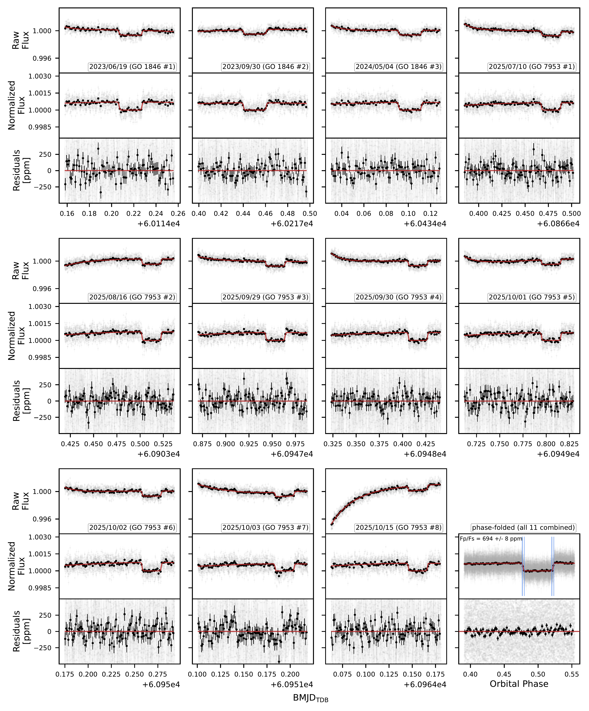

$\newcommand{\ensuremath}{}$
$\newcommand{\xspace}{}$
$\newcommand{\object}[1]{\texttt{#1}}$
$\newcommand{\farcs}{{.}''}$
$\newcommand{\farcm}{{.}'}$
$\newcommand{\arcsec}{''}$
$\newcommand{\arcmin}{'}$
$\newcommand{\ion}[2]{#1#2}$
$\newcommand{\textsc}[1]{\textrm{#1}}$
$\newcommand{\hl}[1]{\textrm{#1}}$
$\newcommand{\footnote}[1]{}$
$\newcommand{\vdag}{(v)^\dagger}$
$\newcommand\aastex{AAS\TeX}$
$\newcommand\latex{La\TeX}$

# Improved Constraints on the Surface of LHS 3844 b from its Mid-Infrared Spectrum

<mark>Appeared on: 2026-09-30</mark> -  _Revised version submitted to ApJL after first referee report_

K. Paragas, et al. -- incl., <mark>L. Kreidberg</mark>

**Abstract:** The thermal emission spectra of terrestrial exoplanets provide a window into their surface compositions and corresponding geological processes. Close-in, rocky planets orbiting M dwarfs are ideal targets for these studies, as observations have shown that most have little to no atmosphere. LHS 3844 b is an ultra-short period super-Earth orbiting a nearby M dwarf, and is the most favorable target that does not have a dayside magma ocean. We present an updated JWST MIRI/LRS emission spectrum ( $5-12$  $\unit{\micro\meter}$ ) of this planet, derived from eight new and three archival eclipse observations. We combine these visits to obtain the highest SNR emission spectrum for any rocky exoplanet thus far, with a median SNR of 29 across 12 wavelength bins. Our data are sensitive to the predicted Si-O stretching feature (the strongest mid-infrared silicate feature) for a wide range of common materials and the transparency feature, which is relatively insensitive to composition and constrains the grain size and porosity of surface materials. We find that LHS 3844 b's emission spectrum resembles a blackbody shortward of $\SI{10}{\micro\meter}$ , disfavoring the presence of a transparency feature, and identify a tentative feature ( $1.9-3.5\sigma$ ) between $10-12$  $\unit{\micro\meter}$ . If this feature is astrophysical and not instrumental in nature, it can be matched by a fayalite (the iron end-member of olivine) surface, but might also be consistent with other candidate planet-forming materials like spinel or silicon carbide. We discuss possible biases introduced by the wavelength-dependent instrumental ramp, and outline several strategies to mitigate this effect in future observations of LHS 3844 b.

**Figure 1. -** Top: Planet-to-star flux ratio emission spectrum from the three eclipses published in \citet{Zieba2026}, compared to the combined spectrum from all 11 eclipses in this work (including the three previously published). Middle and bottom: The same spectrum converted to brightness temperature to highlight the feature near 10--12 \unit{\micro\meter}. The top two panels show the best-fit blackbody, fayalite, and SiC-basalt mixture models (each with temperature as a free parameter), and the three parameter Fayalite model with temperature (temp.), amplitude (amp.),
    and Christiansen Feature (CF) location (loc.) as free parameters. The bottom panel shows the best-fit forsterite, fayalite, and spinel models of small, loosely packed grains with their corresponding transparency features denoted by the solid lines. (*fig:emission_spectrum*)

**Figure 2. -** (a): The ramp models for all spectral channels for GO 7953 \#5 (October 1 2025) showing the change in ramp shape for channels in the shadowed region. (b): The planet-to-star flux ratios of each observation as a function of the ramp amplitude $r_0$ in the \SI{10.8\pm0.6}{\micro\meter} bin. (c): The averaged planet-to-star flux spectra for the two groups. (d): The same spectra converted to brightness temperature. (c) and (d) include the blackbody and Gaussian feature model (free temperature, amplitude, center, and width) fit to all 11 observations and each subgroup. The shaded regions correspond to the $1\sigma$ range of the best-fit models. The feature amplitude is detected to $2.2\sigma$ for the stronger ramp amplitude group and $1.8\sigma$ for the weaker ramp amplitude group. (*fig:ramp_effects*)

**Figure 5. -** The 11 three-panel plots show the raw flux, normalized flux, and residuals of the white light curves for each MIRI LRS eclipse with their best-fit model overplotted in red. The two-panel figure in the bottom right is the phase-folded combined white light curve of all 11 visits with the blue vertical lines indicating T1-T4, i.e., ingress and egress. The gray points are the raw data at the native resolution of the observations while the black points are the binned data to a cadence of 1.6 minutes. (*fig:white_light_curves*)

