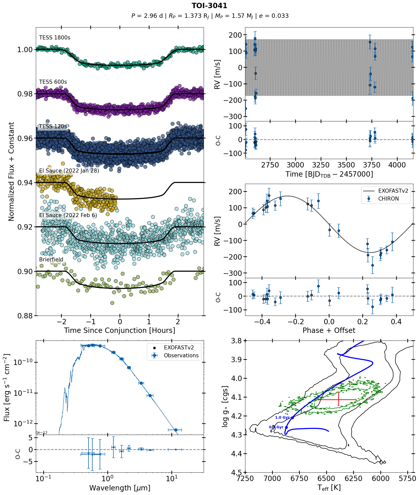
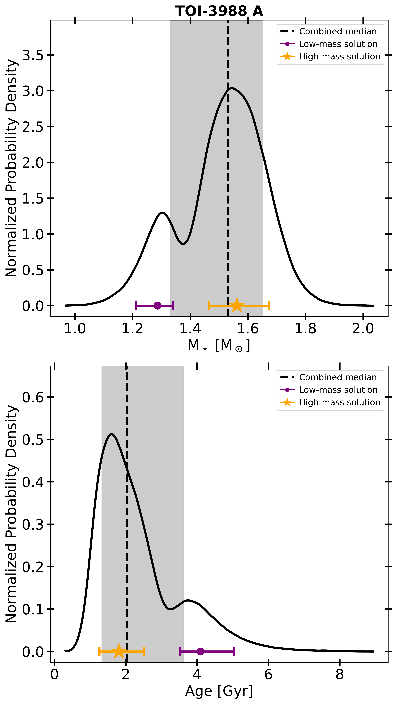
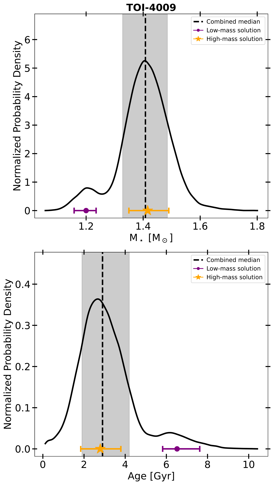
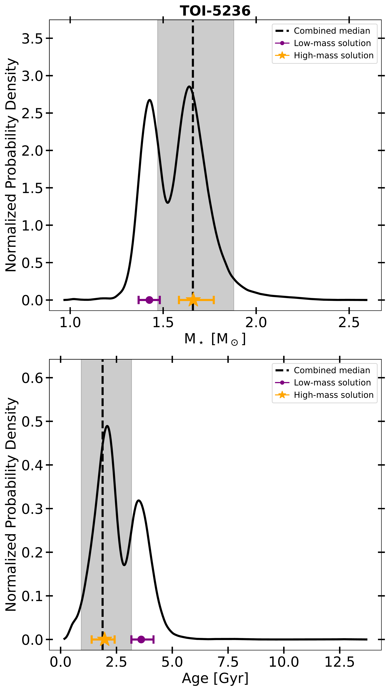
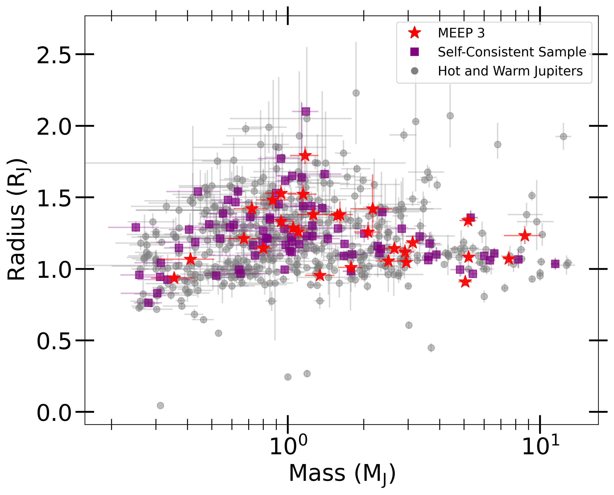

$\newcommand{\ensuremath}{}$
$\newcommand{\xspace}{}$
$\newcommand{\object}[1]{\texttt{#1}}$
$\newcommand{\farcs}{{.}''}$
$\newcommand{\farcm}{{.}'}$
$\newcommand{\arcsec}{''}$
$\newcommand{\arcmin}{'}$
$\newcommand{\ion}[2]{#1#2}$
$\newcommand{\textsc}[1]{\textrm{#1}}$
$\newcommand{\hl}[1]{\textrm{#1}}$
$\newcommand{\footnote}[1]{}$
$\newcommand{\tess}{\textit{TESS}\xspace}$
$\newcommand{\bjdtdb}{\ensuremath{\rm{BJD_{TDB}}}}$
$\newcommand{\feh}{\ensuremath{\left[{\rm Fe}/{\rm H}\right]}}$
$\newcommand{\teff}{\ensuremath{T_{\rm eff}}}$
$\newcommand{\teq}{\ensuremath{T_{\rm eq}}}$
$\newcommand{\ecosw}{\ensuremath{e\cos{\omega_*}}}$
$\newcommand{\esinw}{\ensuremath{e\sin{\omega_*}}}$
$\newcommand\msun{M_\odot\xspace}$
$\newcommand{\rsun}{R_\odot\xspace}$
$\newcommand{\lsun}{L_\odot\xspace}$
$\newcommand{\mj}{\ensuremath{ M_{\rm J}}}$
$\newcommand{\rj}{\ensuremath{ R_{\rm J}}}$
$\newcommand{\me}{\ensuremath{ M_{\rm E}}}$
$\newcommand{\re}{\ensuremath{ R_{\rm E}}}$
$\newcommand{\fave}{\langle F \rangle}$
$\newcommand{\fluxcgs}{10^9 erg s^{-1} cm^{-2}}$
$\newcommand{\tess}{\textit{TESS}\xspace}$
$\newcommand{\bjdtdb}{\ensuremath{\rm{BJD_{TDB}}}}$
$\newcommand{\feh}{\ensuremath{\left[{\rm Fe}/{\rm H}\right]}}$
$\newcommand{\teff}{\ensuremath{T_{\rm eff}}}$
$\newcommand{\teq}{\ensuremath{T_{\rm eq}}}$
$\newcommand{\ecosw}{\ensuremath{e\cos{\omega_*}}}$
$\newcommand{\esinw}{\ensuremath{e\sin{\omega_*}}}$
$\newcommand\msun{M_\odot\xspace}$
$\newcommand{\rsun}{R_\odot\xspace}$
$\newcommand{\lsun}{L_\odot\xspace}$
$\newcommand{\mj}{\ensuremath{ M_{\rm J}}}$
$\newcommand{\rj}{\ensuremath{ R_{\rm J}}}$
$\newcommand{\me}{\ensuremath{ M_{\rm E}}}$
$\newcommand{\re}{\ensuremath{ R_{\rm E}}}$
$\newcommand{\fave}{\langle F \rangle}$
$\newcommand{\fluxcgs}{10^9 erg s^{-1} cm^{-2}}$
$\newcommand{\tess}{\textit{TESS}\xspace}$
$\newcommand{\bjdtdb}{\ensuremath{\rm{BJD_{TDB}}}}$
$\newcommand{\feh}{\ensuremath{\left[{\rm Fe}/{\rm H}\right]}}$
$\newcommand{\teff}{\ensuremath{T_{\rm eff}}}$
$\newcommand{\teq}{\ensuremath{T_{\rm eq}}}$
$\newcommand{\ecosw}{\ensuremath{e\cos{\omega_*}}}$
$\newcommand{\esinw}{\ensuremath{e\sin{\omega_*}}}$
$\newcommand\msun{M_\odot\xspace}$
$\newcommand{\rsun}{R_\odot\xspace}$
$\newcommand{\lsun}{L_\odot\xspace}$
$\newcommand{\mj}{\ensuremath{ M_{\rm J}}}$
$\newcommand{\rj}{\ensuremath{ R_{\rm J}}}$
$\newcommand{\me}{\ensuremath{ M_{\rm E}}}$
$\newcommand{\re}{\ensuremath{ R_{\rm E}}}$
$\newcommand{\fave}{\langle F \rangle}$
$\newcommand{\fluxcgs}{10^9 erg s^{-1} cm^{-2}}$
$\newcommand{\tess}{\textit{TESS}\xspace}$
$\newcommand{\bjdtdb}{\ensuremath{\rm{BJD_{TDB}}}}$
$\newcommand{\feh}{\ensuremath{\left[{\rm Fe}/{\rm H}\right]}}$
$\newcommand{\teff}{\ensuremath{T_{\rm eff}}}$
$\newcommand{\teq}{\ensuremath{T_{\rm eq}}}$
$\newcommand{\ecosw}{\ensuremath{e\cos{\omega_*}}}$
$\newcommand{\esinw}{\ensuremath{e\sin{\omega_*}}}$
$\newcommand\msun{M_\odot\xspace}$
$\newcommand{\rsun}{R_\odot\xspace}$
$\newcommand{\lsun}{L_\odot\xspace}$
$\newcommand{\mj}{\ensuremath{ M_{\rm J}}}$
$\newcommand{\rj}{\ensuremath{ R_{\rm J}}}$
$\newcommand{\me}{\ensuremath{ M_{\rm E}}}$
$\newcommand{\re}{\ensuremath{ R_{\rm E}}}$
$\newcommand{\fave}{\langle F \rangle}$
$\newcommand{\fluxcgs}{10^9 erg s^{-1} cm^{-2}}$
$\newcommand{\tess}{\textit{TESS}\xspace}$
$\newcommand{\bjdtdb}{\ensuremath{\rm{BJD_{TDB}}}}$
$\newcommand{\feh}{\ensuremath{\left[{\rm Fe}/{\rm H}\right]}}$
$\newcommand{\teff}{\ensuremath{T_{\rm eff}}}$
$\newcommand{\teq}{\ensuremath{T_{\rm eq}}}$
$\newcommand{\ecosw}{\ensuremath{e\cos{\omega_*}}}$
$\newcommand{\esinw}{\ensuremath{e\sin{\omega_*}}}$
$\newcommand\msun{M_\odot\xspace}$
$\newcommand{\rsun}{R_\odot\xspace}$
$\newcommand{\lsun}{L_\odot\xspace}$
$\newcommand{\mj}{\ensuremath{ M_{\rm J}}}$
$\newcommand{\rj}{\ensuremath{ R_{\rm J}}}$
$\newcommand{\me}{\ensuremath{ M_{\rm E}}}$
$\newcommand{\re}{\ensuremath{ R_{\rm E}}}$
$\newcommand{\fave}{\langle F \rangle}$
$\newcommand{\fluxcgs}{10^9 erg s^{-1} cm^{-2}}$
$\newcommand{\tess}{\textit{TESS}\xspace}$
$\newcommand{\bjdtdb}{\ensuremath{\rm{BJD_{TDB}}}}$
$\newcommand{\feh}{\ensuremath{\left[{\rm Fe}/{\rm H}\right]}}$
$\newcommand{\teff}{\ensuremath{T_{\rm eff}}}$
$\newcommand{\teq}{\ensuremath{T_{\rm eq}}}$
$\newcommand{\ecosw}{\ensuremath{e\cos{\omega_*}}}$
$\newcommand{\esinw}{\ensuremath{e\sin{\omega_*}}}$
$\newcommand\msun{M_\odot\xspace}$
$\newcommand{\rsun}{R_\odot\xspace}$
$\newcommand{\lsun}{L_\odot\xspace}$
$\newcommand{\mj}{\ensuremath{ M_{\rm J}}}$
$\newcommand{\rj}{\ensuremath{ R_{\rm J}}}$
$\newcommand{\me}{\ensuremath{ M_{\rm E}}}$
$\newcommand{\re}{\ensuremath{ R_{\rm E}}}$
$\newcommand{\fave}{\langle F \rangle}$
$\newcommand{\fluxcgs}{10^9 erg s^{-1} cm^{-2}}$
$\newcommand{\tess}{\textit{TESS}\xspace}$
$\newcommand{\bjdtdb}{\ensuremath{\rm{BJD_{TDB}}}}$
$\newcommand{\feh}{\ensuremath{\left[{\rm Fe}/{\rm H}\right]}}$
$\newcommand{\teff}{\ensuremath{T_{\rm eff}}}$
$\newcommand{\teq}{\ensuremath{T_{\rm eq}}}$
$\newcommand{\ecosw}{\ensuremath{e\cos{\omega_\star}}}$
$\newcommand{\esinw}{\ensuremath{e\sin{\omega_\star}}}$
$\newcommand{\msun}{\ensuremath{ M_\Sun}}$
$\newcommand{\rsun}{\ensuremath{ R_\Sun}}$
$\newcommand{\lsun}{\ensuremath{ L_\Sun}}$
$\newcommand{\mj}{\ensuremath{ M_{\rm J}}}$
$\newcommand{\rj}{\ensuremath{ R_{\rm J}}}$
$\newcommand{\me}{\ensuremath{ M_{\rm E}}}$
$\newcommand{\re}{\ensuremath{ R_{\rm E}}}$
$\newcommand{\fave}{\langle F \rangle}$
$\newcommand{\fluxcgs}{10^9 erg s^{-1} cm^{-2}}$
$\newcommand{\tess}{\textit{TESS}\xspace}$
$\newcommand{\bjdtdb}{\ensuremath{\rm{BJD_{TDB}}}}$
$\newcommand{\feh}{\ensuremath{\left[{\rm Fe}/{\rm H}\right]}}$
$\newcommand{\teff}{\ensuremath{T_{\rm eff}}}$
$\newcommand{\teq}{\ensuremath{T_{\rm eq}}}$
$\newcommand{\ecosw}{\ensuremath{e\cos{\omega_\star}}}$
$\newcommand{\esinw}{\ensuremath{e\sin{\omega_\star}}}$
$\newcommand{\msun}{\ensuremath{ M_\Sun}}$
$\newcommand{\rsun}{\ensuremath{ R_\Sun}}$
$\newcommand{\lsun}{\ensuremath{ L_\Sun}}$
$\newcommand{\mj}{\ensuremath{ M_{\rm J}}}$
$\newcommand{\rj}{\ensuremath{ R_{\rm J}}}$
$\newcommand{\me}{\ensuremath{ M_{\rm E}}}$
$\newcommand{\re}{\ensuremath{ R_{\rm E}}}$
$\newcommand{\fave}{\langle F \rangle}$
$\newcommand{\fluxcgs}{10^9 erg s^{-1} cm^{-2}}$
$\newcommand{\tess}{\textit{TESS}\xspace}$
$\newcommand{\bjdtdb}{\ensuremath{\rm{BJD_{TDB}}}}$
$\newcommand{\feh}{\ensuremath{\left[{\rm Fe}/{\rm H}\right]}}$
$\newcommand{\teff}{\ensuremath{T_{\rm eff}}}$
$\newcommand{\teq}{\ensuremath{T_{\rm eq}}}$
$\newcommand{\ecosw}{\ensuremath{e\cos{\omega_\star}}}$
$\newcommand{\esinw}{\ensuremath{e\sin{\omega_\star}}}$
$\newcommand{\msun}{\ensuremath{ M_\Sun}}$
$\newcommand{\rsun}{\ensuremath{ R_\Sun}}$
$\newcommand{\lsun}{\ensuremath{ L_\Sun}}$
$\newcommand{\mj}{\ensuremath{ M_{\rm J}}}$
$\newcommand{\rj}{\ensuremath{ R_{\rm J}}}$
$\newcommand{\me}{\ensuremath{ M_{\rm E}}}$
$\newcommand{\re}{\ensuremath{ R_{\rm E}}}$
$\newcommand{\fave}{\langle F \rangle}$
$\newcommand{\fluxcgs}{10^9 erg s^{-1} cm^{-2}}$
$\newcommand{\tess}{\textit{TESS}\xspace}$
$\newcommand{\bjdtdb}{\ensuremath{\rm{BJD_{TDB}}}}$
$\newcommand{\feh}{\ensuremath{\left[{\rm Fe}/{\rm H}\right]}}$
$\newcommand{\teff}{\ensuremath{T_{\rm eff}}}$
$\newcommand{\teq}{\ensuremath{T_{\rm eq}}}$
$\newcommand{\ecosw}{\ensuremath{e\cos{\omega_\star}}}$
$\newcommand{\esinw}{\ensuremath{e\sin{\omega_\star}}}$
$\newcommand{\msun}{\ensuremath{ M_\Sun}}$
$\newcommand{\rsun}{\ensuremath{ R_\Sun}}$
$\newcommand{\lsun}{\ensuremath{ L_\Sun}}$
$\newcommand{\mj}{\ensuremath{ M_{\rm J}}}$
$\newcommand{\rj}{\ensuremath{ R_{\rm J}}}$
$\newcommand{\me}{\ensuremath{ M_{\rm E}}}$
$\newcommand{\re}{\ensuremath{ R_{\rm E}}}$
$\newcommand{\fave}{\langle F \rangle}$
$\newcommand{\fluxcgs}{10^9 erg s^{-1} cm^{-2}}$
$\newcommand{\tess}{\textit{TESS}\xspace}$
$\newcommand{\bjdtdb}{\ensuremath{\rm{BJD_{TDB}}}}$
$\newcommand{\feh}{\ensuremath{\left[{\rm Fe}/{\rm H}\right]}}$
$\newcommand{\teff}{\ensuremath{T_{\rm eff}}}$
$\newcommand{\teq}{\ensuremath{T_{\rm eq}}}$
$\newcommand{\ecosw}{\ensuremath{e\cos{\omega_\star}}}$
$\newcommand{\esinw}{\ensuremath{e\sin{\omega_\star}}}$
$\newcommand{\msun}{\ensuremath{ M_\Sun}}$
$\newcommand{\rsun}{\ensuremath{ R_\Sun}}$
$\newcommand{\lsun}{\ensuremath{ L_\Sun}}$
$\newcommand{\mj}{\ensuremath{ M_{\rm J}}}$
$\newcommand{\rj}{\ensuremath{ R_{\rm J}}}$
$\newcommand{\me}{\ensuremath{ M_{\rm E}}}$
$\newcommand{\re}{\ensuremath{ R_{\rm E}}}$
$\newcommand{\fave}{\langle F \rangle}$
$\newcommand{\fluxcgs}{10^9 erg s^{-1} cm^{-2}}$
$\newcommand{\tess}{\textit{TESS}\xspace}$
$\newcommand{\bjdtdb}{\ensuremath{\rm{BJD_{TDB}}}}$
$\newcommand{\feh}{\ensuremath{\left[{\rm Fe}/{\rm H}\right]}}$
$\newcommand{\teff}{\ensuremath{T_{\rm eff}}}$
$\newcommand{\teq}{\ensuremath{T_{\rm eq}}}$
$\newcommand{\ecosw}{\ensuremath{e\cos{\omega_\star}}}$
$\newcommand{\esinw}{\ensuremath{e\sin{\omega_\star}}}$
$\newcommand{\msun}{\ensuremath{ M_\Sun}}$
$\newcommand{\rsun}{\ensuremath{ R_\Sun}}$
$\newcommand{\lsun}{\ensuremath{ L_\Sun}}$
$\newcommand{\mj}{\ensuremath{ M_{\rm J}}}$
$\newcommand{\rj}{\ensuremath{ R_{\rm J}}}$
$\newcommand{\me}{\ensuremath{ M_{\rm E}}}$
$\newcommand{\re}{\ensuremath{ R_{\rm E}}}$
$\newcommand{\fave}{\langle F \rangle}$
$\newcommand{\fluxcgs}{10^9 erg s^{-1} cm^{-2}}$
$\newcommand{\tess}{\textit{TESS}\xspace}$
$\newcommand{\bjdtdb}{\ensuremath{\rm{BJD_{TDB}}}}$
$\newcommand{\feh}{\ensuremath{\left[{\rm Fe}/{\rm H}\right]}}$
$\newcommand{\teff}{\ensuremath{T_{\rm eff}}}$
$\newcommand{\teq}{\ensuremath{T_{\rm eq}}}$
$\newcommand{\ecosw}{\ensuremath{e\cos{\omega_\star}}}$
$\newcommand{\esinw}{\ensuremath{e\sin{\omega_\star}}}$
$\newcommand{\msun}{\ensuremath{ M_\Sun}}$
$\newcommand{\rsun}{\ensuremath{ R_\Sun}}$
$\newcommand{\lsun}{\ensuremath{ L_\Sun}}$
$\newcommand{\mj}{\ensuremath{ M_{\rm J}}}$
$\newcommand{\rj}{\ensuremath{ R_{\rm J}}}$
$\newcommand{\me}{\ensuremath{ M_{\rm E}}}$
$\newcommand{\re}{\ensuremath{ R_{\rm E}}}$
$\newcommand{\fave}{\langle F \rangle}$
$\newcommand{\fluxcgs}{10^9 erg s^{-1} cm^{-2}}$
$\newcommand{\tess}{\textit{TESS}\xspace}$
$\newcommand{\bjdtdb}{\ensuremath{\rm{BJD_{TDB}}}}$
$\newcommand{\feh}{\ensuremath{\left[{\rm Fe}/{\rm H}\right]}}$
$\newcommand{\teff}{\ensuremath{T_{\rm eff}}}$
$\newcommand{\teq}{\ensuremath{T_{\rm eq}}}$
$\newcommand{\ecosw}{\ensuremath{e\cos{\omega_\star}}}$
$\newcommand{\esinw}{\ensuremath{e\sin{\omega_\star}}}$
$\newcommand{\msun}{\ensuremath{ M_\Sun}}$
$\newcommand{\rsun}{\ensuremath{ R_\Sun}}$
$\newcommand{\lsun}{\ensuremath{ L_\Sun}}$
$\newcommand{\mj}{\ensuremath{ M_{\rm J}}}$
$\newcommand{\rj}{\ensuremath{ R_{\rm J}}}$
$\newcommand{\me}{\ensuremath{ M_{\rm E}}}$
$\newcommand{\re}{\ensuremath{ R_{\rm E}}}$
$\newcommand{\fave}{\langle F \rangle}$
$\newcommand{\fluxcgs}{10^9 erg s^{-1} cm^{-2}}$
$\newcommand{\tess}{\textit{TESS}\xspace}$
$\newcommand{\bjdtdb}{\ensuremath{\rm{BJD_{TDB}}}}$
$\newcommand{\feh}{\ensuremath{\left[{\rm Fe}/{\rm H}\right]}}$
$\newcommand{\teff}{\ensuremath{T_{\rm eff}}}$
$\newcommand{\teq}{\ensuremath{T_{\rm eq}}}$
$\newcommand{\ecosw}{\ensuremath{e\cos{\omega_\star}}}$
$\newcommand{\esinw}{\ensuremath{e\sin{\omega_\star}}}$
$\newcommand{\msun}{\ensuremath{ M_\Sun}}$
$\newcommand{\rsun}{\ensuremath{ R_\Sun}}$
$\newcommand{\lsun}{\ensuremath{ L_\Sun}}$
$\newcommand{\mj}{\ensuremath{ M_{\rm J}}}$
$\newcommand{\rj}{\ensuremath{ R_{\rm J}}}$
$\newcommand{\me}{\ensuremath{ M_{\rm E}}}$
$\newcommand{\re}{\ensuremath{ R_{\rm E}}}$
$\newcommand{\fave}{\langle F \rangle}$
$\newcommand{\fluxcgs}{10^9 erg s^{-1} cm^{-2}}$
$\newcommand{\tess}{\textit{TESS}\xspace}$
$\newcommand{\bjdtdb}{\ensuremath{\rm{BJD_{TDB}}}}$
$\newcommand{\feh}{\ensuremath{\left[{\rm Fe}/{\rm H}\right]}}$
$\newcommand{\teff}{\ensuremath{T_{\rm eff}}}$
$\newcommand{\teq}{\ensuremath{T_{\rm eq}}}$
$\newcommand{\ecosw}{\ensuremath{e\cos{\omega_\star}}}$
$\newcommand{\esinw}{\ensuremath{e\sin{\omega_\star}}}$
$\newcommand{\msun}{\ensuremath{ M_\Sun}}$
$\newcommand{\rsun}{\ensuremath{ R_\Sun}}$
$\newcommand{\lsun}{\ensuremath{ L_\Sun}}$
$\newcommand{\mj}{\ensuremath{ M_{\rm J}}}$
$\newcommand{\rj}{\ensuremath{ R_{\rm J}}}$
$\newcommand{\me}{\ensuremath{ M_{\rm E}}}$
$\newcommand{\re}{\ensuremath{ R_{\rm E}}}$
$\newcommand{\fave}{\langle F \rangle}$
$\newcommand{\fluxcgs}{10^9 erg s^{-1} cm^{-2}}$
$\newcommand{\tess}{\textit{TESS}\xspace}$
$\newcommand{\bjdtdb}{\ensuremath{\rm{BJD_{TDB}}}}$
$\newcommand{\feh}{\ensuremath{\left[{\rm Fe}/{\rm H}\right]}}$
$\newcommand{\teff}{\ensuremath{T_{\rm eff}}}$
$\newcommand{\teq}{\ensuremath{T_{\rm eq}}}$
$\newcommand{\ecosw}{\ensuremath{e\cos{\omega_\star}}}$
$\newcommand{\esinw}{\ensuremath{e\sin{\omega_\star}}}$
$\newcommand{\msun}{\ensuremath{ M_\Sun}}$
$\newcommand{\rsun}{\ensuremath{ R_\Sun}}$
$\newcommand{\lsun}{\ensuremath{ L_\Sun}}$
$\newcommand{\mj}{\ensuremath{ M_{\rm J}}}$
$\newcommand{\rj}{\ensuremath{ R_{\rm J}}}$
$\newcommand{\me}{\ensuremath{ M_{\rm E}}}$
$\newcommand{\re}{\ensuremath{ R_{\rm E}}}$
$\newcommand{\fave}{\langle F \rangle}$
$\newcommand{\fluxcgs}{10^9 erg s^{-1} cm^{-2}}$
$\newcommand{\tess}{\textit{TESS}\xspace}$
$\newcommand{\bjdtdb}{\ensuremath{\rm{BJD_{TDB}}}}$
$\newcommand{\feh}{\ensuremath{\left[{\rm Fe}/{\rm H}\right]}}$
$\newcommand{\teff}{\ensuremath{T_{\rm eff}}}$
$\newcommand{\teq}{\ensuremath{T_{\rm eq}}}$
$\newcommand{\ecosw}{\ensuremath{e\cos{\omega_\star}}}$
$\newcommand{\esinw}{\ensuremath{e\sin{\omega_\star}}}$
$\newcommand{\msun}{\ensuremath{ M_\Sun}}$
$\newcommand{\rsun}{\ensuremath{ R_\Sun}}$
$\newcommand{\lsun}{\ensuremath{ L_\Sun}}$
$\newcommand{\mj}{\ensuremath{ M_{\rm J}}}$
$\newcommand{\rj}{\ensuremath{ R_{\rm J}}}$
$\newcommand{\me}{\ensuremath{ M_{\rm E}}}$
$\newcommand{\re}{\ensuremath{ R_{\rm E}}}$
$\newcommand{\fave}{\langle F \rangle}$
$\newcommand{\fluxcgs}{10^9 erg s^{-1} cm^{-2}}$
$\newcommand{\tess}{\textit{TESS}\xspace}$
$\newcommand{\panelgap}{\hspace{2.5em}}$
$\newcommand{\resetpageheight}{$
$  \global\@colht\textheight$
$  \global\@colroom\textheight$
$  \global\vsize\textheight}$
$\newcommand{\bodystretch}{1.15}$
$\newcommand{\litstretch}{1.32}$
$\newcommand{\medianstretch}{1.68}$
$\newcommand{\bimodalstretch}{1.82}$
$\newcommand{\vdag}{(v)^\dagger}$
$\newcommand\aastex{AAS\TeX}$
$\newcommand\latex{La\TeX}$
$\newcommand\tess{\textit{TESS}\xspace}$
$\newcommand\gaia{\textit{Gaia}\xspace}$
$\newcommand\exofast{\texttt{EXOFASTv2}\xspace}$
$\newcommand\mj{M_{\rm J}\xspace}$
$\newcommand\msun{M_\odot\xspace}$
$\newcommand\Mp{M_{\rm P}\xspace}$
$\newcommand\rj{R_{\rm J}\xspace}$
$\newcommand\Rp{R_{\rm P}\xspace}$
$\newcommand{\bjdtdb}{\ensuremath{\rm{BJD_{TDB}}}}$
$\newcommand{\msol}{M_\odot\xspace}$
$\newcommand{\rsun}{R_\odot\xspace}$
$\newcommand{\lsun}{L_\odot\xspace}$
$\newcommand{\teff}{T_{\rm eff}\xspace}$
$\newcommand\tbd[1]{{\color{red}#1}}$
$\newcommand{\totHJs}{669\xspace}$
$\newcommand{\nearetrievaldate}{2026 Sep 18\xspace}$
$\newcommand{\affil}[2]{\par\hangindent=1em\hangafter=1 ^{#1}#2}$
$\newcommand{\arraystretch}{\bodystretch}$
$\newcommand{\topfraction}{0.92}$
$\newcommand{\bottomfraction}{0.75}$
$\newcommand{\textfraction}{0.06}$
$\newcommand{\floatpagefraction}{0.80}$
$\newcommand{\dbltopfraction}{0.92}$
$\newcommand{\dblfloatpagefraction}{0.75}$
$\newcommand{\arraystretch}{\litstretch}$
$\newcommand{\arraystretch}{\bodystretch}$
$\newcommand{\arraystretch}{\medianstretch}$
$\newcommand{\arraystretch}{\bodystretch}$
$\newcommand{\arraystretch}{\bimodalstretch}$
$\newcommand{\arraystretch}{\bodystretch}$
$\newcommand{\thebibliography}{\DeclareRobustCommand{\VAN}[3]{##3}\VANthebibliography}$

# Migration and Evolution of giant ExoPlanets (MEEP). III. Twenty-Nine Giant Planets from the $\tess$ Mission

<mark>Appeared on: 2026-10-01</mark> -  _64 pages, 6 figures, 9 tables, submitted to MNRAS_

J. Schulte, et al. -- incl., <mark>T. Henning</mark>

**Abstract:** We present the discovery and characterization of 29 hot and warm Jupiter systems transiting bright ( $G < 12.8$ ) FGK stars using $\tess$ data and ground-based photometry and spectroscopy. Through the use of high angular resolution imaging, we discovered three bound stellar companions, named TOI-3988 B, TOI-6171 B, and TOI-7266 B. The planets that we confirmed span an orbital period range of $1.28 - 16.9$ days, a mass range of $0.35 - 8.7$ $\mj$ , and an orbital eccentricity range of $0 - 0.6$ , and add to the growing self-consistent sample of hot and warm Jupiter systems detected using $\tess$ and analyzed using the Markov-Chain Monte Carlo code $\exofast$ . By performing two-sample Kolmogorov-Smirnov tests on a set of host star and planetary parameters, we find that this growing self-consistent sample of giant planets has a different distribution of host star masses, surface gravities, and metallicities, compared to the HJ and WJ systems in the literature, likely due to the additional constraint on the host star density from the planetary transits included in our global fits. We find that seven of the 29 newly confirmed planets have significant orbital eccentricity, and that one of these, TOI-3365 b, is in a system which likely hosts a massive outer companion. The continued confirmation of HJ and WJ systems and the follow-up RV monitoring on these systems to identify outer companions will pave the way for important investigations of giant planet migration.

**Figure 7. -** Photometric and radial velocity observations of the TOI-3041 system.
    **Upper left:** Phase-folded, unbinned, transits of TOI-3041 b shown in comparison to the best-fit time of conjunction with an arbitrary normalized flux offset. Multiple $\tess$ sectors in the same cadence are stacked on top of each other.
    **Bottom left:** The spectral energy distribution of the target star compared to the best-fit \exofast model. Residuals are shown on a linear scale, using the same units as the primary y-axis.
    **Upper right:** RV observations versus time, including any significant long-term trend. The residuals are shown in the subpanel below in the same units.
    **Middle right:** RV observations phase-folded using the best-fit ephemeris from the \exofast global fit. The phase is shifted so that the transit occurs at Phase + Offset = 0. The residuals are shown in the subpanel below in the same units.
    **Bottom right:** The evolutionary track and current evolutionary stage of the planet according to the best-fit MESA Isochrones and Stellar Tracks (MIST) model. The blue line indicates the best-fit MIST track, while the black contours show the 1$\sigma$ and 2$\sigma$ constraints on the star's current $\teff$ and $\log{ g}$ from the MIST isochrone alone. The green contours represent the 1$\sigma$ and 2$\sigma$ constraints on the star's $\teff$ and $\log{g}$ from the \exofast global fit, combining constraints from observations of the star and planet. The red cross indicates the median and 68\% confidence interval reported in Table $\re$f{tab:median}. (*fig:toi3041*)

**Figure 3. -** Bimodal posterior distributions in stellar mass and age for TOI-3988 A, TOI-4009, and TOI-5236. In each frame, the solid black line represents a kernel density estimation of the posterior distribution for that parameter. The dashed black line and grey shaded region represents the median and 68\% confidence interval reported in Table $\re$f{tab:median}. The purple marker and error bars represent the median and 68\% confidence interval of the low-mass solution, while the orange marker and error bars represent those of the high-mass solution, as reported in Table $\re$f{tab:bimodal}. The solution with the highest probability is marked with a star, while the one with the lowest probability is marked with a circle. (*fig:bimodal_1*)

**Figure 1. -** Mass-radius diagram of the HJ and WJ systems discovered by the MEEP survey, compared to those systems in the NASA Exoplanet Archive (NEA; retrieved $\nearetrievaldate$). Systems discovered in the MEEP survey are represented as red stars. Those discovered following a similar methodology to this work (\citealt{Rodriguez:2019, Rodriguez:2021, Ikwut-Ukwa:2022, Yee:2022, Yee:2023a, Rodriguez:2023, RodriguezMartinez:2025, Yee:2025}) are represented with purple squares, while those from the NASA Exoplanet Archive are represented as grey circles. (*fig:mass-radius*)

