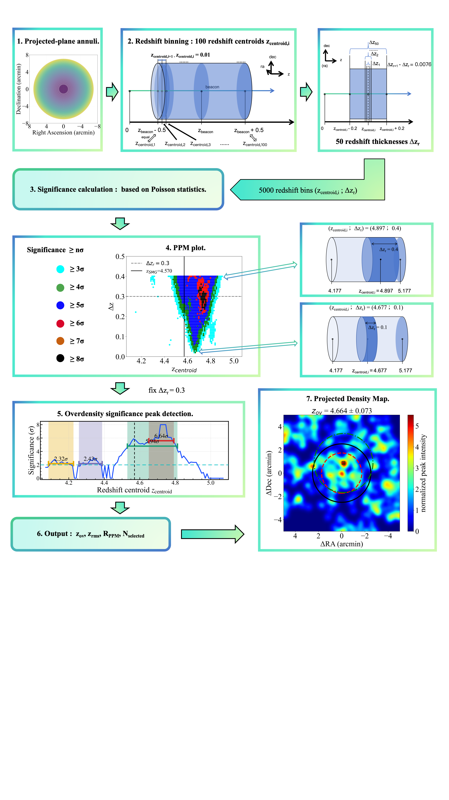
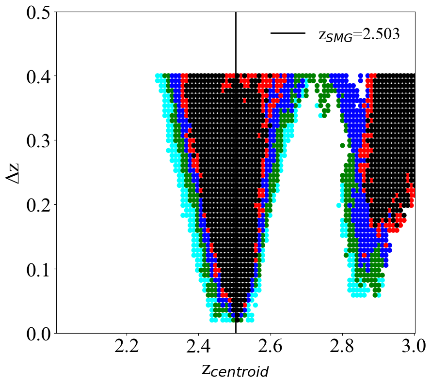
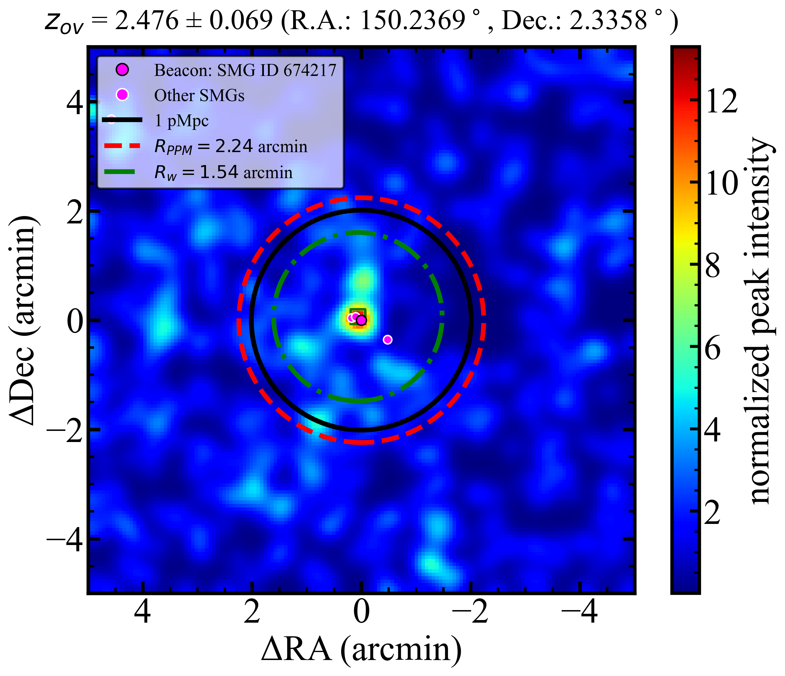
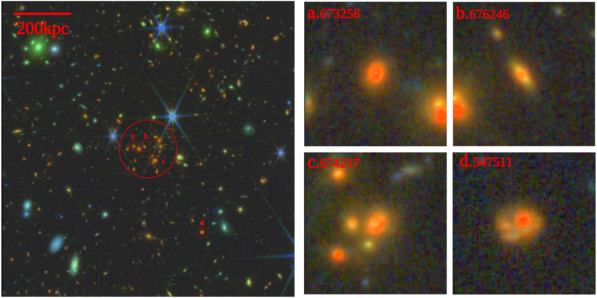
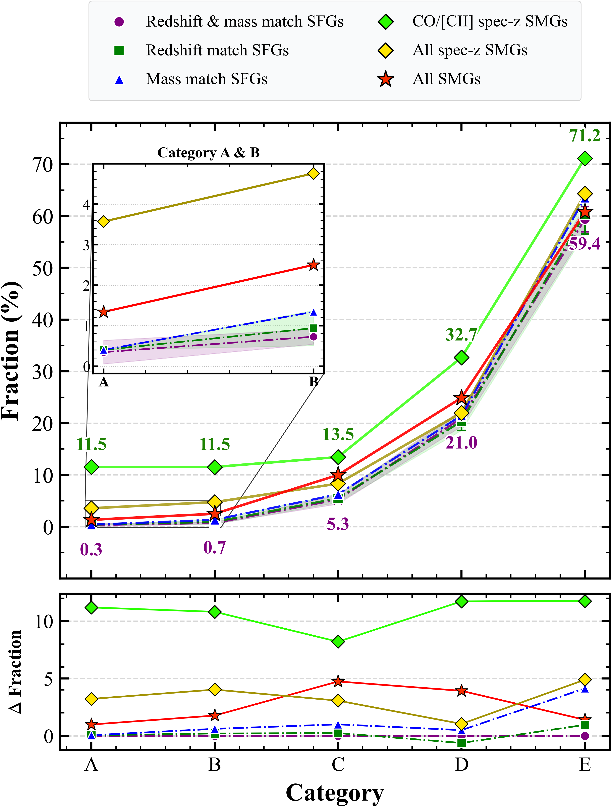

$\newcommand{\ensuremath}{}$
$\newcommand{\xspace}{}$
$\newcommand{\object}[1]{\texttt{#1}}$
$\newcommand{\farcs}{{.}''}$
$\newcommand{\farcm}{{.}'}$
$\newcommand{\arcsec}{''}$
$\newcommand{\arcmin}{'}$
$\newcommand{\ion}[2]{#1#2}$
$\newcommand{\textsc}[1]{\textrm{#1}}$
$\newcommand{\hl}[1]{\textrm{#1}}$
$\newcommand{\footnote}[1]{}$
$\newcommand{\vdag}{(v)^\dagger}$
$\newcommand\aastex{AAS\TeX}$
$\newcommand\latex{La\TeX}$
$\newcommand{\XXX}{\textcolor{red}{XXX}}$
$\newcommand{\CIIline}{[C \textmd{\textsc{ii}}]}$
$\newcommand{\arraystretch}{0.8}$
$\newcommand{\arraystretch}{0.8}$

# Do Submillimeter Galaxies Trace Megaparsec Large-scale Structures? -- An Overdensity Analysis of 449 Submillimeter Galaxies in COSMOS

<mark>Appeared on: 2026-10-02</mark> -  _27 pages of main text and 13 pages of appendix and references. 17 figures in main text and 2 in appendix. Resubmitted to ApJS after addressing referee's comments_

C. Deng, et al. -- incl., <mark>E. Schinnerer</mark>

**Abstract:** We present an environmental analysis and overdensity catalog for a large sample of submillimeter galaxies (SMGs) in the COSMOS field in order to understand whether SMGs are signposts of megaparsec-scale overdensity structures. We apply the Poisson Probability Method (PPM) protocluster finder to characterize the significance ( $\sigma$ ) and overdensity value ( $\delta$ ) of any overdense structures surrounding specific `beacon' galaxies. These beacons include 449 SMGs from A $^{3}$ COSMOS (including 168 with spectroscopic redshifts, 52 of which have CO or $\CIIline$ 158 $\mu$ m line detections), as well as a control sample of over 5000 main-sequence star-forming galaxies (SFGs) selected from the 40-band photometric-redshift catalog in COSMOS2025.    We successfully reproduce 15 known protoclusters and clusters in COSMOS (including _Hyperion_ large-scale structure, CL J1001+0220 at $z \sim 2.5$ , and AzTEC-3 protocluster at $z \sim 5.3$ ),    and report 26 new PPM-based high-overdensity ( $\delta \geq 5$ ), high-significance ( $\sigma \geq 5$ ), robust candidates.    We measure an overdensity fraction of 11.5--71.2 \% (1.3--61.0 \% ) in the CO/ $\CIIline$ 52 SMG (full 449 SMG) sample with different criterion categories, confirming that SMGs are signposts of overdensities compared to the control SFG sample. We also notice that the fraction is lower than 100 \% , indicating that not all SMGs are associated with overdensities. We thus inspect the JWST morphology and argue that the triggering of starburst in SMGs must have non-environmental mechanisms, for instance, merger and violent disk instability.    Finally, we further conduct a spatial distribution analysis, finding that the location of SMGs in overdensities has a redshift evolution, with SMGs being more concentrated in the inner regions of overdensities at higher redshift.

**Figure 9. -** Workflow of our method (see section \ref{sec:method}). Showing the general steps of the PPM method. The PPM plot and the projected density plot are calculated by a randomly selected SMG (ID: 867532). (*fig4*)

**Figure 10. -** PPM diagnostic plots of CL J1001+0220 protocluster.
**Top-left**: PPM redshift-overdensity plot (Section \ref{sec:ppm} Step 4). Colored dots represent different significance levels: $\geq$ 3$\sigma$(cyan), 4$\sigma$(green), 5$\sigma$(blue), 6$\sigma$(red), 7$\sigma$(brown), and 8$\sigma$(black). The `inverted triangle' shape indicates the peak overdensity redshift $z_{\rm{ov}}$ and aligns well with the beacon's redshift indicated by the black vertical line.
**Top-right**: 2D density plot (Section \ref{sec:ppm} Step 7), with color indicating the overdensity value $\delta$. Magenta dots represent the SMGs within the PPM peak's redshift range, and a total of 4 SMGs are found in the core region. The black solid circle and red dashed circle are centered at the projected spatial coordinates of the SMG. The former has a physical radius of $1 \rm{Mpc}$(estimated based on $z_{\rm{ov}}$), and the latter uses $R_{\rm{PPM}}$ as the radius to represent the overdense region detected by PPM. The green rectangular box indicates the peak point with the highest $\delta$. The center of the green dashed circle is at the detection peak of the density plot, and its radius $R_{w}$ is the position where the overdensity value drops to one percent of the peak value. Our reproduced results are in perfect agreement with the position and structure of the protocluster presented by \cite{2016ApJ...828...56W}.
**Bottom**: JWST RGB image of the protocluster with a FoV$\sim$1 $\rm{pMpc^2}$(**bottom-left**) and the four protocluster SMG members labelled $a$--$d$ with FoV$\sim 5$\arcsec$ \times 5$\arcsec$$(**bottom-right**). The red dashed circle is centered at the projected center of the overdensity with a radius of $100 \mathrm{kpc}$.
 (*fig:4.0*)

**Figure 12. -** Statistical results of the sample fractions across the five environment categories (A--E; see Table \ref{tab:table1}). **Top panel:** The absolute fractions for each sample type. The purple circles, green squares, and blue triangles represent the average fractions of sources in each category for the control samples: the redshift--mass-matched SFGs, redshift-matched SFGs, and mass-matched SFGs, respectively. Their corresponding dispersions are indicated by the shaded regions in matching colors. These shaded envelopes represent the $1\sigma$ standard deviation across the five independent iterations used to construct the SFG control samples. In contrast, the SMG samples (denoted by the green diamonds, gold diamonds, and red stars for the CO/$\CIIline$  spec-$z$ SMG, all spec-$z$ SMG, and all SMG samples, respectively) are fixed, single observational datasets and are therefore plotted as exact fractions without uncertainty envelopes. An inset is provided in the upper left to show a zoomed-in view of the lower-fraction Category A and B. **Bottom panel:** The relative differences in fraction ($\Delta$ Fraction) for all samples, plotted with respect to the redshift--mass-matched SFG control sample (purple line at $\Delta = 0$). Overall, the fractions for the all SMG and all spec-$z$ SMG samples are generally higher than those of the control samples. Furthermore, the fractions of the CO/$\CIIline$  spec-$z$ SMGs are significantly higher than the control samples across all categories. This demonstrates the superiority of SMGs as robust tracer beacons for (proto)clusters. (*fig:5.0*)

