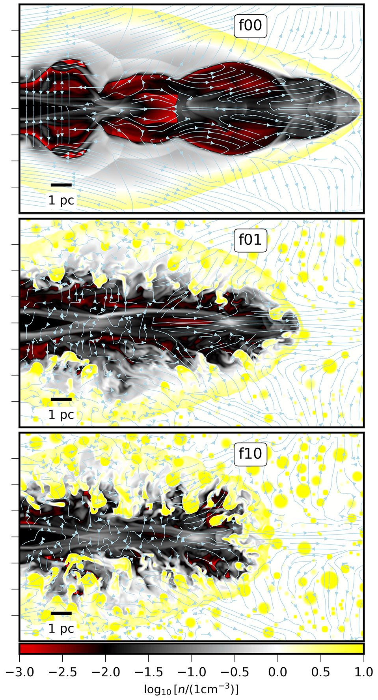
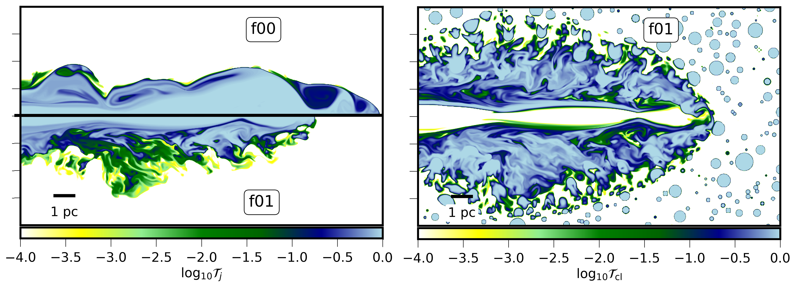
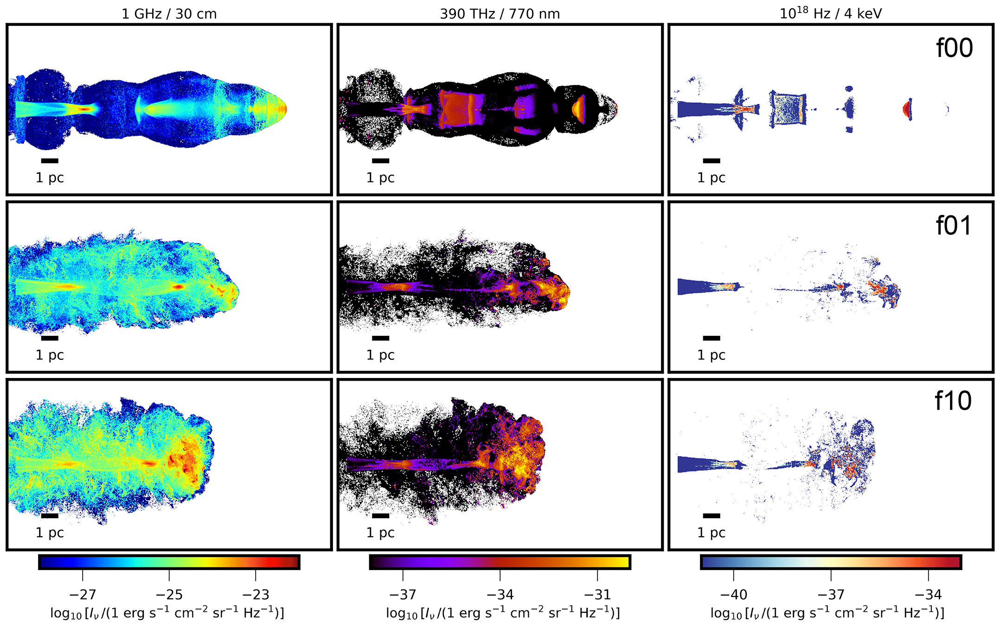

$\newcommand{\ensuremath}{}$
$\newcommand{\xspace}{}$
$\newcommand{\object}[1]{\texttt{#1}}$
$\newcommand{\farcs}{{.}''}$
$\newcommand{\farcm}{{.}'}$
$\newcommand{\arcsec}{''}$
$\newcommand{\arcmin}{'}$
$\newcommand{\ion}[2]{#1#2}$
$\newcommand{\textsc}[1]{\textrm{#1}}$
$\newcommand{\hl}[1]{\textrm{#1}}$
$\newcommand{\footnote}[1]{}$
$\newcommand{\orcid}[1]{\href{#1}{\includegraphics[scale=0.04]{figures/orcid.png}}}$
$\newcommand{\vdag}{(v)^\dagger}$
$\newcommand\aastex{AAS\TeX}$
$\newcommand\latex{La\TeX}$
$\newcommand\ia{\color[HTML]{ad901c}}$
$\newcommand\dens{\text{cm}^{-3}}$
$\newcommand\fZero{\texttt{f00}}$
$\newcommand\fLow{\texttt{f01}}$
$\newcommand\fHigh{\texttt{f10}}$
$\newcommand\fZeroB{\texttt{f00\_M120}}$
$\newcommand\fZeroC{\texttt{f00\_M370}}$
$\newcommand\msun{\text{M}_\odot}$
$\newcommand{\thebibliography}{\DeclareRobustCommand{\VAN}[3]{##3}\VANthebibliography}$

# The Impact of a Clumpy Ambient Medium on the Dynamics \ and Synchrotron Emission of AGN Jets

<mark>Appeared on: 2026-10-02</mark> -  _19 pages, 13 figures, accepted for publication in MNRAS_

<mark>I. Almeida</mark>, <mark>C. Fendt</mark>, B. Vaidya

**Abstract:** Relativistic jets from AGN are expected to propagate through an inhomogeneous ISM, but the role of small-scale gas inhomogeneities in shaping their early evolution remains uncertain. We investigate this problem using 3D special-relativistic magnetohydrodynamic simulations with \texttt{PLUTO} , following a jet with a Lorentz factor of 10 propagating through a pc-scale medium. We compare a homogeneous ambient medium with two clumpy ambient-medium models, motivated by dense gas in the nuclear ISM, in which clouds occupy volume filling factors of $0.1$ and $1$ per cent.We compute synthetic synchrotron maps and spectra from Lagrangian macro-particles that have been accelerated by diffusive shock acceleration.Jet--cloud interactions deflect the flow, enhance shock formation, and produce a more asymmetric cocoon than in the homogeneous ISM case. Altogether, this results in a substantially stronger mass loading: the entrained mass increases from $0.43 \msun$ in the homogeneous run to $5.3$ and $8.8 \msun$ in the clumpy runs. The clumpy ISM also modifies the turbulence and the material mixing within the jet cocoon.The dynamical differences we find translate into brighter and more irregular synchrotron emission.For the same injected jet, the models with a clumpy medium produce stronger frequency-integrated synchrotron emission than the homogeneous run, with the largest differences in the SED occurring from the sub-mm to the infrared/optical bands.Our results demonstrate that including a small-scale ISM structure provides a more complete description of the early dynamical evolution of young AGN jets and their radiative properties.

**Figure 2. -** 
Logarithmic density maps overlaid with velocity streamlines at $t_{\rm sim}=85$ yr.
Panels correspond to \fZero(top), \fLow(middle), and \fHigh(bottom).
The homogeneous case shows a narrow, symmetric jet and a well-defined bow shock.
In the simulations with a clumpy medium, dense clouds locally deflect and distort the jet, producing a broader and more irregular cocoon.
Low-density channels between clouds allow part of the flow to propagate through the inhomogeneous medium.
 (*fig:jet-rho*)

**Figure 11. -** 
Distribution of the passive scalar tracers at $t=85$ yr associated with jet-origin material, $\mathcal{T}_{\rm j}$(left), and cloud-origin material, $\mathcal{T}_{\rm cl}$(right).
_Jet-origin material:_ In the homogeneous case (top), the jet tracer closely follows the density map shown in Figure \ref{fig:jet-rho}.
In contrast, the simulation with a clumpy background shows a narrower distribution, with jet-origin material remaining concentrated near the central channel in the presence of dense clouds.
_Cloud-origin material:_ The cloud tracer shows that disrupted cloud-origin material is distributed throughout much of the cocoon, whereas the central jet-dominated channel remains primarily occupied by jet-origin material.
 (*fig:jet-tracer*)

**Figure 12. -** Synchrotron specific intensity $I_\nu$ at $\nu = 1$ GHz (left), $390$ THz (centre), and $4$ keV (right) for the three main simulations at $t = 85$ yr, assuming a viewing angle of $90^\circ$. In the homogeneous case, the emission is dominated by the jet spine and terminal shock, producing an elongated and symmetric morphology. In contrast, the presence of a multiphase ISM broadens and fragments the emission, with multiple localised bright regions associated with jet--cloud interactions and shock compression. The \fHigh simulation shows the strongest emission, concentrated near the jet head, consistent with enhanced particle acceleration in a dense, clumpy environment. (*fig:EM-Inu*)

