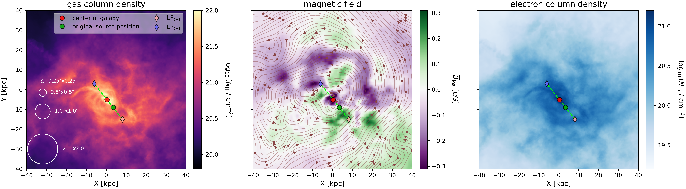
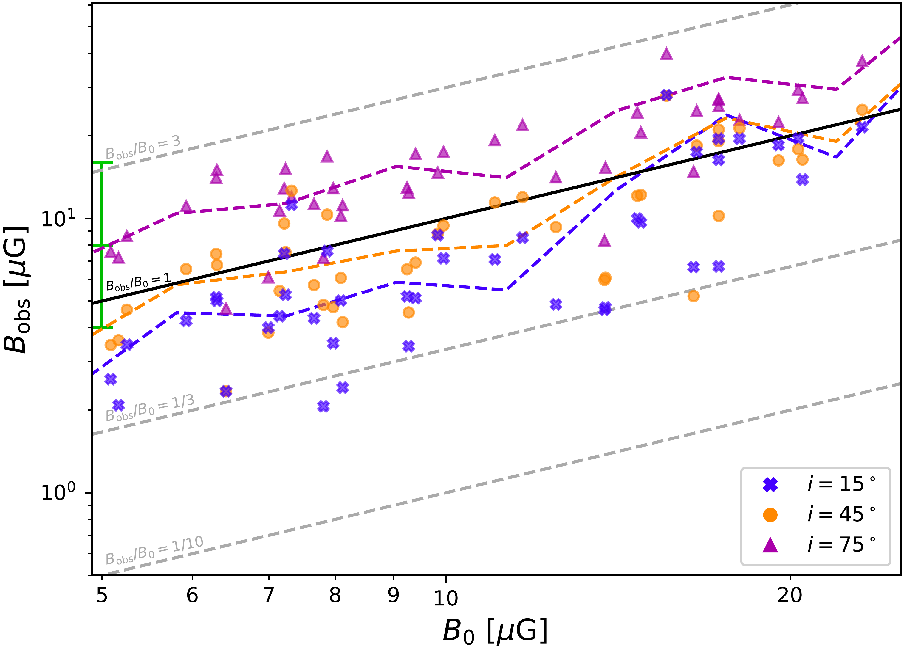
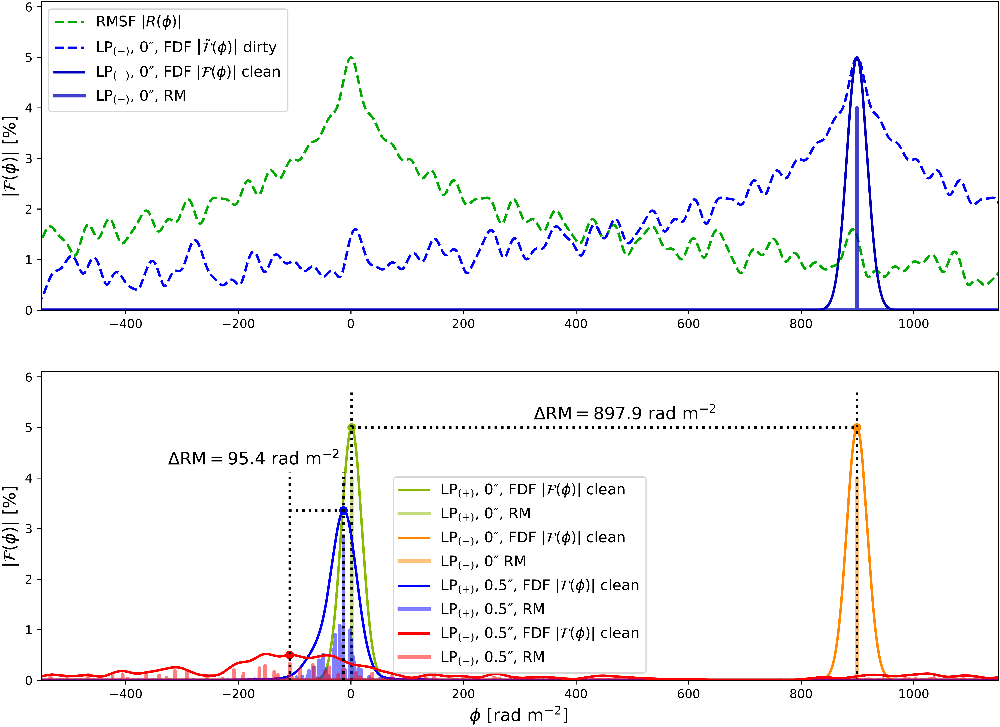

$\newcommand{\ensuremath}{}$
$\newcommand{\xspace}{}$
$\newcommand{\object}[1]{\texttt{#1}}$
$\newcommand{\farcs}{{.}''}$
$\newcommand{\farcm}{{.}'}$
$\newcommand{\arcsec}{''}$
$\newcommand{\arcmin}{'}$
$\newcommand{\ion}[2]{#1#2}$
$\newcommand{\textsc}[1]{\textrm{#1}}$
$\newcommand{\hl}[1]{\textrm{#1}}$
$\newcommand{\footnote}[1]{}$
$\newcommand{\iu}{{i\mkern1mu}}$
$\newcommand{\specialcell}[2][c]{$
$  \begin{tabular}[#1]{@ c@ }#2\end{tabular}}$

# Inferring magnetic field strengths in high-redshift lensing galaxies from Faraday rotation measure observations

<mark>Appeared on: 2026-10-05</mark> -  _17 pages, 13 figures_

S. Reissl, et al. -- incl., <mark>A. Pillepich</mark>

**Abstract:** Observations of Faraday rotation in the lensing-galaxy of CLASS B1152+199 at $z=0.439$ suggest that efficient dynamo mechanisms had already amplified galactic magnetic fields by this epoch. In this work, we evaluate the reliability of this method for deriving magnetic field strengths and assess the likelihood of observing Faraday rotation differences similar to those measured in CLASS B1152+199 . We select 64 star-forming disk galaxies from the TNG50 cosmological magnetohydrodynamical simulation analog to CLASS B1152+199 in mass and redshift and forward model these systems using polarized radiative transfer calculations  with POLARIS and subsequent RM synthesis.We characterize the large-scale magnetic fields directly from the TNG50 galaxies by spatially averaging the magneticfield components and fitting their radial profiles. TNG50 predicts characteristic field strengths of $B_0=1.9-15.6 \mu\mathrm{G}$ for the individual galaxies,while fitting the combined sample yields $B_0=10.3 \mu\mathrm{G}$ . The magnetic field strength $B_{\mathrm{obs}}$ inferred from the synthetic observations generally recovers $B_{\mathrm{0}}$ within a factor of three. We find only a minor dependence of $B_{\mathrm{obs}}$ on the assumed magnetic field geometry, while galaxy inclination and beam depolarization have a stronger impact on the inferred field strength. The differential rotation measure recovered from RM synthesis remains correlated with the directly integrated value, although beam depolarization systematically reduces its magnitude. Finally, only $1.41\%$ of the directly integrated sightline pairs reproduce the observed $\Delta\mathrm{RM}=1040\pm60 \mathrm{rad m^{-2}}$ of CLASS B1152+199 assuming that contributions unrelated to the lensing galaxy cancel between the two images. This fraction increases to $3.16\%$ when restricting the sightlines to galactocentric distances comparable to the observed $2.6$ and $6.5 \mathrm{kpc}$ . We conclude that differential Faraday rotation of gravitationally lensed sources provides a robust probe of large-scale magnetic fields, while the large $\Delta\mathrm{RM}$ observed in CLASS B1152+199 appears to be relatively rare among the considered TNG50 analog galaxies.

**Figure 7. -** Left panel: Face-on map of the gas column density $N_{\mathrm{H}}$ of the exemplary lensing galaxy ID-1026 with a redshift of  $z=0.4$ from our TNG50 simulation sample. The red dot marks the peak value of  $N_{\mathrm{H}}$, and the green dot indicates the true offset position of a fictitious lensed galaxy behind. Purple and pink diamonds represent the corresponding positive (LP$_{(+)}$) and negative (LP$_{(-)}$) solutions of the lensing equation for the background galaxy. White circles indicate the considered beam sizes in arcseconds. Midle panel: The same as the left panel, but for the magnetic field in the disk averaged along the line of sight (LOS). Color coded are magnitude and sign of the LOS component $B_{\mathrm{LOS}}$. Streamlines depict the field component in the disk perpendicular to $B_{\mathrm{LOS}}$. Right panel: The column density map $N_{\mathrm{th}}$ of the distribution of thermal electrons, corrected by star formation as described in the text.  (*fig:InputParams*)

**Figure 2. -**  The same as Fig. \ref{fig:MagGeometry} but for the three different inclinations angles $i=15^\circ$(blue crosses), $i=45^\circ$(yellow dots), and $i=75^\circ$(purple triangles), respectively.  (*fig:MagInc*)

**Figure 10. -** Top panel: The RMSF $R(\phi)$(dashed green) scaled to the peak of the signal, as well as the observed dirty Faraday spectrum $\tilde{\mathcal{F}}(\phi)$(dashed dark blue), the de-convolved and cleaned FDF $\mathcal{F}(\phi)$(solid blue), and the scaled RM component (vertical blue peak) of the negative lensing point LP$_{(-)}$. Bottom panel: The same as the top panel, but for LP$_{(-)}$ as well as LP$_{(+)}$ for a beam size of $0$\arcsec$$ and $0.5$\arcsec$$, respectively. For $0$\arcsec$$, the difference  between the points LP$_{(-)}$(green) and LP$_{(+)}$(light blue) leads to $\Delta\mathrm{RM} = 897.9 \mathrm{rad m}^{-2}$, whereas in the case of a beam size of $0.5$\arcsec$$ we obtain a strikingly different value of $\Delta\mathrm{RM} = 95.4  \mathrm{rad m}^{-2}$ from the difference between LP$_{(-)}$(red) and LP$_{(+)}$(light blue). We note that the considered lensing points LP$_{(-)}$ and LP$_{(+)}$ are identical to those depicted in Fig. \ref{fig:InputParams}.  (*fig:SpectrumBeam*)

