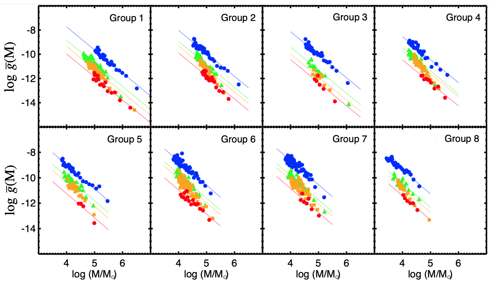
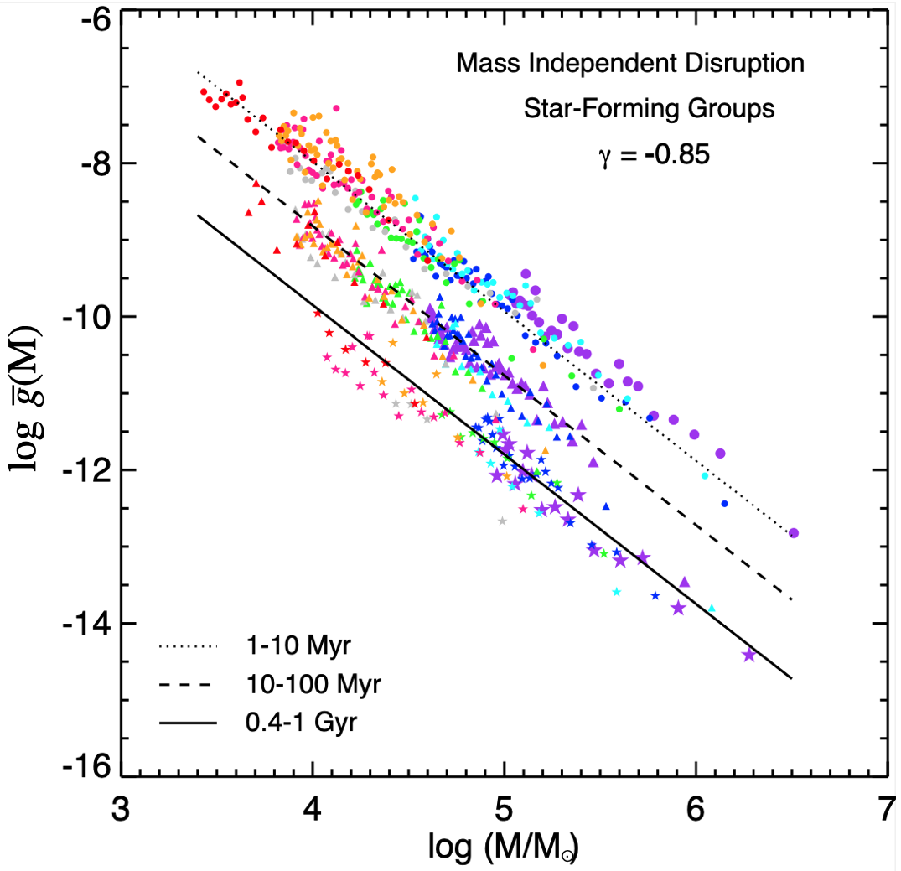
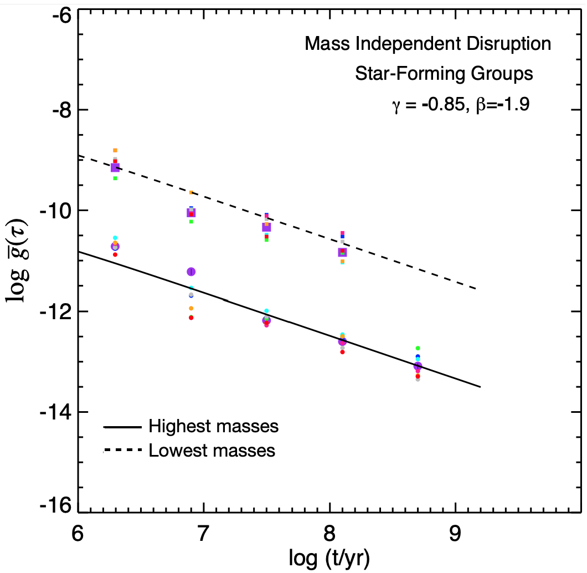
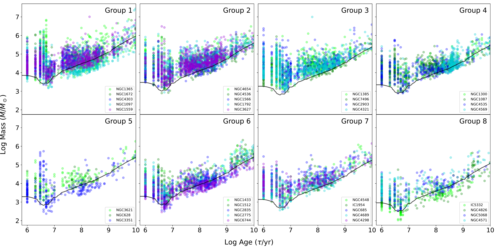

$\newcommand{\ensuremath}{}$
$\newcommand{\xspace}{}$
$\newcommand{\object}[1]{\texttt{#1}}$
$\newcommand{\farcs}{{.}''}$
$\newcommand{\farcm}{{.}'}$
$\newcommand{\arcsec}{''}$
$\newcommand{\arcmin}{'}$
$\newcommand{\ion}[2]{#1#2}$
$\newcommand{\textsc}[1]{\textrm{#1}}$
$\newcommand{\hl}[1]{\textrm{#1}}$
$\newcommand{\footnote}[1]{}$
$\newcommand\aastex{AAS\TeX}$
$\newcommand\latex{La\TeX}$
$\newcommand{\GEMINI}{\affiliation{Gemini Observatory/NSF’s NOIRLab, 950 N. Cherry Avenue, Tucson, AZ, 85719, USA$
$}}$
$\newcommand{\ASCL}{\affiliation{Astrophysics Source Code Librar$
$y, Michigan Technological University, 1400 Townsend Drive, Houghton, MI 49931}}$
$\newcommand{\OSU}{\affiliation{Department of Astronomy, The Ohio State University, 140 West 18th Avenue, Columbus, Ohio 43210, USA}}$
$\newcommand{\Alberta}{\affiliation{Department of Physics, University of Alberta, Edmonton, AB T6G 2E1, Canada}}$
$\newcommand{\ANU}{\affiliation{Research School of Astronomy and Astrophysics, Australian National University, Canberra, ACT 2611, Australia}}$
$\newcommand{\IPARCOS}{\affiliation{Instituto de Física de Partículas y del Cosmos, Universidad Complutense de Madrid, E-28040 Madrid, Spain}}$
$\newcommand{\IPAC}{\affiliation{Caltech-IPAC, 1200 E. California Blvd. Pasadena, CA 91125, USA}}$
$\newcommand{\Carnegie}{\affiliation{Observatories of the Carnegie Institution for Science, 813 Santa Barbara Street, Pasadena, CA 91101, USA}}$
$\newcommand{ÇAPP}{\affiliation{Center for Cosmology and Astroparticle Physics, 191 West Woodruff Avenue, Columbus, OH 43210, USA}}$
$\newcommand{\CfA}{\affiliation{Harvard-Smithsonian Center for Astrophysics, 60 Garden Street, Cambridge, MA 02138, USA}}$
$\newcommand{\CITEVA}{\affiliation{Centro de Astronomía (CITEVA), Universidad de Antofagasta, Avenida Angamos 601, Antofagasta, Chile}}$
$\newcommand{\CNRS}{\affiliation{CNRS, IRAP, 9 Av. du Colonel Roche, BP 44346, F-31028 Toulouse cedex 4, France}}$
$\newcommand{\ESO}{\affiliation{European Southern Observatory, Karl-Schwarzschild Stra{\ss}e 2, D-85748 Garching bei München, Germany}}$
$\newcommand{\Heidelberg}{\affiliation{Astronomisches Rechen-Institut, Zentrum für Astronomie der Universität Heidelberg, Mönchhofstra\ss e 12-14, D-69120 Heidelberg, Germany}}$
$\newcommand{\ICRAR}{\affiliation{International Centre for Radio Astronomy Research, University of Western Australia, 35 Stirling Highway, Crawley, WA 6009, Australia}}$
$\newcommand{\IRAM}{\affiliation{Institut de Radioastronomie Millimétrique (IRAM), 300 Rue de la Piscine, F-38406 Saint Martin d'Hères, France}}$
$\newcommand{\IRAP}{\affiliation{CNRS, IRAP, 9 Av. du Colonel Roche, BP 44346, F-31028 Toulouse cedex 4, France}}$
$\newcommand{\UPS}{\affiliation{Université de Toulouse, UPS-OMP, IRAP, F-31028 Toulouse cedex 4, France}}$
$\newcommand{\ITA}{\affiliation{Universität Heidelberg, Zentrum für Astronomie, Institut für Theoretische Astrophysik, Albert-Ueberle-Str 2, D-69120 Heidelberg, Germany}}$
$\newcommand{\IWR}{\affiliation{Universität Heidelberg, Interdisziplinäres Zentrum für Wissenschaftliches Rechnen, Im Neuenheimer Feld 205, D-69120 Heidelberg, Germany}}$
$\newcommand{\JHU}{\affiliation{Department of Physics and Astronomy, The Johns Hopkins University, Baltimore, MD 21218, USA}}$
$\newcommand{\Leiden}{\affiliation{Leiden Observatory, Leiden University, P.O. Box 9513, 2300 RA Leiden, The Netherlands}}$
$\newcommand{\Maryland}{\affiliation{Department of Astronomy, University of Maryland, College Park, MD 20742, USA}}$
$\newcommand{\MPE}{\affiliation{Max-Planck-Institut für extraterrestrische Physik, Giessenbachstra{\ss}e 1, D-85748 Garching, Germany}}$
$\newcommand{\MPIA}{\affiliation{Max-Planck-Institut für Astronomie, Königstuhl 17, D-69117, Heidelberg, Germany}}$
$\newcommand{\Nagoya}{\affiliation{Department of Physics, Nagoya University, Furo-cho, Chikusa-ku, Nagoya, Aichi 464-8602, Japan}}$
$\newcommand{\NRAO}{\affiliation{National Radio Astronomy Observatory, 520 Edgemont Road, Charlottesville, VA 22903-2475, USA}}$
$\newcommand{\OAN}{\affiliation{Observatorio Astronómico Nacional (IGN), C/Alfonso XII, 3, E-28014 Madrid, Spain}}$
$\newcommand{\OCAD}{\affiliation{OCAD University, Toronto, Ontario, M5T 1W1, Canada}}$
$\newcommand{\ObsParis}{\affiliation{Sorbonne Université, Observatoire de Paris, Université PSL, CNRS, LERMA, F-75014, Paris, France}}$
$\newcommand{\Ox}{\affiliation{Sub-department of Astrophysics, Department of Physics, University of Oxford, Keble Road, Oxford OX1 3RH, UK}}$
$\newcommand{\Princeton}{\affiliation{Department of Astrophysical Sciences, Princeton University, Princeton, NJ 08544 USA}}$
$\newcommand{\UToledo}{\affiliation{Ritter Astrophysical Research Center, University of Toledo, Toledo, OH, 43606}}$
$\newcommand{\Toulouse}{\affiliation{Université de Toulouse, UPS-OMP, IRAP, F-31028 Toulouse cedex 4, France}}$
$\newcommand{\UBonn}{\affiliation{Argelander-Institut für Astronomie, Universität Bonn, Auf dem Hügel 71, 53121 Bonn, Germany}}$
$\newcommand{\UChile}{\affiliation{Departamento de Astronomía, Universidad de Chile, Camino del Observatorio 1515, Las Condes, Santiago, Chile}}$
$\newcommand{\UCM}{\affiliation{Departamento de Física de la Tierra y Astrofísica, Universidad Complutense de Madrid, E-28040 Madrid, Spain}}$
$\newcommand{\UCSD}{\affiliation{Center for Astrophysics and Space Sciences, Department of Physics,  University of California,\ San Diego, 9500 Gilman Drive, La Jolla, CA 92093, USA}}$
$\newcommand{\ULyon}{\affiliation{Univ Lyon, Univ Lyon 1, ENS de Lyon, CNRS, Centre de Recherche Astrophysique de Lyon UMR5574,\ F-69230 Saint-Genis-Laval, France}}$
$\newcommand{\UMass}{\affiliation{University of Massachusetts—Amherst, 710 N. Pleasant Street, Amherst, MA 01003, USA}}$
$\newcommand{\UMichigan}{\affiliation{University of Michigan}}$
$\newcommand{\UniCA}{\affiliation{Université Côte d'Azur, Observatoire de la Côte d'Azur, CNRS, Laboratoire Lagrange, 06000, Nice, France}}$
$\newcommand{\UWyoming}{\affiliation{Department of Physics and Astronomy, University of Wyoming, Laramie, WY 82071, USA}}$
$\newcommand{\LAM}{\affiliation{$
$Aix Marseille Univ, CNRS, CNES, LAM (Laboratoire d’Astrophysique de Marseille),  F-13388 Marseille,$
$France}}$
$\newcommand{\UHawaii}{\affiliation{Institute for Astronomy, University of Hawaii, 2680 Woodlawn Drive, Honolulu, HI 96822, USA}}$
$\newcommand{\UGent}{\affiliation{Sterrenkundig Observatorium, Universiteit Gent, Krijgslaan 281 S9, B-9000 Gent, Belgium}}$
$\newcommand{\IPARC}{\affiliation{Instituto de Física de Partículas y del Cosmos IPARCOS, Facultad de Ciencias Físicas, Universidad Complutense de Madrid, E-28040, Spain}}$
$\newcommand{\STScI}{\affiliation{Space Telescope Science Institute, 3700 San Martin Drive, Baltimore, MD 21218, USA}}$
$\newcommand{\McMaster}{\affiliation{Department of Physics and Astronomy, McMaster University, Hamilton, ON L8S 4M1, Canada}}$
$\newcommand{\INAF}{\affiliation{INAF -- Osservatorio Astrofisico di Arcetri, Largo E. Fermi 5, I-50157, Firenze, Italy}}$
$\newcommand{\Sydney}{\affiliation{Sydney Institute for Astronomy, School of Physics A28, The University of Sydney, NSW 2006, Australia}}$
$\newcommand{\UA}{\affiliation{Centro de Astronomía (CITEVA), Universidad de Antofagasta, Avenida Angamos 601, Antofagasta, Chile}}$
$\newcommand{\LERMA}{\affiliation{Observatoire de Paris, PSL Research University, CNRS, Sorbonne Universités, 75014 Paris}}$
$\newcommand{\SAIMSU}{\affiliation{Sternberg Astronomical Institute, Lomonosov Moscow State University, Universitetsky pr. 13, 119234 Moscow, Russia}}$
$\newcommand{\Rad}{\affiliation{Elizabeth S. and Richard M. Cashin Fellow at the Radcliffe Institute for Advanced Studies at Harvard University, 10 Garden Street, Cambridge, MA 02138, U.S.A.}}$
$\newcommand{\Tenerife}{\affiliation{Instituto de Astrofísica de Canarias, calle Vía Láctea s/n, E-38205 La Laguna, Tenerife, Spain}}$
$\newcommand{\Laguna}{\affiliation{Departamento de Astrofísica, Universidad de La Laguna, Avenida Astrofísico Francisco Sánchez s/n, E-38206 La Laguna, Spain}}$
$\newcommand{\Ensenada}{\affiliation{Instituto de Astronomía, Universidad Nacional Autónoma de México, Unidad Académica en Ensenada, Km 103 Carr. Tijuana-Ensenada, Ensenada, B.C.,\\C.P. 22860, México}}$
$\newcommand{\Cambridge}{\affiliation{Institute of Astronomy and Kavli Institute for Cosmology, University of Cambridge, Madingley Road, Cambridge, CB3 0HA, UK}}$
$\newcommand{\lea}{\mathrel{<\kern-1.0em\lower0.9ex\hbox{\sim}}}$
$\newcommand{\gea}{\mathrel{>\kern-1.0em\lower0.9ex\hbox{\sim}}}$
$\newcommand{\aap}{A\&A}$
$\newcommand{\aaps}{A\&AS}$
$\newcommand{\aapr}{AAPR}$
$\newcommand{\araa}{ARA\&A}$
$\newcommand{\apjl}{ApJ}$
$\newcommand{\apj}{ApJ}$
$\newcommand{\apjs}{ApJS}$
$\newcommand{\aj}{AJ}$
$\newcommand{\mnras}{MNRAS}$
$\newcommand{\pasj}{PASJ}$
$\newcommand{\pasp}{PASP}$
$\newcommand{\nat}{Nature}$
$\newcommand{\lea}{\mathrel{<\kern-1.0em\lower0.9ex\hbox{\sim}}}$
$\newcommand{\gea}{\mathrel{>\kern-1.0em\lower0.9ex\hbox{\sim}}}$

# Star Cluster Populations in 38 Spiral Galaxies: Evidence for Near-Universal Mass and Age Distributions from PHANGS

<mark>Appeared on: 2026-10-05</mark> - 

Rupali~Chandar, et al. -- incl., <mark>E. Schinnerer</mark>

**Abstract:** We present the largest study to date of star cluster mass and age distributions in nearby galaxies. The analysis is based on a uniformly selected catalog of over 15,000 (36,000) human (machine) classified compact clusters across 38 spiral galaxies in the PHANGS-HST survey, with improved photometric SED age dating that mitigates key degeneracies with reddening and metallicity. The galaxies span a factor of $\sim$ 100 in star formation rate (SFR) and in their surface density of star formation and molecular gas ( $\Sigma_{\rm SFR}$ , $\Sigma_{\rm H_2}$ ), and cover a broad range of morphologies. We find that cluster mass functions are well described by a power law, $dN/dM\propto M^{\beta}$ , with $\beta=-1.9\pm0.2$ , and that this shape is remarkably similar across all galaxies in our sample and eight composite groups of galaxies with similar SFRs, with no significant dependence on SFR, $\Sigma_{\rm SFR}$ , or $\Sigma_{\rm H_2}$ .Cluster age distributions decline steeply and can be described by $dN/d\tau\propto\tau^{\gamma}$ with $\gamma=-0.83\pm0.24$ , again with little dependence on host-galaxy properties or cluster mass. The independence of the mass and age distributions implies a separable joint distribution, $g(M,\tau)\propto M^{\beta}\tau^{\gamma}$ , and suggests that cluster populations in spiral disks are dominated by strong, mass-independent dissolution over their first $\sim$ Gyr. These results establish a benchmark for interpreting cluster demographics across diverse galactic environments and provide context for studies of young cluster populations at high redshift.

**Figure 3. -** ** Mass function of star clusters for the eight galaxy groups have similar shapes but different amplitudes.** The groups are arranged in order of decreasing star formation rate starting from the upper-left.  Each panel shows the mass function in four intervals of age: $1-10$ Myr (blue), $10-100$ Myr (green), $100-400$ Myr (orange), and $0.4-1$ Gyr (red).  Each distribution is divided by the amount of time elapsed in the interval, and the normalizations are preserved.   The lines show that a power-law with index $\beta=-1.9$ is a good approximation to each distribution; the best fit values of $\beta$ are compiled in Table \ref{tab:betagroups}. The normalization of the mass functions decreases systematically with increasing cluster age in all galaxy groups.
     (*fig-gM_groups*)

**Figure 9. -** ** Mass-independent dissolution does not alter the shapes of the mass or age distributions, but decreases the amplitude of the mass function over time.** The left panel plots together the mass functions of all 8 galaxy groups, where the amplitudes of the observed mass functions are normalized only so that $1-10$ Myr clusters from groups 2-8 match those of group 1, and the differences in amplitude between the $10-100$ Myr and $0.4-1$ Gyr distributions are preserved between each galaxy group. Together, the galaxy groups form a nearly seamless power-law distribution covering a factor of $\approx1000$ in cluster mass for all three age intervals.  The black lines in the left panel show the predicted evolution of the cluster mass function $\overline{g}(M)$ from a mass-independent dissolution model with $\gamma = -0.85$. The right panel plots together the age distributions from all 8 galaxy groups, where groups 2-8 are normalized to match group 1. The age distributions have similar shapes even though a different mass interval was used for each group. The predicted shape of the age distribution is similar for different mass intervals when cluster dissolution is independent of mass.
     See section 6.1 for details.  (*fig-modelMID*)

**Figure 2. -** ** The age-mass diagrams of clusters in the eight galaxy groups** that are used throughout this work and described in Section 2.1, organized from highest to lowest SFR. The cluster populations formed continuously over at least the past Gyr, and the composite SFR was likely approximately constant over this period since multiple galaxies have been stacked together and it is unlikely they experienced variations in their SFR at the exact same time. The decrease in the upper end of cluster masses with SFR is quite noticeable, with a drop by a factor of $\approx100$ from the highest to lowest star-forming group. The black line represents the luminosity limit in the galaxy with the most conservative lower mass limit within the group. (*fig-Mt_SFgroups*)

