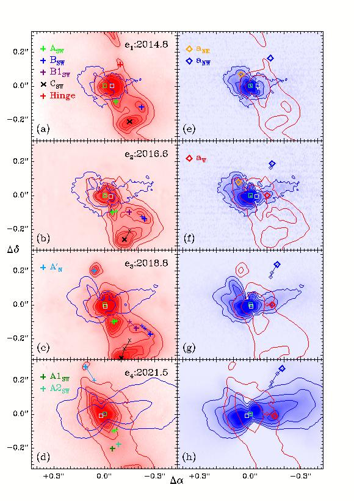
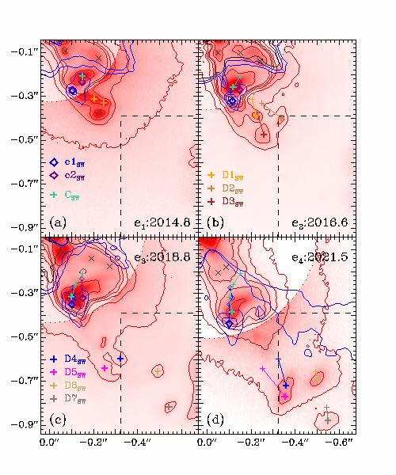
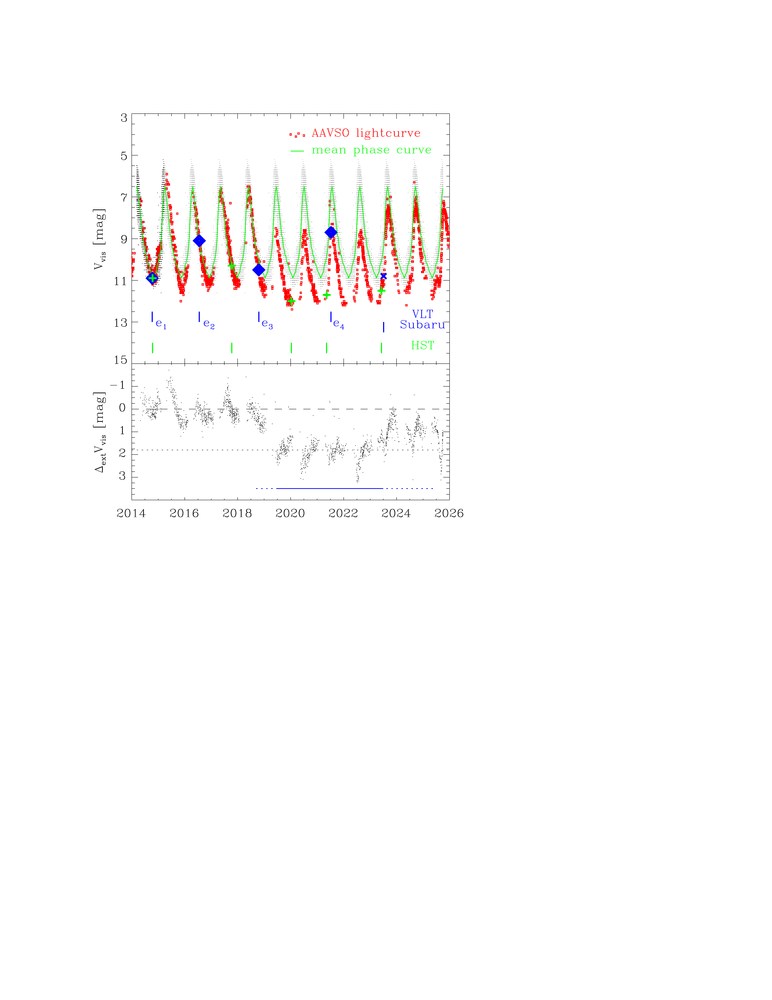

$\newcommand{\ensuremath}{}$
$\newcommand{\xspace}{}$
$\newcommand{\object}[1]{\texttt{#1}}$
$\newcommand{\farcs}{{.}''}$
$\newcommand{\farcm}{{.}'}$
$\newcommand{\arcsec}{''}$
$\newcommand{\arcmin}{'}$
$\newcommand{\ion}[2]{#1#2}$
$\newcommand{\textsc}[1]{\textrm{#1}}$
$\newcommand{\hl}[1]{\textrm{#1}}$
$\newcommand{\footnote}[1]{}$
$\newcommand\gapprox{\;\rlap{\lower 2.5pt$
$ \hbox{\sim}}\raise 1.5pt\hbox{>}\;}$
$\newcommand\lapprox{\;\rlap{\lower 2.5pt$
$ \hbox{\sim}}\raise 1.5pt\hbox{<}\;}$

# SPHERE/ZIMPOL observations of the symbiotic  system R Aquarii$\thanks{Based on observations collected at the    European Southern Observatory under ESO programmes    60.A-9249, 097.D-0516, 0102.D-0501, and 1104.C-0416.}$: II. Dynamics of the dust in the Mira wind and the H$\alpha$      gas in the jet

<mark>Appeared on: 2026-10-06</mark> -  _25 pages, 22 figures, accepted by Astonomy & Astrophysics_

H. Schmid, et al. -- incl., <mark>G. Chauvin</mark>, <mark>M. Feldt</mark>, <mark>T. Henning</mark>

**Abstract:** R Aqr is a resolved symbiotic Mira binary and a      prototype target for the study of complex hydrodynamic processes      including dust-driven mass loss, mass transfer, accretion,      and jet outflows and the formation of strongly asymmetric      circumstellar structures. With the aim of gaining a better understanding of      the complex hydrodynamics of R Aqr, we conducted an      investigation based on new high-resolution imaging of the H $\alpha$ emission from the ionized gas and of the polarization from      scattering dust. We analyzed SPHERE/ZIMPOL H $\alpha$ and polarization maps      with a resolution of $\approx 25$ mas (5 AU)      for the innermost region -- $r\lapprox 2"$ ( $\lapprox 400$ AU) -- of      the R Aqr system.      Data for four epochs were taken covering 6.7 years, including      the dust eclipse phase around 2021,     providing the angular motion and structural changes for the     H $\alpha$ and dust clouds, which are measured and described in detail.     The results are compared with literature data and put into context     with respect to models for AGB star binaries. The central H $\alpha$ emission traces the      orbital motion of the hot component.      The circumstellar polarization from scattering      dust shows interaction effects near the binary ( $\lapprox 60$ AU),      including a flattened distribution aligned with the orbital plane,      corotating dust, and a reduction of the scattering signal during      the dust eclipse phase. The polarization shows for $\gapprox 60$ AU      a steady outflow with about a dozen dust clouds,      a few of which have a comet-like core and tail features.      The dust velocity is about $20 {\rm km s}^{-1}$ ,      and this is faster than for the CO gas measured with ALMA.      Several prominent H $\alpha$ clouds near the binary ( $\lapprox 200$ AU)      also show scattering polarization because they are just      partly ionized dust clouds from the Mira wind. We      also found small faster-moving transient H $\alpha$ clouds, pointing      to outflow instabilities such as those in clumpy winds of hot stars. The      observed temporal changes of the H $\alpha$ emission, in particular the      overall angular shift during the dust eclipse event, can      be explained by strong illumination changes from the hot component.      At a larger separation ( $\gapprox 500 $ AU), the H $\alpha$ clouds move      faster ( $>100 {\rm km s}^{-1}$ ), in agreement with previous studies.      This acceleration in the outflow is probably a result of gas      heating by photoionization and shocks in the clumpy outflow, and      the produced overpressure gives rise to the two well-known      jet-like features expanding in polar directions. Monitoring of the inner regions of R Aqr shows      the motion and evolution of different structures      in the dusty Mira wind and the ionized outflow of the hot component,      and these features provide unambiguous information about the      hydrodynamics of the      circumstellar material. Such observations are very      useful to clarify the complex phenomena taking place in      interacting binaries with asymptotic giant branch stars.

**Figure 4. -** Differential flux $I_{{\rm H}\alpha}$(left) and I-band
  polarization $Q_\phi^{\rm ex}$(right) for the center of R Aqr.
  Relative flux contours for $I_{{\rm H}\alpha}$ are given for levels
  $c\cdot n$ with $n=1,2,3,4,5$ and
  $c\cdot 2^n$ with $n=0,1,2,3$ for $Q_\phi^{\rm ex}$.
  Some contours for the polarization are repeated in the H$\alpha$ maps
  and vice versa for comparison.
  H$\alpha$ and $Q_\phi^{\rm ex}$ clouds are identified and replotted with small symbols and lines
  in later epochs to indicate cloud motions. The green and white squares mark the two stellar components. (*HaDustCent*)

**Figure 10. -** H$\alpha$ emission $I_{{\rm H}\alpha}$ in the inner region
  of the southwest outflow for the four VLT epochs.
  Relative $I_{{\rm H}\alpha}$ contours for flux levels
  $c\cdot n$ with $n=1,2,3,4,5,10$ are given in red. The color scale has a
  radial step of a factor of three marked by the dotted line to show
  bright clouds near the binary and fainter clouds further out.
  Blue contours and points illustrate
  the dust polarization in this region. Clouds are identified and replotted in later epochs
  with small symbols and lines to indicate cloud motions. Black
  crosses ($\times$) mark clouds discussed in Sect. \ref{Hato03}.
  The dashed lines indicates the region also covered by Fig. \ref{HaSW3}. (*HaSW2*)

**Figure 2. -** Upper panel: R Aqr light curve V$_{\rm vis}$ from 2014 to 2025
from the AAVSO database (red squares) plotted together with
the mean pulsation phase light curve ${\rm V}_{\rm max}(\phi)$ for the years
2000 to 2015 (green line). Small gray points are individual measurements
for this phase curve. High-resolution imaging observations are indicated: blue diamonds are for the VLT, the blue cross is for Subaru, and green crosses are
for HST. Lower panel: Difference ${\rm V}_{\rm vis}-{\rm V}_{\rm max}(\phi)$
representing roughly the extra extinction $\Delta_{\rm ext}{\rm V}_{\rm vis}$
during the dust eclipse event lasting from about 2019.5 to 2023.5, as indicated
by the blue line. (*lightcurve*)

