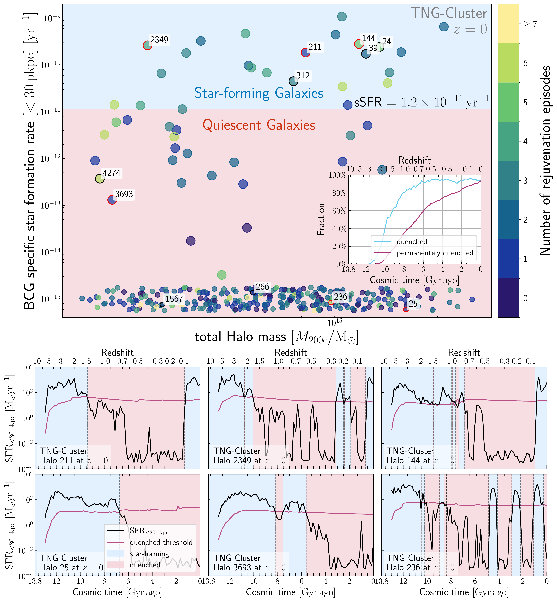
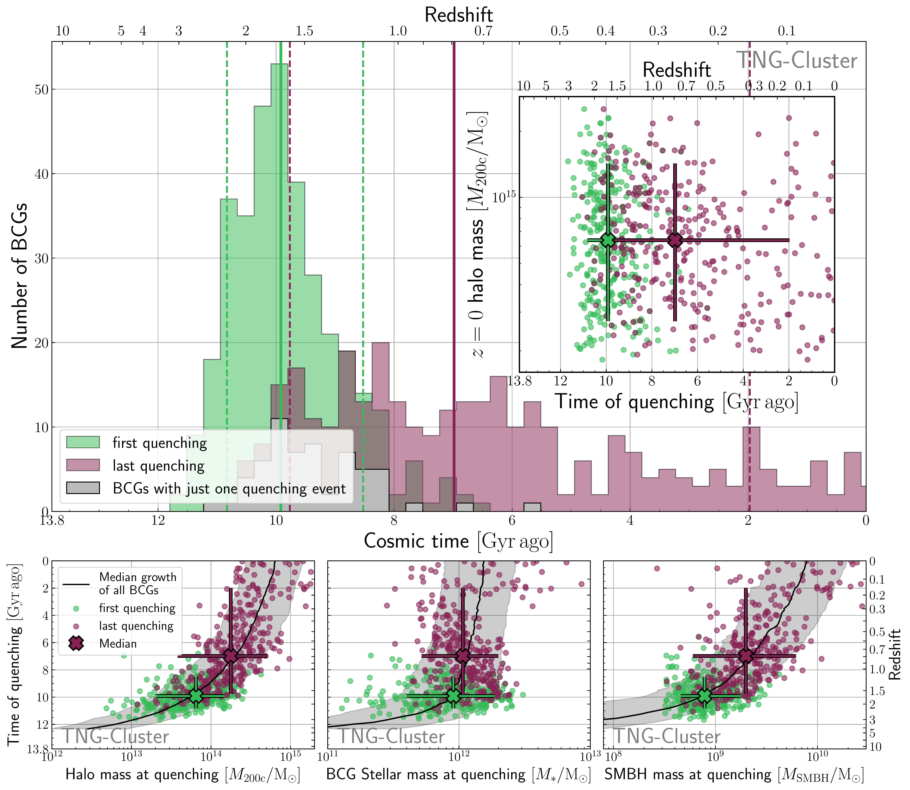
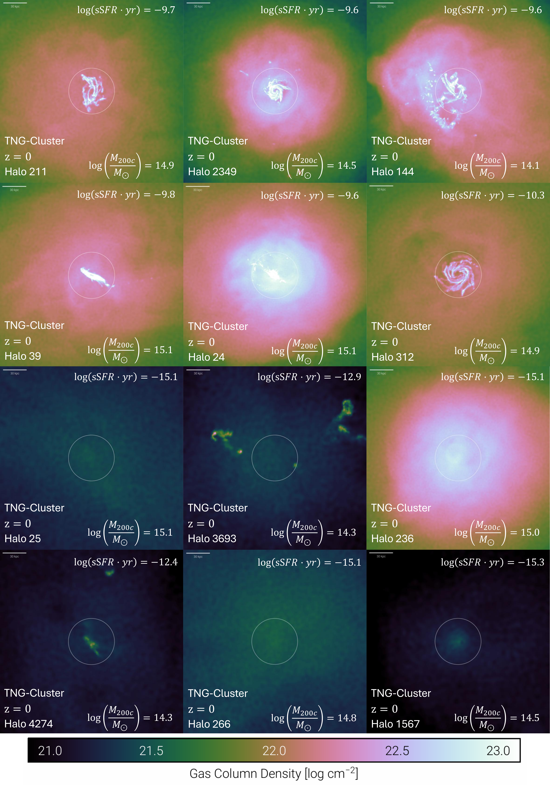

$\newcommand{\ensuremath}{}$
$\newcommand{\xspace}{}$
$\newcommand{\object}[1]{\texttt{#1}}$
$\newcommand{\farcs}{{.}''}$
$\newcommand{\farcm}{{.}'}$
$\newcommand{\arcsec}{''}$
$\newcommand{\arcmin}{'}$
$\newcommand{\ion}[2]{#1#2}$
$\newcommand{\textsc}[1]{\textrm{#1}}$
$\newcommand{\hl}[1]{\textrm{#1}}$
$\newcommand{\footnote}[1]{}$
$\newcommand{\Mcrit}{M_{200\mathrm{c}}}$
$\newcommand{\MSMBH}{M_{\mathrm{SMBH}}}$
$\newcommand{\Mstar}{M_{*}}$
$\newcommand{\Msun}{\mathrm{M}_{\odot}}$
$\newcommand{\betakin}{\beta}$
$\newcommand{\thebibliography}{\DeclareRobustCommand{\VAN}[3]{##3}\VANthebibliography}$

# The star-forming past and quenching of brightest cluster galaxies in TNG-Cluster

<mark>Appeared on: 2026-10-06</mark> -  _15 pages, 7 Figures, submitted to MNRAS_

S. Gottschewski, et al. -- incl., <mark>J. Braspenning</mark>, <mark>A. Pillepich</mark>

**Abstract:** The Brightest Cluster Galaxies (BCGs) in the most massive galaxy clusters of our Universe are, at present, mostly quiescent, elliptical, and red. However, their formation histories are unclear and likely different from those of massive ellipticals in lower-mass haloes. Simulations face the challenge of simultaneously requiring large volumes to sample massive clusters and sufficient resolution to model their stellar populations. Therefore, we make use of TNG-Cluster, one of the highest-resolution cosmological simulations of galaxy clusters, which returns 352 BCGs at $z=0$ with stellar masses $M_{*, <30  \mathrm{pkpc}} = 10^{11.6-12.9}  \Msun$ and total halo masses $\Mcrit = 10^{14.3-15.4} \Msun$ . 93 per cent of the BCGs are quenched at $z=0$ , whereas at redshift $z>3$ all their main progenitors were still star forming. The star-formation histories of individual BCGs are complex, including multiple (re)quenching episodes. They rejuvenate on average $2.1 \pm 1.8$ times since $z=3$ . BCGs quench for the first time $9.9^{+0.9}_{-1.4}  \mathrm{Gyr}$ ago (10th-90th percentiles; $z=1.7^{+0.5}_{-0.5}$ ), while the last and final quenching event occurred $7.0^{+2.8}_{-5.0}  \mathrm{Gyr}$ ago ( $z=0.8^{+0.8}_{-0.6}$ ). We find a large scatter in the halo, stellar, and SMBH masses at both first and last quenching, suggesting no characteristic mass at which quenching occurs. Instead, BCGs quench for the first time when the cumulative kinetic energy injected by their SMBH equals the BCG binding energy, corresponding to a delay of $2.3^{+1.2}_{-1.2}   \mathrm{Gyr}$ after the first SMBH kinetic energy injection. Namely, TNG-Cluster BCGs quench when they experience significant gas expulsion. Our work shows that BCGs have complex and varied star-formation histories, with multiple rejuvenation episodes, but they ultimately quench due to SMBH feedback.

**Figure 4. -** **According to TNG-Cluster, BCGs undergo multiple quenching and rejuvenation episodes.** Top: sSFR versus total cluster mass $\Mcrit$ of all BCGs in TNG-Cluster at $z=0$, colour-coded by the number of rejuvenation episodes any given BCG has undergone during its lifetime. The dashed line marks the $z=0$ quenched threshold $\mathrm{sSFR} = 1.21 \times 10^{11}   \text{yr}^{-1}$, dividing the star-forming from the quiescent population. While 93 per cent of the BCGs are quenched, the number of rejuvenation episodes does not correlate with sSFR or halo mass. The BCGs shown in the gas maps in Fig. \ref{fig:gasmaps} are circled in black and red, and their ID is annotated. In the inline plot, we plot the fraction of quenched galaxies over time. The blue curve corresponds to the total fraction of quiescent BCGs at each snapshot, the magenta curve represents the fraction of BCGs that are permanently quenched, meaning that they have already undergone their last quenching event and remain quenched until $z=0$. Both curves start growing from zero between 11 and 11.7 Gyr ago, i.e., between $z \sim 3$ and $\sim 2.3$. Bottom: Star-formation histories of 6 example BCGs, marked by the red circles in the scatter plot above, and selected such that they represent the whole variety of number of rejuvenation episodes while spanning the whole mass range. The 3 upper BCGs are star forming, whereas the 3 bottom BCGs are quenched at $z=0$. The black curve denotes the instantaneous SFR at each snapshot, while the magenta curve represents the limit below which the BCG is categorized as quenched. The blue (red) shaded areas denote when the BCG is star-forming (quenched). All BCGs begin as star-forming galaxies, while the frequency and duration of the rejuvenation periods differ considerably among BCGs. (*fig:sfr*)

**Figure 5. -** **When did BCGs quench according to TNG-Cluster?** Top: Distribution of the times of first and last quenching. The green (magenta) bars indicate the times of first (last) quenching of all BCGs; the grey bars represent BCGs with just one quenching, meaning that the first and last quenching events coincide. The solid vertical lines are the median, with the dashed lines denoting the 10th and 90th percentiles. The first quenching happens at a cosmic time of $9.9^{+0.9}_{-1.4}   \mathrm{Gyr}$ ago, and the last quenching at $7.0^{+2.8}_{-5.0}   \mathrm{Gyr}$ ago, meaning that the last quenching is more scattered than the first quenching. In the inline plot, the time of the first (last) quenching is shown in green (magenta) for all BCGs as a function of halo mass at $z=0$. The $z=0$ halo mass does not seem to correlate with the times of the first and last quenching. Bottom: Time of first and last quenching versus the halo mass $\Mcrit$(left), stellar mass $\Mstar$, and mass of the SMBH $\MSMBH$, all at the corresponding quenching times. The median and the 10th-90th percentiles are plotted. The black curve shows the median mass growth across all halos, with the shaded region being the 10th to 90th percentile. The scatter in halo, stellar, and SMBH masses at the times of quenching is large and follows roughly the median mass growth. This suggests that, at least for BCGs, there is no characteristic mass of quenching. (*fig:quenchingtimes*)

**Figure 3. -** **Star-forming BCGs are discy.** Maps of the projected gas column density at $z=0$ for 12 example BCGs from TNG-Cluster. They are selected to cover the full range of halo masses and sSFR values. The upper two rows are BCGs that are star forming, while the bottom two rows depict quenched BCGs. The white circle represents the radius of 30 pkpc. sSFR and halo mass at $z=0$ are annotated. Star-forming BCGs show higher gas densities and, in most cases, characteristic gaseous disc features, while this is not the case for the quiescent galaxies. Maps generated with the TNG online visualization tool. (*fig:gasmaps*)

