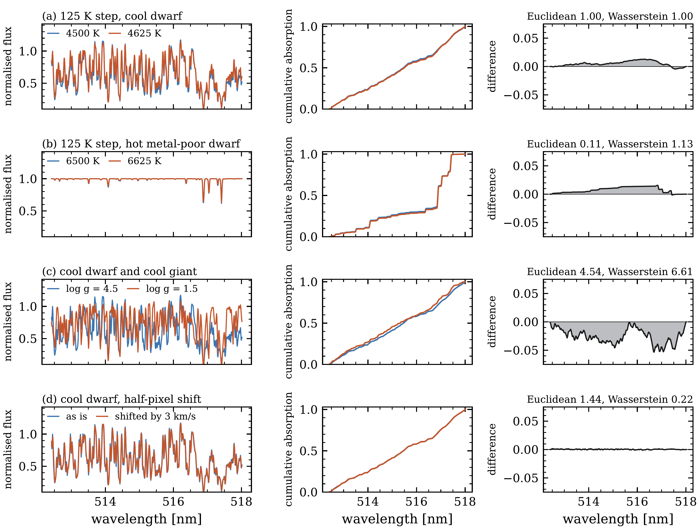
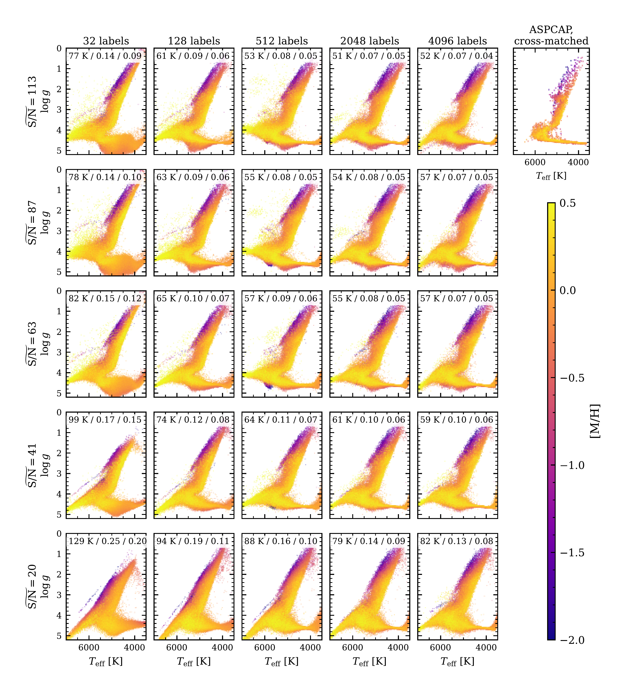
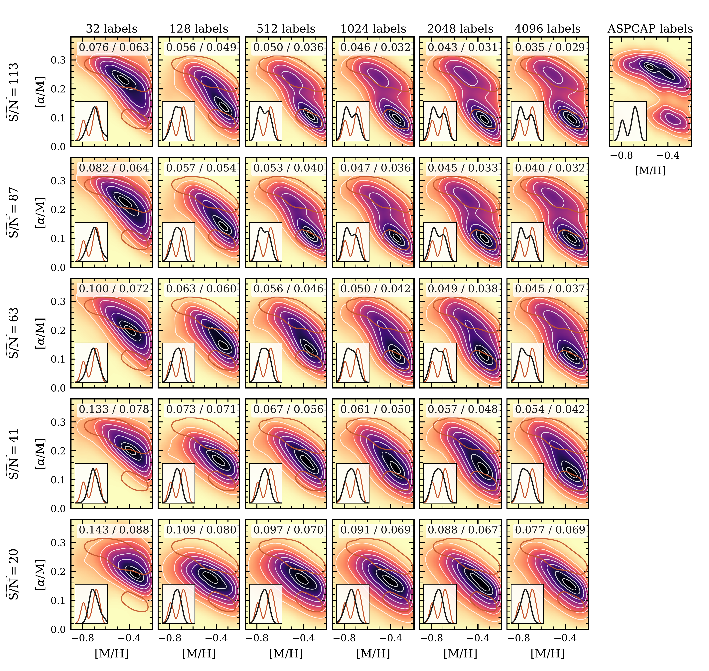

$\newcommand{\ensuremath}{}$
$\newcommand{\xspace}{}$
$\newcommand{\object}[1]{\texttt{#1}}$
$\newcommand{\farcs}{{.}''}$
$\newcommand{\farcm}{{.}'}$
$\newcommand{\arcsec}{''}$
$\newcommand{\arcmin}{'}$
$\newcommand{\ion}[2]{#1#2}$
$\newcommand{\textsc}[1]{\textrm{#1}}$
$\newcommand{\hl}[1]{\textrm{#1}}$
$\newcommand{\footnote}[1]{}$
$\newcommand{\Teff}{T_{\rm eff}}$
$\newcommand{\logg}{\log g}$
$\newcommand{\feh}{\mathrm{[M/H]}}$
$\newcommand{\alphafe}{[\alpha/\mathrm{M}]}$
$\newcommand{\cm}{[\mathrm{C/M}]}$
$\newcommand{\nm}{[\mathrm{N/M}]}$
$\newcommand{\dd}{\mathrm{d}}$
$\newcommand{\Wone}{W_1}$
$\newcommand{\topfraction}{0.92}$
$\newcommand{\bottomfraction}{0.85}$
$\newcommand{\textfraction}{0.06}$
$\newcommand{\floatpagefraction}{0.72}$
$\newcommand{\dbltopfraction}{0.92}$
$\newcommand{\dblfloatpagefraction}{0.72}$
$\newcommand{\arraystretch}{1.12}$

# Armillary: A Label-Free Coordinate System for Stellar Spectra

<mark>Appeared on: 2026-10-07</mark> -  _24 pages, 11 figures; submitted to the Open Journal of Astrophysics. Comments welcome_

<mark>Y.-S. Ting</mark>, S. Saad

**Abstract:** A stellar spectrum is determined by a few parameters, so a set of spectra lies on a low-dimensional manifold with those parameters as its coordinates. We introduce Armillary, which generalises the Sequencer of Baron and Ménard from an ordering to multidimensional coordinates, constructed from the spectra alone. Two stars are compared by the Wasserstein distance between their signed absorption profiles. Shortest paths through a nearest-neighbour graph measure distance along the manifold and give the coordinates, and the same graph transfers the labels of a few stars to all the others. The coordinates are more nearly linear in $\Teff$ and $\logg$ than principal components, t-SNE, UMAP or an autoencoder. The label transfer, without deep learning, is more precise than the first three and comparable to the autoencoder. On $202 932$ APOGEE DR17 stars, an illustrative draw of $32$ training stars recovers the ASPCAP $\Teff$ , $\logg$ and $\feh$ of held-out dwarfs and giants, with $1\sigma$ errors of $100$ K, $0.18$ and $0.083$ dex. Resolving the two $\alpha$ sequences of the disc in $\alphafe$ for giants takes $128$ training stars, and with $2048$ the four errors improve to $33$ K, $0.06$ , $0.026$ and $0.022$ dex. On $104 799$ DESI stars, $32$ training labels from APOGEE recover the stellar parameters to $129$ K, $0.25$ and $0.203$ dex, even for spectra degraded to a signal-to-noise of about $20$ . At a signal-to-noise of about $100$ , $2048$ training labels resolve the two $\alpha$ sequences of the disc in DESI giants, with errors against APOGEE of $51$ K, $0.07$ , $0.047$ and $0.026$ dex. The code is public at $\url{https://github.com/tingyuansen/armillary}$ .

**Figure 2. -** The Wasserstein distance measures a change of the spectrum more evenly than the Euclidean distance does, shown on four pairs of synthetic spectra, one pair per row, in the chunk containing the Mg b triplet. Left, the normalised flux. Middle, the cumulative absorption curves $F$. Right, their difference, whose integral (shaded) is the Wasserstein distance of the chunk. Above each right-hand panel are the Euclidean and Wasserstein distances between the two complete spectra, over all chunks, each in units of its own value in row (a). Every row then reads as a number of temperature steps of the cool dwarf under each distance. (a) A $125$ K step for a cool dwarf ($4500$ K, $\logg=4.5$, solar metallicity). (b) The same step for a hot metal-poor dwarf ($6500$ K, $\logg=4.5$, $\feh=-2$). (c) The cool dwarf and a cool giant ($\logg=1.5$) of the same temperature and metallicity. (d) The cool dwarf and itself shifted by half a pixel, $3$ km s$^{-1}$ at this resolution. (*fig:ruler*)

**Figure 10. -** APOGEE's labels transferred to the DESI spectra through Armillary's graph, against the median red-grid signal-to-noise (rows) and the size of the training set (columns). Each panel is the Kiel diagram of the $104 799$ DESI stars, coloured by $\feh$, with the labels transferred from a training set of the cross-matched stars. The panel above the colour bar is the Kiel diagram of the $4799$ cross-matched stars in ASPCAP's labels. The numbers are the $1\sigma$ errors against ASPCAP in $\Teff$, $\logg$ and $\feh$ over the cross-matched stars not in the training set. (*fig:surveys*)

**Figure 11. -** The emergence of $\alpha$ structure in DESI against the signal-to-noise of the spectra and the size of the training set, in the $\alphafe$--$\feh$ plane of every giant of the graph by its transferred labels. Down the figure the noise increases to the median signal-to-noise named at the left, and the labels are transferred again through Armillary's graph. Across it the number of training stars increases through $32$, $128$, $512$, $1024$, $2048$ and $4096$. The panel at the top right is ASPCAP's labels for the cross-matched giants. Each panel is a smoothed density with white contours at the same fractions of its peak throughout, and the orange contour repeats one contour of the ASPCAP panel. The inset of each panel is the distribution of $\alphafe$ of the giants with $-0.55<$\feh$<-0.3$, ASPCAP's in orange. The numbers at the top are the $1\sigma$ errors of the transferred $\feh$ and $\alphafe$ against ASPCAP's over the cross-matched giants not in the training set. (*fig:alphaseq*)

