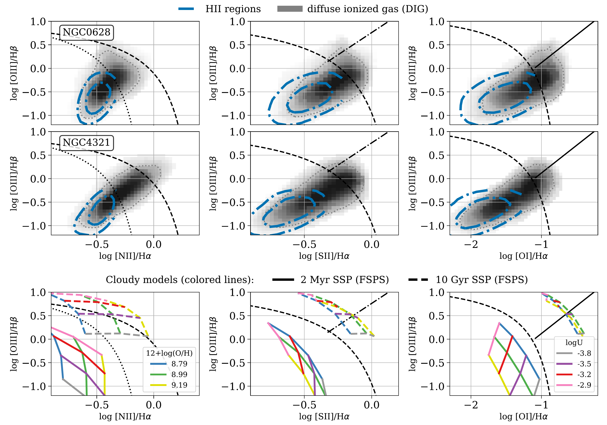
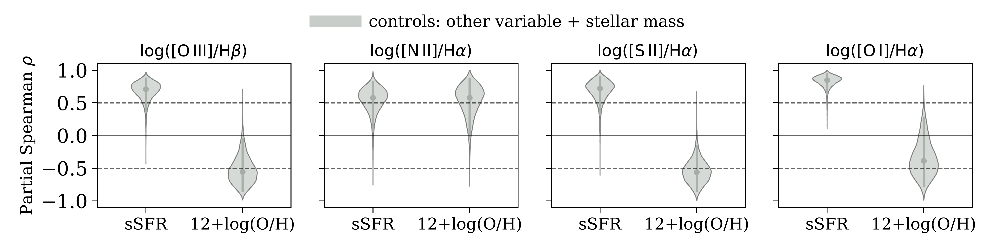
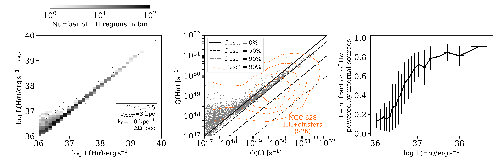

$\newcommand{\ensuremath}{}$
$\newcommand{\xspace}{}$
$\newcommand{\object}[1]{\texttt{#1}}$
$\newcommand{\farcs}{{.}''}$
$\newcommand{\farcm}{{.}'}$
$\newcommand{\arcsec}{''}$
$\newcommand{\arcmin}{'}$
$\newcommand{\ion}[2]{#1#2}$
$\newcommand{\textsc}[1]{\textrm{#1}}$
$\newcommand{\hl}[1]{\textrm{#1}}$
$\newcommand{\footnote}[1]{}$
$\newcommand{\vdag}{(v)^\dagger}$
$\newcommand\aastex{AAS\TeX}$
$\newcommand\latex{La\TeX}$
$\newcommand{\halpha}{H\alpha\xspace}$
$\newcommand{\hbeta}{H\beta\xspace}$
$\newcommand{\oiiifull}{\text{[O {\sc iii}]}\lambda   5007\mathrm{Å}\xspace}$
$\newcommand{\oiii}{\text{[O {\sc iii}]}\xspace}$
$\newcommand{\oii}{\text{[O {\sc ii}]}\xspace}$
$\newcommand{\oifull}{\text{[O {\sc i}]}\lambda   6300\mathrm{Å}\xspace}$
$\newcommand{\oi}{\text{[O {\sc i}]}\xspace}$
$\newcommand{\niifull}{\text{[N {\sc ii}]}\lambda   6584\mathrm{Å}\xspace}$
$\newcommand{\nii}{\text{[N {\sc ii}]}\xspace}$
$\newcommand{\siifull}{\text{[S {\sc ii}]}\lambda\lambda   6717\mathrm{Å}+6731\mathrm{Å}\xspace}$
$\newcommand{\sii}{\text{[S {\sc ii}]}\xspace}$
$\newcommand{\siii}{\text{[S {\sc iii}]}\xspace}$
$\newcommand{\hi}{\text{H {\sc i}}\xspace}$
$\newcommand{\hei}{\text{He {\sc i}}\xspace}$
$\newcommand{\heii}{\text{He {\sc ii}}\xspace}$
$\newcommand{\oiiihbeta}{\log (\text{[O {\sc iii}]}/\text{H}\beta)\xspace}$
$\newcommand{\niihalpha}{\log (\text{[N {\sc ii}]}/\text{H}\alpha)\xspace}$
$\newcommand{\siihalpha}{\log (\text{[S {\sc ii}]}/\text{H}\alpha)\xspace}$
$\newcommand{\oihalpha}{\log (\text{[O {\sc i}]}/\text{H}\alpha)\xspace}$
$\newcommand{\cofull}{\mathrm{^{12}CO(2-1)} }$
$\newcommand{\mic}{\mathrm{\mu m}\xspace}$

# DIGging into HII regions: the role of ionizing photon leakage and spectral hardening in coupling HII regions and diffuse ionized gas

<mark>Appeared on: 2026-10-07</mark> -  _Submitted to ApJ. Comments are welcome!_

D. Baron, et al. -- incl., <mark>K. Kreckel</mark>, <mark>E. Schinnerer</mark>, <mark>J. Neumann</mark>

**Abstract:** The optical emission-line ratios of star-forming galaxies are broadly understood in the framework of photoionization, yet some systematic trends remain unexplained. Using 50--100 pc resolution PHANGS-MUSE observations of 19 nearby galaxies, we investigate how escaping ionizing radiation couples HII regions to the diffuse ionized gas (DIG), analyzing thousands of HII regions and DIG sightlines. HII regions and the DIG form a continuous sequence across standard line-ratio diagnostic diagrams (e.g., BPT diagrams), where progressively fainter regions show elevated high- and low-ionization line ratios, and the DIG extends the same trends into the composite--LINER regime. Line-ratio variations with global specific star formation rate (sSFR) suggest progressively harder ionizing radiation with increasing star formation activity, contrary to expectations for emission increasingly dominated by older stellar populations. Line-of-sight mixing explains part of the behavior but cannot reproduce all line-ratio trends. We therefore develop a model in which ionizing photons escape HII regions and propagate through the diffuse ISM, undergoing geometric dilution, attenuation, and spectral hardening. The model predicts that progressively fainter HII regions are increasingly ionized by leaked radiation from neighboring luminous regions, implying radiative coupling between HII regions. Joint modeling of HII regions and the DIG reproduces the HII region luminosity distribution and DIG surface brightness for escape fractions of $\sim$ 0.4 $-$ 0.6 and ionizing-photon mean free paths of $\sim$ 0.5 $-$ 1 kpc, and qualitatively reproduces the observed line-ratio sequences and their dependence on sSFR. Our results suggest that ionizing photon leakage may provide an important non-local feedback channel linking compact star-forming sites to large-scale galaxy disks.

**Figure 7. -** **Optical line-ratio sequences from HII regions to the DIG compared to model expectations.****Top two rows:** BPT diagrams of $\nii$/$\halpha$(left), $\sii$/$\halpha$(middle), and $\oi$/$\halpha$(right) versus $\oiii$/$\hbeta$ for NGC 628 (top) and NGC 4321 (middle). Blue contours show the 50th and 95th percentiles of the HII region distributions, based on 2132 (NGC 628) and 1141 (NGC 4321) individual regions. The DIG is shown as a logarithmically scaled grayscale density map, with the gray dotted contour marking its 95th percentile.
**Bottom row:**{\sc cloudy} model grids illustrating the dependence of the line ratios on gas-phase metallicity (and stellar metallicity), ionization parameter ($\log U$), and the shape of the ionizing radiation field. The models use FSPS spectra  ([Conroy, Gunn and White 2009]())  for 2 Myr stellar populations (solid lines; softer ionizing spectra with lower $\mathrm{Q(O^{++})/Q(H^{+})}$ ratios) and 10 Gyr stellar populations (dashed lines; harder ionizing spectra with higher $\mathrm{Q(O^{++})/Q(H^{+})}$ ratios). Black demarcation curves from the literature are shown as dashed  ([Kewley, et. al 2001]()) , dotted  ([Kauffmann, Heckman and Tremonti 2003]()) , dash-dotted  ([Kewley, et. al 2006]()) , and solid  ([ and Schlickmann 2010]()) .
**Summary:** HII regions and the DIG form a single continuous sequence across emission-line diagnostic diagrams, consistent with progressive hardening of the ionizing radiation field.
 (*f:BPT_tracks*)

**Figure 9. -** **Partial correlations of line-ratio offsets with global galaxy properties.** Each panel shows one line ratio (from left to right: $\oiii$/$\hbeta$, $\nii$/$\halpha$, $\sii$/$\halpha$, and $\oi$/$\halpha$). We quantify how the stacked line ratios vary across the galaxy sample with global sSFR or gas-phase metallicity at fixed $\Sigma$($\halpha$). For each $\Sigma$($\halpha$) bin, we compute the partial Spearman correlation coefficient across galaxies and summarize the results by taking the median of the per-bin coefficients. The violins show the bootstrap distribution (galaxy bootstrap) of this median partial correlation. When evaluating the dependence on sSFR, we control for metallicity and stellar mass; when evaluating the dependence on metallicity, we control for sSFR and stellar mass.
**Summary:** Optical line ratios show the expected dependence on gas-phase metallicity, while all exhibit positive correlations with sSFR, indicating progressively harder ionizing radiation with increasing star formation activity.
 (*f:BPT_tracks_partial_correlation_all_gals_control_all*)

**Figure 12. -** **Fiducial model of radiative coupling between neighboring HII regions in NGC 628.** The panels show results from our fiducial model, which assumes $f_{\mathrm{esc}}=0.5$, $k_0 = 1 \mathrm{kpc^{-1}}$, opaque HII regions (\texttt{occ}), and considers every HII region pair within a maximum coupling distance of $r_{\mathrm{cutoff}}=3 \mathrm{kpc}$.
**Left panel:** observed versus model-predicted $\halpha$ luminosities for HII regions, shown as 2D histograms with logarithmic color scaling; black points indicate bins containing a single source.
**Middle panel:** intrinsic ionizing photon production rates derived from the model, $\mathrm{Q(0)}$, compared to $\mathrm{Q(H\alpha)}$ inferred directly from the observed $\halpha$ luminosity assuming purely internal powering (as done in  ([Scheuermann, Kreckel and Teh 2026]()) ; S26). Orange contours show the measurements of star clusters+HII regions in PHANGS-MUSE from S26, and the black lines indicate constant apparent escape fractions, under the same assumption.
**Right panel:** median and median absolute deviation of the internally powered fraction of the observed $\halpha$ luminosity, $1-\eta$, as a function of HII region luminosity. $1-\eta=1$ corresponds to HII regions whose observed $\halpha$ emission is entirely powered by internal sources, while $1-\eta=0.5$ corresponds to regions where only half of the observed $\halpha$ emission is powered internally, with the remainder supplied by leaking radiation from neighboring HII regions.
**Summary: **The radiative coupling model qualitatively reproduces the two populations of cluster+HII region pairs observed in the data, including the seemingly "impossible" systems in which the ionizing radiation from the associated star cluster is insufficient to power the observed $\halpha$ luminosity, through contamination by leaking ionizing radiation from neighboring HII regions (middle panel). The model predicts that bright HII regions are primarily powered by their own ionizing radiation, whereas progressively fainter HII regions receive an increasing contribution from leaked radiation originating in neighboring luminous regions (right panel).
 (*f:HII_coupling_fiducial_model*)

