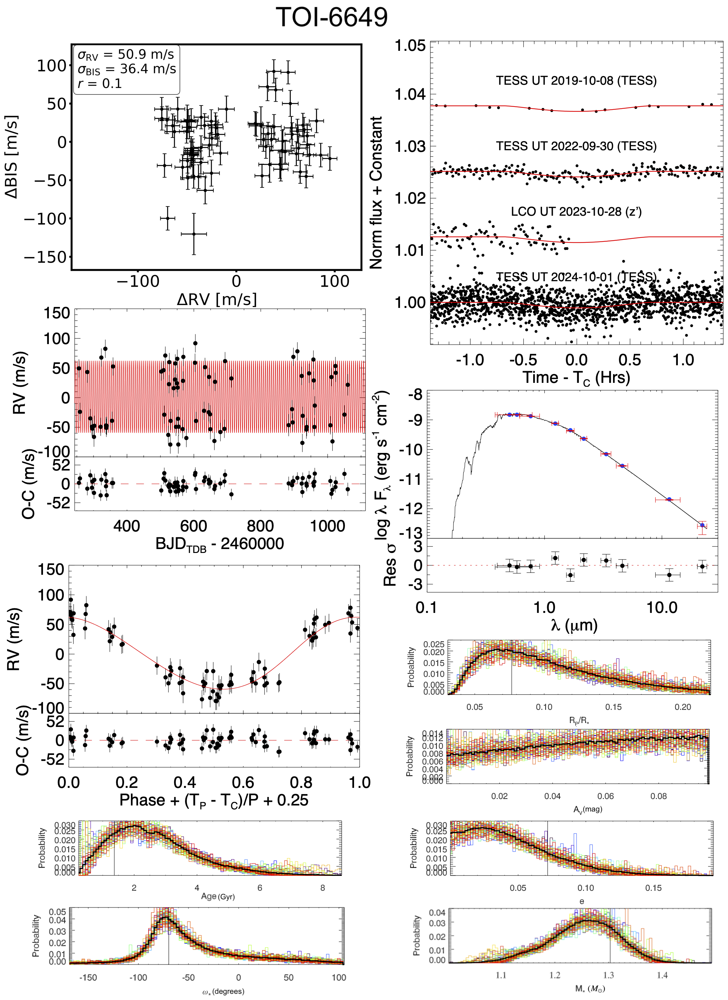
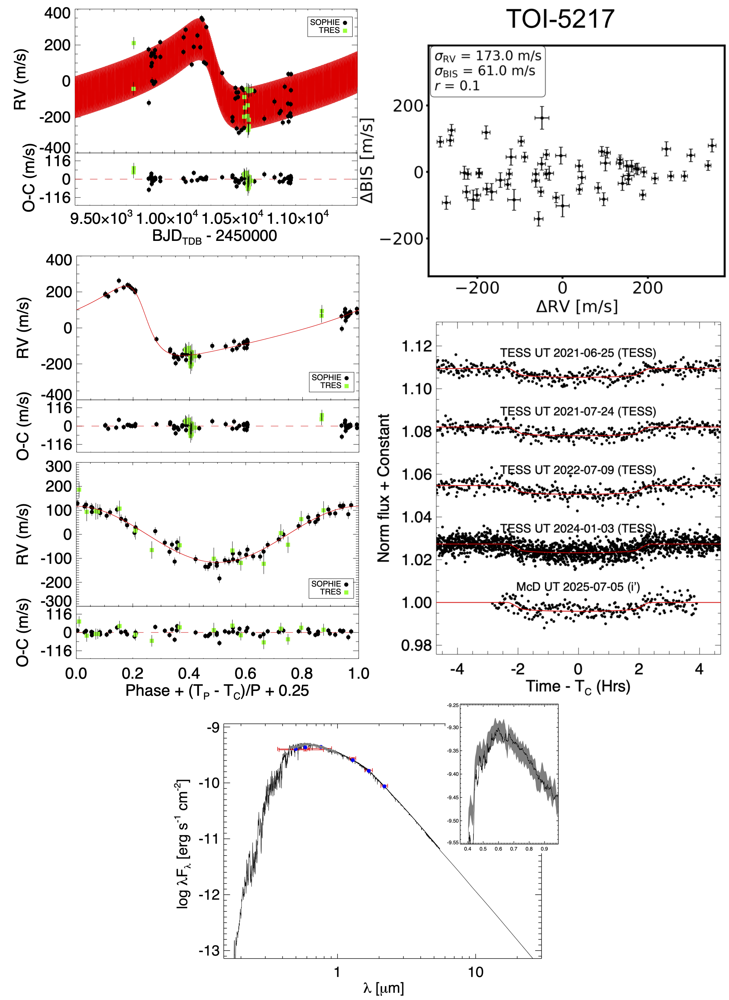
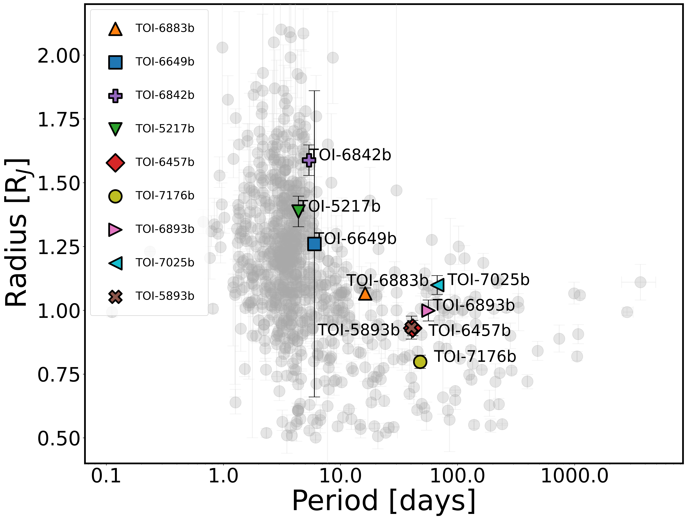
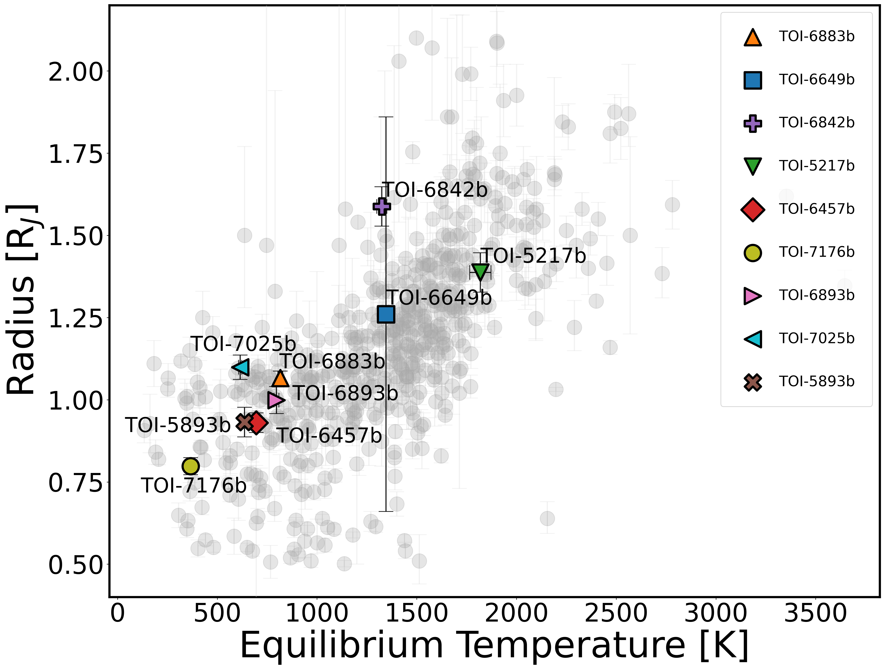
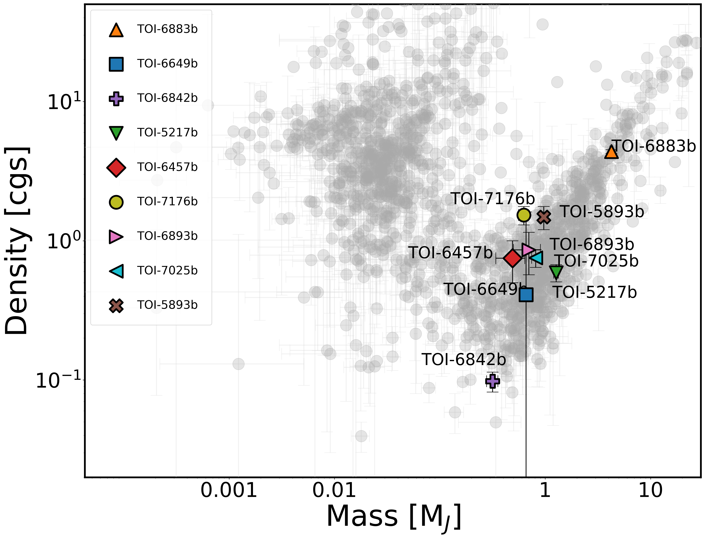
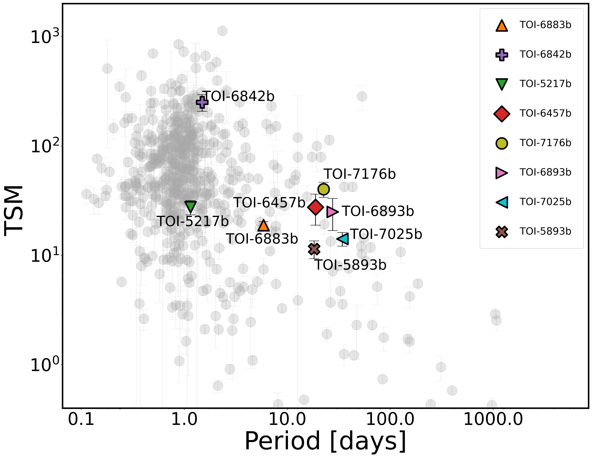

$\newcommand{\ensuremath}{}$
$\newcommand{\xspace}{}$
$\newcommand{\object}[1]{\texttt{#1}}$
$\newcommand{\farcs}{{.}''}$
$\newcommand{\farcm}{{.}'}$
$\newcommand{\arcsec}{''}$
$\newcommand{\arcmin}{'}$
$\newcommand{\ion}[2]{#1#2}$
$\newcommand{\textsc}[1]{\textrm{#1}}$
$\newcommand{\hl}[1]{\textrm{#1}}$
$\newcommand{\footnote}[1]{}$
$\newcommand\subsubsubsection{\@startsection{paragraph}{4}{\z@}{-3.25ex \@plus -1ex \@minus -.2ex}{1.5ex \@plus .2ex}{\normalfont\normalsize}}$
$\newcommand{\exofasttwo}{{\tt EXOFASTv2}}$
$\newcommand{\bjdtdb}{\ensuremath{\rm{BJD_{TDB}}}}$
$\newcommand{\tjdtdb}{\ensuremath{\rm{TJD_{TDB}}}}$
$\newcommand{\msun}{\ensuremath{ M_\odot}}$
$\newcommand{\rsun}{\ensuremath{ R_\odot}}$
$\newcommand{\lsun}{\ensuremath{ L_\odot}}$
$\newcommand{\fave}{\langle F \rangle}$
$\newcommand{\thefigure}{\arabic{figure}}$

# SOPHIE and TESS characterization of fourteen TESS Objects of Interest: nine planetary systems and five low-mass stellar companions

<mark>Appeared on: 2026-10-07</mark> -  _37 pages, 19 figures, 11 tables. Accepted for publication in Astronomy & Astrophysics_

N. Heidari, et al. -- incl., <mark>T. Henning</mark>

**Abstract:** We present a study of fourteen _TESS_ Objects of Interest (TOIs) observed as part of the SOPHIE– _TESS_ follow-up program. Using _TESS_ photometry, SOPHIE radial velocities (RVs), ground-based photometry, and high-spatial resolution imaging, we characterized all targets and established their true nature. Among them, nine systems—TOI-6457, TOI-6883A, TOI-6649, TOI-6842A, TOI-5217A, TOI-6893A, TOI-7025, TOI-7176, and TOI-5893—are shown to host planets. We find that TOI-6649 b, TOI-6842A b, and TOI-5217A b are transiting hot Jupiters with orbital periods of approximately 4.4–6.0 d, radii of 1.3–1.6 $R_{\rm J}$ , and masses of 0.3–1.3 $M_{\rm J}$ , corresponding to bulk densities of 0.1–0.6 g cm $^{-3}$ . Our RV data further reveal that TOI-5217A hosts an outer companion, TOI-5217A c, with a period of $\sim$ 1761 d, a minimum mass of $\sim$ 13 $M_{\rm J}$ , and a significantly eccentric orbit ( $e = 0.53 \pm 0.02$ ). We also characterize TOI-5893 b, TOI-6893A b, TOI-6457 b, TOI-7176 b, and TOI-7025 b as transiting warm Jupiters, a relatively scarce population. Their orbital periods range from 40.4 to 67.0 days, with radii of 0.8–1.2 $R_{\rm J}$ and masses of 0.5–1.0 $M_{\rm J}$ . In addition, TOI-6883A b—a recently reported transiting warm Jupiter—is further characterized using new ground- and space-based photometry together with SOPHIE and TRES RVs. The remaining five systems—TOI-5621AB, TOI-5321AB, TOI-3678AB, TOI-5906AB and TOI-5308AB—exhibit large RV semi-amplitudes indicative of eclipsing binaries. The companions have estimated masses of 0.1–0.6 $M_{\odot}$ and radii of 0.1–0.6 $ R_\odot$ . Among our sample, TOI-6842A b stands out as an extremely low-density giant planet ( $\rho_{p} = 0.08 \pm 0.01 \mathrm{g cm^{-3}}$ ), placing it in the super-puff category and ranking it among the nine lowest-density planets known to date. With a transmission spectroscopy metric of $\sim$ 250, it represents an excellent target for atmospheric characterization. Additionally, transiting planets TOI-6883A b, TOI-6893A b, TOI-6457 b, TOI-5893 b, TOI-7176 b, and TOI-7025 b—each with equilibrium temperatures between 377 and 846 K—provide valuable low-irradiation benchmarks for control models of hot-Jupiter inflation. Furthermore, TOI-7025 b stands out due to its orbital eccentricity of 0.82 $\pm$ 0.02, one of the largest planetary eccentricities discovered so far for a planet orbiting a single star. Finally, using the _Gaia_ astrometric excess noise, we detect TOI-5906 B, marking the first discovery of an object identified using all three techniques: transit, RV, and astrometry.

**Figure 7. -** Summary of the spectroscopic, photometric, and SED analyses for TOI-6649. *Top-left*:  Bisector span versus RV. *Second-left*: RV time series with the best-fit Keplerian model overplotted in red; residuals are shown below. *Third-left*: Phase-folded RV curve for TOI-6649b with the best-fit model (red line) and residuals. *Top-right:*_TESS_ and ground-based light curves, phase-folded on the best-fit period and time of conjunction, with their respective transit models overplotted in red. *Second-right:* Broadband photometry is shown in red, with blue points indicating the best-fit model flux derived from the stellar properties and the MIST bolometric correction grid. For illustrative purposes only, a Kurucz (1993) atmospheric model corresponding to the best-fit stellar parameters is plotted in black; note that the fit is performed directly using the MIST grid. Residuals are displayed below. *Bottom-right* and *Bottom-left:* Posterior probability distributions of non-Gaussian parameters obtained from the EXOFASTv2 fit. Colored curves represent individual MCMC chains, the thick black curve shows their average, and the thin black vertical line marks the median value. TOI-6649 b is a grazing giant planet with an orbital period of $P = 5.9877995^{+0.000010}_{-0.0000098}$ d, a mass of $M_{\rm p}=0.645^{+0.032}_{-0.033} M_{\rm J}$, and a radius of $R_{\rm p}=1.25^{+0.74}_{-0.45} R_{\rm J}$. (*image_6649*)

**Figure 2. -** $\footnote$size{Summary of the spectroscopic, photometric, and SED analyses for TOI-5217A. *Top-left*: RV time series with the best-fit Keplerian model overplotted in red; residuals are shown below. *Second-left*: Phase-folded RV curve for TOI-5217Ac with the best-fit model (red line) and residuals. *Third-left*: Phase-folded RV curve for the TOI-5217Ab with the best-fit model (red line) and residuals. *Top-right:* Bisector span versus RV. *Second-right:* _TESS_ and ground-based light curves, phase-folded on the best-fit period and time of conjunction, with their respective transit models overplotted in red. *Bottomn:* SED analyses. Red symbols represent the observed photometric measurements, where the horizontal bars represent the effective width of the broadband photometry. Blue symbols are the model fluxes from the best-fit PHOENIX atmosphere model (black). The absolute flux-calibrated _ Gaia \/_ spectrophotometry is shown as the gray swathe. TOI-5217A b has an orbital period of $P = 4.3712411 \pm 0.0000082$ d, a radius of $R_{\rm p} = 1.385^{+0.056}_{-0.055} R_{\rm J}$, and a mass of $M_{\rm p} = 1.282\pm0.060 M_{\rm J}$. The outer companion, TOI-5217A c, has a minimum mass of approximately $13 M_{\rm J}$ on an eccentric orbit ($e = 0.529\pm0.017$), while its orbital period remains poorly constrained.} (*image_5217*)

**Figure 5. -** Position of the planets analyzed in this work among the population of known transiting exoplanets with measured masses and radii, compiled from the NASA Exoplanet Archive (as of September 15, 2025), without applying any precision cut. Top left: radius–orbital period diagram for giant planets ($R_\mathrm{p} > 0.5 R_\mathrm{J}$). Top right: planetary radius as a function of equilibrium temperature for giant planets, assuming zero Bond albedo and full heat redistribution. Bottom left: planetary density–mass diagram. Bottom right: TSM as a function of orbital period for giant exoplanets with known masses, radii, and equilibrium temperatures. Planets discussed in this study are highlighted in color. (*four_figures*)

