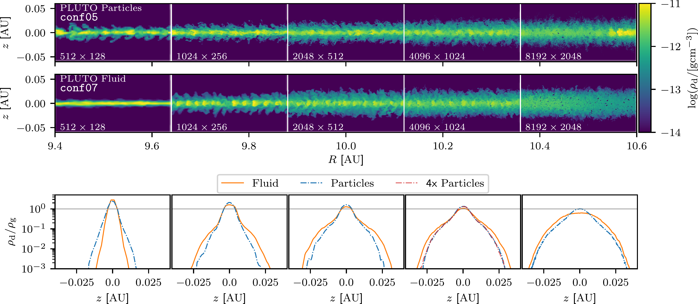
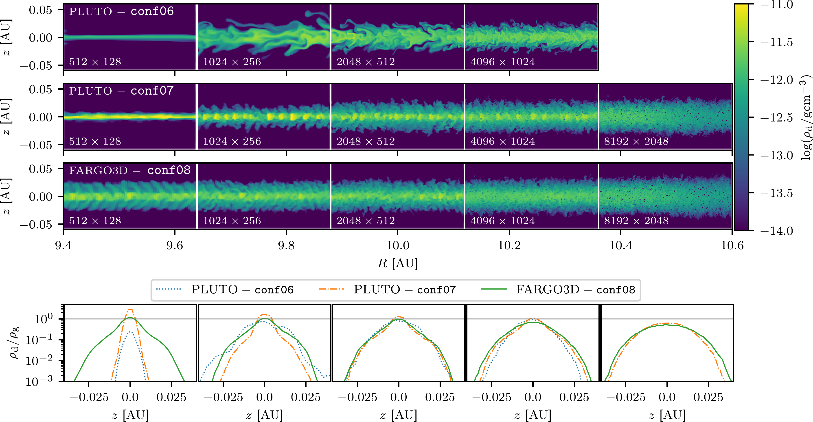
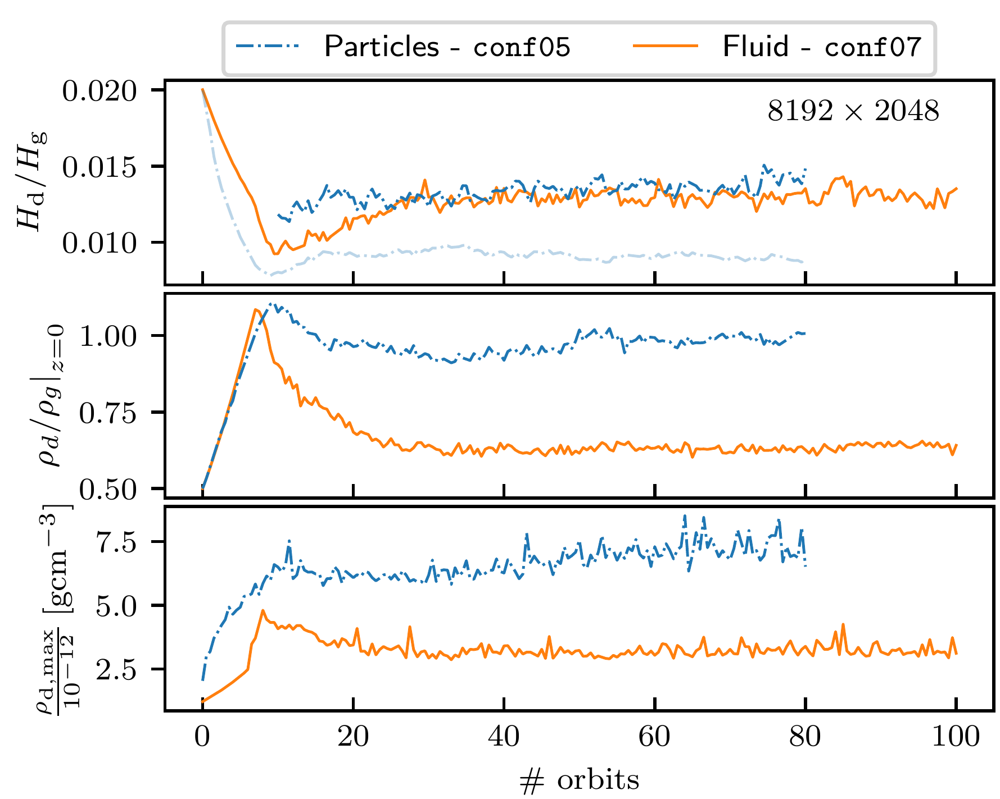

$\newcommand{\ensuremath}{}$
$\newcommand{\xspace}{}$
$\newcommand{\object}[1]{\texttt{#1}}$
$\newcommand{\farcs}{{.}''}$
$\newcommand{\farcm}{{.}'}$
$\newcommand{\arcsec}{''}$
$\newcommand{\arcmin}{'}$
$\newcommand{\ion}[2]{#1#2}$
$\newcommand{\textsc}[1]{\textrm{#1}}$
$\newcommand{\hl}[1]{\textrm{#1}}$
$\newcommand{\footnote}[1]{}$
$\newcommand{\psj}{Planet. Sci. J.}$
$\newcommand{\jaysays}[1]{{\bf \color{brown}[Jay: #1]}}$
$\newcommand{\jakesays}[1]{{\bf \color{orange}[JBS: #1]}}$
$\newcommand{\AM}{\color{magenta}}$
$\newcommand{\DO}[1]{{\bf \color{blue}[DO: #1]}}$
$\newcommand{\tktext}[1]{\begin{CJK}{UTF8}{mj}#1\end{CJK}}$

# A comparison between particle and fluid approaches for streaming instability in global patch simulations

<mark>Appeared on: 2026-10-08</mark> -  _22 pages, 24 figures_

D. H. Ostertag, et al. -- incl., <mark>M. Flock</mark>

**Abstract:** Identifying the process relevant to planet formation is still a major task.Mechanisms have been identified that can trap dust, preventing it from migrating inwards.A particular hydrodynamic instability, known as the streaming instability, is of high interest because it may be responsible for the formation of dust clumps from which the first planetesimals form. We aim to compare the outcome of non-linear streaming instability simulations using both fundamental approaches in a more realistic global disk model.The results will not be used to identify or disentangle the effect of, e.g., numerical diffusion in fluid simulations or the possibility of having crossing particle streams.Instead, they will enable us to determine whether the Lagrangian particle approach is the most suitable for numerical studies of the streaming instability. We perform 2D, axisymmetric, global, and isothermal hydrodynamic simulations using the two codes FARGO3D (dust fluid) and PLUTO (fluid, particles) to investigate the temporal evolution of dust scale height, midplane dust-to-gas ratio, and maximum dust density as well as to study velocity distributions and vorticities.For PLUTO particle simulations, we also investigate the influence of the gas Riemann solver and spatial reconstruction orders. Our results from a resolution study up to 5120 cells per gas scale height indicate convergence between PLUTO fluid and FARGO3D.Both yield a Gaussian profile dominated by small-scale, dust-depleted voids.Particle simulations with PLUTO have not yet converged, as a transient midplane dust component persists, indicating the need for even higher resolution or more particles.Using a more accurate Riemann solver or a higher-order spatial reconstruction scheme helps to bring the dust density profile closer to the converged structure.At the highest resolution, we find that the maximum dust density in fluid simulations is only 36 $\%$ that in particle simulations, which is not too different from other code-comparison works. Studying streaming instability in a global sense, the choice of Riemann solver, spatial reconstruction order becomes more important than the approach itself (fluid, particle).Including the computational performance of both dust treatments, the fluid approach provides an efficient and suitable tool for streaming instability simulations.

**Figure 21. -** Top: Comparison of the 2D dust density structure due to non-linear streaming instability for the particle approach (first row) and fluid approach (second row) in PLUTO.
    For all resolutions, the disk is shown after 50 orbits (at 10 AU).
    The white vertical lines indicate the radial positions at which we switch to another simulation for plotting.
    The resolution of each simulation is indicated in the lower left corner of each section.
    Bottom: vertical dust-to-gas ratio profile for fluid simulations (solid line) and particle simulations (dash-dotted line) averaged in the radial domain 10 $\pm$ 0.15 AU.
    The red dash-dotted line in the dust-to-gas ratio plot at a resolution of $4096\times1024$ shows the vertical profile from a simulation with 4 times the number of particles.
    The grey horizontal lines at the bottom subplots indicate a dust-to-gas ratio of unity. (*fig: dustDensity2D_ComparisonFluidParticle_Roe*)

**Figure 22. -** Top 3 rows: 2D dust densities for dust fluid simulations and increasing resolution (information shown on the left side of each panel).
    The vertical white lines indicate the transition to another simulation.
    Bottom: vertical dust-to-gas ratio profile for each simulation, averaged over the radial domain 10 $\pm$ 0.15 AU.
    The solid line represents FARGO3D (\texttt{conf08}) results, the dashed-dotted line represents PLUTO fluid (\texttt{conf07}) results, and the dotted line represents PLUTO fluid (\texttt{conf06}) results.
    The horizontal grey line indicates a dust-to-gas ratio of unity.
    The disks are shown after 50 orbits (at 10 AU). (*fig: dustDensity2D_FARGO3D*)

**Figure 4. -** Comparison between the particle simulation ($\texttt{conf05}$, shown as dash-dotted lines) and fluid simulation ($\texttt{conf07}$, shown in solid lines), both with a more accurate setup and a resolution of $8192\times2048$.
    Top: Dust scale heights as a function of orbits.
    Dark blue shows the dust scale height for the full vertical range, while light blue corresponds to the midplane component.
    Middle: Midplane dust-to-gas ratio, determined by doing a radial averaging in the domain 10 $\pm$ 0.15 AU.
    Bottom: Maximum dust density determined in the radial domain between 9.4 and 10.4 AU. (*fig: dustScaleHeight_midDTGRatio_maxRhodust_FluidParticle_Roe*)

