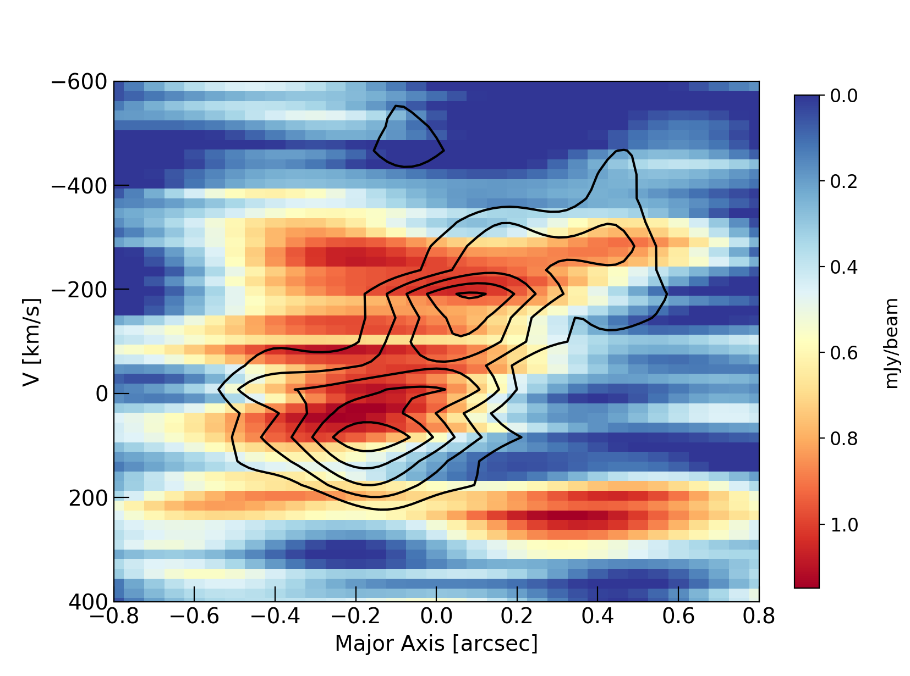

$\newcommand{\ensuremath}{}$
$\newcommand{\xspace}{}$
$\newcommand{\object}[1]{\texttt{#1}}$
$\newcommand{\farcs}{{.}''}$
$\newcommand{\farcm}{{.}'}$
$\newcommand{\arcsec}{''}$
$\newcommand{\arcmin}{'}$
$\newcommand{\ion}[2]{#1#2}$
$\newcommand{\textsc}[1]{\textrm{#1}}$
$\newcommand{\hl}[1]{\textrm{#1}}$
$\newcommand{\footnote}[1]{}$
$\newcommand{\vdag}{(v)^\dagger}$
$\newcommand$
$\newcommand$

$\newcommand{\ensuremath}{}$
$\newcommand{\xspace}{}$
$\newcommand{\object}[1]{\texttt{#1}}$
$\newcommand{\farcs}{{.}''}$
$\newcommand{\farcm}{{.}'}$
$\newcommand{\arcsec}{''}$
$\newcommand{\arcmin}{'}$
$\newcommand{\ion}[2]{#1#2}$
$\newcommand{\textsc}[1]{\textrm{#1}}$
$\newcommand{\hl}[1]{\textrm{#1}}$
$\newcommand{\footnote}[1]{}$
$\newcommand{\vdag}{(v)^\dagger}$
$\newcommand$
$\newcommand$

# Kiloparsec-scale imaging of the CO(1-0)-traced cold molecular gas reservoir in a z$\sim$3.4 submillimeter galaxy

<mark>Appeared on: 2022-03-29</mark> - _19 pages, 12 figures, accepted for publication in ApJ_

Marta Frias Castillo, et al. -- incl., <mark>Fabian Walter</mark>

**Abstract:** We present a high-resolution study of the cold molecular gas as traced by CO(1-0) in the unlensed z $\sim$ 3.4 submillimeter galaxy SMM J13120+4242, using multi-configuration observations with the Karl G. Jansky Very Large Array (JVLA). The gas reservoir, imaged on 0.39 $"$ ( $\sim$ 3 kpc) scales, is resolved into two components separated by $\sim$ 11 kpc with a total extent of 16 $ \pm $ 3 kpc. Despite the large spatial extent of the reservoir, the observations show aCO(1-0) FWHM linewidth of only 267 $ \pm $ 64 km s $^{-1}$ . We derive a revised line luminosity of L $'_{\text{CO(1-0)}} = $ (10 $\pm$ 3) $ \times$ 10 $^{10} $ K $ $ km $ $ s $^{-1} $ pc $^2$ and a molecular gas mass of M $_{\text{gas}} = $ (13 $\pm$ 3) $ \times $ 10 $^{10}$ ( $\alpha_\mathrm{CO}/1)$ M $_\odot$ . Despite the presence of a velocity gradient (consistent with previous resolved CO(6-5) imaging), the CO(1-0) imaging shows evidence for significant turbulent motions which are preventing the gas from fully settling into a disk. The system likely represents a merger in an advanced stage. Although the dynamical mass is highly uncertain, we use it to place an upper limit on the CO–to–H $_2$ mass conversion factor $\alpha_\mathrm{CO}$ of 1.4. We revisit the SED fitting, finding that this galaxy lies on the very massive end of the main sequence at z $=$ 3.4. Based on the low gas fraction, short gas depletion time and evidence for a central AGN, we propose that SMM J13120 is in a rapid transitional phase between a merger-driven starburst and an unobscured quasar. The case of SMM J13120 highlights the how mergers may drive important physical changes in galaxies without pushing them off the main sequence.

**Figure 2. -** CO(1-0) 0th (top) and 1st (bottom) moment map of SMM J13120 at a resolution of 0.39$"$. The 0th moment map contours start at $\pm$ 2$\sigma$ and increase in steps of $\sigma$ = 4.4 mJy km s$^{-1}$. The 1st moment map was clipped at 2 times the rms noise per channel ($\sigma$ = 9 $\mu$Jy beam$^{-1}$), and contours are shown in steps of 50 km s$^{-1}$. We fit a 2D elliptical Gaussian to the 0th moment map to determine the peak position of the emission, shown by the cross, corresponding to the white cross in Fig. \ref{chans}. (*moment_maps*)

**Figure 4. -** Position-velocity (PV) diagram of CO(1-0) emission in J13120. The axis of extraction is at PA of 42.7$◦ee$ and an aperture of 0.3$"$ was used.
    Despite the disturbed velocity field seen in Fig. \ref{moment_maps}, bottom, there is a clear velocity gradient in SMM J13120. (*pv-diagram*)

**Figure 5. -** PV diagram of CO(6-5) emission in J13120 extracted from an axis with PA = 42.7$◦ee$. Black contours correspond to the CO(1-0) PV diagram extracted from the same axis (see Figure \ref{pv-diagram}). The CO(6-5) emission shows evidence for a similar gradient as seen in CO(1-0). (*pv_overplot*)

