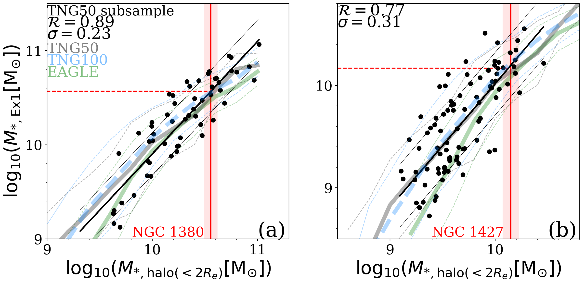
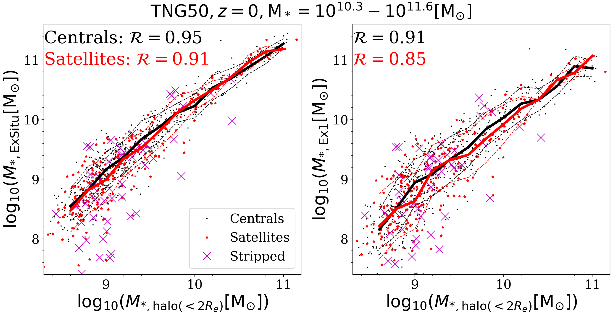

$\newcommand{\ensuremath}{}$
$\newcommand{\xspace}{}$
$\newcommand{\object}[1]{\texttt{#1}}$
$\newcommand{\farcs}{{.}''}$
$\newcommand{\farcm}{{.}'}$
$\newcommand{\arcsec}{''}$
$\newcommand{\arcmin}{'}$
$\newcommand{\dlens}{D_{\rm L}}$
$\newcommand{\dsource}{D_{\rm S}}$
$\newcommand{\dls}{D_{\rm S}-D_{\rm L}}$
$\newcommand{\vdag}{(v)^\dagger}$
$\newcommand{\vt}{{\rm v}_t}$
$\newcommand{\swd}{Schwarzschild }$
$\newcommand{\atlas}{ATLAS^{\rm{3D}}}$
$\newcommand{\sfg}{S^4G }$
$\newcommand{\kms}{km\,s^{-1}}$
$\newcommand{\dgr}{^\circ}$
$\newcommand{\kmsM}{km\,s^{-1}\,Mpc^{-1}}$
$\newcommand{\Msun}{M_\odot}$
$\newcommand{\Msunpcsq}{M_\odot\,pc^{-2}}$
$\newcommand{\Msunpccube}{M_\odot\,pc^{-3}}$
$\newcommand{\Lsun}{L_\odot}$
$\newcommand{\Lsunpcsq}{L_\odot\,pc^{-2}}$
$\newcommand{\Lsunpccube}{L_\odot\,pc^{-3}}$
$\newcommand{\MLsun}{M_\odot/L_\odot}$
$\newcommand{\magarcsq}{\mathrm{mag\,arcsec^{-2}}}$
$\newcommand{\Mstar}{\ensuremath{M_*}}$
$\newcommand{\rmaxhot}{\ensuremath{r|_{{\rm max}(p_{\rm hot})}}}$
$\newcommand{\rcut}{\ensuremath{r_\mathrm{cut}}}$
$\newcommand{\rmax}{\ensuremath{r_\mathrm{max}}}$
$\newcommand{\Mshalo}{\ensuremath{M_{*,\mathrm{halo(r< 2R_e)}}}}$
$\newcommand{\Mswarm}{\ensuremath{M_{*,\mathrm{warm(r< 2R_e)}}}}$
$\newcommand{\ap}[1]{{\color{magenta} #1}}$

# The Fornax3D project: discovery of ancient massive merger events in the Fornax cluster galaxies NGC\,1380 and NGC\,1427

  _Submitted to A&A, 19 pages, 16 figures_

Ling Zhu, et al. -- incl., <mark>Annalisa Pillepich</mark>, <mark>Francesca Pinna</mark> 

 **Abstract:** We report the discovery of ancient massive merger events in the early-type galaxies NGC\,1380 and NGC\,1427 in the Fornax galaxy cluster. Both galaxies are observed by the MUSE IFU instrument on the VLT, as part of the Fornax3D project. By fitting recently-developed population-orbital superposition models to the observed surface brightness as well as stellar kinematic, age, and metallicity maps, we obtain the stellar orbits, age and metallicity distributions of each galaxy. We then decompose each galaxy into multiple orbital-based components, including a dynamically hot inner stellar halo component which is identified as the relic of past massive mergers. By comparing to analogues from cosmological galaxy simulations, chiefly TNG50, we find that the formation of such a hot inner stellar halo requires the merger with a now-destroyed massive satellite galaxy of$ 3.7_{-1.5}^{+2.7} \times 10^{10} $\,$\Msun$(about$ 1/5 $of its current stellar mass) and of$ 1.5_{-0.7}^{+1.6} \times10^{10} $\,$\Msun$(about$ 1/4 $of its current stellar mass) in the case of NGC\,1380 and NGC\,1427, respectively. Moreover, we infer that the last massive merger in NGC\,1380 happened$ \sim10 $Gyr ago based on the stellar age distribution of the re-grown dynamically cold disk, whereas the merger in NGC\,1427 ended$ t\lesssim 8 $Gyr ago based on the stellar populations in its hot inner stellar halo. The major merger event in NGC\,1380 is the first one with both merger mass and merger time quantitatively inferred in a galaxy beyond the Local Volume. Moreover, it is the oldest and most massive one uncovered in nearby galaxies so far.

**Figure 5. -** \textbf{Stellar masses of the most massive satellites (now-destroyed) that merged with NGC\,1380 and NGC\,1427.} Panel (a): The correlation from cosmological simulations between the mass of the hot inner stellar halo $\Mshalo$\, and the stellar mass  $ M_{*,\mathrm{Ex1}} $  of the most massive merged satellite. The black dots are a subsample of TNG50 galaxies with similar mass and size as NGC\,1380, the black thick line is a linear fit to the points, while the thin black lines indicate the  $ \pm1\sigma $  scatter. The Pearson correlation coefficients  $ \mathcal{R} $  between  $ M_{*,\mathrm{halo}(<2R_e)} $  and  $ M_{*,\mathrm{Ex1}} $  and  $ 1\sigma $  scatter against the linear fit for the TNG50 subsample are indicated. The vertical red line with shadows marks the mass and corresponding  $ \pm1\sigma $  uncertainty of NGC\,1380's hot inner stellar halo. The horizontal dashed line marks the satellite(s) mass inferred from the correlations. The thick and thin curves in grey, blue, and green in the background are the running median and  $ \pm1\sigma $  scatter of the whole sample of TNG50, TNG100, and EAGLE galaxies. Panel (b): Similar to Panel (a), but for the subsample of TNG50 galaxies with similar mass and size to NGC1427. The vertical red line marks the mass of NGC\,1427's hot inner stellar halo and the horizontal dashed line marks the satellite(s) mass inferred from the correlations.  (*fig:mex1*)

**Figure 8. -** \textbf{Correlations of hot inner stellar halo mass $\Mshalo$\, vs. accreted stellar mass  $ M_{*,\mathrm{Ex1}} $  (left) and  $ M_{*,\mathrm{ExSitu}} $  (right) for central and satellite galaxies separately.} All TNG50 galaxies with  $ M_*=10^{10.3}-10^{11.6} $\,$\Msun$\, are included. The black dots are central galaxies and the red dots are satellites. The thick black and red curves are the running median for central and satellite galaxies, respectively, while the thin dashed curves are the corresponding  $ \pm1\sigma $  scatter. The satellites with more than  $ 20\% $  of stellar mass stripped are marked by magenta crosses. The correlations are almost the same for central and satellite galaxies. The strongly stripped satellites tend to locate below the median of the correlations, some of them deviate from the correlations significantly below the  $ -1\sigma $  curves. (*fig:mex_strip*)

**Figure 1. -** \textbf{Population-orbit model of NGC\,1380.} Panel (a): A deep  $ r $ -band image of NGC\,1380 from the Fornax Deep Survey with the VLT Survey Telescop \citep{Iodice2019a}. The three squares indicate the three pointings, each with  $ 1'\times 1' $  square field-of-view, of spectroscopic observations with the VLT MUSE instrument. The black dashed ellipse corresponds to the isophote at  $ \mu_B = 25 $  mag arcsec $ ^{-2} $ . Panel (b): The first column shows the data from the VLT/MUSE observations, the second column the best-fitting population-orbit model, and the third column the residuals of data minus model divided by the observational errors. From top to bottom: surface brightness, mean velocity, velocity dispersion, Gauss-Hermite coefficients  $ h_3 $  and  $ h_4 $ , as well as light-weighted age and metallicity maps of the stars in NGC\,1380. Note that kinematic maps were derived from spectra binned with a different scheme than the age and metallicity maps.  (*fig:bestfit*)

