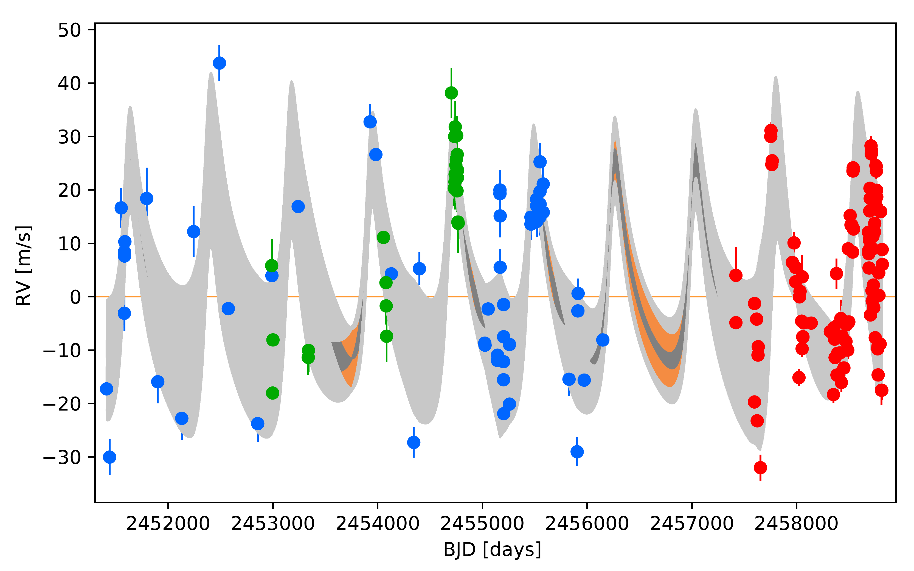
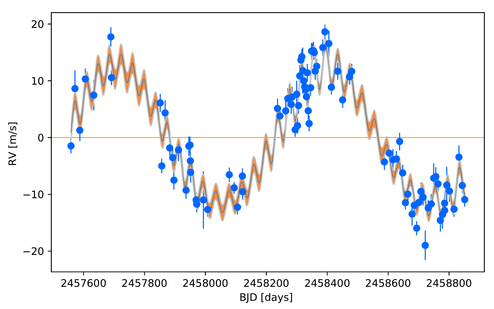
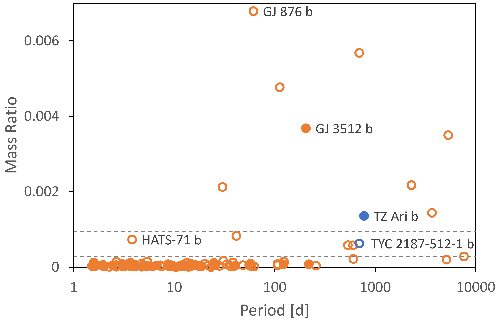

$\newcommand{\ensuremath}{}$
$\newcommand{\xspace}{}$
$\newcommand{\object}[1]{\texttt{#1}}$
$\newcommand{\farcs}{{.}''}$
$\newcommand{\farcm}{{.}'}$
$\newcommand{\arcsec}{''}$
$\newcommand{\arcmin}{'}$
$\newcommand{\tyc}{\mbox{TYC\,2187-512-1}}$
$\newcommand{\cyr}{\tencyr\cyracc}$

# The CARMENES search for exoplanets around M dwarfs

  _Accepted for publication in Astronomy and Astrophysics_

A. Quirrenbach, et al. -- incl., <mark>T. Trifonov</mark>, <mark>T. Henning</mark>, <mark>E. Herrero</mark>, <mark>M. Kuerster</mark> 

 **Abstract:** The CARMENES radial-velocity survey is currently searching for planets in a sample of 387 M dwarfs. Here we report on two Saturn-mass planets orbiting$\tyc$($ M_\star = 0.50\,M_\odot $) and TZ\,Ari ($ M_\star = 0.15\,M_\odot $), respectively. We obtained supplementary photometric time series, which we use along with spectroscopic information to determine the rotation periods of the two stars. In both cases, the radial velocities also show strong modulations at the respective rotation period. We thus modeled the radial velocities as a Keplerian orbit plus a Gaussian process representing the stellar variability.$\tyc$is found to harbor a planet with a minimum mass of 0.33\,$ M_{\rm Jup} $in a near-circular 692-day orbit. The companion of TZ\,Ari has a minimum mass of 0.21\,$ M_{\rm Jup} $, orbital period of 771\,d, and orbital eccentricity of 0.46. We provide an overview of all known giant planets in the CARMENES sample, from which we infer an occurrence rate of giant planets orbiting M dwarfs with periods up to 2 years in the range between 2\,\%to 6\,\%. TZ\,Ari\,b is only the second giant planet discovered orbiting a host with mass less than 0.3\,$ M_\odot $. These objects occupy an extreme location in the planet mass versus host mass plane. It is difficult to explain their formation in core-accretion scenarios, so they may possibly have been formed through a disk fragmentation process.

**Figure 11. -** Gaussian process model fit to the RV data of TZ\,Ari from HIRES (blue), HARPS (green), and CARMENES VIS (red). The orbital parameters are listed in the right column of Table \ref{tab:TZ_RVfits}. The rotational modulation of the RV is far too fast to be seen at any reasonable screen or print resolution; the full range of this variation is therefore seen as a grey band. We provide a zoom into a short section in Fig. \ref{Fig_TZ_GP_RV_Zoom}. (*Fig_TZ_GP_RV*)

**Figure 6. -** Gaussian process model fit to the RV data of $\tyc$  from CARMENES VIS. The orbital parameters are listed in the right column of Table \ref{tab:TYC_RVfits}. Here and in the following figures the GP model and its  $ 1 \sigma $  credibility range are shown in grey and brown, respectively. (*Fig_TYC_GP_RV*)

**Figure 17. -** Mass ratio-period relation for planets orbiting low-mass stars. The y-axis shows the mass ratio  $ m/M_\star $(for transiting planets) or  $ m \sin i / M_\star $(for non-transiting planets). The dashed horizontal lines indicate the mass ratios of Saturn and Jupiter compared to the Sun. The open symbols designate planets orbiting hosts with  $ 0.3\,M_\odot < M_\star \leq 0.55\,M_\odot $ , the filled symbols are for host masses  $ M_\star \leq 0.3\,M_\odot $ . Objects with small mass ratios, that is, terrestrial planets and super-Earths, are included for illustration, but not discussed further in the present paper. The data were compiled from the NASA Exoplanet Archive. (*Fig_Mass_Period*)

