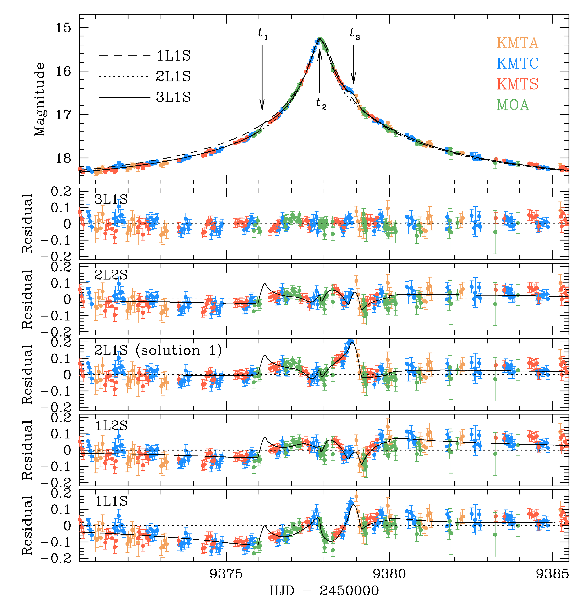
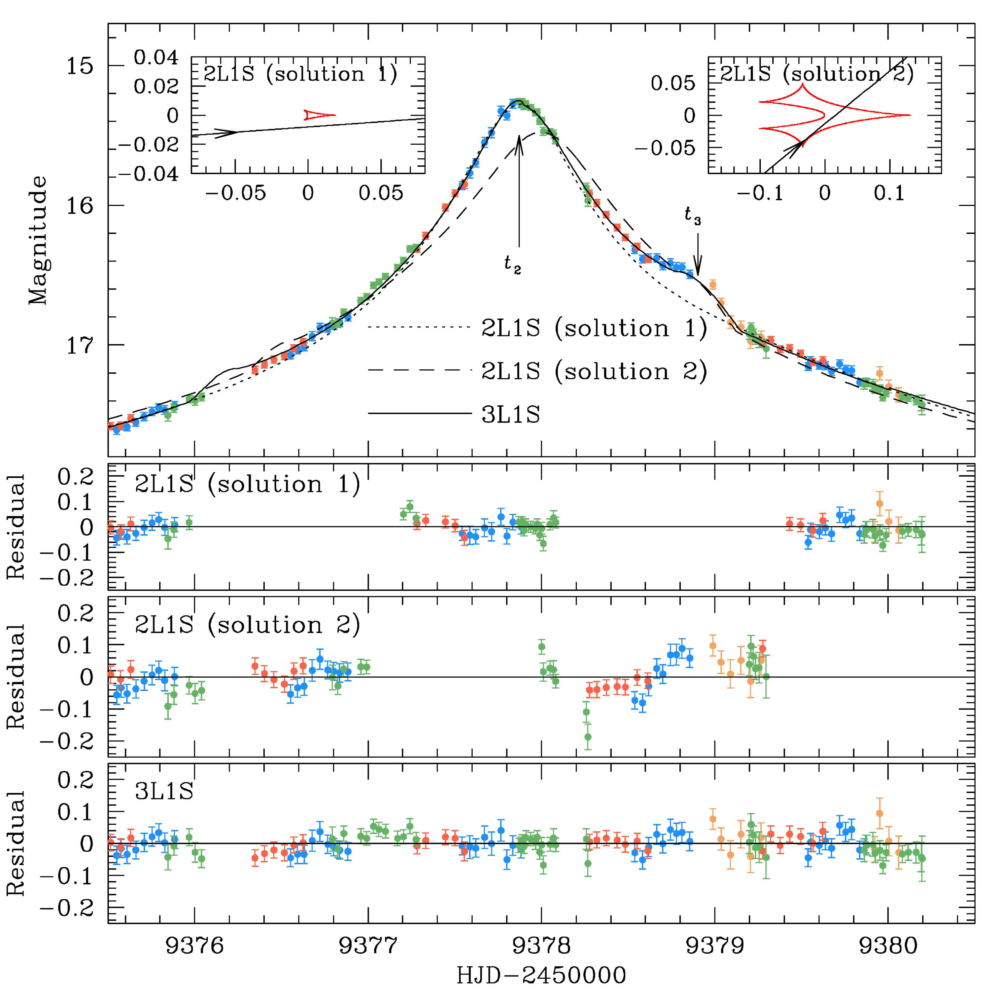
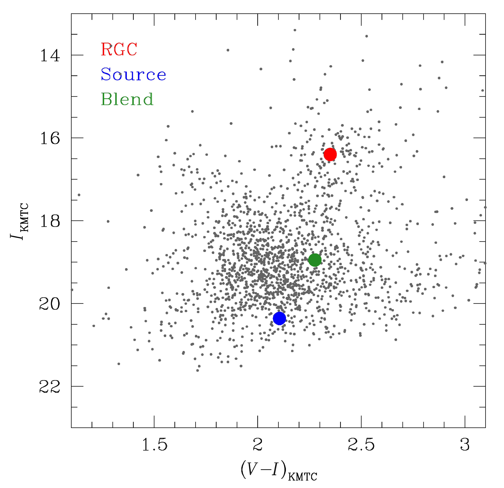

$\newcommand{\ensuremath}{}$
$\newcommand{\xspace}{}$
$\newcommand{\object}[1]{\texttt{#1}}$
$\newcommand{\farcs}{{.}''}$
$\newcommand{\farcm}{{.}'}$
$\newcommand{\arcsec}{''}$
$\newcommand{\arcmin}{'}$
$\newcommand{\ion}[2]{#1#2}$
$\newcommand{\textsc}[1]{\textrm{#1}}$
$\newcommand{\hl}[1]{\textrm{#1}}$
$\newcommand{\footnote}[1]{}$
$\newcommand{\pivec}{\mbox{\boldmath \pi}}$
$\newcommand{\muvec}{\mbox{\boldmath \mu}}$
$\newcommand{\deltavec}{\mbox{\boldmath \delta}}$
$\newcommand{\thetavec}{\mbox{\boldmath \theta}}$
$\newcommand{\te}{t_{\rm E}}$
$\newcommand{\thetae}{\theta_{\rm E}}$
$\newcommand{\thetastar}{\theta_*}$
$\newcommand{\pie}{\pi_{\rm E}}$
$\newcommand{\pien}{\pi_{{\rm E},N}}$
$\newcommand{\piee}{\pi_{{\rm E},E}}$
$\newcommand{\dl}{D_{\rm L}}$
$\newcommand{\ds}{D_{\rm S}}$
$\newcommand{\e}{{\rm E}}$
$\newcommand{\microm}{\mu{\rm m}}$
$\newcommand{\btheta}{{\vec\theta}}$
$\newcommand{\}{eqalign}$

$\newcommand{\ensuremath}{}$
$\newcommand{\xspace}{}$
$\newcommand{\object}[1]{\texttt{#1}}$
$\newcommand{\farcs}{{.}''}$
$\newcommand{\farcm}{{.}'}$
$\newcommand{\arcsec}{''}$
$\newcommand{\arcmin}{'}$
$\newcommand{\ion}[2]{#1#2}$
$\newcommand{\textsc}[1]{\textrm{#1}}$
$\newcommand{\hl}[1]{\textrm{#1}}$
$\newcommand{\footnote}[1]{}$
$\newcommand{\pivec}{\mbox{\boldmath \pi}}$
$\newcommand{\muvec}{\mbox{\boldmath \mu}}$
$\newcommand{\deltavec}{\mbox{\boldmath \delta}}$
$\newcommand{\thetavec}{\mbox{\boldmath \theta}}$
$\newcommand{\te}{t_{\rm E}}$
$\newcommand{\thetae}{\theta_{\rm E}}$
$\newcommand{\thetastar}{\theta_*}$
$\newcommand{\pie}{\pi_{\rm E}}$
$\newcommand{\pien}{\pi_{{\rm E},N}}$
$\newcommand{\piee}{\pi_{{\rm E},E}}$
$\newcommand{\dl}{D_{\rm L}}$
$\newcommand{\ds}{D_{\rm S}}$
$\newcommand{\e}{{\rm E}}$
$\newcommand{\microm}{\mu{\rm m}}$
$\newcommand{\btheta}{{\vec\theta}}$
$\newcommand{\}{eqalign}$

# KMT-2021-BLG-1077L: The fifth confirmed multiplanetary system detected by microlensing

<mark>Appeared on: 2022-03-31</mark> - _9 pages, 8 figures_

Cheongho Han, et al. -- incl., <mark><mark>Andrew Gould</mark></mark>, <mark><mark>Seung-Lee Kim</mark></mark>, <mark><mark>Chung-Uk Lee</mark></mark>, <mark><mark>Dong-Joo Lee</mark></mark>, <mark><mark>Yongseok Lee</mark></mark>

**Abstract:** The high-magnification microlensing event KMT-2021-BLG-1077 exhibits a subtleand complex anomaly pattern in the region around the peak. We analyze thelensing light curve of the event with the aim of revealing the nature of theanomaly. We test various models in combination with several interpretations. Wefind that the anomaly cannot be explained by the usual three-body (2L1S and1L2S) models. The 2L2S model improves the fit compared to the three-bodymodels, but it still leaves noticeable residuals. On the other hand, the 3L1Sinterpretation yields a model explaining all the major anomalous features inthe lensing light curve. According to the 3L1S interpretation, the estimatedmass ratios of the lens companions to the primary are $\sim 1.56 \times10^{-3}$ and $\sim 1.75 \times 10^{-3}$, which correspond to $\sim 1.6$ and$\sim 1.8$ times the Jupiter/Sun mass ratio, respectively, and therefore thelens is a multiplanetary system containing two giant planets. With theconstraints of the event time-scale and angular Einstein radius, it is foundthat the host of the lens system is a low-mass star of mid-to-late M spectraltype with a mass of $M_{\rm h} = 0.14^{+0.19}_{-0.07}~M_\odot$, and it hoststwo gas giant planets with masses of $M_{\rm p_1}=0.22^{+0.31}_{-0.12}~M_{\rmJ}$ and $M_{\rm p_2}=0.25^{+0.35}_{-0.13}~M_{\rm J}$. The planets lie beyondthe snow line of the host with projected separations of $a_{\perp, {\rmp}_1}=1.26^{+1.41}_{-1.08}~{\rm AU}$ and $a_{\perp, {\rmp}_2}=0.93^{+1.05}_{-0.80}~{\rm AU}$. The planetary system resides in theGalactic bulge at a distance of $D_{\rm L}=8.24^{+1.02}_{-1.16}~{\rm kpc}$. Thelens of the event is the fifth confirmed multiplanetary system detected bymicrolensing following OGLE-2006-BLG-109L, OGLE-2012-BLG-0026L,OGLE-2018-BLG-1011L, and OGLE-2019-BLG-0468L.

**Figure 8. -** 
Zoom-in view around the peak of the light curve. The lower five panels show the residuals of
the tested models under 3L1S, 2L2S, 2L1S, 1L2S, and 1L1S interpretations.  The curve drawn in each
residual panel is the difference from the 3L1S model.  The curves of the 1L1S, 2L1S, and 3L1S
models are drawn over the data points of the light curve in the top panel.  The epochs marked
$t_1$, $t_2$, and $t_3$ indicate the times of the major anomalous features.
 (*fig:two*)

**Figure 2. -** 
Models and residuals of the "solution 1" and "solution 2" 2L1S models.  The individual
solutions are obtained from the two sets of 2L1S models, in which the light curve was fitted
by excluding the data lying in the regions of
$9376.0 < {\rm HID}^\prime < 9377.2$ and
$9378.2 < {\rm HID}^\prime < 9379.4$ for solution 1, and
by excluding those lying in the regions of
$9377.0 < {\rm HID}^\prime < 9378.0$ and
$9379.3 < {\rm HID}^\prime < 9381.0$ for solution 2.
The two insets in the top panel show the lens system configurations of the individual solutions.
Also presented are the model curve and residual of the 3L1S solution.
 (*fig:three*)

**Figure 6. -** 
Locations of the source (blue dot) and centroid of the red giant clump (red dot) on the
instrumental color--magnitude diagram of stars lying around the source, constructed from the
pyDIA photometry of the KMTC data set. Also marked is the location of the blend (green dot).
 (*fig:seven*)

