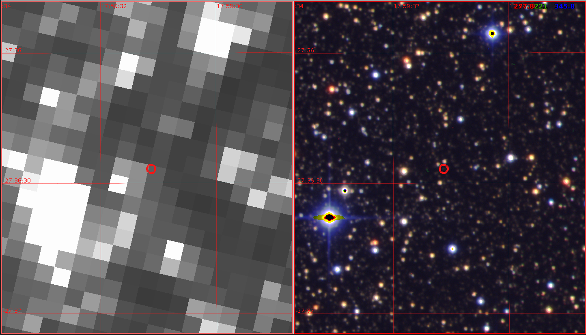

$\newcommand{\ensuremath}{}$
$\newcommand{\xspace}{}$
$\newcommand{\object}[1]{\texttt{#1}}$
$\newcommand{\farcs}{{.}''}$
$\newcommand{\farcm}{{.}'}$
$\newcommand{\arcsec}{''}$
$\newcommand{\arcmin}{'}$
$\newcommand{\ion}[2]{#1#2}$
$\newcommand{\textsc}[1]{\textrm{#1}}$
$\newcommand{\hl}[1]{\textrm{#1}}$
$\newcommand{\thebibliography}{\DeclareRobustCommand{\VAN}[3]{##3}\VANthebibliography}$
$\newcommand{\}{mn}$
$\newcommand{\}{mn}$
$\newcommand{\}{mn}$
$\newcommand{\}{mn}$
$\newcommand{\}{mn}$
$\newcommand{\}{mn}$
$\newcommand{\}{mn}$
$\newcommand{\@}{tempa}$
$\newcommand{\@}{tempa }$
$\newcommand{\@}{tempb }$
$\newcommand{\@}{tempc$
$  }$
$\newcommand{\@}{tempb }$

$\newcommand{\ensuremath}{}$
$\newcommand{\xspace}{}$
$\newcommand{\object}[1]{\texttt{#1}}$
$\newcommand{\farcs}{{.}''}$
$\newcommand{\farcm}{{.}'}$
$\newcommand{\arcsec}{''}$
$\newcommand{\arcmin}{'}$
$\newcommand{\ion}[2]{#1#2}$
$\newcommand{\textsc}[1]{\textrm{#1}}$
$\newcommand{\hl}[1]{\textrm{#1}}$
$\newcommand{\thebibliography}{\DeclareRobustCommand{\VAN}[3]{##3}\VANthebibliography}$
$\newcommand{\}{mn}$
$\newcommand{\}{mn}$
$\newcommand{\}{mn}$
$\newcommand{\}{mn}$
$\newcommand{\}{mn}$
$\newcommand{\}{mn}$
$\newcommand{\}{mn}$
$\newcommand{\@}{tempa}$
$\newcommand{\@}{tempa }$
$\newcommand{\@}{tempb }$
$\newcommand{\@}{tempc$
$  }$
$\newcommand{\@}{tempb }$

# *Kepler K2* Campaign 9: II. First space-based discovery of an exoplanet using microlensing

<mark>Appeared on: 2022-03-31</mark> - _18 pages. Accepted for publication in MNRAS Published by Oxford University Press on behalf of the Royal Astronomical Society_

D. Specht, et al. -- incl., <mark><mark>Chung-Uk Lee</mark></mark>, <mark><mark>Andrew Gould</mark></mark>, <mark><mark>Seung-Lee Kim</mark></mark>, <mark><mark>Dong-Joo Lee</mark></mark>, <mark><mark>Yongseok Lee</mark></mark>

**Abstract:** We present K2-2016-BLG-0005Lb, a densely sampled, planetary binary caustic-crossing microlensing event found from a blind search of data gathered from Campaign 9 of the *Kepler K2* mission ( *K2* C9). K2-2016-BLG-0005Lb is the first bound microlensing exoplanet *discovered* from space-based data. The event has caustic entry and exit points that are resolved in the *K2* C9 data, enabling the lens--source relative proper motion to be measured. We have fitted a binary microlens model to the *Kepler* data, and to simultaneous observations from multiple ground-based surveys. Whilst the ground-based data only sparsely sample the binary caustic, they provide a clear detection of parallax that allows us to break completely the microlensing mass--position--velocity degeneracy and measure the planet's mass directly. We find a host mass of $0.58\pm0.04  {\rm M}_\odot$ and a planetary mass of $1.1\pm0.1  {\rm M_J}$ . The system lies at a distance of $5.2\pm0.2$ kpc from Earth towards the Galactic bulge, more than twice the distance of the previous most distant planet found by *Kepler* . The sky-projected separation of the planet from its host is found to be $4.2\pm0.3$ au which, for circular orbits, deprojects to a host separation $a = 4.4^{+1.9}_{-0.4}$ au and orbital period $P = 13^{+9}_{-2}$ yr. This makes K2-2016-BLG-0005Lb a close Jupiter analogue orbiting a low-mass host star. According to current planet formation models, this system is very close to the host mass threshold below which Jupiters are not expected to form. Upcoming space-based exoplanet microlensing surveys by NASA's *Nancy Grace Roman Space Telescope* and, possibly, ESA's *Euclid* mission, will provide demanding tests of current planet formation models.

**Figure 9. -** The superposition of photometry and best-fit model from Figures \ref{fig:wide_space} and \ref{fig:wide_ground}. The *K2* differential flux count scale is shown on the right vertical axis. The space-based component of the wide-topology solution is indicated by the dashed black line, while the ground-based component is shown as a solid black line. The best-fit wide solution provides good characterisation of the *K2*C9 caustic structure, as well as ground based coverage of the caustic exit and of the pre-caustic peak seen around BJD$-2450000 = 7512.5$ days. (*fig:wide*)

**Figure 7. -** K2 \texttt{MCPM} photometry of K2-2016-BLG-0005Lb (red). The space-based component of the best-fit wide-topology, parallax binary lens model is shown in black. The caustic crossing region is clearly visible and well sampled between $BJD-2450000=7515$ and $7519$. The *K2* differential flux counts are indicated on the right vertical axis; note that this scale is neither linear, nor logarithmic. (*fig:wide_space*)

**Figure 6. -** Comparison of K2C9 and CFHT images centered at the position of K2-2016-BLG-0005 (red circle). *Left:* A small section of a K2C9 full-frame image captured during subcampaign C9a. The pixel scale is $3$\farcs$ 98$. The event is not visible on this frame, which was taken 7 days before the start of the binary caustic anomaly. *Right:* A CFHT MegaCam sloan $i+r+g$ colour composite image of the same region with a pixel scale of $0$\farcs$ 187$. In both images Celestial North points upwards and East is to the left. (*fig:k2c9-cfht*)

