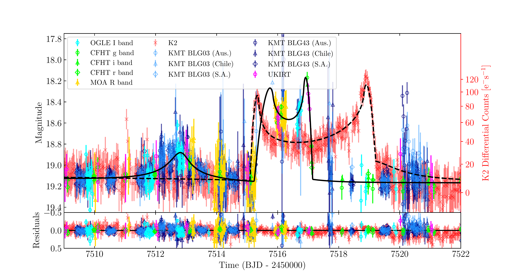
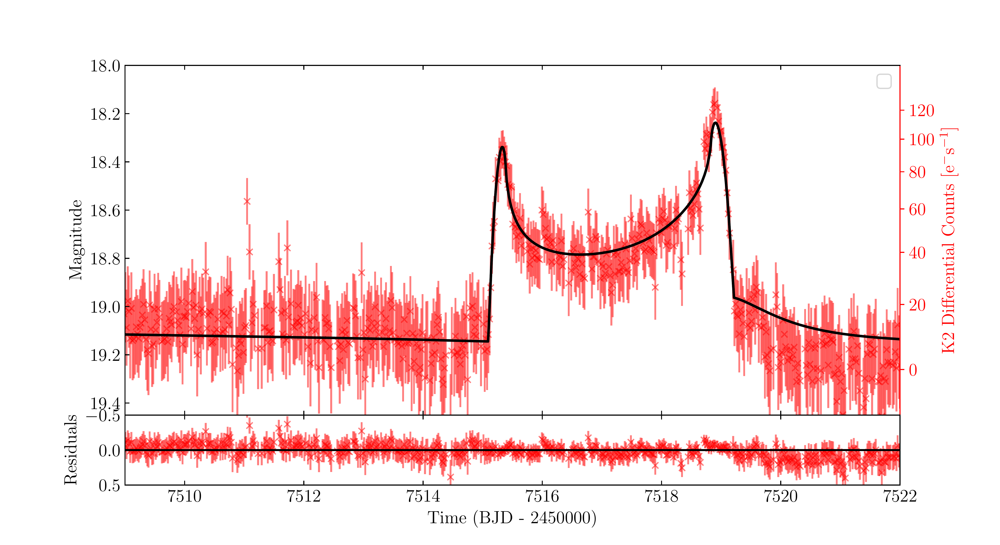
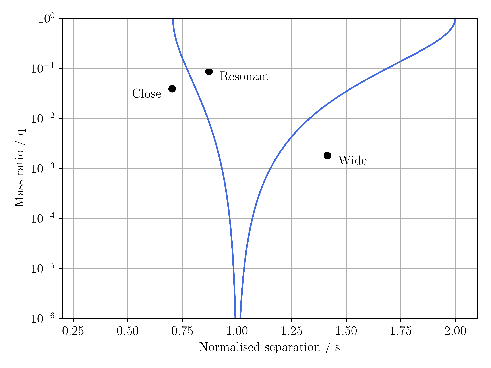

$\newcommand{\ensuremath}{}$
$\newcommand{\xspace}{}$
$\newcommand{\object}[1]{\texttt{#1}}$
$\newcommand{\farcs}{{.}''}$
$\newcommand{\farcm}{{.}'}$
$\newcommand{\arcsec}{''}$
$\newcommand{\arcmin}{'}$
$\newcommand{\ion}[2]{#1#2}$
$\newcommand{\textsc}[1]{\textrm{#1}}$
$\newcommand{\hl}[1]{\textrm{#1}}$
$\newcommand{\footnote}[1]{}$
$\newcommand{\thebibliography}{\DeclareRobustCommand{\VAN}[3]{##3}\VANthebibliography}$

$\newcommand{\ensuremath}{}$
$\newcommand{\xspace}{}$
$\newcommand{\object}[1]{\texttt{#1}}$
$\newcommand{\farcs}{{.}''}$
$\newcommand{\farcm}{{.}'}$
$\newcommand{\arcsec}{''}$
$\newcommand{\arcmin}{'}$
$\newcommand{\ion}[2]{#1#2}$
$\newcommand{\textsc}[1]{\textrm{#1}}$
$\newcommand{\hl}[1]{\textrm{#1}}$
$\newcommand{\footnote}[1]{}$
$\newcommand{\thebibliography}{\DeclareRobustCommand{\VAN}[3]{##3}\VANthebibliography}$

# $*Kepler K2*$ Campaign 9: II. First space-based discovery of an exoplanet using microlensing

<mark>Appeared on: 2022-03-31</mark> - _18 pages. Accepted for publication in MNRAS Published by Oxford University Press on behalf of the Royal Astronomical Society_

D. Specht, et al. -- incl., <mark><mark>Chung-Uk Lee</mark></mark>, <mark><mark>Andrew Gould</mark></mark>, <mark><mark>Seung-Lee Kim</mark></mark>, <mark><mark>Dong-Joo Lee</mark></mark>, <mark><mark>Yongseok Lee</mark></mark>

**Abstract:** We report on the discovery of a bound exoplanetary microlensing event from a blind search of data gathered from Campaign 9 of the $*Kepler K2*$ mission ( $*K2*$ C9). K2-2016-BLG-0005Lb is a densely sampled, binary caustic-crossing microlensing event with caustic entry and exit points that are resolved in the $*K2*$ C9 data, enabling the lens--source relative proper motion to be measured. We have fitted a binary microlens model to the $*K2*$ dataset, and to simultaneous observations from the  Optical Gravitational Lensing Experiment (OGLE-IV), Canada--France--Hawaii Telescope (CFHT), Microlensing Observations in Astrophysics (MOA-2), the Korean Microlensing Telescope Network (KMTNet), and the United Kingdom InfraRed Telescope (UKIRT). Whilst the ground-based data only sparsely sample the binary caustic, they provide a clear detection of parallax that allows us to break completely the microlensing mass--position--velocity degeneracy and measure the planet's mass directly. We find a host mass of $0.58\pm0.03  {\rm M}_\odot$ and a planetary mass of $1.1\pm0.1  {\rm M_J}$ . The system lies at a distance of $5.2\pm0.2$ kpc from Earth towards the Galactic bulge. The projected physical separation of the planet from its host is found to be $4.2\pm0.3$ au which, for circular orbits, corresponds to $a = 4.4^{+1.9}_{-0.4}$ au and period $P = 13^{+9}_{-2}$ yr, making K2-2016-BLG-0005Lb a close Jupiter analogue. Though previous exoplanet microlensing events have included space-based data, this event is the first bound microlensing exoplanet to be $*discovered*$ from space-based data. Even through a space telescope not designed for microlensing studies, this result highlights the advantages for exoplanet microlensing discovery that come from continuous, high-cadence temporal sampling that is possible from space. The precision mass and distance measurements of cool low-mass exoplanets from microlensing that will be obtainable from the NASA $*Nancy Grace Roman Space Telescope*$ and, potentially, the ESA $*Euclid*$ space telescope, will unlock a key regime for testing planet formation theories.

**Figure 9. -** The superposition of photometry and best-fit model from Figures \ref{fig:wide_space} and \ref{fig:wide_ground}. The *K2* differential flux count scale is shown on the right vertical axis. The space-based component of the wide-topology solution is indicated by the dashed black line, while the ground-based component is shown as a solid black line. The best-fit wide solution provides good characterisation of the *K2*C9 caustic structure, as well as ground based coverage of the caustic exit and of the pre-caustic peak seen around BJD$-2450000 = 7512.5$ days. (*fig:wide*)

**Figure 7. -** K2 \texttt{MCPM} photometry of K2-2016-BLG-0005Lb (red). The space-based component of the best-fit wide-topology, parallax binary lens model is shown in black. The caustic crossing region is clearly visible and well sampled between $BJD-2450000=7515$ and $7519$. The *K2* differential flux counts are indicated on the right vertical axis; note that this scale is neither linear, nor logarithmic. (*fig:wide_space*)

**Figure 1. -** The close, resonant and wide binary lens topologies. The blue curves show the boundaries between the topologies whilst the black dots show the $s,q$ coordinates of the best-fit models for K2-2016-BLG-0005Lb for each topology. Overall, our analysis shows the wide model to be most strongly preferred by the data. (*fig:topology*)

